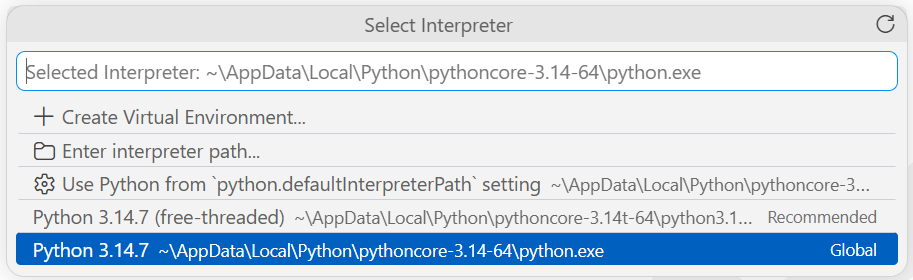
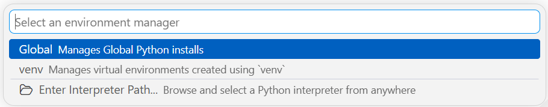

# Konfigurowanie narzędzi

Program w Pythonie można zasadniczo pisać w prostym, interaktywnym środowisku programowania — w konsoli interpretera, realizującej pętlę **REPL** (ang. *read-eval-print loop*; opis w rozdziale [2. Konsola](../02-konsola/index.md)): użytkownik wprowadza polecenia, które zostają wykonane, a ich wynik jest wypisywany na ekran. Nie jest to jednak wydajny sposób pracy nad większym kodem. Do pisania programów potrzebny jest edytor, a najlepiej — zintegrowane środowisko programistyczne (**IDE**, ang. *integrated development environment*), wspomagające cały proces tworzenia kodu.

## Wybór edytora / IDE

Wybór można dostosować do własnych preferencji — część programistów pozostaje przy edytorach **vim** lub **emacs**, inni korzystają z dołączanego do dystrybucji Pythona środowiska **IDLE**.

Duże możliwości dają lekkie edytory:

- [Sublime Text](https://www.sublimetext.com/)
- [Zed](https://zed.dev/)

Z drugiej strony, w pełni wyposażonym pakietem IDE dedykowanym dla Pythona jest [**PyCharm**](https://www.jetbrains.com/pycharm/) (bezpłatny do użytku niekomercyjnego; istnieje także licencja akademicka). Całkowicie darmowym produktem jest [**Spyder**](https://www.spyder-ide.org/), używany w analizie danych, naukach przyrodniczych oraz inżynierii, głównie ze względu na swoją integrację z popularnymi bibliotekami Pythona, takimi jak NumPy, SciPy czy Matplotlib.

## Rekomendacja: Visual Studio Code

Bardzo wiele osób używa obecnie **Visual Studio Code** (produktu firmy Microsoft, dostępnego na wielu platformach) ze względu na wydajne działanie, dużą elastyczność, konfigurowalność oraz ciągłe wsparcie i aktualizacje. Za pomocą wybranych rozszerzeń można szybko skonfigurować VSC do wydajnej pracy z Pythonem — opisują to kolejne sekcje.

### Instalacja i rozszerzenia

1. Instalujemy VSC: [code.visualstudio.com/download](https://code.visualstudio.com/download)
2. Uruchamiamy i dodajemy rozszerzenia **Extensions** (++ctrl+shift+x++): **Python** (IntelliSense od Microsoft)
3. W ten sam sposób instalujemy linter: w **Extensions** wyszukujemy **Pylint** (wydawca Microsoft) i instalujemy

**Linter** to moduł sprawdzający i podpowiadający składnię. Dawniej wybierało się go poleceniem palety *Python: Select Linter* — polecenie to zostało wycofane, a lintery są obecnie osobnymi rozszerzeniami VSC. Po zainstalowaniu rozszerzenia Pylint linter jest od razu aktywny, bez dodatkowej konfiguracji.

!!! note "Wersja pylinta"
    Rozszerzenie zawiera wbudowaną kopię pylinta i domyślnie używa właśnie jej
    (ustawienie `pylint.importStrategy` o wartości domyślnej `useBundled`). Kontrolę
    nad wersją lintera w projekcie daje instalacja własnej wersji w środowisku —
    poleceniem `python -m pip install pylint` — wraz z wpisem
    `"pylint.importStrategy": "fromEnvironment"` w pliku `settings.json`; wówczas
    używana jest wersja ze środowiska, a wbudowana pozostaje rezerwą.

### Test lintera

Utwórzmy w katalogu projektu plik `main.py` i wpiszmy składnię celowo błędną z punktu widzenia Pythona 3, na przykład:

```python title="main.py"
print "hello wrong"
```

Powinien pojawić się problem oraz podpowiedź.

<!-- TODO: screenshot — podkreślenie błędu przez pylint -->

Albo (++ctrl+shift+m++) zakładka **Problems**:

<!-- TODO: screenshot — zakładka Problems -->

### Usuwanie Pylance

Możliwe, że wyświetlone zostaną dwie „porady” — druga pochodzi od **Pylance**, który nie jest linterem, lecz serwerem językowym zapewniającym IntelliSense; jego diagnostyka może się dublować z pylintem. Aby go wyłączyć, prostą operację (odszukanie Pylance na liście rozszerzeń i jego dezaktywacja albo odinstalowanie) trzeba uzupełnić wpisem w pliku konfiguracyjnym VSC.

W tym celu otwieramy Command Palette (++ctrl+shift+p++) i wyszukujemy **Preferences: Open User Settings (JSON)** (nie *Default*).

<!-- TODO: screenshot — otwieranie settings.json -->

Otwieramy plik `settings.json` do edycji i np. na końcu dopisujemy (jeśli nie ma):

```json title="settings.json"
"python.languageServer": "None"
```

Po przeładowaniu podpowiedź powinna pochodzić wyłącznie od Pylint.

## PEP 8 i formatowanie kodu

Opisy działania języka Python oraz propozycje jego usprawnień są gromadzone w dokumentach **PEP** (ang. *Python Enhancement Proposals*): [peps.python.org](https://peps.python.org/). Jednym z najbardziej znanych jest [**PEP 8 — Style Guide for Python Code**](https://peps.python.org/pep-0008/), określający zasady formatowania kodu Pythona. Katalog PEP obejmuje także m.in. filozofię języka (PEP 20, opis w rozdziale [2. Konsola](../02-konsola/konsola-w-praktyce.md)) oraz konwencje dokumentowania kodu (PEP 257).

Formatery — podobnie jak lintery — są obecnie osobnymi rozszerzeniami VSC. W **Extensions** wyszukujemy **autopep8** (wydawca Microsoft) i instalujemy. W naszym pliku zapiszmy teraz np.:

```python title="main.py"
x=0
```

a następnie w Command Palette (++ctrl+shift+p++) wybierzmy **Format Document With** i wskażmy **autopep8** (opcja *Configure Default Formatter* pozwala ustawić go jako domyślny formater dla plików Pythona).

Formatowanie wykonujemy poleceniem *Format Document* jak wyżej albo — wygodniej — skrótem klawiszowym ++shift+alt+f++. W tym przypadku zobaczymy:

```{ .python .no-copy }
x = 0
```

ponieważ PEP 8 zaleca, aby przed i za operatorem znajdowały się spacje.

!!! warning "Formatowanie ≠ poprawianie błędów"
    Nie należy formatowania mylić z poprawianiem błędów — do tego celu służy
    linter (wcześniej opisany pylint).

Aby formatowanie następowało automatycznie podczas zapisu pliku, można w **File → Preferences → Settings** (albo skrótem ++ctrl+comma++) wyszukać `formatOnSave` i zaznaczyć opcję **Editor: Format On Save**.

## Wyciszanie ostrzeżeń pylint

Załóżmy, że w pliku znajduje się z powrotem prosta instrukcja:

```python title="main.py"
print("pierwszy program")
```

Pylint, w zależności od ustawień, zgłosi ostrzeżenie *Missing module docstring* — w pliku-module brakuje opisu dokumentacyjnego. **Docstring** (ang. *documentation string*) to łańcuch znakowy umieszczany na początku modułu, klasy lub funkcji, pełniący rolę ich dokumentacji; konwencje jego pisania określa PEP 257, a szersze omówienie nastąpi przy funkcjach. Jeżeli tego rodzaju ostrzeżenia mają zostać wyłączone, w pliku `settings.json` (otwieranym jak poprzednio) dodajemy linię:

```json title="settings.json"
"pylint.args": ["--errors-only"]
```

Dawne ustawienie `python.linting.pylintArgs` zostało wycofane wraz z wbudowanym lintowaniem — konfigurację przekazuje się obecnie przez ustawienia rozszerzenia Pylint (`pylint.args`).

!!! note "Odczytanie znaczenia komunikatu"
    Znaczenie konkretnego kodu komunikatu można sprawdzić w terminalu (przy pylincie
    zainstalowanym w środowisku):

    ```powershell title="Terminal"
    python -m pylint --help-msg=missing-module-docstring
    ```

## Uruchamianie kodu — Code Runner

Plik z instrukcją `print` chcemy teraz uruchomić z poziomu VSC. W tym celu dodajemy jeszcze jedno rozszerzenie: w **Extensions** wyszukujemy `code runner`, wybieramy pozycję z pomarańczową ikoną **.run** i instalujemy.

Od tej pory uruchomienie kodu to ++ctrl+alt+n++ (a zatrzymanie ++ctrl+alt+m++).

<!-- TODO: screenshot — wynik działania Code Runner w terminalu VSC -->

!!! note "Wariant bez dodatkowego rozszerzenia"
    Rozszerzenie Code Runner nie jest już aktywnie rozwijane (ostatnie wydanie
    pochodzi z 2024 roku), choć nadal działa poprawnie. Równoważne uruchamianie
    zapewnia samo rozszerzenie Python od Microsoftu — przycisk **Run Python File**
    w prawym górnym rogu edytora wykonuje plik w terminalu zintegrowanym.

!!! tip "Terminal w VSC"
    Jeżeli sekcja terminala w dolnej części okna zostanie zamknięta, otwieramy ją
    ponownie: **Terminal → New Terminal** (lub skrótem klawiszowym ++ctrl+grave++).

Warte odnotowania jest również uruchamianie w trybie debugowania: klawisz ++f5++ wykonuje program pod kontrolą **debuggera**, z możliwością wstawiania pułapek (ang. *breakpoint*) zatrzymujących wykonanie we wskazanej linii. Szersze omówienie debugowania nastąpi w dalszych rozdziałach.

## Interpreter i środowisko venv w VSC

Visual Studio Code pozwala na utworzenie wirtualnego środowiska (opisanego w podrozdziale [Wirtualne środowisko venv](venv.md)) przy okazji wyboru interpretera.

Po skrócie klawiszowym ++ctrl+shift+p++ wpisujemy **Python: Select Interpreter**. Pojawi się lista dostępnych interpreterów wraz z opcją utworzenia nowego środowiska:



Wybierzmy **Create Virtual Environment**, a następnie menedżera środowiska **venv**:



Po wskazaniu wersji interpretera zostanie lokalnie utworzony podkatalog `.venv` wraz z wirtualnym środowiskiem dla danego projektu.

Po wskazaniu interpretera pochodzącego ze środowiska Visual Studio Code aktywuje `.venv` automatycznie w każdym nowo otwieranym terminalu zintegrowanym — dodatkowa konfiguracja nie jest potrzebna. Odpowiada za to domyślnie włączona opcja `python.terminal.activateEnvironment`.

!!! note "Wygląd a wersja VSC"
    Szczegóły wyglądu okien Visual Studio Code mogą się nieznacznie różnić między
    wersjami — stałe pozostają natomiast nazwy poleceń palety (**Python: Select
    Interpreter**, **Create Virtual Environment**) i to nimi należy się kierować.

W ten sposób środowisko pracy w VSC jest przygotowane.
