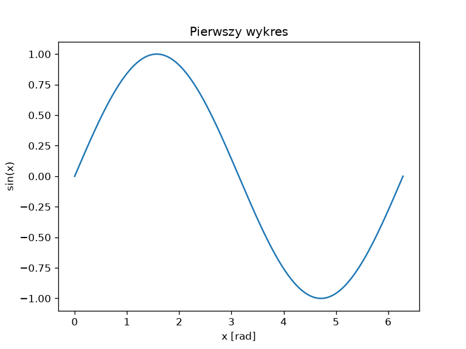
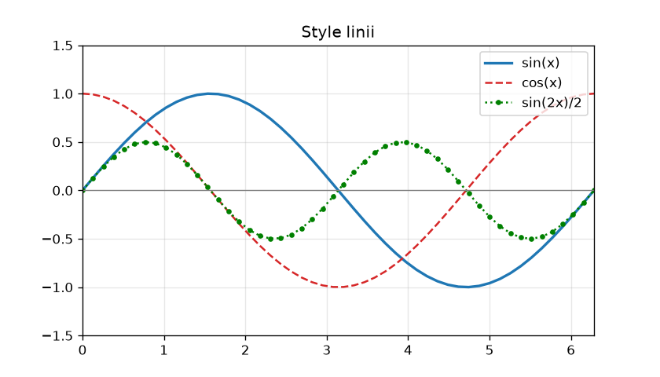
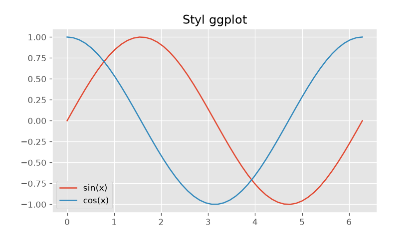
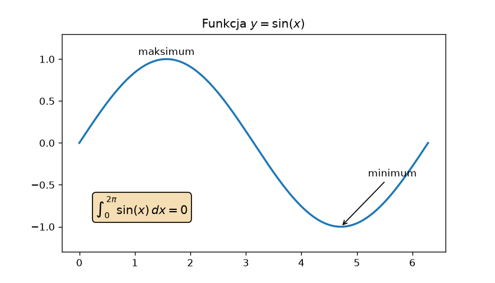

# Matplotlib — pierwszy wykres i styl obiektowy

Matplotlib rysuje wykresy z tablic NumPy i zapisuje je w formatach rastrowych i wektorowych. Biblioteka ma dwa interfejsy: **stanowy** `pyplot`, wzorowany na programie MATLAB, i **obiektowy**, w którym jawnie operujemy na obiektach rysunku i osi. W książce używamy stylu obiektowego — jest jednoznaczny przy wielu panelach i zgodny z tym, jak biblioteka jest zbudowana; interfejs stanowy pokazujemy raz, aby rozpoznawać go w cudzym kodzie.

## Hierarchia obiektów

```{ .text .no-copy }
Figure   — cały rysunek: okno albo plik
└── Axes — jeden wykres: układ współrzędnych z danymi
    ├── Axis   — oś x i oś y: skala, podziałki, etykiety
    └── Artist — wszystko, co narysowane: linie, punkty, teksty, legenda
```

`Figure` może zawierać wiele obiektów `Axes` (paneli), a każdy `Axes` ma dwie osie `Axis`; wszystko, co widać na rysunku, jest obiektem klasy `Artist`. Nazwy bywają mylące: `Axes` to cały wykres, nie „osie” — te nazywają się `Axis`.

## Pierwszy wykres

```python title="pierwszy-wykres.py"
import matplotlib.pyplot as plt
import numpy as np

x = np.linspace(0, 2 * np.pi, 200)

fig, ax = plt.subplots()
ax.plot(x, np.sin(x))
ax.set_xlabel("x [rad]")
ax.set_ylabel("sin(x)")
ax.set_title("Pierwszy wykres")
fig.savefig("pierwszy-wykres.png", dpi=120)
plt.show()
```

{ width="640" }

Funkcja `plt.subplots()` tworzy rysunek i jeden panel, zwracając parę `(Figure, Axes)` — w stylu obiektowym z modułu `pyplot` korzystamy głównie tutaj oraz przy `plt.show()`, `plt.close()` i wyborze stylu; rysowaniem sterują metody obiektów. Dane rysujemy metodami obiektu `ax`: `plot()` łączy punkty linią, a metody `set_xlabel()`, `set_ylabel()` i `set_title()` opisują wykres. `fig.savefig()` zapisuje rysunek do pliku w katalogu roboczym (rozdział 9), a `plt.show()` otwiera okno i **blokuje** program do jego zamknięcia — dlatego zapis umieszczamy przed nim. Uruchomiony w VSC skrypt pokazuje okno z paskiem narzędzi do powiększania i zapisu; w notatniku Jupyter wykres pojawia się pod komórką, bez okna.

## Interfejs `pyplot` a styl obiektowy

Ten sam wykres w stylu stanowym wygląda krócej:

```{ .python .no-copy }
plt.plot(x, np.sin(x))
plt.xlabel("x [rad]")
plt.ylabel("sin(x)")
plt.title("Pierwszy wykres")
plt.show()
```

Funkcje `pyplot` działają na „bieżącym” rysunku i panelu, które moduł tworzy niejawnie przy pierwszym wywołaniu. Przy jednym wykresie różnicy nie widać; przy kilku panelach lub kilku rysunkach trzeba śledzić, który z nich jest bieżący, a z kodu nie wynika, na którym rysunku i panelu działa dane wywołanie. Dokumentacja Matplotlib zaleca styl obiektowy poza szybkimi próbami w konsoli; odpowiedniki są regularne:

| `pyplot` (stanowy) | styl obiektowy |
|---|---|
| `plt.plot(x, y)` | `ax.plot(x, y)` |
| `plt.xlabel("x")`, `plt.title("…")` | `ax.set_xlabel("x")`, `ax.set_title("…")` |
| `plt.xlim(0, 1)`, `plt.ylim(-1, 1)` | `ax.set_xlim(0, 1)`, `ax.set_ylim(-1, 1)` |
| `plt.legend()`, `plt.grid(True)` | `ax.legend()`, `ax.grid(True)` |
| `plt.savefig("plik.png")` | `fig.savefig("plik.png")` |

## Linie, znaczniki i style

Każda linia ma kolor, styl, grubość i znacznik punktów; etykieta `label=` trafia do legendy:

```python title="style-linii.py"
import matplotlib.pyplot as plt
import numpy as np

x = np.linspace(0, 2 * np.pi, 50)

fig, ax = plt.subplots(figsize=(7, 4))
ax.plot(x, np.sin(x), color="tab:blue", linewidth=2, label="sin(x)")
ax.plot(x, np.cos(x), color="tab:red", linestyle="--", label="cos(x)")
ax.plot(x, np.sin(2 * x) / 2, "g:o", markersize=3, label="sin(2x)/2")
ax.axhline(0, color="gray", linewidth=0.8)
ax.set_xlim(0, 2 * np.pi)
ax.set_ylim(-1.5, 1.5)
ax.grid(True, alpha=0.3)
ax.legend(loc="upper right")
ax.set_title("Style linii")
fig.savefig("style-linii.png", dpi=120)

with plt.style.context("ggplot"):
    fig2, ax2 = plt.subplots(figsize=(7, 4))
    ax2.plot(x, np.sin(x), label="sin(x)")
    ax2.plot(x, np.cos(x), label="cos(x)")
    ax2.legend()
    ax2.set_title("Styl ggplot")
    fig2.savefig("styl-ggplot.png", dpi=120)

print(len(plt.style.available), plt.style.available[:4])
```

```{ .text .no-copy }
28 ['Solarize_Light2', 'bmh', 'classic', 'dark_background']
```

{ width="640" }

{ width="640" }

Kolory podajemy nazwą (`"red"`), zapisem szesnastkowym (`"#306998"`) albo z palety dziesięciu kolorów domyślnych `"tab:blue"`, `"tab:orange"`, … — tej, z której Matplotlib bierze kolory kolejnych linii bez `color=`. Styl linii to `"-"`, `"--"`, `"-."` lub `":"`; znaczniki to między innymi `"o"`, `"s"`, `"^"`, `"."`. Trzy cechy można zapisać skrótem — `"g:o"` znaczy: zielona, kropkowana, z kółkami. Argument `figsize=` podaje rozmiar w calach, a `dpi=` w `savefig()` — liczbę pikseli na cal; rysunek 7 × 4 cale przy 120 dpi ma 840 × 480 pikseli. `axhline()` i `axvline()` rysują linie poziome i pionowe przez cały panel; `grid()` włącza siatkę, a `alpha=` ustawia przezroczystość.

Gotowe **style** zmieniają cały wygląd rysunku: `plt.style.use("ggplot")` globalnie, a `plt.style.context()` — jako menedżer kontekstu z rozdziału 8 — tylko dla rysunków tworzonych wewnątrz bloku `with`. Listę nazw podaje `plt.style.available`; style `seaborn-v0_8-*` naśladują bibliotekę seaborn.

## Tekst i adnotacje

Tekst umieszczamy we współrzędnych danych; `annotate()` łączy tekst strzałką ze wskazanym punktem:

```python title="adnotacje.py"
import matplotlib.pyplot as plt
import numpy as np

x = np.linspace(0, 2 * np.pi, 200)

fig, ax = plt.subplots(figsize=(7, 4))
ax.plot(x, np.sin(x), linewidth=2)
ax.text(np.pi / 2, 1.05, "maksimum", ha="center")
ax.annotate(
    "minimum",
    xy=(3 * np.pi / 2, -1),
    xytext=(5.2, -0.4),
    arrowprops={"arrowstyle": "->"},
)
ax.text(
    0.3, -0.85,
    r"$\int_0^{2\pi} \sin(x)\,dx = 0$",
    fontsize=12,
    bbox={"boxstyle": "round", "facecolor": "wheat"},
)
ax.set_title(r"Funkcja $y = \sin(x)$")
ax.set_ylim(-1.3, 1.3)
fig.savefig("adnotacje.png", dpi=120)
```

{ width="640" }

`text(x, y, napis)` rysuje napis w punkcie danych; `ha=` (ang. *horizontal alignment*) wyrównuje go względem tego punktu. W `annotate()` argument `xy=` wskazuje punkt, `xytext=` — położenie tekstu, a słownik `arrowprops=` opisuje strzałkę. Fragmenty między znakami dolara Matplotlib składa własnym silnikiem wzorów, obsługującym podzbiór składni TeX-a — bez instalowania TeX-a; zapisujemy je jako łańcuchy surowe `r"…"` z rozdziału 3, bo zawierają odwrotne ukośniki. Argument `bbox=` rysuje ramkę wokół tekstu.
