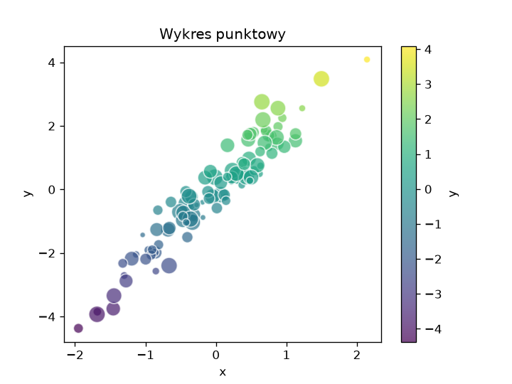
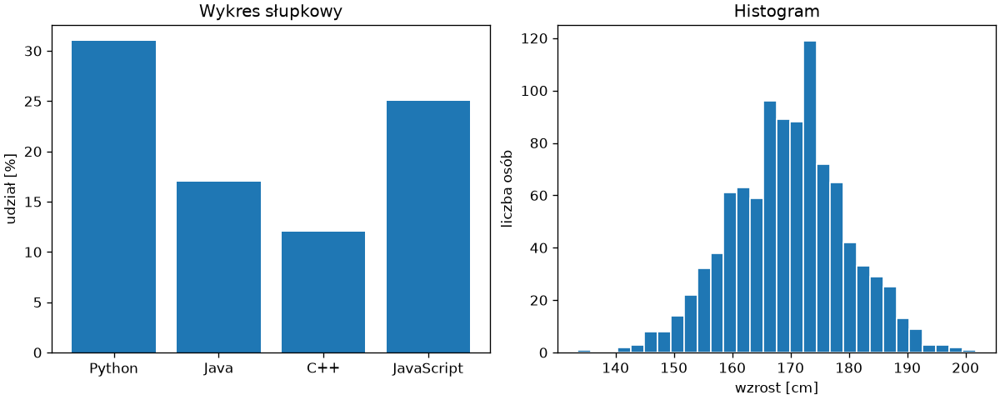
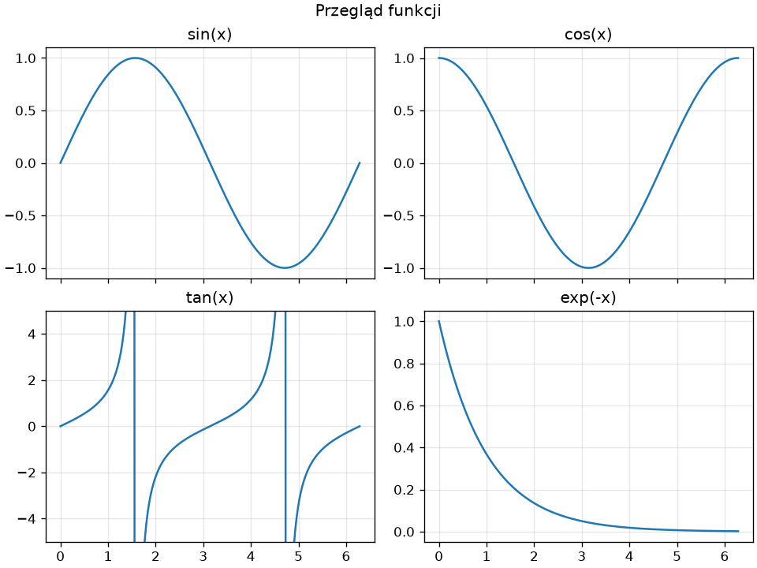

# Matplotlib — rodzaje wykresów, układ i zapis

Wykres liniowy to jeden z wielu typów; w tym podrozdziale dochodzą wykres punktowy, słupkowy i histogram, układ wielu paneli na jednym rysunku, zapis do plików w różnych formatach oraz lista pułapek, na które często natrafiają początkujący użytkownicy biblioteki.

## Wykres punktowy — `scatter()`

`plot()` łączy punkty w kolejności podania, więc nadaje się do danych uporządkowanych po `x`. Gdy punkty są niezależnymi obserwacjami, rysujemy je metodą `scatter()`, która pozwala zadać kolor i rozmiar każdego punktu osobno:

```python title="punktowy.py"
import matplotlib.pyplot as plt
import numpy as np

rng = np.random.default_rng(42)
x = rng.normal(0, 1, 100)
y = 2 * x + rng.normal(0, 0.5, 100)
rozmiary = rng.integers(20, 200, 100)

fig, ax = plt.subplots(figsize=(6, 4.5))
punkty = ax.scatter(x, y, c=y, s=rozmiary, cmap="viridis", alpha=0.7, edgecolors="white")
fig.colorbar(punkty, ax=ax, label="y")
ax.set_xlabel("x")
ax.set_ylabel("y")
ax.set_title("Wykres punktowy")
fig.savefig("punktowy.png", dpi=120)
print(f"współczynnik korelacji: {np.corrcoef(x, y)[0, 1]:.3f}")
```

```{ .text .no-copy }
współczynnik korelacji: 0.957
```

{ width="600" }

Argument `c=` przyjmuje tablicę wartości, które **mapa kolorów** (ang. *colormap*) `cmap=` zamienia na kolory; `s=` zadaje rozmiary punktów, `alpha=` — przezroczystość, przydatną przy nakładających się punktach. `fig.colorbar()` dodaje skalę kolorów. `np.corrcoef(x, y)` zwraca macierz korelacji 2 × 2; element `[0, 1]` to współczynnik korelacji Pearsona między `x` i `y`, bliski 1 dla punktów ułożonych wzdłuż prostej. Mapy `"viridis"`, `"plasma"` i `"cividis"` są jednolite percepcyjnie (ang. *perceptually uniform*) i czytelne w skali szarości; `"coolwarm"` służy do danych symetrycznych wokół zera.

## Słupkowy i histogram — `bar()` i `hist()`

Wykres słupkowy porównuje wartości w kategoriach; histogram pokazuje rozkład wartości liczbowych, dzieląc ich zakres na przedziały (ang. *bins*) i zliczając obserwacje w każdym:

```python title="slupki-histogram.py"
import matplotlib.pyplot as plt
import numpy as np

jezyki = ["Python", "Java", "C++", "JavaScript"]
udzialy = [31, 17, 12, 25]

rng = np.random.default_rng(42)
wzrost = rng.normal(170, 10, 1000)

fig, (ax1, ax2) = plt.subplots(1, 2, figsize=(10, 4), layout="constrained")
ax1.bar(jezyki, udzialy, color="tab:blue")
ax1.set_ylabel("udział [%]")
ax1.set_title("Wykres słupkowy")

licznosci, krawedzie, _ = ax2.hist(wzrost, bins=30, edgecolor="white")
ax2.set_xlabel("wzrost [cm]")
ax2.set_ylabel("liczba osób")
ax2.set_title("Histogram")
fig.savefig("slupki-histogram.png", dpi=120)
print(len(licznosci), int(licznosci.max()), krawedzie[0].round(1), krawedzie[-1].round(1))
```

```{ .text .no-copy }
30 119 133.5 201.8
```

{ width="760" }

Wywołanie `subplots(1, 2)` tworzy dwa panele obok siebie, które rozpakowujemy do `ax1` i `ax2`; układ wielu paneli i argument `layout=` omawiamy w sekcji Wiele paneli. `bar()` przyjmuje etykiety kategorii i wartości; `barh()` rysuje słupki poziome. `hist()` zwraca trzy wartości: liczności w przedziałach, krawędzie przedziałów (o jeden więcej niż przedziałów) i narysowane prostokąty; argument `density=True` normalizuje histogram do gęstości prawdopodobieństwa, co pozwala nałożyć na niego krzywą rozkładu. Liczba przedziałów zmienia wygląd rozkładu — warto wypróbować kilka wartości `bins=`.

## Wiele paneli — `subplots()`

Argumenty `subplots(wiersze, kolumny)` tworzą siatkę paneli; zamiast jednego obiektu `Axes` otrzymujemy tablicę NumPy obiektów `Axes`:

```python title="panele.py"
import matplotlib.pyplot as plt
import numpy as np

x = np.linspace(0, 2 * np.pi, 200)
funkcje = [(np.sin, "sin(x)"), (np.cos, "cos(x)"), (np.tan, "tan(x)"), (lambda t: np.exp(-t), "exp(-x)")]

fig, osie = plt.subplots(2, 2, figsize=(8, 6), sharex=True, layout="constrained")
for ax, (funkcja, nazwa) in zip(osie.flat, funkcje):
    ax.plot(x, funkcja(x))
    ax.set_title(nazwa)
    ax.grid(True, alpha=0.3)
osie[1, 0].set_ylim(-5, 5)
fig.suptitle("Przegląd funkcji")
fig.savefig("panele.png", dpi=120)
print(type(osie).__name__, osie.shape)
```

```{ .text .no-copy }
ndarray (2, 2)
```

{ width="640" }

Tablicę paneli indeksujemy jak każdą tablicę dwuwymiarową — `osie[1, 0]` to lewy dolny panel — a atrybut `flat` — iterator po wszystkich elementach tablicy niezależnie od liczby wymiarów, odpowiednik `ravel()` z poprzedniego podrozdziału — pozwala przejść po wszystkich panelach jedną pętlą. Zakres osi y panelu z tangensem ograniczamy, bo przy asymptotach wartości przekraczają sto; pionowe kreski w tym panelu nie należą do wykresu funkcji — `plot()` łączy odcinkiem sąsiednie punkty po obu stronach nieciągłości. `sharex=True` (i analogicznie `sharey=`) wiąże zakresy osi, więc powiększenie jednego panelu w oknie powiększa pozostałe. `layout="constrained"` dobiera odstępy tak, aby tytuły i etykiety nie nachodziły na siebie — w starszym kodzie tę rolę pełni wywołanie `fig.tight_layout()`. `fig.suptitle()` dodaje tytuł całego rysunku. Nieregularne układy — panel na dwie kolumny — buduje `fig.add_gridspec()`, którego opis zostawiamy dokumentacji.

## Zapis do pliku — `savefig()`

```python title="zapis.py"
from pathlib import Path

import matplotlib.pyplot as plt
import numpy as np

x = np.linspace(-2, 2, 100)
fig, ax = plt.subplots(figsize=(5, 3.5))
ax.plot(x, x**2)
ax.set_title("Parabola")

fig.savefig("parabola.png", dpi=200, bbox_inches="tight")
fig.savefig("parabola.svg")
fig.savefig("parabola.pdf", transparent=True)
plt.close(fig)

for plik in sorted(Path().glob("parabola.*")):
    print(plik.name, plik.stat().st_size > 0)
```

```{ .text .no-copy }
parabola.pdf True
parabola.png True
parabola.svg True
```

Format wynika z rozszerzenia nazwy pliku. PNG to format rastrowy — do ekranu i dokumentów; `dpi=` decyduje o liczbie pikseli. SVG i PDF są **wektorowe**: skalują się bez utraty jakości — SVG nadaje się do stron WWW, PDF do publikacji drukowanych. `bbox_inches="tight"` przycina puste marginesy, `transparent=True` daje przezroczyste tło. `plt.close(fig)` zwalnia pamięć rysunku — w skrypcie tworzącym wykresy w pętli jest konieczne, bo Matplotlib przechowuje wszystkie otwarte rysunki i ostrzega po dwudziestym. Zapis wykonujemy przed `plt.show()`. W stylu obiektowym `fig.savefig()` działa także po zamknięciu okna, ale stanowe `plt.savefig()` wywołane po `plt.show()` zapisuje pusty obraz: po zamknięciu okien moduł nie ma bieżącego rysunku i tworzy nowy — częsty błąd w cudzym kodzie.

## Typowe pułapki

- **`plt.show()` blokuje program** do zamknięcia okna. Wywołujemy je raz, na końcu skryptu — pokaże wszystkie utworzone rysunki naraz — a nie po każdym wykresie.
- **Nachodzące napisy** — tytuł na etykiety osi, etykiety paneli na siebie: `layout="constrained"` w `subplots()` rozwiązuje większość przypadków.
- **Zniekształcone proporcje** — okrąg wygląda jak elipsa, bo skale osi różnią się: `ax.set_aspect("equal")` wyrównuje je.
- **Domyślny zakres osi** obejmuje dane z marginesem; `set_xlim()` i `set_ylim()` ustalają go wprost, także po to, aby porównywane wykresy miały tę samą skalę.
- **Brak polskich znaków** w etykietach pojawia się dopiero po zmianie czcionki (`rcParams["font.family"]`) na taką, która nie zawiera znaków diakrytycznych; domyślna DejaVu Sans je zawiera.
- **Skrypt bez okna** — na serwerze albo w harmonogramie zadań `plt.show()` nie ma gdzie pokazać wykresu; zapisujemy pliki, a przed importem `pyplot` ustawiamy zmienną środowiskową `MPLBACKEND=Agg`, która wybiera silnik rysujący wyłącznie do plików.
