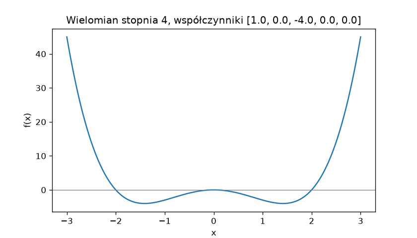
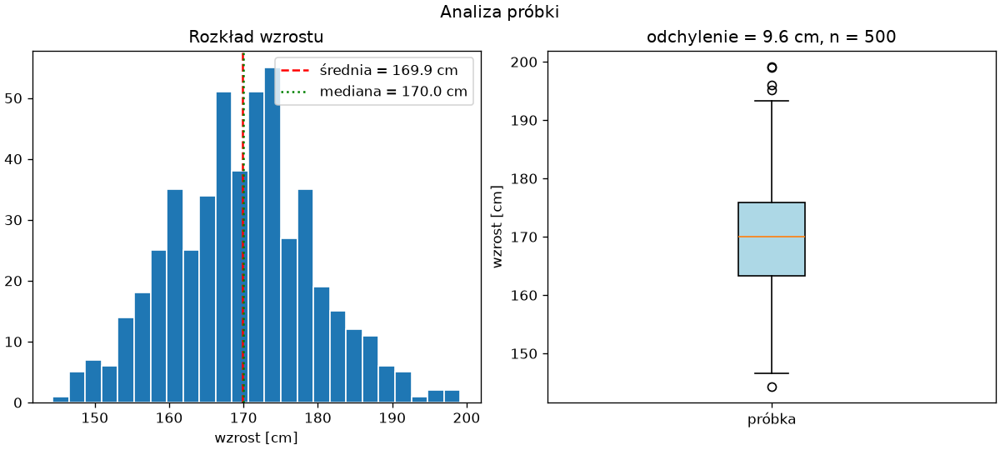
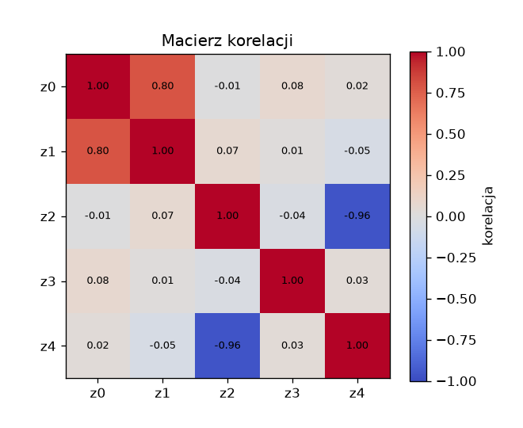
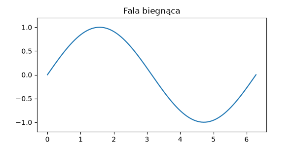

# Przykłady i rozszerzenia

Podrozdział uzupełniający, dla dociekliwych: trzy kompletne przykłady łączące NumPy z Matplotlib oraz krótki przegląd zagadnień wykraczających poza zakres rozdziału — animacji, SciPy i kompilacji Numba.

## Wielomian bez `eval()`

Program ma narysować wielomian podany przez użytkownika. Najkrótsza droga — wczytać wzór jako tekst i wykonać go funkcją `eval()` — jest niebezpieczna — jak w przestrodze z rozdziału [12. Programowanie obiektowe — mechanizmy zaawansowane](../12-oop-zaawansowane/metaprogramowanie.md#funkcje-eval-i-exec-przestroga): `eval()` wykonuje dowolny kod Pythona, więc wpisany „wzór” może usunąć pliki. Wielomian jest w pełni opisany współczynnikami, a wartości oblicza `np.polyval()`:

```python title="wielomian.py"
import matplotlib.pyplot as plt
import numpy as np

wspolczynniki = [float(w) for w in input("Współczynniki od najwyższej potęgi: ").split()]
x_min, x_max = (float(w) for w in input("Przedział x_min x_max: ").split())

x = np.linspace(x_min, x_max, 400)
y = np.polyval(wspolczynniki, x)
stopien = len(wspolczynniki) - 1

fig, ax = plt.subplots(figsize=(7, 4))
ax.plot(x, y)
ax.axhline(0, color="gray", linewidth=0.8)
ax.set_title(f"Wielomian stopnia {stopien}, współczynniki {wspolczynniki}")
ax.set_xlabel("x")
ax.set_ylabel("f(x)")
fig.savefig("wielomian.png", dpi=120)
print(f"f(0) = {np.polyval(wspolczynniki, 0):g}, min = {y.min():.1f}, max = {y.max():.1f}")
```

```{ .text .no-copy }
Współczynniki od najwyższej potęgi: 1 0 -4 0 0
Przedział x_min x_max: -3 3
f(0) = 0, min = -4.0, max = 45.0
```

{ width="640" }

`np.polyval(wspolczynniki, x)` oblicza wartość wielomianu dla całej tablicy `x` naraz, schematem Hornera; współczynniki podajemy od najwyższej potęgi. Nowsze API `numpy.polynomial.Polynomial` przyjmuje współczynniki w odwrotnej kolejności i oferuje dopasowanie, pochodne i pierwiastki — do prostego rysowania wystarcza `polyval()`.

## Histogram i wykres pudełkowy

Analiza próbki pomiarów: histogram jak w poprzednim podrozdziale, tym razem z zaznaczoną średnią i medianą, obok **wykresu pudełkowego** (ang. *box plot*), który streszcza rozkład pięcioma liczbami:

```python title="analiza.py"
import matplotlib.pyplot as plt
import numpy as np

rng = np.random.default_rng(42)
wzrost = rng.normal(170, 10, 500)
srednia, mediana, odchylenie = wzrost.mean(), np.median(wzrost), wzrost.std()

fig, (ax1, ax2) = plt.subplots(1, 2, figsize=(10, 4.5), layout="constrained")
ax1.hist(wzrost, bins=25, edgecolor="white")
ax1.axvline(srednia, color="red", linestyle="--", label=f"średnia = {srednia:.1f} cm")
ax1.axvline(mediana, color="green", linestyle=":", label=f"mediana = {mediana:.1f} cm")
ax1.legend()
ax1.set_xlabel("wzrost [cm]")
ax1.set_title("Rozkład wzrostu")

ax2.boxplot(wzrost, orientation="vertical", tick_labels=["próbka"], patch_artist=True, boxprops={"facecolor": "lightblue"})
ax2.set_ylabel("wzrost [cm]")
ax2.set_title(f"odchylenie = {odchylenie:.1f} cm, n = {len(wzrost)}")
fig.suptitle("Analiza próbki")
fig.savefig("analiza.png", dpi=120)
print(f"{srednia:.2f} {mediana:.2f} {odchylenie:.2f}")
```

```{ .text .no-copy }
169.87 170.03 9.59
```

{ width="760" }

Pudełko obejmuje środkowe 50% obserwacji (od pierwszego do trzeciego kwartyla), linia w środku to mediana, wąsy sięgają do najdalszych obserwacji w odległości półtora rozstępu ćwiartkowego, a punkty poza nimi to obserwacje odstające. Argument `orientation=` (dostępny od Matplotlib 3.10) zastępuje `vert=`, przestarzały od wersji 3.11 i przewidziany do usunięcia w 3.13 (`"vertical"` to wartość domyślna, `"horizontal"` obraca wykres); `tick_labels=` podpisuje pudełko zamiast domyślnego numeru, a `patch_artist=True` pozwala wypełnić je kolorem.

## Mapa ciepła — `imshow()`

Macierz można pokazać jako obraz, w którym kolor odpowiada wartości. Klasyczny przykład to macierz korelacji kilku zmiennych, obliczona funkcją `np.corrcoef()`, która każdy wiersz tablicy traktuje jako osobną zmienną. Zmienną `z1` budujemy jako zaszumioną kopię `z0`, a `z4` jako przeciwieństwo `z2`, aby w macierzy pojawiła się wyraźna korelacja dodatnia i ujemna:

```python title="mapa-ciepla.py"
import matplotlib.pyplot as plt
import numpy as np

rng = np.random.default_rng(42)
pomiary = rng.normal(size=(5, 100))
pomiary[1] = 0.8 * pomiary[0] + rng.normal(scale=0.5, size=100)
pomiary[4] = -pomiary[2] + rng.normal(scale=0.3, size=100)
korelacje = np.corrcoef(pomiary)
nazwy = [f"z{i}" for i in range(5)]

fig, ax = plt.subplots(figsize=(5.5, 4.5))
obraz = ax.imshow(korelacje, cmap="coolwarm", vmin=-1, vmax=1)
fig.colorbar(obraz, ax=ax, label="korelacja")
ax.set_xticks(range(5), labels=nazwy)
ax.set_yticks(range(5), labels=nazwy)
for i in range(5):
    for j in range(5):
        ax.text(j, i, f"{korelacje[i, j]:.2f}", ha="center", va="center", fontsize=8)
ax.set_title("Macierz korelacji")
fig.savefig("mapa-ciepla.png", dpi=120)
print(korelacje[0, 1].round(3), korelacje[2, 4].round(3))
```

```{ .text .no-copy }
0.797 -0.957
```

{ width="560" }

`imshow()` rysuje tablicę dwuwymiarową wiersz po wierszu od góry, jak obraz; `vmin=` i `vmax=` ustalają zakres mapy kolorów, aby zero wypadło w środku palety `"coolwarm"`. Z drugiej strony każdy obraz jest tablicą: `plt.imread("zdjecie.png")` zwraca tablicę o kształcie `(wysokość, szerokość, 3)` z kanałami RGB — lub `(…, 4)`, gdy plik ma kanał przezroczystości —, którą można wycinać, uśredniać po kanałach (`obraz.mean(axis=2)` daje odcienie szarości) i pokazać tym samym `imshow()`.

## Animacja — `FuncAnimation`

Animacja to rysunek, którego dane zmieniają się w kolejnych klatkach. `FuncAnimation` wywołuje podaną funkcję dla każdej klatki; funkcja aktualizuje dane istniejącej linii zamiast rysować ją od nowa:

```python title="animacja.py"
import matplotlib.pyplot as plt
import numpy as np
from matplotlib.animation import FuncAnimation

x = np.linspace(0, 2 * np.pi, 200)
fig, ax = plt.subplots(figsize=(6, 3))
(linia,) = ax.plot(x, np.sin(x))
ax.set_ylim(-1.2, 1.2)
ax.set_title("Fala biegnąca")


def aktualizuj(klatka):
    linia.set_ydata(np.sin(x - klatka / 10))
    return (linia,)


animacja = FuncAnimation(fig, aktualizuj, frames=63, interval=40, blit=True)
animacja.save("fala.gif", writer="pillow", fps=25)
print("zapisano fala.gif")
```

```{ .text .no-copy }
zapisano fala.gif
```

{ width="600" }

`ax.plot()` zwraca listę linii — stąd rozpakowanie `(linia,)` z rozdziału 5 — a `set_ydata()` podmienia jej dane. Argument `frames=` to liczba klatek, `interval=` — odstęp w milisekundach, `blit=True` przerysowuje tylko zmienione elementy. `plt.show()` odtworzyłoby animację w oknie; zapis do GIF-u wykonuje pakiet Pillow, instalowany razem z Matplotlib jako jego zależność; zapis do MP4 wymaga zewnętrznego programu FFmpeg.

## SciPy — krótki przegląd

**SciPy** rozszerza NumPy o algorytmy numeryczne, pogrupowane w podpakiety:

| Podpakiet | Zastosowanie |
|---|---|
| `scipy.optimize` | minimalizacja, szukanie miejsc zerowych, dopasowanie krzywej `curve_fit()` |
| `scipy.interpolate` | interpolacja, na przykład `make_interp_spline()` |
| `scipy.stats` | rozkłady prawdopodobieństwa, testy statystyczne (`ttest_ind()`) |
| `scipy.linalg` | rozszerzona algebra liniowa |
| `scipy.signal`, `scipy.fft` | przetwarzanie sygnałów, transformata Fouriera |
| `scipy.integrate` | całkowanie numeryczne, równania różniczkowe |

Dopasowanie modelu do danych z szumem zajmuje trzy wiersze:

```{ .python .no-copy }
from scipy.optimize import curve_fit

def model(x, a, b):
    return a * np.exp(b * x)

parametry, kowariancja = curve_fit(model, x, y)   # parametry = [a, b]
```

SciPy instalujemy poleceniem `python -m pip install scipy` (w chwili pisania wersja 1.18.1). Bibliotekę tę, wraz z pandas i scikit-learn, omawiamy w części II książki. <!-- TODO: link po powstaniu rozdziału o SciPy -->

## Numba — odsyłacz

Gdy obliczenia nie dają się zapisać jako operacje na całych tablicach — pętla z warunkami zależnymi od poprzednich elementów — pozostaje kompilacja pętli w locie. Dekorator `@njit` z biblioteki Numba i jego ograniczenia opisaliśmy w rozdziale [13. Wydajność i optymalizacja](../13-wydajnosc/przyspieszanie-pythona.md#kompilacja-w-locie-numba); Numba współpracuje z tablicami NumPy, ale nie z obiektami Pythona.
