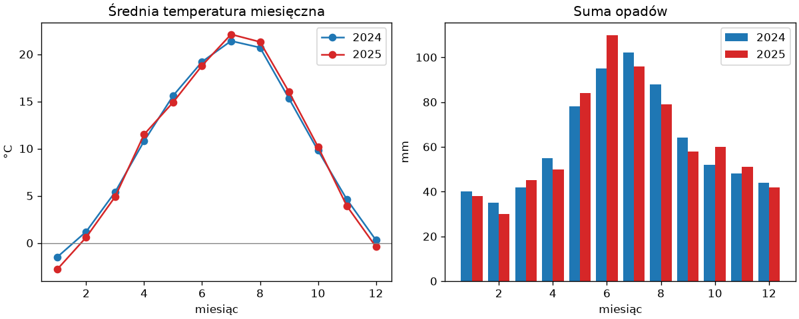

# Pierwsza analiza w notatniku

Wszystkie elementy warsztatu składamy w jedną, kompletną analizę: plik z danymi, notatnik, statystyki, wykres, wnioski i zapis wyników. Narzędzia pochodzą z rozdziału 14 „Python Notatki” — tablice NumPy i wykresy Matplotlib — a nowe jest tylko to, jak układają się w notatniku.

## Zadanie i dane

Mamy średnie miesięczne temperatury i sumy opadów z dwóch lat dla jednej stacji pomiarowej — dane przykładowe, o wartościach typowych dla południowej Polski. Pytania: który rok był cieplejszy, który miesiąc najcieplejszy i jaki jest związek temperatury z opadami. W projekcie z poprzedniego podrozdziału plik trafiłby do `dane/surowe/`; w tym przykładzie, dla zwięzłości, leży w katalogu notatnika:

```text title="pomiary.csv"
rok,miesiac,temperatura,opady
2024,1,-1.5,40
2024,2,1.2,35
2024,3,5.4,42
2024,4,10.8,55
2024,5,15.6,78
2024,6,19.2,95
2024,7,21.4,102
2024,8,20.7,88
2024,9,15.3,64
2024,10,9.8,52
2024,11,4.6,48
2024,12,0.3,44
2025,1,-2.8,38
2025,2,0.6,30
2025,3,4.9,45
2025,4,11.5,50
2025,5,14.9,84
2025,6,18.8,110
2025,7,22.1,96
2025,8,21.3,79
2025,9,16.0,58
2025,10,10.2,60
2025,11,3.9,51
2025,12,-0.4,42
```

## Wczytanie

Pierwsza komórka importuje biblioteki — wszystkie importy trzymamy na górze notatnika, jak w skrypcie — a druga wczytuje plik. Funkcja `np.genfromtxt()` — ogólniejsza odmiana `np.loadtxt()` z rozdziału 14 — z argumentem `names=True` odczytuje nagłówek i tworzy **tablicę strukturalną** (ang. *structured array*): jednowymiarową tablicę rekordów, w której każdy element ma pola nazwane jak kolumny pliku:

```python title="analiza.ipynb — komórka 1"
from pathlib import Path

import matplotlib.pyplot as plt
import numpy as np
```

```python title="analiza.ipynb — komórka 2"
dane = np.genfromtxt("pomiary.csv", delimiter=",", names=True)
dane.dtype.names, len(dane)
```

```{ .text .no-copy }
(('rok', 'miesiac', 'temperatura', 'opady'), 24)
```

```python title="analiza.ipynb — komórka 3"
dane[:3]
```

```{ .text .no-copy }
array([(2024., 1., -1.5, 40.), (2024., 2.,  1.2, 35.),
       (2024., 3.,  5.4, 42.)],
      dtype=[('rok', '<f8'), ('miesiac', '<f8'), ('temperatura', '<f8'), ('opady', '<f8')])
```

Każdy element tablicy to jeden wiersz pliku; `dane["temperatura"]` daje zwykłą tablicę jednowymiarową z całą kolumną. Zapis `<f8` w `dtype` oznacza `float64` — liczbę zmiennoprzecinkową na ośmiu bajtach. Maska logiczna zastosowana do takiej tablicy zwraca całe wiersze, nie pojedyncze liczby. Wszystkie kolumny mają typ `float64`, bo domyślny argument `dtype=float` nadaje jeden typ całemu plikowi; `dtype=None` kazałby dobrać typ każdej kolumnie osobno (`rok`, `miesiac` i `opady` stałyby się `int64`), lecz do obliczeń wygodniejsze są liczby zmiennoprzecinkowe. W rozdziale o pandas zobaczymy tabele z kolumnami różnych typów, także tekstowymi. <!-- TODO: link po powstaniu rozdziału o pandas --> Ścieżka `"pomiary.csv"` jest tu względna wobec katalogu notatnika; w projekcie z poprzedniego podrozdziału byłaby to `SUROWE / "pomiary.csv"`.

## Statystyki

Maska logiczna z rozdziału 14 wybiera wiersze jednego roku, a agregacje liczą średnią i sumę:

```python title="analiza.ipynb — komórka 4"
for rok in (2024, 2025):
    wiersze = dane[dane["rok"] == rok]
    print(rok, round(wiersze["temperatura"].mean(), 1), "°C", int(wiersze["opady"].sum()), "mm")
```

```{ .text .no-copy }
2024 10.2 °C 743 mm
2025 10.1 °C 743 mm
```

```python title="analiza.ipynb — komórka 5"
najcieplejszy = dane[dane["temperatura"].argmax()]
najchlodniejszy = dane[dane["temperatura"].argmin()]
int(najcieplejszy["rok"]), int(najcieplejszy["miesiac"]), int(najchlodniejszy["rok"]), int(najchlodniejszy["miesiac"])
```

```{ .text .no-copy }
(2025, 7, 2025, 1)
```

Średnie roczne różnią się o około jedną dziesiątą stopnia (dokładnie o 0,15 °C), a sumy opadów są równe — lata są do siebie podobne, ale rok 2025 miał zarówno najcieplejszy, jak i najchłodniejszy miesiąc, czyli większą amplitudę. Takie spostrzeżenie zapisujemy od razu w komórce Markdown pod wynikiem — notatnik jest także zapisem wniosków.

## Wykres

Wykres w notatniku pojawia się pod komórką bez `plt.show()` — jądro używa silnika rysującego, który zamiast okna wstawia obraz pod komórkę — odpowiednika `MPLBACKEND=Agg` z rozdziału 14, lecz do dokumentu, nie do pliku. Dwa panele z rozdziału 14: temperatury obu lat liniami i opady słupkami obok siebie:

```python title="analiza.ipynb — komórka 6"
miesiace = np.arange(1, 13)
fig, (ax1, ax2) = plt.subplots(1, 2, figsize=(10, 4), layout="constrained")
for rok, kolor in ((2024, "tab:blue"), (2025, "tab:red")):
    wiersze = dane[dane["rok"] == rok]
    ax1.plot(miesiace, wiersze["temperatura"], marker="o", color=kolor, label=str(rok))
    ax2.bar(miesiace + (0.2 if rok == 2025 else -0.2), wiersze["opady"], width=0.4, color=kolor, label=str(rok))
ax1.set_title("Średnia temperatura miesięczna")
ax1.set_xlabel("miesiąc")
ax1.set_ylabel("°C")
ax1.axhline(0, color="gray", linewidth=0.8)
ax1.legend()
ax2.set_title("Suma opadów")
ax2.set_xlabel("miesiąc")
ax2.set_ylabel("mm")
ax2.legend()
fig.savefig("pogoda.png", dpi=120)
```

```{ .text .no-copy }
<Figure size 1000x400 with 2 Axes>
```

{ width="760" }

Słupki obu lat przesuwamy o ±0,2 względem numeru miesiąca i zwężamy do `width=0.4`, aby stanęły parami obok siebie zamiast się nakładać. Rysunek utworzony przez `subplots()` pojawia się pod komórką automatycznie po jej wykonaniu — w książce zapisujemy jego postać tekstową `<Figure …>`, w notatniku widać obraz. `fig.savefig()` zapisuje kopię do pliku dla raportu; gdyby wiersz `fig` stał na końcu komórki, rysunek pojawiłby się dwa razy — jako wartość wyrażenia i jako rysunek otwarty w komórce. Zamiast `plt.show()` i okien z rozdziału 14 mamy więc obrazy w dokumencie — wygodniejsze przy wielu próbach, bo poprzedni wykres zostaje pod swoją komórką.

## Wnioski i zapis wyników

```markdown title="analiza.ipynb — komórka Markdown"
## Wnioski

- Średnie roczne: 10,2 °C (2024) i 10,1 °C (2025); sumy opadów jednakowe (743 mm).
- Rok 2025 miał większą amplitudę: najcieplejszy lipiec (22,1 °C) i najchłodniejszy styczeń (−2,8 °C).
- Opady rosną wraz z temperaturą — najwyższe sumy przypadają na czerwiec i lipiec (w 2024 maksimum w lipcu, w 2025 w czerwcu).
```

Wyniki liczbowe zapisujemy do pliku, aby raport i inne notatniki mogły z nich korzystać bez ponownego liczenia:

```python title="analiza.ipynb — komórka 7"
Path("wyniki").mkdir(exist_ok=True)
wiersze = []
for rok in (2024, 2025):
    rocznik = dane[dane["rok"] == rok]
    wiersze.append([rok, rocznik["temperatura"].mean(), rocznik["opady"].sum()])
srednie = np.array(wiersze)
np.savetxt("wyniki/srednie.csv", srednie, delimiter=",", fmt=["%d", "%.2f", "%d"], header="rok,temperatura,opady", comments="")
print(Path("wyniki/srednie.csv").read_text(encoding="utf-8"))
```

```{ .text .no-copy }
rok,temperatura,opady
2024,10.23,743
2025,10.08,743
```

Argument `fmt=` ustala format każdej kolumny, `header=` dopisuje nagłówek, a `comments=""` usuwa znak `#`, który `savetxt()` domyślnie stawia przed nagłówkiem — `genfromtxt()` taki nagłówek rozpoznaje, ale arkusz kalkulacyjny i moduł `csv` z rozdziału 9 potraktowałyby `# rok` jako nazwę pierwszej kolumny.

## Od notatnika do skryptu

Gdy analiza się ustabilizuje, zamieniamy ją w skrypt, który powtarza obliczenia dla nowych danych bez otwierania notatnika:

```powershell title="Terminal"
python -m jupyter nbconvert --to script analiza.ipynb
```

Powstały plik `analiza.py` zawiera kod komórek rozdzielony komentarzami `# In[2]:`; komórki Markdown stają się komentarzami. Zwykle porządkujemy go ręcznie: funkcje do modułu w `skrypty/`, wczytanie i zapis pod strażnikiem `if __name__ == "__main__":` z rozdziału 7, ścieżki jako argumenty z wiersza poleceń. Notatnik zostaje jako zapis drogi do wyniku i raport; skrypt — jako narzędzie.

## Co dalej

Analiza mieściła się w tablicach NumPy, bo kolumn było cztery i wszystkie były liczbami. Następny rozdział ścieżki, [2. NumPy w praktyce](../02-numpy/index.md), rozwija NumPy poza zakres rozdziału 14 „Python Notatki” — tablice wielowymiarowe, statystykę i porządkowanie danych, algebrę liniową, losowość i wydajność — a rozdziały o pandas wprowadzają tabele z kolumnami różnych typów, brakującymi wartościami i datami, na których ta sama analiza zajmuje kilka wierszy. <!-- TODO: link po powstaniu rozdziału o pandas -->
