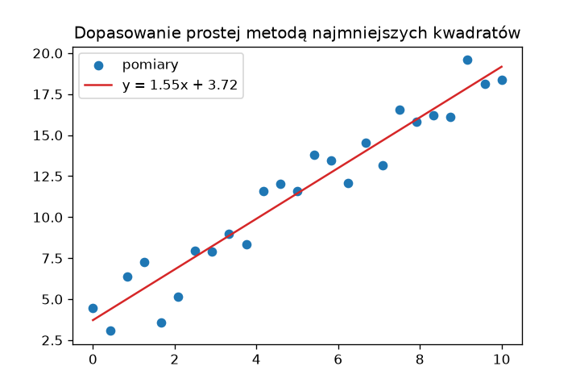
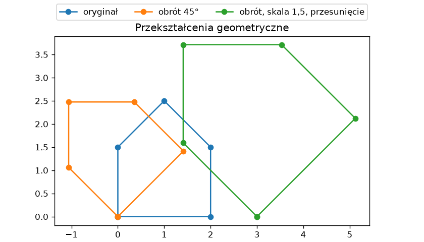

# Algebra liniowa i dopasowanie

Rozdział 14 „Python Notatki” pokazał operator `@` i moduł `np.linalg` w kilku wierszach. Tu używamy ich do zadań praktycznych: rozwiązania układu równań, dopasowania prostej do punktów pomiarowych, znalezienia kierunku największej zmienności, obrotu figury i liczenia odległości między wieloma punktami naraz.

## Układy równań

Trzy stopy metali o znanym składzie mieszamy tak, aby uzyskać zadany skład — to układ trzech równań liniowych `A @ x = b`, w którym kolumny `A` to składy stopów, a `x` — szukane ilości:

```python title="uklad.py"
import numpy as np

A = np.array([[0.5, 0.2, 0.1], [0.3, 0.6, 0.2], [0.2, 0.2, 0.7]])
b = np.array([25.0, 40.0, 35.0])

x = np.linalg.solve(A, b)
print(x.round(2), np.allclose(A @ x, b))

osobliwa = np.array([[1.0, 2.0], [2.0, 4.0]])
try:
    np.linalg.solve(osobliwa, np.array([1.0, 2.0]))
except np.linalg.LinAlgError as e:
    print("LinAlgError:", e)
```

```{ .text .no-copy }
[26.67 43.33 30.  ] True
LinAlgError: Singular matrix
```

`solve()` rozwiązuje układ bez jawnego odwracania macierzy — szybciej i dokładniej niż `inv(A) @ b` — a `np.allclose()` sprawdza wynik. Układ bez jednoznacznego rozwiązania (druga macierz ma wiersze proporcjonalne) kończy się wyjątkiem `LinAlgError` z modułu `np.linalg`; obsługujemy go jak każdy wyjątek z rozdziału 8.

## Dopasowanie prostej — najmniejsze kwadraty

Punkty pomiarowe rzadko leżą na prostej; **metoda najmniejszych kwadratów** (ang. *least squares*) wybiera prostą, dla której suma kwadratów odchyleń pionowych — reszt `y − f(x)` — jest najmniejsza. W NumPy służą do tego `np.linalg.lstsq()` i klasa `Polynomial` z modułu `numpy.polynomial`:

```python title="prosta.py"
import matplotlib.pyplot as plt
import numpy as np
from numpy.polynomial import Polynomial

rng = np.random.default_rng(42)
x = np.linspace(0, 10, 25)
y = 1.5 * x + 4.0 + rng.normal(0, 1.5, size=x.size)

A = np.column_stack([x, np.ones_like(x)])
(a, b), reszty, rzad, _ = np.linalg.lstsq(A, y)
print(f"lstsq: y = {a:.3f}x + {b:.3f}, suma kwadratów reszt {reszty[0]:.2f}")

prosta = Polynomial.fit(x, y, deg=1)
parabola = Polynomial.fit(x, y, deg=2)
print("Polynomial:", prosta.convert().coef.round(3), parabola.convert().coef.round(3))

r2 = 1 - ((y - prosta(x)) ** 2).sum() / ((y - y.mean()) ** 2).sum()
print(f"R² prostej: {r2:.3f}")

fig, ax = plt.subplots(figsize=(6, 4))
ax.scatter(x, y, label="pomiary")
ax.plot(x, prosta(x), color="tab:red", label=f"y = {a:.2f}x + {b:.2f}")
ax.legend()
ax.set_title("Dopasowanie prostej metodą najmniejszych kwadratów")
fig.savefig("dopasowanie.png", dpi=120)
```

```{ .text .no-copy }
lstsq: y = 1.545x + 3.721, suma kwadratów reszt 36.84
Polynomial: [3.721 1.545] [ 3.467  1.704 -0.016]
R² prostej: 0.936
```

{ width="600" }

`lstsq()` przyjmuje macierz, której kolumny to składniki modelu — tu `x` i kolumna jedynek, bo każdy wiersz `A` zapisuje równanie `a·xᵢ + b·1 = yᵢ` — i zwraca współczynniki, sumę kwadratów reszt, rząd macierzy i wartości osobliwe. `Polynomial.fit()` robi to samo dla wielomianu dowolnego stopnia; `fit()` dla stabilności numerycznej dopasowuje wielomian w dziedzinie przeskalowanej do przedziału [−1, 1], więc jego surowe `coef` nie są współczynnikami w zmiennej `x`; metoda `convert()` przelicza je do zwykłej postaci (od wyrazu wolnego wzwyż, odwrotnie niż w `np.polyval()` z rozdziału 14). Współczynnik determinacji R² mówi, jaką część zmienności `y` wyjaśnia model; stopień wielomianu dobieramy oszczędnie — parabola dopasowuje się do szumu równie dobrze, jak do prawidłowości — tu jej współczynnik przy `x²`, −0,016, jest praktycznie zerowy, więc dodatkowy stopień niczego nie wyjaśnia. Dopasowanie krzywych nieliniowych oferuje `scipy.optimize.curve_fit()`.

## Wektory własne i kierunek główny

Chmura punktów wydłużona w jednym kierunku ma **macierz kowariancji**, której **wektory własne** (ang. *eigenvectors*) wskazują kierunki zmienności, a **wartości własne** — jej wielkość w każdym z nich:

```python title="wlasne.py"
import numpy as np

rng = np.random.default_rng(42)
podstawa = rng.normal(size=(200, 2)) * [3.0, 0.5]
kat = np.radians(30)
obrot = np.array([[np.cos(kat), -np.sin(kat)], [np.sin(kat), np.cos(kat)]])
punkty = podstawa @ obrot.T

kowariancja = np.cov(punkty, rowvar=False)
wartosci, wektory = np.linalg.eigh(kowariancja)
print(kowariancja.round(2))
print(wartosci.round(2))
glowny = wektory[:, wartosci.argmax()]
print(glowny.round(3), (np.degrees(np.arctan2(glowny[1], glowny[0])) % 180).round(1))
```

```{ .text .no-copy }
[[6.58 3.76]
 [3.76 2.43]]
[0.21 8.8 ]
[-0.861 -0.508] 30.5
```

`np.cov()` z `rowvar=False` traktuje kolumny jako zmienne; Na przekątnej macierzy kowariancji leżą wariancje obu współrzędnych, poza nią — kowariancja, miara ich współzmienności. `eigh()` — odmiana ogólnej `np.linalg.eig()` dla macierzy symetrycznych, jaką jest kowariancja — zwraca wartości własne rosnąco i wektory własne w kolumnach. Kierunek największej wartości własnej odtwarza kąt obrotu chmury, około 30 stopni — znak wektora własnego jest umowny, dlatego kąt sprowadzamy do przedziału 0–180° operatorem `%`. Ten rachunek to istota **analizy głównych składowych** (ang. *principal component analysis*, PCA) — redukcji wymiaru, do której wracamy w ścieżce uczenia maszynowego. <!-- TODO: link po powstaniu rozdziału o uczeniu bez nadzoru -->

## Przekształcenia geometryczne

Obrót, skalowanie i odbicie punktów płaszczyzny to mnożenie przez macierz 2 × 2; wiele punktów naraz przekształca jedno wywołanie `@`, gdy punkty leżą w wierszach, a macierz jest transponowana — iloczyn `M @ p` dla punktu-kolumny `p` daje to samo, co wiersz `p @ M.T` (z tego wzorca skorzystaliśmy już przy obrocie chmury w poprzedniej sekcji):

```python title="obrot.py"
import matplotlib.pyplot as plt
import numpy as np


def macierz_obrotu(stopnie):
    kat = np.radians(stopnie)
    return np.array([[np.cos(kat), -np.sin(kat)], [np.sin(kat), np.cos(kat)]])


dom = np.array([[0, 0], [2, 0], [2, 1.5], [1, 2.5], [0, 1.5], [0, 0]])
obrocony = dom @ macierz_obrotu(45).T
powiekszony = obrocony @ np.diag([1.5, 1.5]).T + [3, 0]
print(obrocony[2].round(3), powiekszony[2].round(3))

fig, ax = plt.subplots(figsize=(7, 4), layout="constrained")
for figura, etykieta in ((dom, "oryginał"), (obrocony, "obrót 45°"), (powiekszony, "obrót, skala 1,5, przesunięcie")):
    ax.plot(figura[:, 0], figura[:, 1], marker="o", label=etykieta)
ax.set_aspect("equal")
fig.legend(loc="outside upper center", ncol=3)
ax.set_title("Przekształcenia geometryczne")
fig.savefig("obrot.png", dpi=120)
```

```{ .text .no-copy }
[0.354 2.475] [3.53  3.712]
```

{ width="600" }

Macierz obrotu o kąt `θ` ma postać `[[cos θ, −sin θ], [sin θ, cos θ]]`; skalowanie to macierz diagonalna, a przesunięcie — dodanie wektora rozgłaszanego na wszystkie wiersze. Złożenie przekształceń to iloczyn ich macierzy, więc dowolny ciąg obrotów i skalowań sprowadza się do jednego mnożenia. `set_aspect("equal")` z rozdziału 14 zachowuje na rysunku kąty i proporcje figury.

## Normy i odległości

**Norma** wektora to jego długość; `np.linalg.norm()` liczy ją dla jednego wektora albo wzdłuż wybranej osi tablicy, co pozwala policzyć odległości między wszystkimi parami punktów jednym wyrażeniem:

```python title="odleglosci.py"
import numpy as np

rng = np.random.default_rng(42)
miasta = rng.uniform(0, 100, size=(5, 2)).round(1)

print(np.linalg.norm(miasta[0] - miasta[1]).round(2))
roznice = miasta[:, None, :] - miasta[None, :, :]
odleglosci = np.linalg.norm(roznice, axis=2)
print(roznice.shape, odleglosci.shape)
print(odleglosci.round(1))

np.fill_diagonal(odleglosci, np.inf)
print(odleglosci.argmin(axis=1), odleglosci.min(axis=1).round(1))
```

```{ .text .no-copy }
27.16
(5, 5, 2) (5, 5)
[[ 0.  27.2 86.6 34.7 64.6]
 [27.2  0.  81.4 13.2 77.2]
 [86.6 81.4  0.  69.4 52.7]
 [34.7 13.2 69.4  0.  71.7]
 [64.6 77.2 52.7 71.7  0. ]]
[1 3 4 1 2] [27.2 13.2 52.7 13.2 52.7]
```

`np.linalg.norm()` liczy długość wektora (domyślnie euklidesową). Odległości między wszystkimi parami punktów daje rozgłaszanie z podrozdziału [Tablice wielowymiarowe](tablice-wielowymiarowe.md): `miasta[:, None, :]` ma kształt `(5, 1, 2)`, `miasta[None, :, :]` — `(1, 5, 2)`, a ich różnica — `(5, 5, 2)`, czyli wektor różnicy dla każdej pary; norma wzdłuż ostatniej osi zwraca macierz odległości. Wypełnienie przekątnej nieskończonością wyklucza odległość punktu od siebie, więc `argmin(axis=1)` wskazuje najbliższego sąsiada każdego miasta. Ten sam wzorzec — para osi z `None`, agregacja wzdłuż ostatniej — pojawi się w uczeniu maszynowym przy grupowaniu punktów. <!-- TODO: link po powstaniu rozdziału o uczeniu bez nadzoru --> Rozszerzoną algebrę liniową dostarcza `scipy.linalg`.
