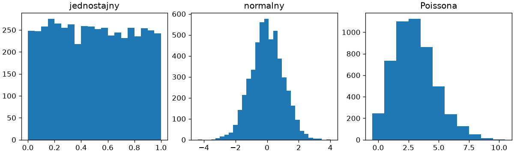
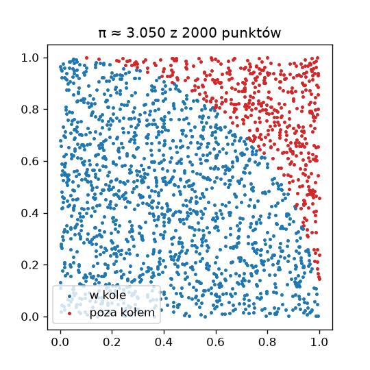
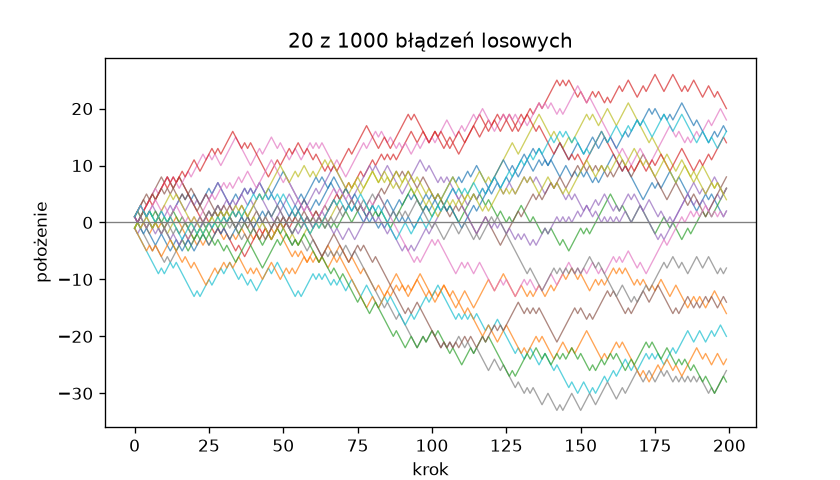

# Losowość i symulacje

Generator `default_rng()` z rozdziału 14 „Python Notatki” dostarcza liczby z kilkudziesięciu rozkładów, a tablice pozwalają symulować tysiące powtórzeń eksperymentu jednym wywołaniem. W tym podrozdziale losowość służy trzem celom: generowania danych testowych o znanych własnościach, szacowania wielkości trudnych do policzenia analitycznie i oceny niepewności wyniku.

## Generator i rozkłady

```python title="rozklady.py"
import matplotlib.pyplot as plt
import numpy as np

rng = np.random.default_rng(42)
print(rng.integers(1, 7, size=10))
print(rng.uniform(-1, 1, size=3).round(3))
print(rng.normal(loc=170, scale=10, size=3).round(1))
print(rng.binomial(n=10, p=0.5, size=5))
print(rng.poisson(lam=3, size=5))
print(rng.choice(["orzeł", "reszka"], size=6, p=[0.7, 0.3]))
print(rng.permutation(5))

fig, osie = plt.subplots(1, 3, figsize=(10, 3), layout="constrained")
osie[0].hist(rng.uniform(0, 1, 5000), bins=20)
osie[0].set_title("jednostajny")
osie[1].hist(rng.normal(0, 1, 5000), bins=30)
osie[1].set_title("normalny")
osie[2].hist(rng.poisson(3, 5000), bins=np.arange(12) - 0.5)
osie[2].set_title("Poissona")
fig.savefig("rozklady.png", dpi=120)
```

```{ .text .no-copy }
[1 5 4 3 3 6 1 5 2 1]
[0.951 0.522 0.572]
[169.8 161.5 178.8]
[7 6 6 5 4]
[1 7 1 4 2]
['orzeł' 'orzeł' 'orzeł' 'orzeł' 'orzeł' 'reszka']
[1 3 0 2 4]
```

{ width="760" }

`integers()` losuje liczby całkowite z przedziału prawostronnie otwartego (rzut kostką to `integers(1, 7)`), `uniform()` — liczby rzeczywiste z równym prawdopodobieństwem, `normal()` — z rozkładu normalnego o zadanej średniej i odchyleniu, `binomial()` — liczbę sukcesów w `n` próbach, `poisson()` — liczbę zdarzeń w jednostce czasu. `choice()` z argumentem `p=` losuje z zadanymi prawdopodobieństwami (moneta niesymetryczna), a `permutation()` zwraca losową kolejność. Histogram rozkładu Poissona ma krawędzie przedziałów przesunięte o 0,5, aby każda wartość całkowita trafiła w środek własnego słupka. Rozkład wybieramy według natury zjawiska: liczba wad na partii — Poissona, pomiar z błędem — normalny, wynik serii prób tak/nie — dwumianowy.

## Ziarno i niezależne strumienie

To samo ziarno daje ten sam ciąg — na tym opiera się [powtarzalność](../01-jupyter/srodowisko-projektu.md#powtarzalnosc) z rozdziału 1 tej części. Gdy symulacja ma działać w kilku procesach z rozdziału 15 „Python Notatki”, każdy potrzebuje własnego, niezależnego strumienia: nie „ziarno + numer procesu”, bo takie ziarna powtarzają się między uruchomieniami (ziarno 4 dla procesu 2 daje to samo, co ziarno 5 dla procesu 1), lecz `spawn()`:

```python title="ziarno.py"
import numpy as np

a = np.random.default_rng(2026)
b = np.random.default_rng(2026)
print(a.random(3).round(4), np.array_equal(a.random(5), b.random(8)[3:]))

rodzic = np.random.default_rng(2026)
potomne = rodzic.spawn(3)
print([int(g.integers(0, 100)) for g in potomne])
print([int(g.integers(0, 100)) for g in np.random.default_rng(2026).spawn(3)])
```

```{ .text .no-copy }
[0.1789 0.6399 0.4673] True
[62, 74, 8]
[62, 74, 8]
```

Dwa generatory z tym samym ziarnem wypisują ten sam ciąg, a ciąg z jednego rozkładu nie zależy od tego, jak pobieranie dzielimy na wywołania: pięć wartości pobranych po pierwszych trzech to te same liczby, co elementy od czwartego z ośmiu pobranych naraz. `spawn(3)` tworzy trzy generatory potomne, których strumienie są od siebie niezależne, a przy tym powtarzalne — drugie wywołanie z tym samym ziarnem rodzica daje te same wyniki. Każdy proces z puli dostaje jeden generator potomny, a wynik całości nie zależy od kolejności, w jakiej procesy skończą.

## Symulacja Monte Carlo

**Symulacja Monte Carlo** szacuje wielkość przez losowanie: pole ćwiartki koła o promieniu 1 to π/4, więc ułamek losowych punktów kwadratu, które wpadną do koła, przybliża tę liczbę:

```python title="monte-carlo.py"
import matplotlib.pyplot as plt
import numpy as np

rng = np.random.default_rng(42)
for n in (100, 10_000, 1_000_000):
    x, y = rng.random((2, n))
    w_kole = x**2 + y**2 <= 1
    print(f"n = {n:>9}: π ≈ {4 * w_kole.mean():.4f}")

x, y = rng.random((2, 2000))
w_kole = x**2 + y**2 <= 1
fig, ax = plt.subplots(figsize=(4.5, 4.5))
ax.scatter(x[w_kole], y[w_kole], s=4, label="w kole")
ax.scatter(x[~w_kole], y[~w_kole], s=4, color="tab:red", label="poza kołem")
ax.set_aspect("equal")
ax.legend(loc="lower left")
ax.set_title(f"π ≈ {4 * w_kole.mean():.3f} z 2000 punktów")
fig.savefig("monte-carlo.png", dpi=120)
```

```{ .text .no-copy }
n =       100: π ≈ 3.3600
n =     10000: π ≈ 3.1468
n =   1000000: π ≈ 3.1425
```

{ width="420" }

Całe losowanie to jedno wywołanie `rng.random((2, n))` — dwie tablice współrzędnych — a warunek `x**2 + y**2 <= 1` sprawdza milion punktów naraz. Dokładność rośnie powoli: błąd maleje odwrotnie proporcjonalnie do pierwiastka z liczby punktów, więc sto razy więcej losowań poprawia wynik o jedną cyfrę. Metoda nie jest dobrym sposobem liczenia π, ale jest jedynym praktycznym sposobem liczenia wielu wielkości bez wzoru — całek wielowymiarowych, prawdopodobieństw złożonych zdarzeń, ryzyka.

## Błądzenie losowe

**Błądzenie losowe** (ang. *random walk*) to suma niezależnych kroków; tysiąc tras liczymy jednocześnie jako tablicę trasy × kroki:

```python title="bladzenie.py"
import matplotlib.pyplot as plt
import numpy as np

rng = np.random.default_rng(42)
kroki = rng.choice([-1, 1], size=(1000, 200))
trasy = kroki.cumsum(axis=1)

koncowe = trasy[:, -1]
print(koncowe.mean().round(2), koncowe.std().round(2), np.sqrt(200).round(2))
print(np.abs(trasy).max(axis=1).mean().round(1))
print((np.abs(trasy) >= 20).any(axis=1).mean())

fig, ax = plt.subplots(figsize=(7, 4))
ax.plot(trasy[:20].T, linewidth=0.8, alpha=0.7)
ax.axhline(0, color="gray", linewidth=0.8)
ax.set_xlabel("krok")
ax.set_ylabel("położenie")
ax.set_title("20 z 1000 błądzeń losowych")
fig.savefig("bladzenie.png", dpi=120)
```

```{ .text .no-copy }
0.49 14.23 14.14
17.4
0.328
```

{ width="700" }

`cumsum(axis=1)` zamienia kroki w położenia dla wszystkich tras jednym wywołaniem. Średnie położenie końcowe jest bliskie zeru, a jego odchylenie — pierwiastkowi z liczby kroków, zgodnie z teorią; drugi wiersz podaje średnie największe oddalenie od punktu wyjścia (około 17), a trzeci — ułamek tras, które kiedykolwiek oddaliły się o co najmniej 20. Ten sam schemat — tablica powtórzeń × czas, agregacja po powtórzeniach — opisuje kursy, kolejki i zużycie zasobów; `plot()` z macierzą transponowaną rysuje każdą kolumnę jako osobną linię.

## Próbkowanie ponowne

Mamy jedną próbkę pomiarów i chcemy ocenić, jak dokładnie jej średnia szacuje średnią populacji. **Próbkowanie ponowne** (ang. *bootstrap*) losuje z próbki ze zwracaniem wiele nowych próbek tej samej wielkości i bada rozrzut ich średnich:

```python title="bootstrap.py"
import numpy as np

rng = np.random.default_rng(42)
probka = rng.normal(loc=50, scale=8, size=30).round(1)
print(probka.mean().round(2), probka.std(ddof=1).round(2))

powtorzenia = rng.choice(probka, size=(10_000, probka.size), replace=True)
srednie = powtorzenia.mean(axis=1)
dolna, gorna = np.percentile(srednie, [2.5, 97.5])
print(f"95% przedział ufności średniej: {dolna:.2f} – {gorna:.2f}")
print(f"błąd standardowy: {srednie.std():.2f} (wzór: {probka.std(ddof=1) / np.sqrt(probka.size):.2f})")
```

```{ .text .no-copy }
50.13 6.2
95% przedział ufności średniej: 47.90 – 52.28
błąd standardowy: 1.12 (wzór: 1.13)
```

`rng.choice()` z `size=(10_000, 30)` i `replace=True` tworzy dziesięć tysięcy próbek jednym wywołaniem; średnia wzdłuż osi 1 daje ich rozkład, a percentyle 2,5 i 97,5 — **95-procentowy przedział ufności** (ang. *confidence interval*): przy wielokrotnym powtarzaniu badania tak wyznaczony przedział obejmuje prawdziwą średnią w około 95% przypadków. Odchylenie tych średnich zgadza się z klasycznym wzorem na błąd standardowy, ale metoda działa także tam, gdzie wzoru nie ma — dla mediany, kwantyli czy współczynnika determinacji R² z poprzedniego podrozdziału. `ddof=1` w `std()` daje odchylenie próbkowe (dzielenie przez `n − 1`), właściwe przy szacowaniu z próbki. Wykresy rozkładów i przedziałów omawiamy szerzej w [rozdziale o Matplotlib w praktyce](../03-matplotlib/wykresy-danych.md).
