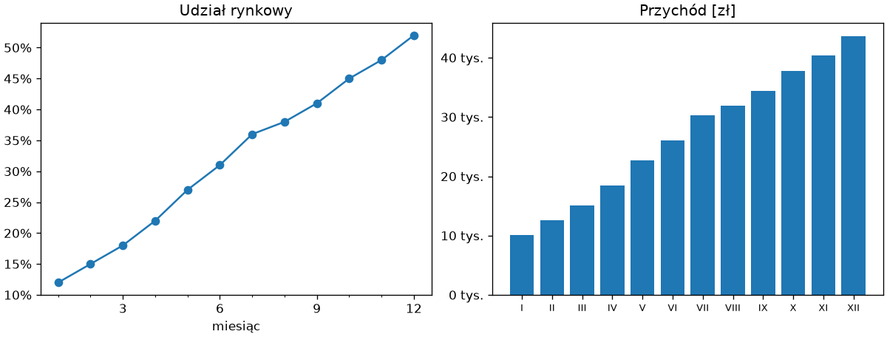
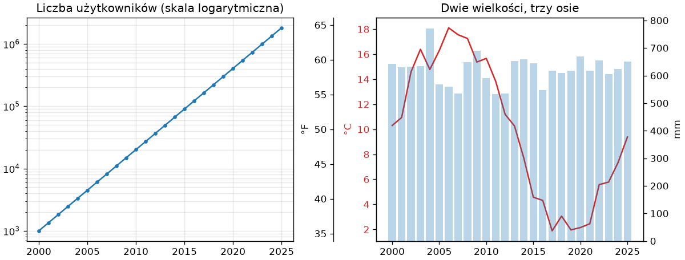
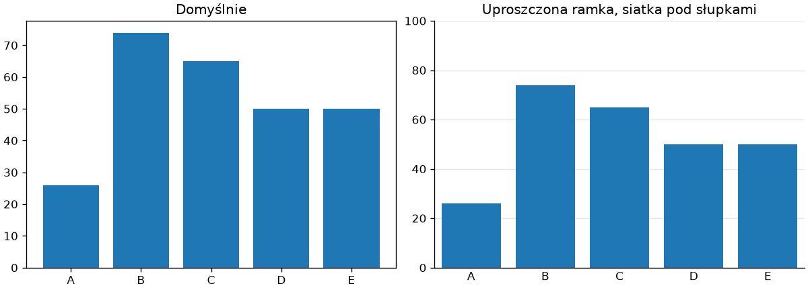
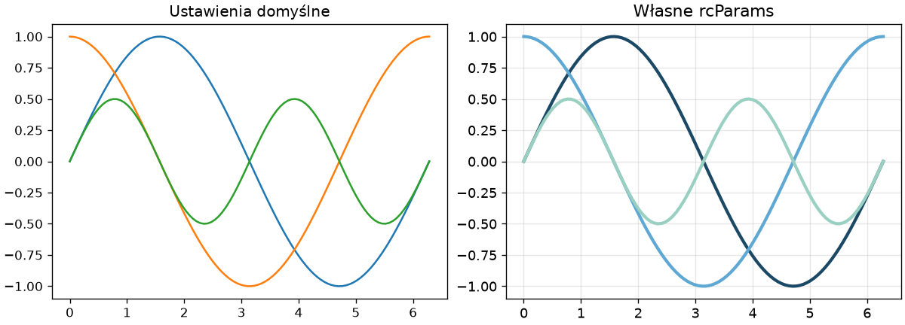

# Anatomia wykresu i style

Każdy element wykresu — linia, podziałka, napis, ramka — jest obiektem, do którego można sięgnąć i który można zmienić. Rozdział 14 „Python Notatki” pokazał tę hierarchię w zarysie; tu omawiamy szczegółowo obiekty, które decydują o czytelności: podziałek i ich opisów, skal osi, ramki i siatki oraz ustawień globalnych, którymi nadaje się wszystkim wykresom jeden styl.

## Obiekty rysunku

Metody rysujące zwracają obiekty, które można później modyfikować; osie, podziałki i ramka są atrybutami obiektu `Axes`:

```python title="anatomia.py"
import matplotlib as mpl
import matplotlib.pyplot as plt
import numpy as np

x = np.linspace(0, 10, 50)
fig, ax = plt.subplots()
(linia,) = ax.plot(x, np.sin(x))
print(type(linia).__name__, len(ax.lines), mpl.colors.to_hex(linia.get_color()), linia.get_linewidth())
print(type(ax.xaxis).__name__, type(ax.xaxis.get_major_locator()).__name__, list(ax.spines))
linia.set_linewidth(3)
ax.set_xticks([0, 5, 10])
print(ax.get_xticks(), type(ax.xaxis.get_major_locator()).__name__, linia.get_linewidth())
```

```{ .text .no-copy }
Line2D 1 #1f77b4 1.5
XAxis AutoLocator ['left', 'right', 'bottom', 'top']
[ 0  5 10] FixedLocator 3.0
```

`ax.plot()` zwraca listę obiektów `Line2D` — jeden na każdą narysowaną linię — a `ax.lines` przechowuje je wszystkie; metody `get_*` i `set_*` odczytują i zmieniają cechy narysowanego obiektu bez rysowania od nowa. `ax.xaxis` i `ax.yaxis` to obiekty `XAxis`/`YAxis`, które przechowują podziałki, ich etykiety i **lokalizator** (ang. *locator*) decydujący o położeniu podziałek; domyślny `AutoLocator` wybiera „okrągłe” wartości według rozmiaru wykresu, a `set_xticks()` zastępuje go lokalizatorem o stałych pozycjach. Cztery krawędzie ramki przechowuje obiekt `ax.spines`, który zachowuje się jak słownik, ale przyjmuje też listę nazw naraz. Kolor `#1f77b4` to pierwszy kolor palety domyślnej — `tab:blue` z rozdziału 14 — który `to_hex()` z modułu `matplotlib.colors` zapisuje w postaci szesnastkowej.

## Podziałki — lokalizatory i formatery

Położenie podziałek ustala lokalizator, a ich tekst — **formater** (ang. *formatter*); obie klasy pochodzą z modułu `matplotlib.ticker`, a osi przypisujemy je metodami `set_major_locator()` i `set_major_formatter()`:

```python title="podzialki.py"
import matplotlib.pyplot as plt
import numpy as np
from matplotlib.ticker import FuncFormatter, MultipleLocator, PercentFormatter

miesiace = np.arange(1, 13)
udzial = np.array([0.12, 0.15, 0.18, 0.22, 0.27, 0.31, 0.36, 0.38, 0.41, 0.45, 0.48, 0.52])
przychod = udzial * 84_000

fig, (ax1, ax2) = plt.subplots(1, 2, figsize=(10, 3.8), layout="constrained")
ax1.plot(miesiace, udzial, marker="o")
ax1.xaxis.set_major_locator(MultipleLocator(3))
ax1.xaxis.set_minor_locator(MultipleLocator(1))
ax1.yaxis.set_major_formatter(PercentFormatter(xmax=1.0, decimals=0))
ax1.set_title("Udział rynkowy")
ax1.set_xlabel("miesiąc")

ax2.bar(miesiace, przychod)
ax2.yaxis.set_major_formatter(FuncFormatter(lambda wartosc, pozycja: f"{wartosc / 1000:.0f} tys."))
ax2.set_xticks(miesiace, labels=["I", "II", "III", "IV", "V", "VI", "VII", "VIII", "IX", "X", "XI", "XII"])
ax2.tick_params(axis="x", labelsize=8)
ax2.set_title("Przychód [zł]")
fig.savefig("podzialki.png", dpi=120)
print(ax1.yaxis.get_major_formatter()(0.25), ax2.yaxis.get_major_formatter()(42_000))
```

```{ .text .no-copy }
25% 42 tys.
```

{ width="760" }

`MultipleLocator(3)` umieszcza podziałki główne co trzy jednostki, a `set_minor_locator()` — drobne, bez etykiet, co jedną. `PercentFormatter(xmax=1.0)` zamienia ułamki na procenty; `FuncFormatter` przyjmuje dowolną funkcję dwóch argumentów (wartość i pozycja podziałki), która zwraca napis — tu tysiące złotych. Gdy podziałki mają stałe etykiety, wystarcza `set_xticks(pozycje, labels=…)` znane z rozdziału 14; `tick_params()` zmienia rozmiar etykiet oraz kierunek, długość i kolor podziałek. Formater przypisany do osi jest obiektem wywoływalnym — wywołany z liczbą zwraca jej tekst, co pozwala go sprawdzić bez rysowania.

## Skale — logarytmiczna, oś bliźniacza i wtórna

Dane rosnące wykładniczo wymagają skali logarytmicznej; dwie wielkości o różnych jednostkach na jednym wykresie — drugiej osi pionowej:

```python title="skale.py"
import matplotlib.pyplot as plt
import numpy as np

lata = np.arange(2000, 2026)
uzytkownicy = 1_000 * 1.35 ** (lata - 2000)
rng = np.random.default_rng(42)
temperatura = 10 + 8 * np.sin((lata - 2000) / 4) + rng.normal(0, 1, lata.size)
opady = 600 + rng.normal(0, 80, lata.size)

fig, (ax1, ax2) = plt.subplots(1, 2, figsize=(10, 3.8), layout="constrained")
ax1.plot(lata, uzytkownicy, marker=".")
ax1.set_yscale("log")
ax1.set_title("Liczba użytkowników (skala logarytmiczna)")
ax1.grid(True, which="both", alpha=0.3)

ax2.plot(lata, temperatura, color="tab:red")
ax2.set_ylabel("°C", color="tab:red")
ax2.tick_params(axis="y", labelcolor="tab:red")
blizniacza = ax2.twinx()
blizniacza.bar(lata, opady, alpha=0.3)
blizniacza.set_ylabel("mm")
fahrenheit = ax2.secondary_yaxis("left", functions=(lambda c: c * 9 / 5 + 32, lambda f: (f - 32) * 5 / 9))
fahrenheit.spines["left"].set_position(("outward", 45))
fahrenheit.set_ylabel("°F")
ax2.set_title("Dwie wielkości, trzy osie")
fig.savefig("skale.png", dpi=120)
print(uzytkownicy[[0, 12, 25]].astype(int), ax1.get_yscale())
```

```{ .text .no-copy }
[   1000   36644 1812776] log
```

{ width="760" }

W skali logarytmicznej wzrost o stały procent rocznie staje się prostą, a `grid(which="both")` rysuje siatkę także dla podziałek drobnych, które w tej skali oznaczają 2, 3, … 9 w każdej dekadzie. `twinx()` tworzy **oś bliźniaczą** (ang. *twin axis*): drugi obiekt `Axes` o wspólnej osi x i własnej osi y po prawej stronie — rysujemy na nim tak samo, jak na pierwszym. `secondary_yaxis()` tworzy **oś wtórną** (ang. *secondary axis*), która nie niesie nowych danych, lecz pokazuje tę samą wielkość w innych jednostkach — parą funkcji przeliczających w obie strony; `set_position(("outward", 45))` odsuwa ją od ramki o 45 punktów. Dwie osie pionowe łatwo nadużyć: skale dobrane tak, aby linie się „pokrywały”, sugerują zależność, której w danych nie ma — wracamy do tego w ostatnim podrozdziale.

## Ramka, siatka i marginesy

Ramka z czterech krawędzi, którą Matplotlib rysuje domyślnie, i siatka włączona w obu kierunkach rozpraszają uwagę; wykres do raportu zwykle upraszczamy:

```python title="ramka.py"
import matplotlib.pyplot as plt
import numpy as np

rng = np.random.default_rng(42)
kategorie = ["A", "B", "C", "D", "E"]
wartosci = rng.integers(20, 90, size=5)

fig, (ax1, ax2) = plt.subplots(1, 2, figsize=(10, 3.6), layout="constrained")
ax1.bar(kategorie, wartosci)
ax1.set_title("Domyślnie")

ax2.bar(kategorie, wartosci, color="tab:blue")
ax2.spines[["top", "right"]].set_visible(False)
ax2.grid(axis="y", alpha=0.3)
ax2.set_axisbelow(True)
ax2.tick_params(axis="x", length=0)
ax2.margins(x=0.02)
ax2.set_ylim(0, 100)
ax2.set_title("Uproszczona ramka, siatka pod słupkami")
fig.savefig("ramka.png", dpi=120)
print(tuple(round(float(v), 3) for v in ax2.get_xlim()), ax2.spines["top"].get_visible())
```

```{ .text .no-copy }
(-0.496, 4.496) False
```

{ width="760" }

`ax.spines[...]` z listą nazw ukrywa wybrane krawędzie jednym wywołaniem; `grid(axis="y")` rysuje tylko linie poziome — te, które pomagają odczytać wysokość słupka — a `set_axisbelow(True)` umieszcza je pod danymi, nie nad nimi. `margins()` steruje pustym pasem między danymi a ramką (domyślnie 5% z każdej strony), a `set_ylim(0, …)` przypomina zasadę słupków: oś wartości zaczyna się od zera, inaczej różnice wysokości słupków wprowadzają w błąd.

## Style i `rcParams`

Wszystkie ustawienia domyślne — rozmiar rysunku, czcionki, kolory, grubości linii — mieszczą się w słowniku `matplotlib.rcParams`; arkusze stylu z rozdziału 14 to zapisane zestawy takich ustawień:

```python title="style.py"
import matplotlib as mpl
import matplotlib.pyplot as plt
import numpy as np

print(mpl.rcParams["figure.figsize"], mpl.rcParams["font.size"], mpl.rcParams["lines.linewidth"])

x = np.linspace(0, 2 * np.pi, 100)
krzywe = [np.sin(x), np.cos(x), np.sin(2 * x) / 2]

fig = plt.figure(figsize=(10, 3.6), layout="constrained")
ax1 = fig.add_subplot(1, 2, 1)
for krzywa in krzywe:
    ax1.plot(x, krzywa)
ax1.set_title("Ustawienia domyślne")

wlasne = {"lines.linewidth": 2.5, "axes.prop_cycle": mpl.cycler(color=["#1b4965", "#5fa8d3", "#9ad0c2"]), "axes.grid": True, "grid.alpha": 0.3, "font.size": 11}
with mpl.rc_context(wlasne):
    ax2 = fig.add_subplot(1, 2, 2)
    for krzywa in krzywe:
        ax2.plot(x, krzywa)
    ax2.set_title("Własne rcParams")
fig.savefig("style.png", dpi=120)
print(mpl.rcParams["lines.linewidth"])
```

```{ .text .no-copy }
[6.4, 4.8] 10.0 1.5
1.5
```

{ width="760" }

`mpl.rcParams["klucz"] = wartość` zmienia ustawienie dla wszystkich kolejnych rysunków; `mpl.rc_context()` — menedżer kontekstu z rozdziału 8 „Python Notatki” — tylko wewnątrz bloku `with`, po czym przywraca poprzednie wartości, co potwierdza ostatni wydruk. Klucz `axes.prop_cycle` z obiektem `cycler` ustala kolejność kolorów kolejnych linii; `plt.style.use()` znane z rozdziału 14 wczytuje ze ścieżką do pliku `.mplstyle` własny zestaw, o czym w ostatnim podrozdziale. Ustawienia z `rcParams` dotyczą obiektów tworzonych później; już istniejących nie zmieniają — dlatego drugi panel powstaje metodą `add_subplot()` wewnątrz bloku `with`, a nie razem z pierwszym przed nim: paletę, siatkę i rozmiar czcionki panel dostaje w chwili utworzenia.
