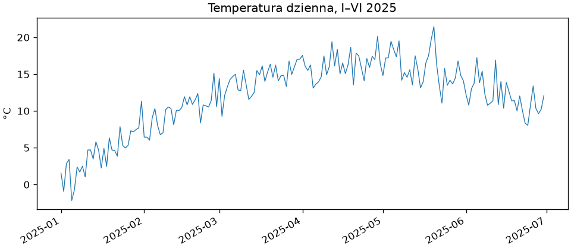
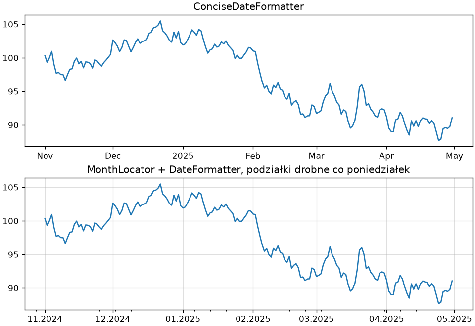
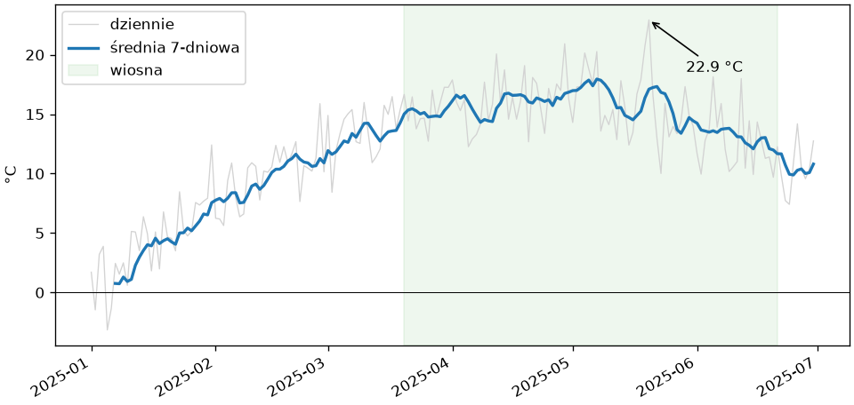
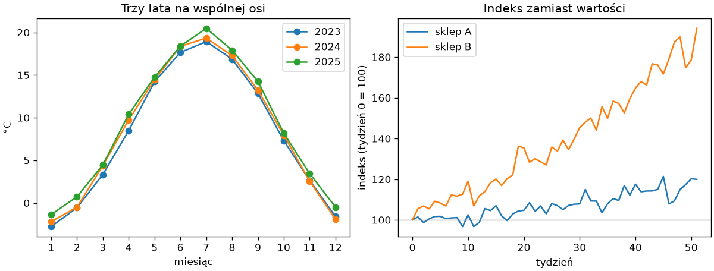

# Daty i szeregi czasowe

Pomiary uporządkowane w czasie — temperatura dzienna, sprzedaż miesięczna, kurs — to **szereg czasowy** (ang. *time series*). Matplotlib rozumie daty: przyjmuje je na osi, dobiera podziałki do zakresu i pozwala je formatować; wystarczy podać daty jako daty, nie jako liczby czy napisy.

## Daty w NumPy i na osi

Typ `np.datetime64` z NumPy przechowuje datę z zadaną rozdzielczością, a `np.arange()` tworzy z niego ciągi dni jak z liczb:

```python title="daty.py"
import matplotlib.pyplot as plt
import numpy as np

dni = np.arange("2025-01-01", "2025-07-01", dtype="datetime64[D]")
rng = np.random.default_rng(42)
temperatura = 5 + 12 * np.sin((np.arange(dni.size) - 20) / 58) + rng.normal(0, 2, dni.size)

print(dni.dtype, dni.size, dni[0], dni[-1])
print(dni[31] - dni[0], (dni[-1] - dni[0]).astype(int))
print(dni.astype("datetime64[M]")[[0, 40, 100]])

fig, ax = plt.subplots(figsize=(8, 3.5), layout="constrained")
ax.plot(dni, temperatura, linewidth=0.8)
ax.set_ylabel("°C")
ax.set_title("Temperatura dzienna, I–VI 2025")
fig.autofmt_xdate()
fig.savefig("daty.png", dpi=120)
print([round(v) for v in ax.get_xlim()])
```

```{ .text .no-copy }
datetime64[D] 181 2025-01-01 2025-06-30
31 days 180
['2025-01' '2025-02' '2025-04']
[20080, 20278]
```

{ width="700" }

Różnica dwóch dat to `np.timedelta64` w jednostce tablicy — tu dni — którą `astype(int)` zamienia na liczbę; rzutowanie na `datetime64[M]` obcina datę do miesiąca. Na osi Matplotlib przechowuje daty jako liczby dni od 1 stycznia 1970 roku — stąd granice osi około 20 000 w ostatnim wydruku — a domyślny lokalizator dat sam dobiera, czy podpisać miesiące, tygodnie czy dni. `fig.autofmt_xdate()` obraca etykiety dat, aby się nie nakładały.

## Lokalizatory i formatery dat

Moduł `matplotlib.dates` dostarcza lokalizatory i formatery dla dat — odpowiedniki tych z pierwszego podrozdziału:

```python title="daty-format.py"
import matplotlib.dates as mdates
import matplotlib.pyplot as plt
import numpy as np

dni = np.arange("2024-11-01", "2025-05-01", dtype="datetime64[D]")
rng = np.random.default_rng(42)
kurs = 100 + rng.normal(0, 1, dni.size).cumsum()

fig, (ax1, ax2) = plt.subplots(2, 1, figsize=(8, 5.5), layout="constrained", sharey=True)
ax1.plot(dni, kurs)
lokalizator = mdates.AutoDateLocator()
ax1.xaxis.set_major_locator(lokalizator)
ax1.xaxis.set_major_formatter(mdates.ConciseDateFormatter(lokalizator))
ax1.set_title("ConciseDateFormatter")

ax2.plot(dni, kurs)
ax2.xaxis.set_major_locator(mdates.MonthLocator())
ax2.xaxis.set_major_formatter(mdates.DateFormatter("%m.%Y"))
ax2.xaxis.set_minor_locator(mdates.WeekdayLocator(byweekday=mdates.MO))
ax2.grid(True, which="major", alpha=0.4)
ax2.set_title("MonthLocator + DateFormatter, podziałki drobne co poniedziałek")
fig.savefig("daty-format.png", dpi=120)
print(mdates.DateFormatter("%d %b %Y")(mdates.date2num(np.datetime64("2025-03-05"))))
```

```{ .text .no-copy }
05 Mar 2025
```

{ width="700" }

`AutoDateLocator` dobiera gęstość podziałek do zakresu, a `ConciseDateFormatter` podpisuje je oszczędnie: rok pojawia się tylko tam, gdzie się zmienia (na podziałce stycznia), a gdy cały zakres mieści się w jednym roku — w napisie pod prawym końcem osi; miesiące oznacza skrótami, dni liczbami. `MonthLocator`, `WeekdayLocator`, `DayLocator` stawiają podziałki w stałych odstępach kalendarzowych, stałe `mdates.MO`…`mdates.SU` oznaczają dni tygodnia, a `DateFormatter` przyjmuje wzorzec `strftime` z modułu `datetime` biblioteki standardowej: `%d` to dzień, `%m` i `%b` — miesiąc liczbą i skrótem, `%Y` — rok. Nazwy miesięcy zależą od ustawień regionalnych interpretera — domyślnie angielskie, jak w wydruku; polskie nazwy uzyskamy za pomocą modułu `locale` albo własnego `FuncFormatter`.

## Wygładzanie, okresy i zdarzenia

```python title="okresy.py"
import matplotlib.pyplot as plt
import numpy as np

dni = np.arange("2025-01-01", "2025-07-01", dtype="datetime64[D]")
rng = np.random.default_rng(42)
temperatura = 5 + 12 * np.sin((np.arange(dni.size) - 20) / 58) + rng.normal(0, 2.5, dni.size)
okno = 7
srednia_ruchoma = np.convolve(temperatura, np.ones(okno) / okno, mode="valid")

fig, ax = plt.subplots(figsize=(8, 3.8), layout="constrained")
ax.plot(dni, temperatura, color="lightgray", linewidth=0.8, label="dziennie")
ax.plot(dni[okno - 1 :], srednia_ruchoma, color="tab:blue", linewidth=2, label="średnia 7-dniowa")
ax.axvspan(np.datetime64("2025-03-20"), np.datetime64("2025-06-21"), color="tab:green", alpha=0.08, label="wiosna")
najcieplej = temperatura.argmax()
ax.annotate(f"{temperatura[najcieplej]:.1f} °C", xy=(dni[najcieplej], temperatura[najcieplej]), xytext=(25, -35), textcoords="offset points", arrowprops={"arrowstyle": "->"})
ax.axhline(0, color="black", linewidth=0.6)
ax.legend(loc="upper left")
ax.set_ylabel("°C")
fig.autofmt_xdate()
fig.savefig("okresy.png", dpi=120)
print(srednia_ruchoma.size, dni[najcieplej], temperatura[najcieplej].round(1))
```

```{ .text .no-copy }
175 2025-05-20 22.9
```

{ width="700" }

Średnia ruchoma z rozdziału 2 wygładza szum; z `mode="valid"` jest krótsza o `okno - 1` punktów, więc rysujemy ją od odpowiedniej daty. `axvspan()` cieniuje przedział na osi x — z datami działa jak z liczbami — a `annotate()` z `textcoords="offset points"` umieszcza tekst w stałej odległości od punktu w punktach typograficznych, niezależnie od skali osi: to wygodniejsze niż współrzędne danych z rozdziału 14, gdy oś jest datą.

## Porównanie szeregów

Szeregi z różnych lat porównujemy, nakładając je na wspólną oś kalendarzową — tu miesiąca roku; szeregi o różnych poziomach — przeliczając na wspólny indeks:

```python title="porownanie.py"
import matplotlib.pyplot as plt
import numpy as np

rng = np.random.default_rng(42)
dzien_roku = np.arange(1, 366)
fig, (ax1, ax2) = plt.subplots(1, 2, figsize=(10, 3.8), layout="constrained")
for rok, przesuniecie in ((2023, 0.0), (2024, 0.6), (2025, 1.1)):
    temperatura = 8 + 11 * np.sin((dzien_roku - 100) / 58) + przesuniecie + rng.normal(0, 2, 365)
    miesieczna = temperatura[:360].reshape(12, 30).mean(axis=1)
    ax1.plot(np.arange(1, 13), miesieczna, marker="o", label=str(rok))
ax1.set_xticks(np.arange(1, 13))
ax1.set_xlabel("miesiąc")
ax1.set_ylabel("°C")
ax1.legend()
ax1.set_title("Trzy lata na wspólnej osi")

tygodnie = np.arange(52)
for nazwa, start, tempo in (("sklep A", 1200, 0.004), ("sklep B", 120, 0.012)):
    sprzedaz = start * (1 + tempo) ** tygodnie * (1 + rng.normal(0, 0.03, 52))
    ax2.plot(tygodnie, 100 * sprzedaz / sprzedaz[0], label=nazwa)
ax2.axhline(100, color="gray", linewidth=0.8)
ax2.set_xlabel("tydzień")
ax2.set_ylabel("indeks (tydzień 0 = 100)")
ax2.legend()
ax2.set_title("Indeks zamiast wartości")
fig.savefig("porownanie.png", dpi=120)
```

{ width="760" }

Nałożenie lat na jedną oś ujawnia różnice między nimi lepiej niż jeden długi szereg; przeskalowanie do indeksu (pierwsza wartość = 100) pozwala porównać tempo zmian wielkości różniących się dziesięciokrotnie — bez indeksu mniejszy sklep byłby na wykresie płaską linią. Obie operacje to zwykłe przekształcenia tablic z rozdziału 2: `reshape()` z agregacją i dzielenie przez pierwszy element.

## `datetime` a `np.datetime64`

```python title="konwersje-dat.py"
from datetime import date, datetime

import matplotlib.dates as mdates
import numpy as np

tablica = np.arange("2025-03-01", "2025-03-04", dtype="datetime64[D]")
print(tablica.astype(datetime)[0], type(tablica.astype(datetime)[0]).__name__)
print(np.datetime64(date(2025, 3, 1)), np.datetime64("2025-03-01T14:30"))
print(mdates.date2num(np.datetime64("2025-03-01")), mdates.num2date(20148).date())
```

```{ .text .no-copy }
2025-03-01 date
2025-03-01 2025-03-01T14:30
20148.0 2025-03-01
```

Daty z modułu `datetime` biblioteki standardowej i `np.datetime64` przeliczają się w obie strony: `astype(datetime)` daje obiekty `date` dla rozdzielczości dziennej i zgrubszej oraz `datetime` dla godzin do mikrosekund (przy nanosekundach, domyślnych w pandas, zwraca liczbę całkowitą, więc najpierw rzutujemy na `datetime64[us]`), a `np.datetime64()` przyjmuje obiekt `date` lub napis w formacie ISO. Matplotlib rysuje oba rodzaje, więc wybór zależy od tego, skąd dane pochodzą: pliki i pandas dostarczają `datetime64`, wejście użytkownika i moduł `datetime` — obiekty Pythona. Strefy czasowe komplikują obraz — `np.datetime64` ich nie przechowuje, więc daty z różnych stref sprowadzamy do jednej przed wykresem.
