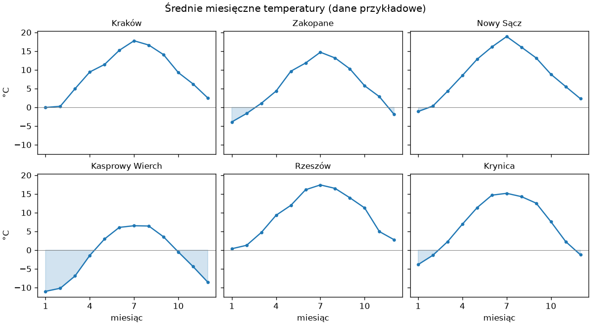
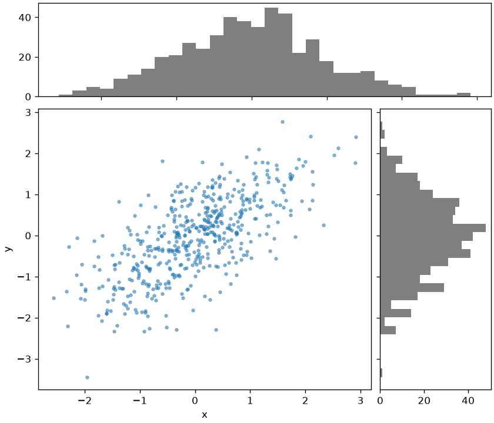
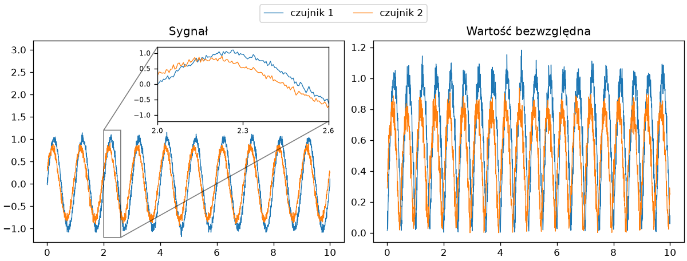
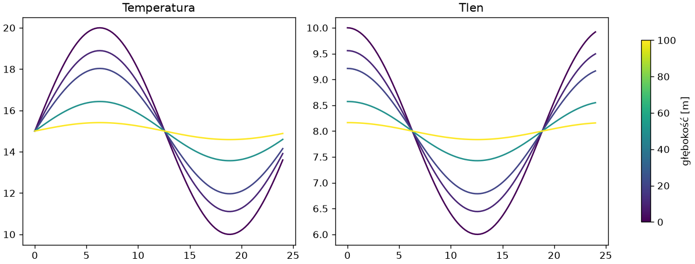
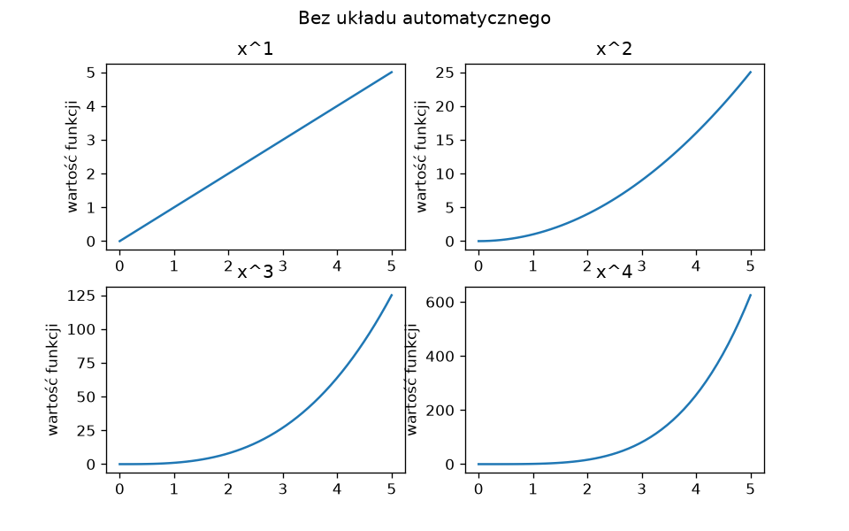
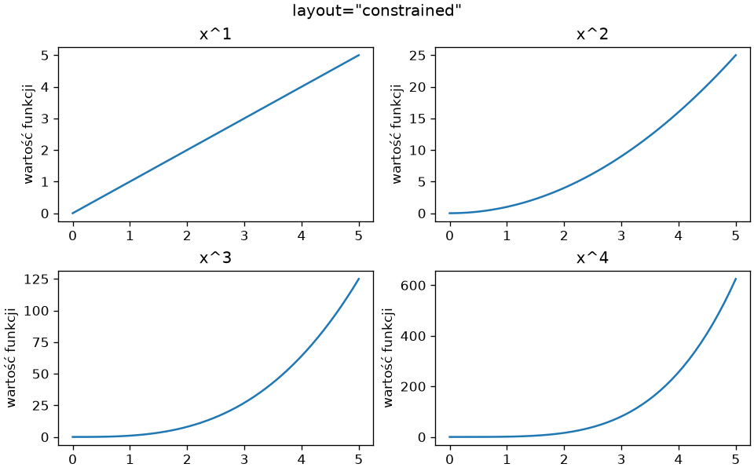

# Wiele paneli i układ

Jeden wykres rzadko odpowiada na wszystkie pytania; kilka paneli o wspólnych osiach, kolorach i legendzie robi to lepiej niż kilka osobnych rysunków. Siatkę `subplots(2, 2)` znamy z rozdziału 14 „Python Notatki”; ten podrozdział dodaje wzorzec małych wielokrotności, układy nieregularne, wstawki, wspólne kolory i wybór między układem automatycznym a ręcznym.

## Małe wielokrotności

**Małe wielokrotności** (ang. *small multiples*) to ten sam wykres powtórzony dla każdej grupy danych, w identycznych osiach — oko porównuje panele bez czytania podziałek:

```python title="male-wielokrotnosci.py"
import matplotlib.pyplot as plt
import numpy as np

rng = np.random.default_rng(42)
miesiace = np.arange(1, 13)
stacje = {nazwa: 10 + wysokosc * -0.006 + 9 * np.sin((miesiace - 4) / 2) + rng.normal(0, 0.8, 12) for nazwa, wysokosc in [("Kraków", 220), ("Zakopane", 830), ("Nowy Sącz", 300), ("Kasprowy Wierch", 1990), ("Rzeszów", 200), ("Krynica", 590)]}

fig, osie = plt.subplots(2, 3, figsize=(10, 5.5), sharex=True, sharey=True, layout="constrained")
for ax, (nazwa, temperatura) in zip(osie.flat, stacje.items()):
    ax.plot(miesiace, temperatura, marker=".")
    ax.fill_between(miesiace, temperatura, 0, where=temperatura < 0, interpolate=True, color="tab:blue", alpha=0.2)
    ax.axhline(0, color="gray", linewidth=0.6)
    ax.set_title(nazwa, fontsize=10)
    ax.set_xticks([1, 4, 7, 10])
for ax in osie[-1]:
    ax.set_xlabel("miesiąc")
for ax in osie[:, 0]:
    ax.set_ylabel("°C")
fig.suptitle("Średnie miesięczne temperatury (dane przykładowe)")
fig.savefig("male-wielokrotnosci.png", dpi=120)
print(osie.shape, [round(float(t.mean()), 1) for t in stacje.values()])
```

```{ .text .no-copy }
(2, 3) [9.0, 5.5, 8.8, -1.5, 9.2, 6.7]
```

{ width="760" }

`sharex=True, sharey=True` wymusza identyczne osie i usuwa powtarzające się etykiety z paneli wewnętrznych; etykiety osi dodajemy tylko w dolnym wierszu i lewej kolumnie — wycinki `osie[-1]` i `osie[:, 0]` tablicy paneli z rozdziału 14. `fill_between()` z argumentem `where=` cieniuje tylko fragmenty spełniające warunek, a `interpolate=True` domyka obszar w punkcie przecięcia z zerem zamiast w ostatnim punkcie danych. Wzorzec skaluje się do dowolnej liczby grup: pętla po `osie.flat` i słowniku danych, a gdy paneli jest więcej niż grup, puste ukrywa `ax.set_visible(False)`.

## Mozaika paneli — `subplot_mosaic()`

Układ nieregularny — jeden panel duży, dwa małe — opisujemy tekstowo:

```python title="mozaika.py"
import matplotlib.pyplot as plt
import numpy as np

rng = np.random.default_rng(42)
x = rng.normal(0, 1, 500)
y = 0.7 * x + rng.normal(0, 0.7, 500)

fig, panele = plt.subplot_mosaic([["gora", "gora"], ["glowny", "prawy"]], figsize=(7, 6), layout="constrained", height_ratios=[1, 3], width_ratios=[3, 1])
panele["glowny"].scatter(x, y, s=8, alpha=0.5)
panele["glowny"].set_xlabel("x")
panele["glowny"].set_ylabel("y")
panele["gora"].hist(x, bins=30, color="tab:gray")
panele["gora"].sharex(panele["glowny"])
panele["gora"].tick_params(labelbottom=False)
panele["prawy"].hist(y, bins=30, orientation="horizontal", color="tab:gray")
panele["prawy"].sharey(panele["glowny"])
panele["prawy"].tick_params(labelleft=False)
fig.savefig("mozaika.png", dpi=120)
print(sorted(panele), panele["gora"].get_subplotspec().colspan)
```

```{ .text .no-copy }
['glowny', 'gora', 'prawy'] range(0, 2)
```

{ width="520" }

`subplot_mosaic()` przyjmuje listę wierszy z nazwami paneli — ta sama nazwa w kilku komórkach rozciąga panel na te komórki — i zwraca słownik `nazwa → Axes`, czytelniejszy niż indeksy tablicy. `height_ratios` i `width_ratios` ustalają proporcje wierszy i kolumn. Metody `sharex()`/`sharey()` wiążą osie po utworzeniu paneli, a `tick_params(labelbottom=False)` ukrywa zbędne etykiety. Ten układ — wykres punktowy z histogramami brzegowymi — pokazuje jednocześnie zależność i rozkłady obu zmiennych.

## Wstawka i wspólna legenda

```python title="wstawka.py"
import matplotlib.pyplot as plt
import numpy as np

rng = np.random.default_rng(42)
t = np.linspace(0, 10, 2000)
sygnaly = {"czujnik 1": np.sin(2 * np.pi * t) + 0.05 * rng.normal(size=t.size), "czujnik 2": 0.8 * np.sin(2 * np.pi * t + 0.4) + 0.05 * rng.normal(size=t.size)}

fig, (ax1, ax2) = plt.subplots(1, 2, figsize=(10, 3.8), layout="constrained")
for nazwa, sygnal in sygnaly.items():
    ax1.plot(t, sygnal, linewidth=0.8, label=nazwa)
    ax2.plot(t, np.abs(sygnal), linewidth=0.8, label=nazwa)
ax1.set_title("Sygnał")
ax1.set_ylim(-1.3, 3.2)
ax2.set_title("Wartość bezwzględna")

wstawka = ax1.inset_axes([0.4, 0.6, 0.55, 0.37])
for nazwa, sygnal in sygnaly.items():
    wstawka.plot(t, sygnal, linewidth=0.8)
wstawka.set_xlim(2, 2.6)
wstawka.set_ylim(-1.2, 1.2)
wstawka.set_xticks([2, 2.3, 2.6])
wstawka.tick_params(labelsize=7)
ax1.indicate_inset_zoom(wstawka, edgecolor="black")

uchwyty, etykiety = ax1.get_legend_handles_labels()
fig.legend(uchwyty, etykiety, loc="outside upper center", ncol=2)
fig.savefig("wstawka.png", dpi=120)
print(len(fig.axes), len(ax1.child_axes), tuple(float(v) for v in wstawka.get_xlim()))
```

```{ .text .no-copy }
2 1 (2.0, 2.6)
```

{ width="760" }

`inset_axes([x, y, szerokość, wysokość])` tworzy **wstawkę** (ang. *inset*) — mały panel wewnątrz dużego, o położeniu podanym w ułamkach jego rozmiaru — a `indicate_inset_zoom()` rysuje ramkę wokół powiększanego obszaru i łączy ją ze wstawką. Wstawka jest panelem potomnym `ax1`, nie rysunku — `fig.axes` jej nie zawiera, `ax1.child_axes` tak. Gdy kilka paneli pokazuje te same serie, jedna legenda na poziomie rysunku zastępuje powtórzone: `get_legend_handles_labels()` zbiera uchwyty i etykiety z jednego panelu, a `fig.legend(loc="outside upper center")` z rozdziału 2 stawia legendę poza panelami, bez zasłaniania danych.

## Kolory spójne między panelami

Gdy ta sama wielkość — na przykład głębokość albo rok — pojawia się w kilku panelach, kolory muszą znaczyć to samo wszędzie; bierzemy je z jednej mapy kolorów i jednej skali:

```python title="kolory.py"
import matplotlib as mpl
import matplotlib.pyplot as plt
import numpy as np

glebokosci = np.array([0, 10, 20, 50, 100])
x = np.linspace(0, 24, 100)
mapa = plt.colormaps["viridis"]
norma = mpl.colors.Normalize(vmin=glebokosci.min(), vmax=glebokosci.max())

fig, (ax1, ax2) = plt.subplots(1, 2, figsize=(10, 3.8), layout="constrained")
for glebokosc in glebokosci:
    tlumienie = np.exp(-glebokosc / 40)
    ax1.plot(x, 15 + 5 * tlumienie * np.sin(x / 4), color=mapa(norma(glebokosc)))
    ax2.plot(x, 8 + 2 * tlumienie * np.cos(x / 4), color=mapa(norma(glebokosc)))
ax1.set_title("Temperatura")
ax2.set_title("Tlen")
fig.colorbar(mpl.cm.ScalarMappable(norm=norma, cmap=mapa), ax=[ax1, ax2], label="głębokość [m]", shrink=0.8)
fig.savefig("kolory.png", dpi=120)
print(mapa.N, [tuple(round(float(c), 2) for c in mapa(norma(g))[:3]) for g in glebokosci[[0, -1]]])
```

```{ .text .no-copy }
256 [(0.27, 0.0, 0.33), (0.99, 0.91, 0.14)]
```

{ width="760" }

`plt.colormaps["viridis"]` to obiekt mapy kolorów: wywołany z liczbą z przedziału 0–1 zwraca kolor RGBA, a `Normalize` przelicza wartości danych na ten przedział. Ten sam kolor dla tej samej głębokości w obu panelach nie wymaga legendy — zastępuje ją wspólna skala `colorbar()` zbudowana z `ScalarMappable` (obiektu, który zna tylko normę i mapę, bez danych) i przypisana do listy paneli. Mapy ciągłe, jak `viridis`, są właściwe dla wielkości uporządkowanych; dla kategorii bez porządku lepsza jest paleta jakościowa, jak `tab10`.

## Układ automatyczny a ręczny

```python title="uklad.py"
import matplotlib.pyplot as plt
import numpy as np

x = np.linspace(0, 5, 50)
fig, osie = plt.subplots(2, 2, figsize=(8, 5))
for i, ax in enumerate(osie.flat):
    ax.plot(x, x ** (i + 1))
    ax.set_title(f"x^{i + 1}")
    ax.set_ylabel("wartość funkcji")
fig.suptitle("Bez układu automatycznego")
fig.savefig("uklad-bez.png", dpi=120)
print(fig.get_layout_engine())

fig.set_layout_engine("constrained")
fig.suptitle("layout=\"constrained\"")
fig.savefig("uklad.png", dpi=120)
print(type(fig.get_layout_engine()).__name__)

fig2, osie2 = plt.subplots(2, 2, figsize=(8, 5))
fig2.subplots_adjust(left=0.1, right=0.98, top=0.9, bottom=0.1, hspace=0.5, wspace=0.35)
print(fig2.subplotpars.hspace)
```

```{ .text .no-copy }
None
ConstrainedLayoutEngine
0.5
```

{ width="560" }

{ width="560" }

Bez silnika układu panele mają stałe marginesy i etykiety nachodzą na sąsiednie tytuły; `layout="constrained"` z rozdziału 14 — albo `set_layout_engine()` po utworzeniu rysunku — dobiera odstępy do rzeczywistych rozmiarów napisów. `fig.subplots_adjust()` ustawia ręcznie marginesy w ułamkach rysunku, a odstępy `hspace` i `wspace` — w ułamkach średniego rozmiaru panelu: przydatne, gdy wiele rysunków ma mieć identyczny układ, na przykład w serii do publikacji, gdzie automatyka dawałaby każdemu inne marginesy. `tight_layout()` ze starszego kodu robi to, co układ automatyczny, ale gorzej radzi sobie z legendami poza panelami i skalami kolorów.
