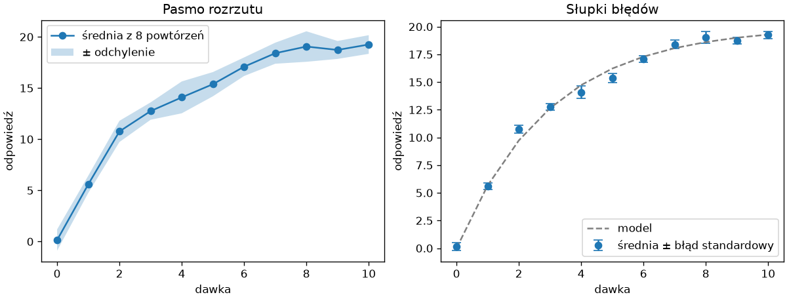
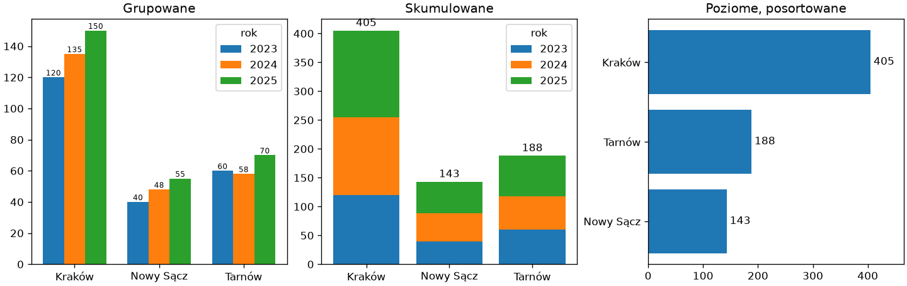
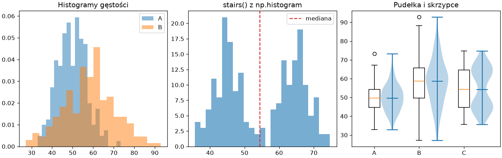
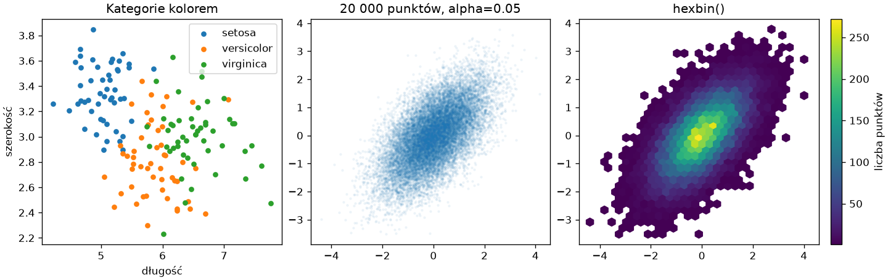

# Wykresy dla danych

Podstawowe typy wykresów z rozdziału 14 „Python Notatki” rzadko wystarczają do przedstawienia danych pomiarowych: wynik ma niepewność, kategorie mają podgrupy, rozkład ma kształt, a punktów bywa tak wiele, że zlewają się w jednolity obszar. Ten podrozdział pokazuje cztery odpowiedzi Matplotlib na te sytuacje; dane losowe pochodzą z generatora z ziarnem, jak w rozdziale 2 tej części.

## Przedziały niepewności — `fill_between()` i `errorbar()`

Pomiar powtórzony wiele razy opisują średnia i rozrzut; na wykresie rozrzut pokazujemy pasmem albo słupkami błędów:

```python title="niepewnosc.py"
import matplotlib.pyplot as plt
import numpy as np

rng = np.random.default_rng(42)
dawka = np.linspace(0, 10, 11)
powtorzenia = 20 * (1 - np.exp(-dawka / 3))[None, :] + rng.normal(0, 1.5, size=(8, dawka.size))
srednia = powtorzenia.mean(axis=0)
odchylenie = powtorzenia.std(axis=0, ddof=1)
blad = odchylenie / np.sqrt(powtorzenia.shape[0])

fig, (ax1, ax2) = plt.subplots(1, 2, figsize=(10, 3.8), layout="constrained")
ax1.plot(dawka, srednia, marker="o", label="średnia z 8 powtórzeń")
ax1.fill_between(dawka, srednia - odchylenie, srednia + odchylenie, alpha=0.25, label="± odchylenie")
ax1.legend()
ax1.set_title("Pasmo rozrzutu")

ax2.errorbar(dawka, srednia, yerr=blad, fmt="o", capsize=4, label="średnia ± błąd standardowy")
ax2.plot(dawka, 20 * (1 - np.exp(-dawka / 3)), color="gray", linestyle="--", label="model")
ax2.legend()
ax2.set_title("Słupki błędów")
for ax in (ax1, ax2):
    ax.set_xlabel("dawka")
    ax.set_ylabel("odpowiedź")
fig.savefig("niepewnosc.png", dpi=120)
print(srednia[[0, 5, 10]].round(1), odchylenie.mean().round(2), blad.mean().round(2))
```

```{ .text .no-copy }
[ 0.1 15.4 19.3] 1.07 0.38
```

{ width="760" }

`fill_between(x, dół, góra)` wypełnia obszar między dwiema krzywymi — z `alpha` tworzy pasmo, przez które widać linie i punkty leżące pod spodem. `errorbar()` rysuje punkty z odcinkami błędu (`yerr=`, także `xerr=`), a `capsize=` dodaje poprzeczki na końcach; `fmt="o"` wyłącza linię łączącą punkty. Wybór między odchyleniem a błędem standardowym z rozdziału 2 to decyzja merytoryczna, którą trzeba nazwać w legendzie: pasmo odchylenia mówi, jak rozrzucone są pojedyncze pomiary, słupki błędu standardowego — jak dokładnie znamy średnią.

## Słupki grupowane, skumulowane i z etykietami

Słupki porównują kategorie; podgrupy stawiamy obok siebie albo jedna na drugiej, a wartości podpisujemy metodą `bar_label()`:

```python title="slupki.py"
import matplotlib.pyplot as plt
import numpy as np

miasta = ["Kraków", "Nowy Sącz", "Tarnów"]
lata = ["2023", "2024", "2025"]
sprzedaz = np.array([[120, 135, 150], [40, 48, 55], [60, 58, 70]])

fig, (ax1, ax2, ax3) = plt.subplots(1, 3, figsize=(12, 3.8), layout="constrained")
pozycje = np.arange(len(miasta))
szerokosc = 0.25
for i, rok in enumerate(lata):
    slupki = ax1.bar(pozycje + (i - 1) * szerokosc, sprzedaz[:, i], width=szerokosc, label=rok)
    ax1.bar_label(slupki, fontsize=7)
ax1.set_xticks(pozycje, labels=miasta)
ax1.legend(title="rok")
ax1.set_title("Grupowane")

dol = np.zeros(len(miasta))
for i, rok in enumerate(lata):
    ax2.bar(miasta, sprzedaz[:, i], bottom=dol, label=rok)
    dol += sprzedaz[:, i]
ax2.bar_label(ax2.containers[-1], labels=dol.astype(int), padding=2)
ax2.legend(title="rok")
ax2.set_title("Skumulowane")

razem = sprzedaz.sum(axis=1)
kolejnosc = razem.argsort()
slupki = ax3.barh(np.array(miasta)[kolejnosc], razem[kolejnosc])
ax3.bar_label(slupki, fmt="%d", padding=3)
ax3.set_xlim(0, razem.max() * 1.15)
ax3.set_title("Poziome, posortowane")
fig.savefig("slupki.png", dpi=120)
print(dol, razem[kolejnosc])
```

```{ .text .no-copy }
[405. 143. 188.] [143 188 405]
```

{ width="900" }

Słupki grupowane to przesunięcia o wielokrotność szerokości — wzorzec z rozdziału 1 tej części; skumulowane powstają z argumentu `bottom=`, który przesuwa każdą kolejną serię o sumę poprzednich. `bar_label()` podpisuje kontener słupków zwrócony przez `bar()` — wartością słupka domyślnie albo własnymi etykietami z `labels=`; `ax.containers` przechowuje wszystkie kontenery, więc ostatni to wierzchołek stosu. Słupki poziome z kategoriami posortowanymi po wartości czyta się najłatwiej — `barh()` rysuje pierwszą kategorię u dołu, więc sortowanie rosnące umieszcza największą wartość na górze — a `set_xlim()` z zapasem robi miejsce na etykiety. Zasada z poprzedniego podrozdziału: oś wartości od zera.

## Rozkłady — histogram, `stairs()`, pudełka i skrzypce

Rozkład jednej zmiennej porównujemy między grupami; sam wykres pudełkowy nie pokazuje, czy rozkład ma jedno skupienie, czy dwa:

```python title="rozklady2.py"
import matplotlib.pyplot as plt
import numpy as np

rng = np.random.default_rng(42)
grupy = {"A": rng.normal(50, 8, 200), "B": rng.normal(58, 12, 200), "C": np.concatenate([rng.normal(45, 4, 100), rng.normal(65, 4, 100)])}

fig, (ax1, ax2, ax3) = plt.subplots(1, 3, figsize=(12, 3.8), layout="constrained")
ax1.hist(grupy["A"], bins=20, density=True, alpha=0.5, label="A")
ax1.hist(grupy["B"], bins=20, density=True, alpha=0.5, label="B")
ax1.legend()
ax1.set_title("Histogramy gęstości")

licznosci, krawedzie = np.histogram(grupy["C"], bins=25)
ax2.stairs(licznosci, krawedzie, fill=True, alpha=0.6)
ax2.axvline(np.median(grupy["C"]), color="tab:red", linestyle="--", label="mediana")
ax2.legend()
ax2.set_title("stairs() z np.histogram")

ax3.boxplot(list(grupy.values()), tick_labels=list(grupy), positions=[1, 2, 3], widths=0.25)
ax3.violinplot(list(grupy.values()), positions=[1.4, 2.4, 3.4], widths=0.5, showmedians=True)
ax3.set_title("Pudełka i skrzypce")
fig.savefig("rozklady2.png", dpi=120)
print({nazwa: (round(float(np.median(dane)), 1), round(float(dane.std()), 1)) for nazwa, dane in grupy.items()})
```

```{ .text .no-copy }
{'A': (49.6, 7.0), 'B': (58.7, 12.2), 'C': (54.3, 10.7)}
```

{ width="900" }

Dwa histogramy na jednym panelu porównujemy po normalizacji `density=True` i z przezroczystością; `stairs()` rysuje liczności policzone wcześniej funkcją `np.histogram()` z rozdziału 2 — przydatne, gdy histogram już mamy albo chcemy go najpierw przekształcić. **Wykres skrzypcowy** (ang. *violin plot*) pokazuje cały kształt rozkładu: grupa C ma dwa skupienia, których wykres pudełkowy nie ujawnia — jej pudełko wygląda jak szeroki rozkład jednomodalny. `violinplot()` i `boxplot()` przyjmują listę tablic i pozycje, więc można je postawić obok siebie dla tych samych grup.

## Zależności — kategorie, nakładanie punktów i `hexbin()`

Zależność dwóch zmiennych pokazuje wykres punktowy — dopóki punktów nie jest za dużo:

```python title="zaleznosci.py"
import matplotlib.pyplot as plt
import numpy as np

rng = np.random.default_rng(42)
gatunki = {"setosa": (5.0, 3.4), "versicolor": (5.9, 2.8), "virginica": (6.6, 3.0)}

fig, (ax1, ax2, ax3) = plt.subplots(1, 3, figsize=(12, 3.8), layout="constrained")
for nazwa, (dlugosc, szerokosc) in gatunki.items():
    x = rng.normal(dlugosc, 0.4, 50)
    y = rng.normal(szerokosc, 0.3, 50)
    ax1.scatter(x, y, s=18, label=nazwa)
ax1.legend()
ax1.set_xlabel("długość")
ax1.set_ylabel("szerokość")
ax1.set_title("Kategorie kolorem")

x = rng.normal(0, 1, 20_000)
y = 0.6 * x + rng.normal(0, 0.8, 20_000)
ax2.scatter(x, y, s=3, alpha=0.05)
ax2.set_title("20 000 punktów, alpha=0.05")

mapa = ax3.hexbin(x, y, gridsize=30, cmap="viridis", mincnt=1)
fig.colorbar(mapa, ax=ax3, label="liczba punktów")
ax3.set_title("hexbin()")
fig.savefig("zaleznosci.png", dpi=120)
print(np.corrcoef(x, y)[0, 1].round(3), int(mapa.get_array().max()))
```

```{ .text .no-copy }
0.6 272
```

{ width="900" }

Kategorie rysujemy w pętli, po jednym `scatter()` na grupę — każde wywołanie dostaje kolejny kolor palety i własny wpis w legendzie. Przy tysiącach punktów zwykły wykres punktowy staje się nieczytelny; przezroczystość `alpha` bliska zeru pokazuje, gdzie punkty się zagęszczają, a `hexbin()` zamienia je w mapę gęstości: liczy punkty w sześciokątach i koloruje je mapą kolorów, `mincnt=1` pomija puste komórki, a `get_array()` zwraca liczności komórek — najgęstsza ma ich kilkaset. To wersja histogramu dla dwóch zmiennych — z tą samą skalą kolorów `colorbar()` co `imshow()` w rozdziale 14. Współczynnik korelacji 0,6 z `np.corrcoef()` potwierdza zależność widoczną na obu panelach.
