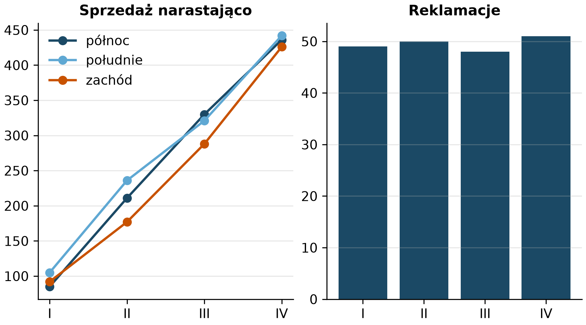
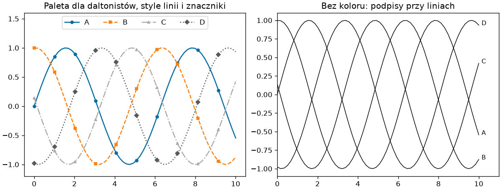

# Wykres do raportu i publikacji

Wykres, który dobrze wygląda na ekranie, po wstawieniu do dokumentu bywa za mały, ma nieczytelne czcionki albo rozmyte linie; wykres kolorowy w druku czarno-białym traci znaczenie. Ten podrozdział zbiera to, co decyduje o wykresie w raporcie: format i rozmiar, jeden styl dla wszystkich rysunków, czytelność dla każdego odbiorcy, wiele wykresów w jednym pliku oraz skrypt, który wszystkie rysunki raportu odtwarza jednym poleceniem.

## Format, rozdzielczość i rozmiar

Rozmiar rysunku podajemy w calach, a rozdzielczość w punktach na cal; dokument decyduje o obu:

```python title="zapis2.py"
from pathlib import Path

import matplotlib.pyplot as plt
import numpy as np

CM = 1 / 2.54
x = np.linspace(0, 10, 100)
fig, ax = plt.subplots(figsize=(16 * CM, 9 * CM), layout="constrained")
ax.plot(x, np.sin(x), label="sin")
ax.plot(x, np.cos(x), label="cos")
ax.legend()
ax.set_xlabel("x")
ax.set_ylabel("y")
ax.set_title("Rysunek 16 × 9 cm")

for nazwa, opcje in (("ekran.png", {"dpi": 100}), ("druk.png", {"dpi": 300}), ("wektor.pdf", {}), ("wektor.svg", {})):
    fig.savefig(nazwa, **opcje, metadata={"Title": "Przykład"})
    print(f"{nazwa:<12}{Path(nazwa).stat().st_size / 1024:7.1f} kB")
print(fig.get_size_inches().round(2), fig.dpi)
```

```{ .text .no-copy }
ekran.png      36.5 kB
druk.png      132.4 kB
wektor.pdf     14.1 kB
wektor.svg     29.3 kB
[6.3  3.54] 100.0
```

Szerokość kolumny tekstu w dokumencie A4 to około 16 cm; rysunek tej szerokości zapisany w 300 dpi ma około 1890 pikseli szerokości i drukuje się ostro, a w 100 dpi — około 630 pikseli, wystarczających na ekran. Stała `CM` przelicza centymetry na cale w `figsize`. Formaty wektorowe PDF i SVG z rozdziału 14 nie mają rozdzielczości — skalują się bez strat i zajmują tyle, ile geometria wykresu, nie liczba pikseli; do dokumentów LaTeX wstawiamy PDF, do edytorów biurowych — SVG albo PNG w 300 dpi, na strony WWW — SVG, a PNG zostawiamy też dla wykresów z tysiącami punktów, bo plik wektorowy rośnie wraz z liczbą punktów. Argument `metadata=` zapisuje w pliku tytuł, a w PNG i PDF także autora (klucz `Author`; SVG ma własny zestaw kluczy, na przykład `Creator`); `fig.dpi` (domyślnie 100) dotyczy ekranu i jest też domyślną rozdzielczością zapisu; zastępuje ją `dpi=` w `savefig()` albo ustawienie `savefig.dpi`, o którym w następnej sekcji.

## Styl domowy w jednym pliku

Rysunki jednego raportu mają wyglądać jednakowo; zamiast powtarzać ustawienia w każdym skrypcie, zapisujemy je raz w **arkuszu stylu** (ang. *style sheet*) — pliku `.mplstyle` z parami klucz–wartość `rcParams`:

```text title="raport.mplstyle"
figure.figsize: 6.3, 3.5
figure.dpi: 100
savefig.dpi: 300
font.size: 10
axes.titlesize: 11
axes.titleweight: bold
axes.spines.top: False
axes.spines.right: False
axes.grid: True
axes.grid.axis: y
grid.alpha: 0.3
axes.prop_cycle: cycler("color", ["1b4965", "5fa8d3", "c85200", "595959", "62b6cb"])
lines.linewidth: 1.8
legend.frameon: False
```

```python title="styl-domowy.py"
import matplotlib.pyplot as plt
import numpy as np

plt.style.use("./raport.mplstyle")
rng = np.random.default_rng(42)
kwartaly = ["I", "II", "III", "IV"]
fig, (ax1, ax2) = plt.subplots(1, 2, layout="constrained")
for nazwa in ("północ", "południe", "zachód"):
    ax1.plot(kwartaly, rng.integers(80, 140, 4).cumsum(), marker="o", label=nazwa)
ax1.legend()
ax1.set_title("Sprzedaż narastająco")
ax2.bar(kwartaly, rng.integers(20, 60, 4))
ax2.set_title("Reklamacje")
fig.savefig("styl-domowy.png")
print(plt.rcParams["axes.spines.top"], plt.rcParams["savefig.dpi"], plt.rcParams["axes.prop_cycle"].by_key()["color"][:2])
```

```{ .text .no-copy }
False 300.0 ['#1b4965', '#5fa8d3']
```

{ width="640" }

`plt.style.use()` ze ścieżką do pliku wczytuje arkusz jak każdy z wbudowanych; przedrostek `./` podkreśla, że chodzi o plik, choć nazwę spoza listy stylów wbudowanych Matplotlib i tak traktuje jako ścieżkę. Ścieżka jest względna do katalogu roboczego, nie do skryptu. Kolory w arkuszu podajemy bez `#`, bo ten znak rozpoczyna w nim komentarz, a `savefig.dpi` sprawia, że każdy zapis ma rozdzielczość do druku bez powtarzania `dpi=` w skryptach. Arkusz trzymamy w katalogu projektu z rozdziału 1 obok skryptów; kilka arkuszy można nałożyć listą — `plt.style.use(["seaborn-v0_8-whitegrid", "./raport.mplstyle"])` — a ustawienia z późniejszego nadpisują wcześniejsze.

## Czytelność — daltonizm i druk czarno-biały

Około 8% mężczyzn i 0,5% kobiet ma zaburzenie widzenia czerwieni i zieleni — od osłabionego rozróżniania po jego brak — a wydruk czarno-biały nie odróżnia żadnych barw; wykres, który znaczenie niesie samym kolorem, jest dla tych odbiorców pusty:

```python title="czytelnosc.py"
import matplotlib as mpl
import matplotlib.pyplot as plt
import numpy as np

x = np.linspace(0, 10, 60)
serie = {"A": np.sin(x), "B": np.sin(x + 1.5), "C": np.sin(x + 3), "D": np.sin(x + 4.5)}
style = [("-", "o"), ("--", "s"), ("-.", "^"), (":", "D")]

fig = plt.figure(figsize=(10, 3.8), layout="constrained")
with plt.style.context("tableau-colorblind10"):
    ax1 = fig.add_subplot(1, 2, 1)
    for (nazwa, y), (linia, znacznik) in zip(serie.items(), style):
        ax1.plot(x, y, linestyle=linia, marker=znacznik, markevery=6, markersize=4, label=nazwa)
    paleta = plt.rcParams["axes.prop_cycle"].by_key()["color"][:2]
ax1.set_ylim(-1.2, 1.6)
ax1.legend(ncol=4, loc="upper center")
ax1.set_title("Paleta dla daltonistów, style linii i znaczniki")

ax2 = fig.add_subplot(1, 2, 2)
for nazwa, y in serie.items():
    ax2.plot(x, y, color="black", linewidth=0.9, label=nazwa)
    ax2.annotate(nazwa, xy=(x[-1], y[-1]), xytext=(4, 0), textcoords="offset points", fontsize=9)
ax2.set_xlim(0, 11)
ax2.set_title("Bez koloru: podpisy przy liniach")
fig.savefig("czytelnosc.png", dpi=120)
print(paleta, [mpl.colors.to_hex(c) for c in plt.rcParams["axes.prop_cycle"].by_key()["color"][:2]])
```

```{ .text .no-copy }
['#006BA4', '#FF800E'] ['#1f77b4', '#ff7f0e']
```

{ width="760" }

Trzy zabezpieczenia: paleta dobrana dla daltonistów (`tableau-colorblind10`, `seaborn-v0_8-colorblind` albo mapy `viridis` i `cividis` z rozdziału 14), różne style linii i znaczniki (`markevery=` rysuje znacznik co kilka punktów, aby nie zasłaniały linii) oraz podpisy bezpośrednio przy liniach zamiast legendy, którą trzeba odczytywać kolorem. `plt.style.context()` włącza paletę tylko wewnątrz bloku, więc panel z tą paletą tworzymy w bloku — jak w podrozdziale o stylach; ostatni wydruk zestawia pierwsze kolory palety z bloku i palety domyślnej, która po wyjściu z bloku wraca.

## Wiele wykresów w jednym PDF — `PdfPages`

Raport z kilkunastoma wykresami wygodnie oddać jako jeden plik PDF, po jednym rysunku na stronę:

```python title="pdfpages.py"
from pathlib import Path

import matplotlib.pyplot as plt
import numpy as np
from matplotlib.backends.backend_pdf import PdfPages

rng = np.random.default_rng(42)
with PdfPages("raport.pdf") as pdf:
    for numer in range(1, 4):
        fig, ax = plt.subplots(figsize=(8, 4.5), layout="constrained")
        ax.plot(rng.normal(size=50).cumsum())
        ax.set_title(f"Wykres {numer}")
        pdf.savefig(fig)
        plt.close(fig)
    pdf.infodict()["Title"] = "Raport kwartalny"
    strony = pdf.get_pagecount()
print(Path("raport.pdf").stat().st_size > 1000, strony)
```

```{ .text .no-copy }
True 3
```

`PdfPages` jest menedżerem kontekstu: `pdf.savefig(fig)` dopisuje stronę, a `plt.close(fig)` z rozdziału 14 zwalnia pamięć w pętli; `infodict()` ustawia metadane dokumentu. Strony mają rozmiar rysunku, więc `figsize` decyduje o formacie strony. Gdy dokument składa się z osobnych plików, zapisujemy pojedyncze PDF — po jednym na rysunek — jak w skrypcie z następnej sekcji.

## Skrypt generujący wykresy raportu

Rysunki raportu powinny powstawać jednym poleceniem — z tych samych danych, w tym samym stylu, do tego samego katalogu — aby po poprawce danych odtworzyć wszystkie bez ręcznego powtarzania czynności:

```python title="raport.py"
"""Generuje wszystkie rysunki raportu do katalogu wyniki/rysunki."""

from pathlib import Path

import matplotlib.pyplot as plt
import numpy as np

KATALOG = Path("wyniki") / "rysunki"
plt.style.use("./raport.mplstyle")


def wczytaj_dane():
    rng = np.random.default_rng(42)
    miesiace = np.arange(1, 13)
    return miesiace, rng.integers(50, 120, 12), rng.normal(20, 3, 12)


def rysunek_sprzedaz(miesiace, sprzedaz):
    fig, ax = plt.subplots()
    ax.bar(miesiace, sprzedaz)
    ax.set_xticks(miesiace)
    ax.set_title("Sprzedaż miesięczna")
    return fig


def rysunek_marza(miesiace, marza):
    fig, ax = plt.subplots()
    ax.plot(miesiace, marza, marker="o")
    ax.set_xticks(miesiace)
    ax.set_ylim(0, 30)
    ax.set_title("Marża [%]")
    return fig


def main():
    KATALOG.mkdir(parents=True, exist_ok=True)
    miesiace, sprzedaz, marza = wczytaj_dane()
    rysunki = {"sprzedaz": rysunek_sprzedaz(miesiace, sprzedaz), "marza": rysunek_marza(miesiace, marza)}
    for nazwa, fig in rysunki.items():
        for rozszerzenie in ("png", "pdf"):
            fig.savefig(KATALOG / f"{nazwa}.{rozszerzenie}")
        plt.close(fig)
    print(sorted(p.name for p in KATALOG.iterdir()))


if __name__ == "__main__":
    main()
```

```{ .text .no-copy }
['marza.pdf', 'marza.png', 'sprzedaz.pdf', 'sprzedaz.png']
```

Każdy rysunek to funkcja przyjmująca dane i zwracająca `Figure` — bez zapisu w środku, więc tę samą funkcję można wywołać w notatniku, aby obejrzeć rysunek przed zapisem. Funkcja `main()` pod strażnikiem z rozdziału 7 „Python Notatki” wczytuje dane raz, tworzy rysunki i zapisuje każdy w dwóch formatach do katalogu `wyniki/` z układu projektu z rozdziału 1. Skrypt należy do katalogu `skrypty/`, a ścieżki w nim są względne do katalogu roboczego, więc uruchamiamy go z katalogu projektu poleceniem `python skrypty/raport.py`, które trafia do listy poleceń odtwarzających raport w `README.md`; testować go można jak każdy skrypt z rozdziału 16 „Python Notatki”, sprawdzając choćby, czy pliki powstały.

## Pułapki prezentacji

- **Oś wartości ucięta nad zerem** na wykresie słupkowym wyolbrzymia różnice; słupki zaczynają się od zera, a gdy różnice są małe, pokazujemy je wykresem liniowym lub punktowym z jawnie opisaną osią.
- **Dwie osie pionowe** o skalach dobranych do wrażenia — rysujemy je tylko dla wielkości fizycznie powiązanych i opisujemy obie osie kolorem serii, jak w pierwszym podrozdziale.
- **Wykres kołowy** z więcej niż trzema–czterema kategoriami jest nieczytelny (oko źle porównuje kąty); słupki poziome posortowane po wartości pokazują to samo dokładniej.
- **Efekty trójwymiarowe** i cienie zniekształcają odczyt wartości, niczego nie dodając.
- **Za dużo kolorów** — więcej niż sześć serii na jednym panelu to sygnał, aby użyć małych wielokrotności z poprzedniego podrozdziału.
- **Brak jednostek i źródła** — każda oś ma jednostkę, a rysunek do raportu podpis ze źródłem danych i datą; wykresu bez nich nie da się zweryfikować.

## Dalej: pandas i seaborn

Rysunki z tego rozdziału powstają z tablic NumPy. Biblioteka pandas z następnego rozdziału ścieżki [rysuje wykresy wprost z tabel](../04-pandas-tabele/przeksztalcenia.md#wykres-z-tabeli-plot) jedną metodą, opisując osie nazwami kolumn — u podstaw leży ten sam Matplotlib, więc każdy zwrócony obiekt `Axes` można dopracować metodami z tego rozdziału. Biblioteka seaborn buduje na Matplotlib wykresy statystyczne — rozkłady z podziałem na grupy, macierze zależności, regresje — jednym wywołaniem i z domyślnym stylem dobranym do danych tabelarycznych; warto ją poznać po pandas, gdy same dane są już tabelą.
