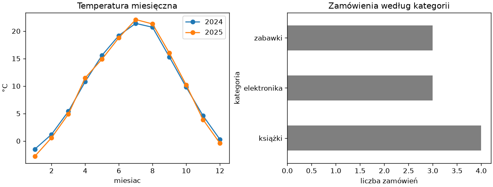

# Przekształcenia i wykres z tabeli

Oczyszczona tabela rzadko zawiera wprost to, o co pytamy: wartość zamówienia trzeba policzyć z ilości, ceny i rabatu, adres rozdzielić na miasto i ulicę, cenę zaliczyć do przedziału. Ten podrozdział pokazuje, jak tworzyć kolumny z kolumn — wektorowo, bez pętli — oraz jak z gotowej tabeli powstaje wykres.

## Nowe kolumny

```python title="nowe-kolumny.py"
import numpy as np
import pandas as pd

zamowienia = pd.read_csv("zamowienia.csv", sep=";", decimal=",", parse_dates=["data"], na_values=["brak"], dtype={"ilosc": "Int64"})
zamowienia = zamowienia.drop_duplicates().dropna(subset=["ilosc"]).fillna({"rabat": 0})
zamowienia["wartosc"] = (zamowienia["ilosc"] * zamowienia["cena"] * (1 - zamowienia["rabat"] / 100)).round(2)
zamowienia["duze"] = np.where(zamowienia["wartosc"] > 200, "tak", "nie")
print(zamowienia[["ilosc", "cena", "rabat", "wartosc", "duze"]])
zamowienia = zamowienia.assign(netto=lambda d: (d["wartosc"] / 1.23).round(2), vat=lambda d: (d["wartosc"] - d["netto"]).round(2))
print(zamowienia[["wartosc", "netto", "vat"]].head(3))
print(zamowienia.eval("cena * ilosc").head(3).tolist())
zamowienia = zamowienia.rename(columns={"cena": "cena_brutto"}).drop(columns=["duze"])
print(zamowienia.columns.tolist())
```

```{ .text .no-copy }
   ilosc     cena  rabat  wartosc duze
0      2    39.90    0.0     79.8  nie
1      1  1299.00   10.0   1169.1  tak
2      1    24.50    0.0     24.5  nie
3      3    59.99    5.0   170.97  nie
5      2   249.00   15.0    423.3  tak
7      1    89.00    0.0     89.0  nie
8      4    29.90    0.0    119.6  nie
9      2   119.00   20.0    190.4  nie
   wartosc   netto     vat
0     79.8   64.88   14.92
1   1169.1  950.49  218.61
2     24.5   19.92    4.58
[79.8, 1299.0, 24.5]
['id', 'data', 'klient', 'miasto', 'kategoria', 'ilosc', 'cena_brutto', 'rabat', 'wartosc', 'netto', 'vat']
```

Przypisanie do nieistniejącej nazwy tworzy kolumnę; wyrażenie po prawej jest wektorowe, więc liczy wszystkie wiersze naraz, a `np.where()` z rozdziału 14 „Python Notatki” wybiera wartość według warunku. Czyszczenie z poprzedniego podrozdziału zapisujemy jako łańcuch metod — każda zwraca nową ramkę, którą przyjmuje następna. `assign()` dodaje kolumny w tym samym stylu, przyjmując funkcje, które dostają bieżącą ramkę, więc druga kolumna może korzystać z pierwszej; `eval()` liczy wyrażenie z napisu, jak `query()`. `rename()` i `drop()` zmieniają nazwy i usuwają kolumny, również zwracając nową ramkę.

## Napisy — akcesor `.str`

```python title="napisy.py"
import pandas as pd

zamowienia = pd.read_csv("zamowienia.csv", sep=";", decimal=",", parse_dates=["data"], na_values=["brak"])
klient = zamowienia["klient"]
print(klient.str.upper().head(2).tolist(), klient.str.len().head(3).tolist())
print(klient.str.startswith("K").sum(), klient.str.contains("ow").sum())
print(klient.str.replace("ska", "ski").unique().tolist())
adresy = pd.Series(["Kraków, Długa 5", "Tarnów, Krótka 12", "Nowy Sącz, Rynek 1"])
czesci = adresy.str.split(", ", expand=True)
czesci.columns = ["miasto", "ulica"]
print(czesci)
print(adresy.str.split(" ").str[-1].astype(int).tolist())
print(zamowienia["kategoria"].str.title().head(2).tolist(), zamowienia["miasto"].str.len().tolist()[:5])
```

```{ .text .no-copy }
['NOWAK', 'KOWALSKA'] [5, 8, 5]
2 5
['Nowak', 'Kowalski', 'Wiśniewski', 'Zieliński']
      miasto      ulica
0     Kraków    Długa 5
1     Tarnów  Krótka 12
2  Nowy Sącz    Rynek 1
[5, 12, 1]
['Książki', 'Elektronika'] [6.0, 6.0, 6.0, nan, 6.0]
```

Akcesor `.str` udostępnia metody napisów z rozdziału 3 „Python Notatki” dla całej kolumny naraz: `upper()`, `len()`, `startswith()`, `contains()`, `replace()`. `split(expand=True)` rozdziela napis na kolumny nowej ramki, a `.str[-1]` wybiera element z listy w każdym wierszu — tu numer domu, który `astype(int)` zamienia na liczbę. Braki przechodzą przez akcesor bez błędu: `len()` miasta o brakującej nazwie daje `NaN`. Do wzorców bardziej złożonych niż stały separator służą wyrażenia regularne (`str.extract()`, `str.match()`), którym poświęcamy osobny rozdział ścieżki automatyzacji.

## `map()`, `replace()` i `apply()`

```python title="map-apply.py"
import time

import numpy as np
import pandas as pd

zamowienia = pd.read_csv("zamowienia.csv", sep=";", decimal=",", parse_dates=["data"], na_values=["brak"])
skroty = {"książki": "K", "elektronika": "E", "zabawki": "Z"}
print(zamowienia["kategoria"].map(skroty).tolist())
print(zamowienia["kategoria"].replace({"zabawki": "gry i zabawki"}).unique().tolist())
print(zamowienia["cena"].map(lambda c: f"{c:.0f} zł").head(3).tolist())
print(zamowienia.apply(lambda w: f"{w['klient']} ({w['miasto']})", axis=1).head(2).tolist())

duza = pd.DataFrame({"a": np.arange(200_000), "b": np.arange(200_000) * 2})
start = time.perf_counter()
wolno = duza.apply(lambda w: w["a"] + w["b"], axis=1)
czas_apply = time.perf_counter() - start
start = time.perf_counter()
szybko = duza["a"] + duza["b"]
czas_wektorowo = time.perf_counter() - start
print(wolno.equals(szybko), f"apply: {czas_apply:.2f} s, wektorowo: {czas_wektorowo * 1000:.1f} ms")
```

```{ .text .no-copy }
['K', 'E', 'K', 'Z', 'K', 'E', 'E', 'Z', 'K', 'Z']
['książki', 'elektronika', 'gry i zabawki']
['40 zł', '1299 zł', '24 zł']
['Nowak (Kraków)', 'Kowalska (Tarnów)']
True apply: 0.71 s, wektorowo: 1.0 ms
```

`map()` ze słownikiem zamienia każdą wartość na odpowiednik (wartości spoza słownika stają się `NaN`), `replace()` — tylko wymienione, resztę zostawia; `replace()` porównuje całe wartości, w odróżnieniu od `str.replace()`, który podmienia fragment napisu. `map()` z funkcją i `apply(axis=1)` wywołują funkcję Pythona dla każdej wartości lub każdego wiersza: to najbardziej ogólne narzędzie i zarazem najwolniejsze — dla dwustu tysięcy wierszy `apply()` potrzebuje ułamka sekundy, gdy operacja wektorowa — około milisekundy, kilkaset razy mniej, bo pandas buduje serię z każdego wiersza i wraca do interpretera, jak pętla w rozdziale 13 „Python Notatki”. Zasada z podrozdziału o wydajności w rozdziale 2 tej części obowiązuje: najpierw szukamy operacji wektorowej, akcesora `.str`/`.dt` albo `np.where()`, a `apply()` zostawiamy dla logiki, której inaczej zapisać się nie da.

## Przedziały — `cut()` i `qcut()`

```python title="przedzialy.py"
import pandas as pd

zamowienia = pd.read_csv("zamowienia.csv", sep=";", decimal=",", parse_dates=["data"], na_values=["brak"])
zamowienia["przedzial"] = pd.cut(zamowienia["cena"], bins=[0, 50, 200, 2000], labels=["niska", "średnia", "wysoka"])
print(zamowienia[["cena", "przedzial"]].head(4))
print(zamowienia["przedzial"].dtype, zamowienia["przedzial"].value_counts().to_dict())
print(pd.cut(zamowienia["cena"], bins=3).cat.categories.tolist())
print(pd.qcut(zamowienia["cena"], q=4, labels=["Q1", "Q2", "Q3", "Q4"]).tolist())
```

```{ .text .no-copy }
      cena przedzial
0    39.90     niska
1  1299.00    wysoka
2    24.50     niska
3    59.99   średnia
category {'niska': 4, 'średnia': 3, 'wysoka': 3}
[Interval(23.226, 449.333, closed='right'), Interval(449.333, 874.167, closed='right'), Interval(874.167, 1299.0, closed='right')]
['Q1', 'Q4', 'Q1', 'Q2', 'Q2', 'Q4', 'Q4', 'Q3', 'Q1', 'Q3']
```

`pd.cut()` zalicza liczby do przedziałów o zadanych granicach (prawy koniec włącznie) i zwraca kolumnę kategorialną z etykietami — gotową do `value_counts()`; z liczbą zamiast listy granic dzieli zakres na równe części, a bez `labels=` kategorie są obiektami `Interval` — dolną granicę pandas obniża o 0,1% zakresu, aby najmniejsza wartość zmieściła się w pierwszym, prawostronnie domkniętym przedziale. `pd.qcut()` dzieli po **kwantylach** z rozdziału 2 tej części, więc przedziały mają w przybliżeniu tyle samo obserwacji (przy dziesięciu wierszach — po dwie lub trzy) — właściwe dla rozkładów skośnych, jak ceny, gdzie równe przedziały zostawiłyby górny niemal pusty.

## Wykres z tabeli — `plot()`

```python title="wykres.py"
import matplotlib.pyplot as plt
import pandas as pd

pomiary = pd.read_csv("pomiary.csv")
zamowienia = pd.read_csv("zamowienia.csv", sep=";", decimal=",", parse_dates=["data"], na_values=["brak"])

fig, (ax1, ax2) = plt.subplots(1, 2, figsize=(10, 3.8), layout="constrained")
for rok in (2024, 2025):
    pomiary[pomiary["rok"] == rok].plot(x="miesiac", y="temperatura", ax=ax1, marker="o", label=str(rok))
ax1.set_ylabel("°C")
ax1.set_title("Temperatura miesięczna")
zwrocony = zamowienia["kategoria"].value_counts().plot(kind="barh", ax=ax2, color="tab:gray")
ax2.set_xlabel("liczba zamówień")
ax2.set_title("Zamówienia według kategorii")
fig.savefig("wykres.png", dpi=120)
print(zwrocony is ax2, ax1.get_xlabel(), [etykieta.get_text() for etykieta in ax1.get_legend().get_texts()])
```

```{ .text .no-copy }
True miesiac ['2024', '2025']
```

{ width="760" }

`DataFrame.plot()` i `Series.plot()` rysują przez Matplotlib: `x=` i `y=` wskazują kolumny, `kind=` (albo `plot.bar()`, `plot.scatter()`, `plot.hist()`) — typ wykresu; nazwa kolumny z `x=` trafia na oś (tu `miesiac`), a nazwa z `y=` — do legendy, chyba że podamy `label=`, jak tu, gdzie legenda ma rozróżniać lata; oś y podpisujemy sami. Metoda zwraca obiekt `Axes` — ten sam, który wskazaliśmy przez `ax=`, albo nowy, gdy go nie podamy — dlatego wszystkie techniki z rozdziału 3 tej części działają dalej: układ paneli, podziałki, style, zapis. Wykres z tabeli to szkic do obejrzenia w notatniku; do raportu dopracowujemy go metodami `Axes`.

## Dalej: analiza

Tabela jest wczytana, oczyszczona i wzbogacona o kolumny; następny rozdział ścieżki odpowiada na pytania, które wymagają porównania grup i tabel: ile sprzedano w każdej kategorii i mieście (`groupby()` z agregacjami), jak dołączyć do zamówień dane klientów z drugiej tabeli (`merge()`), jak ułożyć kategorie w wierszach i miesiące w kolumnach (`pivot_table()`) oraz jak z dat zrobić szereg czasowy z sumami tygodniowymi i średnią ruchomą (`resample()`, `rolling()`). <!-- TODO: link po powstaniu rozdziału o analizie w pandas -->
