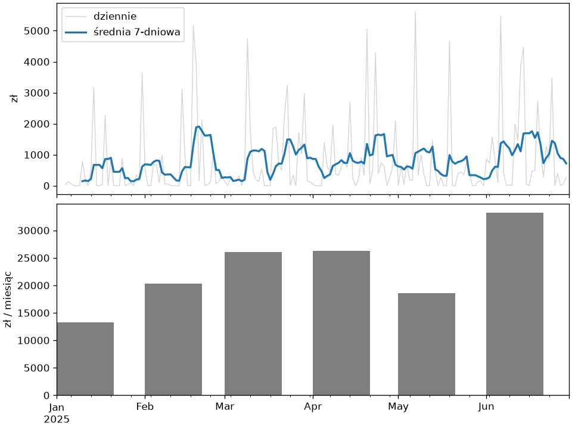

# Szeregi czasowe

Zamówienia mają daty, więc sprzedaż jest szeregiem czasowym — tym samym, który rozdział 3 tej części rysował, a rozdział 2 wygładzał średnią ruchomą. pandas dodaje do tego indeks czasowy: wybór po miesiącu napisem, zmianę częstotliwości z dni na tygodnie i miesiące, okna kroczące, porównania z poprzednim okresem oraz obsługę luk i stref czasowych.

## Indeks czasowy

```python title="indeks-czasowy.py"
import pandas as pd

zamowienia = pd.read_csv("zamowienia-2025.csv", parse_dates=["data"])
sprzedaz = zamowienia.set_index("data").sort_index()["wartosc"]
print(sprzedaz.index.dtype, sprzedaz.index.is_monotonic_increasing, sprzedaz.index.is_unique)
print(sprzedaz.loc["2025-03"].sum().round(0), sprzedaz.loc["2025-03-10":"2025-03-12"].round(0).tolist())
print(sprzedaz.loc["2025-06-25":].shape, sprzedaz.index.max().day_name())
print(pd.date_range("2025-01-01", periods=4, freq="W-MON"))
print(pd.date_range("2025-01-01", periods=3, freq="ME").tolist())
print(pd.date_range("2025-01-01", "2025-01-02", freq="6h").size)
```

```{ .text .no-copy }
datetime64[us] True False
26090.0 [425.0, 1349.0, 284.0, 33.0, 96.0, 43.0, 187.0]
(5,) Sunday
DatetimeIndex(['2025-01-06', '2025-01-13', '2025-01-20', '2025-01-27'], dtype='datetime64[us]', freq='W-MON')
[Timestamp('2025-01-31 00:00:00'), Timestamp('2025-02-28 00:00:00'), Timestamp('2025-03-31 00:00:00')]
5
```

Kolumna dat w indeksie (`set_index()` i `sort_index()`) zamienia serię w szereg czasowy: `loc` przyjmuje napis z miesiącem lub dniem i wybiera wszystkie znaczniki w tym okresie, a wycinek po datach obejmuje oba końce. Indeks nie musi być unikalny — kilka zamówień jednego dnia to kilka wierszy z tą samą datą — ale wycinki po zakresie dat, okna podane napisem (`"7D"`) i `asfreq()` wymagają indeksu posortowanego; `resample()` porządkuje go sam. `date_range()` tworzy regularne ciągi dat z kodem częstotliwości: `D` dzień, `W-MON` tydzień kończący się w poniedziałek, `ME`/`MS` koniec i początek miesiąca, `h` godzina.

## Zmiana częstotliwości — `resample()`

```python title="resample.py"
import pandas as pd

zamowienia = pd.read_csv("zamowienia-2025.csv", parse_dates=["data"])
sprzedaz = zamowienia.set_index("data").sort_index()["wartosc"]
dziennie = sprzedaz.resample("D").sum()
print(dziennie.head(3))
print(dziennie.shape, (dziennie == 0).sum(), dziennie.index.freq)
print(sprzedaz.resample("W").sum().round(0).head(3))
print(sprzedaz.resample("ME").agg(["sum", "count", "max"]).round(0))
print(zamowienia.groupby(pd.Grouper(key="data", freq="MS"))["wartosc"].sum().round(0).head(2))
```

```{ .text .no-copy }
data
2025-01-04     33.68
2025-01-05    131.47
2025-01-06     65.69
Freq: D, Name: wartosc, dtype: float64
(177,) 49 <Day>
data
2025-01-05     165.0
2025-01-12    1045.0
2025-01-19    6024.0
Freq: W-SUN, Name: wartosc, dtype: float64
                sum  count     max
data                              
2025-01-31  13235.0     18  3168.0
2025-02-28  20297.0     27  3985.0
2025-03-31  26090.0     44  4751.0
2025-04-30  26233.0     57  2904.0
2025-05-31  18628.0     40  5613.0
2025-06-30  33179.0     54  3487.0
data
2025-01-01    13235.0
2025-02-01    20297.0
Freq: MS, Name: wartosc, dtype: float64
```

**Zmiana częstotliwości** (ang. *resampling*) to grupowanie po okresach kalendarzowych: `resample("D").sum()` daje sumę dzienną z zerami w dniach bez zamówień — szereg staje się regularny, a `freq` indeksu to `D`. Kod `"W"` sumuje tygodnie kończące się w niedzielę, `"ME"` — miesiące, a `agg()` liczy kilka statystyk naraz. Gdy daty są w kolumnie, nie w indeksie, ten sam podział daje `groupby()` z `pd.Grouper(key=, freq=)`. Zmiana w drugą stronę — z tygodni na dni — wymaga decyzji, skąd wziąć brakujące wartości, o czym w ostatniej sekcji.

## Okna — `rolling()`, `expanding()`, `ewm()`

```python title="okna.py"
import matplotlib.pyplot as plt
import pandas as pd

zamowienia = pd.read_csv("zamowienia-2025.csv", parse_dates=["data"])
dziennie = zamowienia.set_index("data").sort_index()["wartosc"].resample("D").sum()
srednia7 = dziennie.rolling(7).mean()
print(srednia7.iloc[4:8].round(0).tolist())
print(dziennie.rolling(7, center=True).mean().iloc[3:5].round(0).tolist())
print(dziennie.rolling("7D").sum().head(3).round(0).tolist())
print(dziennie.expanding().sum().tail(2).round(0).tolist(), dziennie.sum().round(0))
print(dziennie.ewm(span=7).mean().tail(2).round(0).tolist())

fig, (ax1, ax2) = plt.subplots(2, 1, figsize=(8, 6), layout="constrained", sharex=True)
dziennie.plot(ax=ax1, color="lightgray", linewidth=0.8, label="dziennie")
srednia7.plot(ax=ax1, color="tab:blue", linewidth=2, label="średnia 7-dniowa")
ax1.legend(loc="upper left")
ax1.set_ylabel("zł")
miesiecznie = dziennie.resample("MS").sum()
ax2.bar(miesiecznie.index, miesiecznie, width=20, align="edge", color="tab:gray")
ax2.set_ylabel("zł / miesiąc")
ax2.set_xlabel("")
ax1.set_xlim(dziennie.index[0].replace(day=1), dziennie.index[-1] + pd.Timedelta(days=1))
fig.savefig("okna.png", dpi=120)
```

```{ .text .no-copy }
[nan, nan, 145.0, 168.0]
[145.0, 168.0]
[34.0, 165.0, 231.0]
[137393.0, 137661.0] 137661.0
[594.0, 512.0]
```

{ width="640" }

`rolling(7)` tworzy **okno kroczące** (ang. *rolling window*) z siedmiu ostatnich obserwacji, na którym liczymy średnią — pierwszych sześć wyników to `NaN`, bo okno nie jest jeszcze pełne; to średnia ruchoma z rozdziału 2, ale z zachowanymi datami. `center=True` przypisuje wynik środkowi okna, a okno podane napisem `"7D"` liczy się w czasie, nie w wierszach, więc działa także dla nieregularnych dat. `expanding()` to okno od początku szeregu — narastająca suma — a `ewm(span=7)` **wygładzanie wykładnicze** (ang. *exponentially weighted moving average*, EWMA), które nowszym obserwacjom daje większą wagę i nie traci pierwszych dni. `Series.plot()` z indeksem czasowym rysuje daty na osi jak w rozdziale 3, a `resample("MS")` układa sumy miesięczne pod pierwszym dniem miesiąca.

## Przesunięcia i zmiany

```python title="zmiany.py"
import pandas as pd

zamowienia = pd.read_csv("zamowienia-2025.csv", parse_dates=["data"])
tygodniowo = zamowienia.set_index("data").sort_index()["wartosc"].resample("W").sum().round(0)
porownanie = pd.DataFrame({"suma": tygodniowo, "poprzedni": tygodniowo.shift(1), "zmiana": tygodniowo.diff(), "zmiana_%": (tygodniowo.pct_change() * 100).round(1)})
print(porownanie.head(4))
print(porownanie["zmiana"].idxmax().date(), porownanie["zmiana"].max())
miesiecznie = zamowienia.set_index("data")["wartosc"].resample("ME").sum().round(0)
print((miesiecznie / miesiecznie.shift(1)).round(2).tolist())
print(miesiecznie.cumsum().tolist())
```

```{ .text .no-copy }
              suma  poprzedni  zmiana  zmiana_%
data                                           
2025-01-05   165.0        NaN     NaN       NaN
2025-01-12  1045.0      165.0   880.0     533.3
2025-01-19  6024.0     1045.0  4979.0     476.5
2025-01-26  1739.0     6024.0 -4285.0     -71.1
2025-06-08 7554.0
[nan, 1.53, 1.29, 1.01, 0.71, 1.78]
[13235.0, 33532.0, 59622.0, 85855.0, 104483.0, 137662.0]
```

`shift(1)` przesuwa szereg o jeden okres — w wierszu tygodnia stoi wartość poprzedniego — więc różnica i iloraz z oryginałem dają zmianę bezwzględną (`diff()`) i procentową (`pct_change()`); pierwszy okres nie ma poprzednika i dostaje `NaN`. Te trzy metody odpowiadają na pytanie „w porównaniu z poprzednim tygodniem” bez ręcznego przesuwania indeksów, a `cumsum()` daje sprzedaż narastającą od początku roku.

## Luki, kalendarz i strefy czasowe

```python title="luki-strefy.py"
import pandas as pd

zamowienia = pd.read_csv("zamowienia-2025.csv", parse_dates=["data"])
sprzedaz = zamowienia.set_index("data").sort_index()["wartosc"]
print(sprzedaz.groupby(sprzedaz.index.day_name()).sum().round(0).sort_values(ascending=False).head(3).to_dict())
print(sprzedaz.groupby(sprzedaz.index.to_period("W")).sum().round(0).head(2))
luki = pd.Series([10.0, None, None, 16.0], index=pd.date_range("2025-01-01", periods=4))
print(luki.interpolate().tolist(), luki.ffill().tolist())
tygodniowo = sprzedaz.resample("W").sum()
print(tygodniowo.asfreq("D").head(3).tolist(), tygodniowo.asfreq("D").interpolate().head(3).round(0).tolist())
lokalne = pd.Series([1, 2], index=pd.to_datetime(["2025-03-30 01:30", "2025-03-30 03:30"])).tz_localize("Europe/Warsaw")
print(lokalne.index.tolist())
print(lokalne.index[1] - lokalne.index[0], lokalne.tz_convert("UTC").index[0])
```

```{ .text .no-copy }
{'Friday': 29103.0, 'Wednesday': 23435.0, 'Tuesday': 23426.0}
data
2024-12-30/2025-01-05     165.0
2025-01-06/2025-01-12    1045.0
Freq: W-SUN, Name: wartosc, dtype: float64
[10.0, 12.0, 14.0, 16.0] [10.0, 10.0, 10.0, 16.0]
[165.15, nan, nan] [165.0, 291.0, 417.0]
[Timestamp('2025-03-30 01:30:00+0100', tz='Europe/Warsaw'), Timestamp('2025-03-30 03:30:00+0200', tz='Europe/Warsaw')]
0 days 01:00:00 2025-03-30 00:30:00+00:00
```

Atrybuty i metody indeksu czasowego (`day_name()`, `month`, `to_period()`) służą jako klucze grupowania — tak liczymy sprzedaż według dnia tygodnia. Luki w regularnym szeregu uzupełnia `interpolate()` (liniowo między sąsiadami) albo `ffill()` (ostatnia znana wartość) — wybór zależy od znaczenia: temperaturę interpolujemy, stan magazynu przenosimy. `asfreq("D")` przechodzi z tygodni na dni, wstawiając `NaN` w nowych punktach, które trzeba uzupełnić świadomie. Daty w tym rozdziale są naiwne (ang. *naive*) — bez strefy; `tz_localize()` nadaje strefę i uwzględnia zmianę czasu, więc między 1:30 a 3:30 w noc przejścia na czas letni mija jedna godzina, a `tz_convert("UTC")` sprowadza znaczniki z różnych stref do wspólnej osi przed porównaniem.
