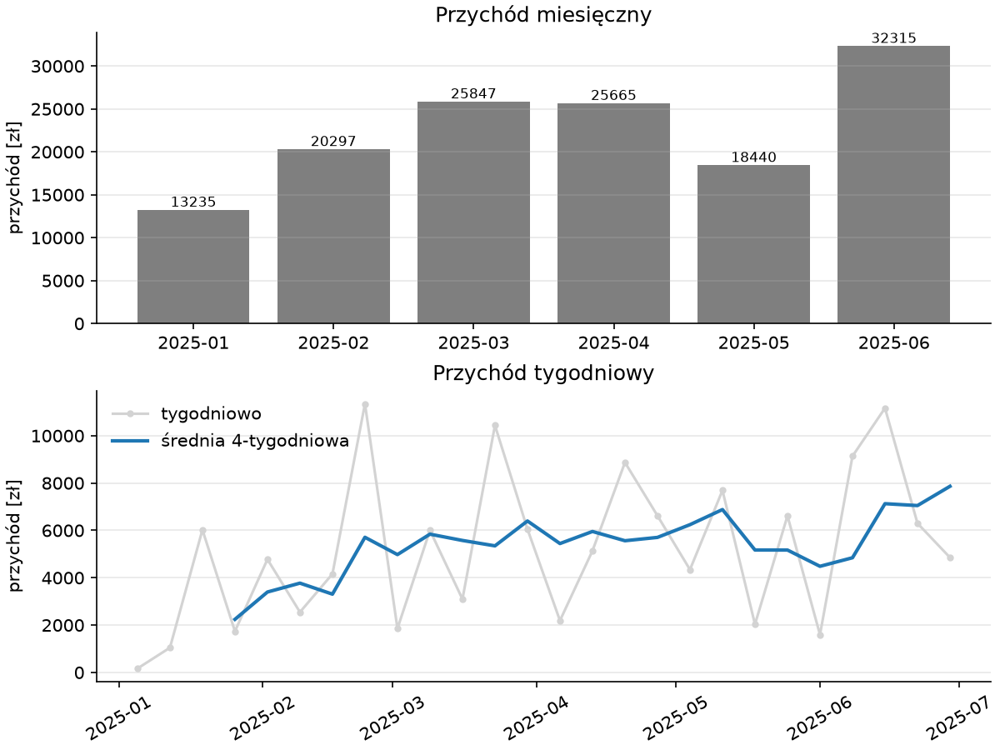
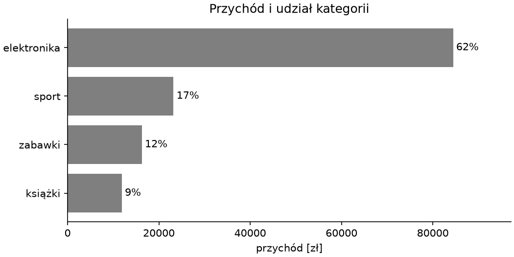
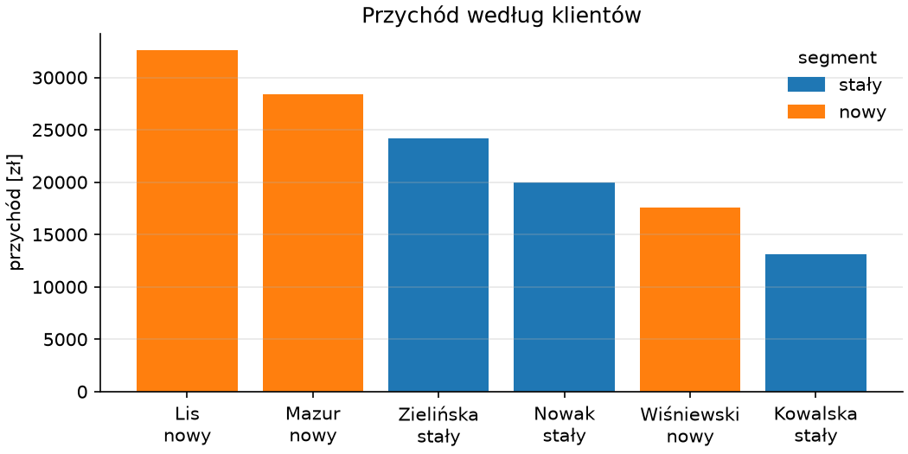

# Raport — rysunki, tabele i dokument

Ostatni krok zamienia tabele z modułu analizy w dokument dla odbiorcy: rysunki w stylu domowym na wzór rozdziału 3, tabele CSV do dalszego użytku i plik `raport.md`, który spina liczby, rysunki i sekcję o jakości danych. Wszystko wytwarza jeden skrypt, więc po poprawce danych lub reguły czyszczenia raport odtwarzamy jednym poleceniem.

## Rysunki

```python title="skrypty/rysunki.py"
"""Rysunki raportu: funkcje przyjmują tabele z modułu analizy i zwracają obiekt Figure."""

import matplotlib.pyplot as plt
from matplotlib.patches import Patch

STYL = {"axes.spines.top": False, "axes.spines.right": False, "axes.grid": True, "axes.grid.axis": "y", "grid.alpha": 0.3, "legend.frameon": False}


def rysunek_trend(tabela_miesieczna, tabela_tygodniowa):
    with plt.rc_context(STYL):
        fig, (ax1, ax2) = plt.subplots(2, 1, figsize=(8, 6), layout="constrained")
        ax1.bar(tabela_miesieczna.index, tabela_miesieczna["przychod"], color="tab:gray")
        ax1.bar_label(ax1.containers[0], fmt="%.0f", fontsize=8)
        ax1.set_ylabel("przychód [zł]")
        ax1.set_title("Przychód miesięczny")
        ax2.plot(tabela_tygodniowa.index, tabela_tygodniowa["przychod"], color="lightgray", marker=".", label="tygodniowo")
        ax2.plot(tabela_tygodniowa.index, tabela_tygodniowa["srednia_4tyg"], color="tab:blue", linewidth=2, label="średnia 4-tygodniowa")
        ax2.set_ylabel("przychód [zł]")
        ax2.set_title("Przychód tygodniowy")
        ax2.legend(loc="upper left")
        ax2.tick_params(axis="x", labelrotation=30)
    return fig


def rysunek_kategorie(tabela_kategorii):
    with plt.rc_context(STYL):
        fig, ax = plt.subplots(figsize=(7, 3.5), layout="constrained")
        kolejnosc = tabela_kategorii.sort_values("przychod")
        slupki = ax.barh(kolejnosc.index, kolejnosc["przychod"], color="tab:gray")
        ax.bar_label(slupki, labels=[f"{u:.0f}%" for u in kolejnosc["udzial_%"]], padding=3)
        ax.set_xlim(0, kolejnosc["przychod"].max() * 1.15)
        ax.set_xlabel("przychód [zł]")
        ax.set_title("Przychód i udział kategorii")
        ax.grid(False)
    return fig


def rysunek_klienci(tabela_klientow):
    with plt.rc_context(STYL):
        fig, ax = plt.subplots(figsize=(7, 3.5), layout="constrained")
        dane = tabela_klientow.reset_index().sort_values("przychod", ascending=False)
        kolory = dane["segment"].map({"stały": "tab:blue", "nowy": "tab:orange"})
        ax.bar(dane["klient"], dane["przychod"], color=kolory)
        ax.set_xticks(range(len(dane)), dane["klient"] + "\n" + dane["segment"])
        ax.legend(handles=[Patch(color="tab:blue", label="stały"), Patch(color="tab:orange", label="nowy")], title="segment")
        ax.set_ylabel("przychód [zł]")
        ax.set_title("Przychód według klientów")
    return fig
```

Funkcje rysujące mają kształt ze skryptu z rozdziału 3: dostają tabele, zwracają `Figure`, niczego nie zapisują. Styl domowy jest słownikiem `rcParams` włączanym przez `rc_context()` wewnątrz każdej funkcji — klucze ze słownika obowiązują niezależnie od ustawień programu wywołującego, pozostałe parametry funkcja od niego przejmuje; blok `with` obejmuje obiekty w nim tworzone, więc panele powstają w nim, a rozdzielczość zapisu podaje jawnie `savefig(dpi=)` w skrypcie generującym, bo zapis odbywa się już poza blokiem. Kolor słupków klientów niesie segment, ale zgodnie z zasadą czytelności z rozdziału 3 segment stoi też w etykiecie pod nazwiskiem; legendę budujemy z obiektów `Patch` — prostokątów o zadanym kolorze i etykiecie — bo kolor nie jest tu osobną serią, z której Matplotlib zrobiłby wpis sam.

## Skrypt generujący

```python title="skrypty/generuj_raport.py"
"""Generuje raport: tabele CSV, rysunki PNG i dokument wyniki/raport.md — jednym poleceniem z katalogu projektu."""

from pathlib import Path

import matplotlib.pyplot as plt
import pandas as pd

from analiza import miesiecznie, odstajace, segmenty, tygodniowo, wedlug_kategorii, wedlug_klientow
from przygotowanie import KLIENCI, oczysc, wczytaj_surowe, zapisz_przetworzone
from rysunki import rysunek_kategorie, rysunek_klienci, rysunek_trend

WYNIKI = Path("wyniki")
NAGLOWKI = {"data": "Miesiąc", "kategoria": "Kategoria", "segment": "Segment", "klient": "Klient", "przychod": "Przychód [zł]", "zamowien": "Zamówień", "srednia": "Średnie zamówienie [zł]", "zmiana_%": "Zmiana m/m [%]", "udzial_%": "Udział [%]", "klientow": "Klientów", "srednie_zamowienie": "Średnie zamówienie [zł]"}


def zapisz_tabele(nazwa, tabela):
    (WYNIKI / "tabele").mkdir(parents=True, exist_ok=True)
    plaska = tabela.reset_index()
    plaska.to_csv(WYNIKI / "tabele" / f"{nazwa}.csv", index=False, sep=";", decimal=",", encoding="utf-8-sig")
    do_markdown = plaska.astype(object).where(plaska.notna(), None).rename(columns=NAGLOWKI)
    return do_markdown.to_markdown(index=False, floatfmt=".0f", missingval="—")


def zapisz_rysunek(nazwa, fig):
    (WYNIKI / "rysunki").mkdir(parents=True, exist_ok=True)
    fig.savefig(WYNIKI / "rysunki" / f"{nazwa}.png", dpi=150)
    plt.close(fig)
    return f""


def main():
    czyste, dziennik = oczysc(wczytaj_surowe())
    zapisz_przetworzone(czyste)
    klienci = pd.read_csv(KLIENCI)
    tabele = {"miesiecznie": miesiecznie(czyste), "tygodniowo": tygodniowo(czyste), "kategorie": wedlug_kategorii(czyste), "klienci": wedlug_klientow(czyste, klienci), "segmenty": segmenty(czyste, klienci)}
    okres = f"{czyste['data'].min():%d.%m.%Y} – {czyste['data'].max():%d.%m.%Y}"
    przychod = f"{czyste.loc[~czyste['odstajaca'], 'wartosc'].sum():,.0f}".replace(",", " ")
    czesci = [
        "# Raport sprzedaży — I półrocze 2025\n",
        f"Okres: {okres}. Zamówień w analizie: {len(czyste) - int(czyste['odstajaca'].sum())}. Przychód: {przychod} zł.\n",
        "## Przychód w czasie\n", zapisz_tabele("miesiecznie", tabele["miesiecznie"]), zapisz_rysunek("trend", rysunek_trend(tabele["miesiecznie"], tabele["tygodniowo"])),
        "## Kategorie\n", zapisz_tabele("kategorie", tabele["kategorie"]), zapisz_rysunek("kategorie", rysunek_kategorie(tabele["kategorie"])),
        "## Klienci\n", zapisz_tabele("segmenty", tabele["segmenty"]), zapisz_tabele("klienci", tabele["klienci"]), zapisz_rysunek("klienci", rysunek_klienci(tabele["klienci"])),
        "## Jakość danych\n",
        f"Wierszy w pliku surowym: {dziennik['wierszy_surowych']}; usuniętych duplikatów: {dziennik['duplikaty']}; dat w formacie dd.mm.yyyy: {dziennik['daty_polskie']}; pól z ujednoliconą pisownią: {dziennik['pisownia']}; rabat „brak” potraktowany jako 0% w {dziennik['rabat_brak']} zamówieniach; zamówień bez ilości, odrzuconych: {len(dziennik['bez_ilosci'])} (id {', '.join(map(str, dziennik['bez_ilosci']))}).\n",
        "Zamówienia z ceną odstającą (ponad 4× mediany kategorii), wyłączone z sum:\n", odstajace(czyste).to_markdown(index=False, floatfmt=".2f"),
    ]
    zapisz_tabele("tygodniowo", tabele["tygodniowo"])
    (WYNIKI / "raport.md").write_text("\n\n".join(czesci) + "\n", encoding="utf-8")
    print(sorted(str(p.relative_to(WYNIKI)).replace("\\", "/") for p in WYNIKI.rglob("*") if p.is_file()))


if __name__ == "__main__":
    main()
```

```{ .text .no-copy }
['raport.md', 'rysunki/kategorie.png', 'rysunki/klienci.png', 'rysunki/trend.png', 'tabele/kategorie.csv', 'tabele/klienci.csv', 'tabele/miesiecznie.csv', 'tabele/segmenty.csv', 'tabele/tygodniowo.csv']
```

{ width="640" }

{ width="560" }

{ width="560" }

Funkcja `main()` wykonuje potok w kolejności: czyszczenie i zapis danych przetworzonych, tabele, rysunki, dokument. Dwie funkcje pomocnicze zapisują tabelę jako CSV i zwracają jej postać Markdown, a rysunek jako PNG i zwracają odsyłacz do obrazu — dokument powstaje więc z listy fragmentów tekstu, sklejonej na końcu. Polskie nagłówki nadaje słownik `NAGLOWKI` w chwili zapisu wersji Markdown — pliki CSV zachowują nazwy techniczne, bo trafią z powrotem do pandas, ale dostają separatory dla polskiego Excela z rozdziału 4 — a dziennik decyzji z modułu przygotowania wypełnia sekcję o jakości danych bez ręcznego przepisywania liczb. Skrypt nie ma argumentów ani opcji: stałe wejście, jeden wynik, jedno polecenie. Braki w tabelach (pierwszy miesiąc nie ma zmiany) tabulate zastępuje przez `missingval=` tylko dla `None`, stąd zamiana `NaN` na `None` przed wypisaniem.

## Dokument raportu

```python title="pokaz_raport.py"
from pathlib import Path

tekst = Path("wyniki/raport.md").read_text(encoding="utf-8").splitlines()
print("\n".join(tekst[:22]))
print("...")
print("\n".join(tekst[-8:]))  # skrypt służy tylko wydrukowi w książce
```

```{ .text .no-copy }
# Raport sprzedaży — I półrocze 2025


Okres: 04.01.2025 – 29.06.2025. Zamówień w analizie: 234. Przychód: 135 799 zł.


## Przychód w czasie


| Miesiąc   |   Przychód [zł] |   Zamówień |   Średnie zamówienie [zł] |   Zmiana m/m [%] |
|:----------|----------------:|-----------:|--------------------------:|-----------------:|
| 2025-01   |           13235 |         18 |                       735 |                — |
| 2025-02   |           20297 |         27 |                       752 |               53 |
| 2025-03   |           25847 |         42 |                       615 |               27 |
| 2025-04   |           25665 |         56 |                       458 |               -1 |
| 2025-05   |           18440 |         39 |                       473 |              -28 |
| 2025-06   |           32315 |         52 |                       621 |               75 |


## Kategorie

...

Zamówienia z ceną odstającą (ponad 4× mediany kategorii), wyłączone z sum:


|   id | data       | klient     | kategoria   |   ilosc |    cena |
|-----:|:-----------|:-----------|:------------|--------:|--------:|
|  163 | 2025-05-13 | Mazur      | sport       |       1 | 2123.40 |
|  231 | 2025-06-23 | Wiśniewski | zabawki     |       1 | 1802.00 |
```

Raport w Markdown otwiera się w VSC z podglądem, w MkDocs jak ta książka i w każdym narzędziu, które renderuje Markdown; do formatu DOCX konwertuje go Pandoc — konwerter dokumentów uruchamiany z katalogu `wyniki/`, bo odsyłacze do rysunków są względne do dokumentu (do PDF potrzebuje dodatkowo silnika składu, na przykład LaTeX-a) — a rysunki zapisane obok w PNG można wstawić do arkusza lub prezentacji. Wersja dla odbiorcy pracującego w Excelu to tabele z `wyniki/tabele/` — te same liczby, ten sam kod.

## README i lista kontrolna

`README.md` z poprzedniego podrozdziału ma już źródło danych, decyzje i polecenia odtworzenia; przed oddaniem raportu przechodzimy listę kontrolną:

- **Odtworzenie od zera.** Świeże środowisko z `requirements.txt`, `python -m pytest -q`, `python skrypty/generuj_raport.py` — wszystko bez ręcznych kroków.
- **Zgodność liczb.** Suma z tabeli miesięcznej równa się sumie z tabeli kategorii i z tabeli klientów z dokładnością do zaokrągleń wierszy do pełnych złotych (te same wiersze wchodzą do każdej), a liczba zamówień w raporcie równa się wierszom surowym minus duplikaty, odrzucone i odstające.
- **Sekcja o jakości danych** wymienia każdą decyzję z README z liczbą dotkniętych wierszy.
- **Rysunki** mają jednostki na osiach, tytuły i czytelne etykiety; oś wartości słupków zaczyna się od zera.
- **Dane surowe** pozostały niezmienione — `git status` nie pokazuje zmian w `dane/surowe/`, a `dane/przetworzone/` i `wyniki/` są wpisane do `.gitignore` z poprzedniego podrozdziału, bo powstają z kodu.

## Dalej: uczenie maszynowe

Ścieżka danych kończy się tu: czytelnik potrafi przyjąć plik, doprowadzić go do tabeli, na której można polegać, i oddać raport, który da się odtworzyć. Następna ścieżka — [uczenie maszynowe](../07-ml-pojecia/index.md) — zaczyna od tych samych tabel i pyta, czego można się z nich nauczyć o przyszłości: który klient złoży kolejne zamówienie, jaka będzie sprzedaż w następnym miesiącu, które zamówienia są nietypowe.
