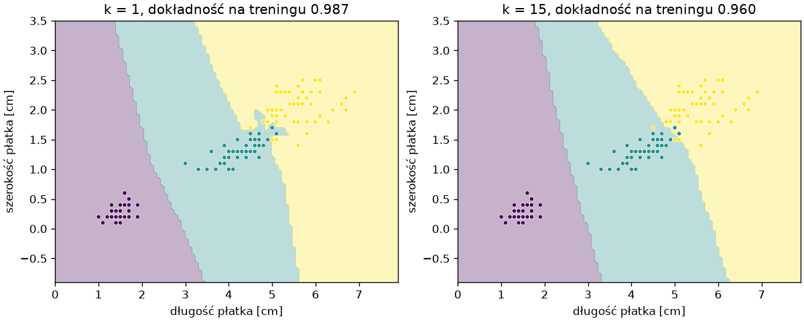

# Pierwszy model od początku do końca

Cały cykl na jednym zbiorze i jednym modelu: wczytanie danych, podział na zbiory, trening, ocena, predykcja dla nowych obserwacji i obraz tego, czego się model nauczył. Model to **k najbliższych sąsiadów** (ang. *k-nearest neighbors*, KNN): nowa próbka dostaje klasę, która przeważa wśród `k` najbliższych próbek treningowych — odmiana pomysłu z klasyfikatora centroidów z poprzedniego podrozdziału, która zamiast odległości do środków klas liczy odległości do samych próbek treningowych.

## Dane

```python title="dane.py"
from sklearn.datasets import load_iris

iris = load_iris(as_frame=True)
X, y = iris.data, iris.target
print(X.describe().round(1).loc[["mean", "min", "max"]])
print(X.isna().sum().sum(), y.map(dict(enumerate(iris.target_names))).value_counts().to_dict())
```

```{ .text .no-copy }
      sepal length (cm)  sepal width (cm)  petal length (cm)  petal width (cm)
mean                5.8               3.1                3.8               1.2
min                 4.3               2.0                1.0               0.1
max                 7.9               4.4                6.9               2.5
0 {'setosa': 50, 'versicolor': 50, 'virginica': 50}
```

Przed treningiem obowiązują oględziny z rozdziału 4: zakresy cech, braki, liczności klas. Iris nie ma braków, cechy są w tych samych jednostkach i podobnych zakresach, klasy równoliczne — to zbiór do nauki, nie do pracy; dane rzeczywiste wymagają czyszczenia z rozdziału 6, zanim trafią do modelu.

## Podział

```python title="podzial.py"
from sklearn.datasets import load_iris
from sklearn.model_selection import train_test_split

iris = load_iris(as_frame=True)
X, y = iris.data, iris.target
X_trening, X_test, y_trening, y_test = train_test_split(X, y, test_size=0.25, random_state=42, stratify=y)
print(X_trening.shape, X_test.shape)
print(y_trening.value_counts().sort_index().tolist(), y_test.value_counts().sort_index().tolist())
print(X_trening.index[:5].tolist())
```

```{ .text .no-copy }
(112, 4) (38, 4)
[38, 37, 37] [12, 13, 13]
[130, 122, 81, 71, 89]
```

`train_test_split()` losuje podział: `test_size=0.25` odkłada ćwierć próbek, `random_state=42` czyni losowanie powtarzalnym — jak ziarno generatora z rozdziału 2 — a `stratify=y` zachowuje proporcje klas w obu zbiorach, co widać w licznościach. Wynik to cztery obiekty tego samego typu, co wejście: ramki cech i serie etykiet z oryginalnymi, wymieszanymi indeksami. Nazwy `X_trening`, `X_test` (w dokumentacji `X_train`, `X_test`) to konwencja, której trzymamy się w całej ścieżce.

## Trening i predykcja

```python title="knn.py"
from sklearn.datasets import load_iris
from sklearn.model_selection import train_test_split
from sklearn.neighbors import KNeighborsClassifier

iris = load_iris(as_frame=True)
X_trening, X_test, y_trening, y_test = train_test_split(iris.data, iris.target, test_size=0.25, random_state=42, stratify=iris.target)
model = KNeighborsClassifier(n_neighbors=5)
model.fit(X_trening, y_trening)
przewidziane = model.predict(X_test)
print(type(przewidziane).__name__, przewidziane[:10])
print(y_test.to_numpy()[:10])
print(model.classes_, model.n_features_in_, model.feature_names_in_.tolist())
```

```{ .text .no-copy }
ndarray [0 1 1 1 0 1 2 2 2 2]
[0 1 1 1 0 1 2 2 2 2]
[0 1 2] 4 ['sepal length (cm)', 'sepal width (cm)', 'petal length (cm)', 'petal width (cm)']
```

Trzy wiersze: utworzenie modelu z hiperparametrem `n_neighbors`, `fit()` na zbiorze treningowym, `predict()` na cechach testowych. Predykcje wracają jako tablica NumPy w kolejności wierszy `X_test`, więc porównujemy je z `y_test`. Po treningu model ma atrybuty zakończone podkreśleniem — `classes_`, `n_features_in_`, `feature_names_in_` — które przechowują to, czego się nauczył; ta konwencja odróżnia w scikit-learn wynik treningu od hiperparametrów podanych w konstruktorze.

## Ocena i model bazowy

```python title="ocena.py"
from sklearn.datasets import load_iris
from sklearn.dummy import DummyClassifier
from sklearn.metrics import accuracy_score
from sklearn.model_selection import train_test_split
from sklearn.neighbors import KNeighborsClassifier

iris = load_iris(as_frame=True)
X_trening, X_test, y_trening, y_test = train_test_split(iris.data, iris.target, test_size=0.25, random_state=42, stratify=iris.target)
model = KNeighborsClassifier(n_neighbors=5).fit(X_trening, y_trening)
przewidziane = model.predict(X_test)
print(accuracy_score(y_test, przewidziane), model.score(X_test, y_test))
print((przewidziane == y_test).sum(), len(y_test))
bledne = X_test[przewidziane != y_test].assign(prawdziwa=y_test[przewidziane != y_test], przewidziana=przewidziane[przewidziane != y_test])
print(bledne[["petal length (cm)", "petal width (cm)", "prawdziwa", "przewidziana"]])
bazowy = DummyClassifier(strategy="most_frequent").fit(X_trening, y_trening)
print(bazowy.score(X_test, y_test), model.score(X_trening, y_trening))
```

```{ .text .no-copy }
0.9736842105263158 0.9736842105263158
37 38
     petal length (cm)  petal width (cm)  prawdziwa  przewidziana
106                4.5               1.7          2             1
0.3157894736842105 0.9732142857142857
```

**Dokładność** (ang. *accuracy*) to odsetek poprawnych predykcji: `accuracy_score()` z modułu `metrics` albo `score()` modelu, który dla klasyfikatorów liczy to samo. Trzydzieści siedem z trzydziestu ośmiu próbek testowych dostało właściwy gatunek; jedyny błąd to virginica wzięta za versicolor — dwa gatunki, które nakładają się na wykresie cech. Liczbę samą w sobie trzeba z czymś porównać: **model bazowy** (ang. *baseline*) `DummyClassifier`, który zawsze przewiduje klasę najliczniejszą w zbiorze treningowym, osiąga 32% — tyle w zbiorze testowym wynosi udział tej klasy (setosa, 12 z 38); przy trzech równolicznych klasach to około jednej trzeciej — więc 97% to rzeczywista umiejętność. Wynik na zbiorze treningowym (97%) jest zbliżony do testowego, co dobrze wróży uogólnianiu. Dokładność nie wystarcza, gdy klasy są nierównoliczne albo błędy mają różną wagę; miary na te przypadki i macierz pomyłek omawia rozdział o klasyfikacji. <!-- TODO: link po powstaniu rozdziału o klasyfikacji -->

## Nowe obserwacje

```python title="nowe.py"
import warnings

import pandas as pd
from sklearn.datasets import load_iris
from sklearn.neighbors import KNeighborsClassifier

iris = load_iris(as_frame=True)
model = KNeighborsClassifier(n_neighbors=5).fit(iris.data, iris.target)
nowe = pd.DataFrame([[5.0, 3.4, 1.5, 0.2], [6.5, 3.0, 5.2, 2.0], [6.0, 2.9, 4.8, 1.7]], columns=iris.data.columns)
kody = model.predict(nowe)
print(kody, iris.target_names[kody].tolist())
print(model.predict_proba(nowe).round(2))
with warnings.catch_warnings(record=True) as ostrzezenia:
    warnings.simplefilter("always")
    print(model.predict(nowe.to_numpy()))
print(type(ostrzezenia[0].message).__name__, str(ostrzezenia[0].message)[:60])
try:
    model.predict(nowe[["petal width (cm)", "petal length (cm)", "sepal width (cm)", "sepal length (cm)"]])
except ValueError as blad:
    print("ValueError:", str(blad).splitlines()[0])
```

```{ .text .no-copy }
[0 2 2] ['setosa', 'virginica', 'virginica']
[[1.  0.  0. ]
 [0.  0.  1. ]
 [0.  0.4 0.6]]
[0 2 2]
UserWarning X does not have valid feature names, but KNeighborsClassifie
ValueError: The feature names should match those that were passed during fit.
```

Predykcja dla nowych obserwacji wymaga ramki o **tych samych kolumnach w tej samej kolejności**, co dane treningowe; model wytrenowany na ramce pamięta nazwy cech, więc tablicę NumPy przyjmuje z ostrzeżeniem `UserWarning` (przechwyconym tu menedżerem kontekstu `warnings.catch_warnings()`, jak przy `ChainedAssignmentError` w rozdziale 4), a ramkę z kolumnami w innej kolejności odrzuca wyjątkiem — lepiej tak niż cicha zamiana długości płatka z szerokością działki. Model do użytku trenujemy na wszystkich próbkach: zbiór testowy służył ocenie, która już się odbyła, a więcej przykładów to lepsze parametry. `predict_proba()` zwraca dla każdej próbki udział głosów sąsiadów na każdą klasę: dwie pierwsze próbki są jednoznaczne, trzecia leży na granicy versicolor i virginica.

## Granica decyzyjna

```python title="granica.py"
import matplotlib.pyplot as plt
from sklearn.datasets import load_iris
from sklearn.inspection import DecisionBoundaryDisplay
from sklearn.neighbors import KNeighborsClassifier

iris = load_iris(as_frame=True)
X2 = iris.data[["petal length (cm)", "petal width (cm)"]]
y = iris.target
fig, osie = plt.subplots(1, 2, figsize=(10, 4), layout="constrained")
for ax, k in zip(osie, (1, 15)):
    model = KNeighborsClassifier(n_neighbors=k).fit(X2, y)
    DecisionBoundaryDisplay.from_estimator(model, X2, ax=ax, response_method="predict", alpha=0.3, multiclass_colors="viridis", xlabel="długość płatka [cm]", ylabel="szerokość płatka [cm]")
    ax.scatter(X2.iloc[:, 0], X2.iloc[:, 1], c=y, cmap="viridis", s=14, edgecolor="white", linewidth=0.4)
    ax.set_title(f"k = {k}, dokładność na treningu {model.score(X2, y):.3f}")
fig.savefig("granica.png", dpi=120)
```

{ width="760" }

**Granica decyzyjna** (ang. *decision boundary*) to linia, po której dwóch stronach model przewiduje różne klasy; `DecisionBoundaryDisplay` z modułu `inspection` rysuje ją dla modelu o dwóch cechach, pytając model o predykcję (`response_method="predict"`) w każdym punkcie siatki. Dla `k = 1` granica obiega każdy punkt treningowy — dokładność na treningu jest bliska 100% (trzy irysy o identycznych wymiarach płatka 4,8 × 1,8 cm należą do dwóch gatunków, stąd dwa błędy), a poszarpane wysepki wokół pojedynczych próbek to zapamiętane wyjątki, nie reguła; dla `k = 15` granica jest gładka, a sześć punktów treningowych znajduje się po niewłaściwej stronie. Który wariant lepiej uogólnia, rozstrzyga ocena na danych spoza treningu — temat ostatniego podrozdziału.
