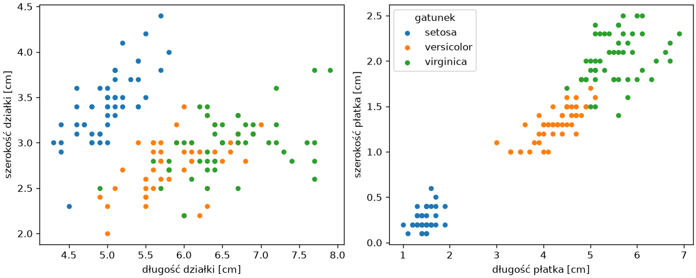

# Pojęcia uczenia maszynowego

Uczenie maszynowe ma własny język, w którym te same słowa — model, trening, cecha — znaczą coś ściślejszego niż w mowie potocznej. Ten podrozdział wprowadza pojęcia na jednym zbiorze danych i jednym modelu napisanym w NumPy, tak aby w następnych podrozdziałach biblioteka scikit-learn była tylko wygodniejszym zapisem tego, co już rozumiemy.

## Reguły a dane

Program z części „Python Notatki” dostaje reguły i dane, a zwraca odpowiedzi: `if temperatura < 0: stan = "lód"`. Uczenie maszynowe odwraca układ: dostaje dane **i odpowiedzi** — przykłady, dla których wynik jest znany — a zwraca regułę, którą potem stosuje do przypadków bez odpowiedzi. Reguła nie jest spisana przez człowieka, lecz **wyuczona** z przykładów; jej jakość zależy od tego, ile przykładów model widział, czy były reprezentatywne i czy zależność w ogóle istnieje. Uczenie maszynowe opłaca się tam, gdzie reguły są zbyt złożone, aby je spisać (rozpoznanie odręcznej cyfry po pikselach, wykrycie spamu po słowach wiadomości), a przykładów jest dość, aby je odtworzyć.

## Zadania — klasyfikacja, regresja, grupowanie

Zadania dzielą się według tego, co model ma przewidzieć i czy zna odpowiedzi:

| Zadanie | Odpowiedź | Przykład | Rozdział |
|---|---|---|---|
| **klasyfikacja** (ang. *classification*) | kategoria z zamkniętej listy | gatunek rośliny, „spam / nie spam”, cyfra na obrazie | 8 |
| **regresja** (ang. *regression*) | liczba | cena mieszkania, sprzedaż w następnym miesiącu, temperatura | 9 |
| **grupowanie** (ang. *clustering*) | grupy podobnych obserwacji, bez odpowiedzi z góry | segmenty klientów | 10 |
| **redukcja wymiaru** (ang. *dimensionality reduction*) | mniej cech opisujących to samo | wizualizacja danych o dziesiątkach cech | 10 |

Dwa pierwsze zadania to **uczenie z nadzorem** (ang. *supervised learning*): każdy przykład ma znaną odpowiedź, którą model ma odtworzyć. Dwa ostatnie to **uczenie bez nadzoru** (ang. *unsupervised learning*): odpowiedzi nie ma, model szuka struktury w samych cechach. Ten rozdział i następny zajmują się klasyfikacją, bo najłatwiej na niej pokazać cały cykl pracy.

## Cechy, etykiety, próbki

Dane do uczenia z nadzorem mają postać tabeli, w której każdy wiersz to **próbka** (ang. *sample*) — jedna obserwacja — kolumny to **cechy** (ang. *features*), czyli to, co o próbce wiemy, a osobna kolumna to **etykieta** (ang. *label*, także *target*), czyli to, co chcemy przewidywać. W zapisie matematycznym cechy tworzą macierz `X` o kształcie (próbki × cechy), a etykiety wektor `y`; scikit-learn używa tych nazw w każdej funkcji. Zbiór iris — sto pięćdziesiąt irysów trzech gatunków z czterema wymiarami kwiatu — jest wbudowany w bibliotekę i będzie towarzyszył całemu rozdziałowi:

```python title="cechy.py"
import matplotlib.pyplot as plt
from sklearn.datasets import load_iris

iris = load_iris(as_frame=True)
X, y = iris.data, iris.target
print(type(X).__name__, X.shape, type(y).__name__, y.shape)
print(X.columns.tolist())
print(iris.target_names.tolist(), y.value_counts().sort_index().tolist())
print(iris.frame.head(3).rename(columns=lambda kolumna: kolumna.replace(" (cm)", "")))

fig, (ax1, ax2) = plt.subplots(1, 2, figsize=(10, 4), layout="constrained")
for klasa, nazwa in enumerate(iris.target_names):
    maska = y == klasa
    ax1.scatter(X.loc[maska, "sepal length (cm)"], X.loc[maska, "sepal width (cm)"], s=18, label=nazwa)
    ax2.scatter(X.loc[maska, "petal length (cm)"], X.loc[maska, "petal width (cm)"], s=18, label=nazwa)
ax1.set_xlabel("długość działki [cm]")
ax1.set_ylabel("szerokość działki [cm]")
ax2.set_xlabel("długość płatka [cm]")
ax2.set_ylabel("szerokość płatka [cm]")
ax2.legend(title="gatunek")
fig.savefig("cechy.png", dpi=120)
```

```{ .text .no-copy }
DataFrame (150, 4) Series (150,)
['sepal length (cm)', 'sepal width (cm)', 'petal length (cm)', 'petal width (cm)']
['setosa', 'versicolor', 'virginica'] [50, 50, 50]
   sepal length  sepal width  petal length  petal width  target
0           5.1          3.5           1.4          0.2       0
1           4.9          3.0           1.4          0.2       0
2           4.7          3.2           1.3          0.2       0
```

{ width="760" }

`load_iris(as_frame=True)` zwraca obiekt z ramką cech `data`, serią etykiet `target` (kody 0, 1, 2) i nazwami gatunków `target_names`; w `frame` jest cała tabela, w `DESCR` opis zbioru. Klasy są równoliczne — po pięćdziesiąt próbek. Wykresy pokazują, dlaczego zadanie jest wykonalne: wymiary płatka niemal rozdzielają gatunki, wymiary działki oddzielają tylko setosę. Wybór cech, które niosą informację, jest częścią pracy; w rozdziale 9 wracamy do tego przy przygotowaniu danych. <!-- TODO: link po powstaniu rozdziału o regresji i przygotowaniu danych -->

## Model, trening, predykcja — klasyfikator centroidów

**Model** to funkcja od cech do odpowiedzi z parametrami, które ustala **trening** (ang. *training*; w scikit-learn *fit*, „dopasowanie”) na przykładach; **predykcja** (ang. *prediction*) to zastosowanie wytrenowanego modelu do nowych cech. Najprostszy model klasyfikacji zmieści się w kilku wierszach NumPy z rozdziału 2: dla każdej klasy liczymy środek jej próbek, a nową próbkę przypisujemy do najbliższego środka:

```python title="centroidy.py"
import numpy as np
from sklearn.datasets import load_iris

iris = load_iris()
X, y = iris.data, iris.target
print(type(X).__name__, X.dtype, X.shape, np.unique(y))

centroidy = np.array([X[y == klasa].mean(axis=0) for klasa in range(3)])
print(centroidy.round(2))


def przewiduj(probki):
    odleglosci = np.linalg.norm(probki[:, None, :] - centroidy[None, :, :], axis=2)
    return odleglosci.argmin(axis=1)


przewidziane = przewiduj(X)
print(przewidziane[:10], y[:10])
print((przewidziane == y).mean().round(3))
nowa = np.array([[5.0, 3.4, 1.5, 0.2]])
print(przewiduj(nowa), iris.target_names[przewiduj(nowa)])
```

```{ .text .no-copy }
ndarray float64 (150, 4) [0 1 2]
[[5.01 3.43 1.46 0.25]
 [5.94 2.77 4.26 1.33]
 [6.59 2.97 5.55 2.03]]
[0 0 0 0 0 0 0 0 0 0] [0 0 0 0 0 0 0 0 0 0]
0.927
[0] ['setosa']
```

Bez `as_frame=True` scikit-learn zwraca tablice NumPy. Parametrami modelu są trzy **centroidy** — środki klas — a treningiem ich obliczenie; predykcja liczy odległości nowej próbki do każdego środka wzorcem z rozdziału 2 (`None` w indeksach i `norm()` wzdłuż ostatniej osi) i wybiera najbliższy. Model odtwarza gatunek poprawnie w 93% próbek, na których go nauczono; scikit-learn ma ten sam algorytm pod nazwą `NearestCentroid`. Wszystko, co dalej, jest wariacją tego schematu: inne parametry, inny sposób ich ustalania, ten sam podział na trening i predykcję.

## Uogólnianie i zbiór testowy

Wynik 93% powstał na tych samych próbkach, które posłużyły do treningu — mówi więc, jak dobrze model **zapamiętał** przykłady, nie jak dobrze **uogólnia** (ang. *generalization*) na przykłady nowe. Model, który zapamiętałby każdą próbkę z etykietą, miałby na treningu 100%, a o jego przydatności dla nowych próbek nie wiedzielibyśmy nic. Dlatego przed treningiem odkładamy część danych jako **zbiór testowy** (ang. *test set*), którego model nie widzi, a ocenę robimy na nim: to jedyna uczciwa miara tego, co model umie. Pozostała część to **zbiór treningowy** (ang. *training set*). Podział musi być losowy — z ziarnem dla powtarzalności — i zachowywać proporcje klas; zbiór testowy służy do jednorazowej oceny na końcu, a decyzje po drodze (który model, jakie ustawienia) podejmujemy bez zaglądania do niego, o czym w ostatnim podrozdziale.

## Słownik pojęć

| Termin | Angielski | Znaczenie |
|---|---|---|
| próbka | *sample* | jedna obserwacja, wiersz macierzy `X` |
| cecha | *feature* | kolumna `X`, właściwość próbki |
| etykieta | *label*, *target* | wartość do przewidzenia, element `y` |
| model | *model*, *estimator* | funkcja od cech do odpowiedzi z parametrami |
| trening, dopasowanie | *training*, *fit* | ustalenie parametrów modelu na zbiorze treningowym |
| predykcja | *prediction* | odpowiedź modelu dla nowych cech |
| hiperparametr | *hyperparameter* | ustawienie modelu wybierane przed treningiem, np. liczba sąsiadów w modelu z następnego podrozdziału |
| dokładność | *accuracy* | odsetek poprawnych predykcji |
| uogólnianie | *generalization* | jakość predykcji na danych spoza treningu |
| zbiór treningowy, testowy | *training set*, *test set* | dane do treningu i do końcowej oceny |
| przeuczenie, niedouczenie | *overfitting*, *underfitting* | model zbyt dopasowany do treningu, model zbyt prosty |

Terminy wracają w każdym rozdziale ścieżki; angielskie odpowiedniki są potrzebne, bo dokumentacja bibliotek i większość materiałów używa ich bez tłumaczenia.
