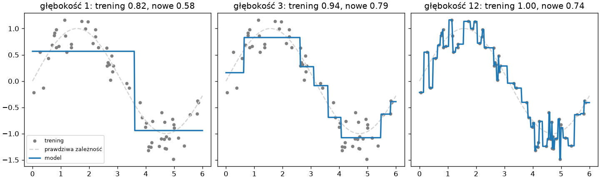
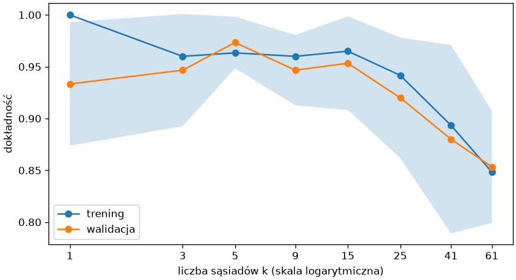
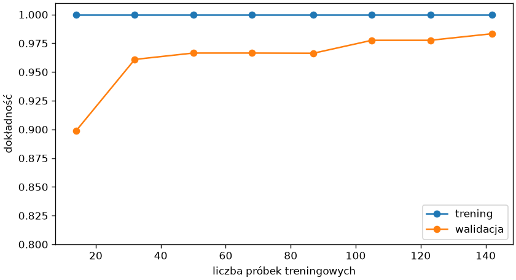

# Przeuczenie i uczciwa ocena

Najczęstszy błąd w uczeniu maszynowym nie jest błędem w kodzie: model wypada świetnie w ocenie, a zawodzi na nowych danych. Ten podrozdział pokazuje dwa mechanizmy tego złudzenia — przeuczenie i wyciek danych — narzędzia, które je ujawniają, oraz mapę, która pomaga wybrać model do zadania.

## Niedouczenie i przeuczenie

```python title="dopasowanie.py"
import matplotlib.pyplot as plt
import numpy as np
from sklearn.tree import DecisionTreeRegressor

rng = np.random.default_rng(42)
x = np.sort(rng.uniform(0, 6, 60))
y = np.sin(x) + rng.normal(0, 0.3, 60)
x_nowe = np.sort(rng.uniform(0, 6, 60))
y_nowe = np.sin(x_nowe) + rng.normal(0, 0.3, 60)
siatka = np.linspace(0, 6, 300)[:, None]

fig, osie = plt.subplots(1, 3, figsize=(12, 3.6), layout="constrained", sharey=True)
for ax, glebokosc in zip(osie, (1, 3, 12)):
    model = DecisionTreeRegressor(max_depth=glebokosc, random_state=42).fit(x[:, None], y)
    ax.scatter(x, y, s=14, color="tab:gray", label="trening")
    ax.plot(siatka, np.sin(siatka), color="lightgray", linestyle="--", label="prawdziwa zależność")
    ax.plot(siatka, model.predict(siatka), color="tab:blue", linewidth=2, label="model")
    ax.set_title(f"głębokość {glebokosc}: trening {model.score(x[:, None], y):.2f}, nowe {model.score(x_nowe[:, None], y_nowe):.2f}")
    print(glebokosc, model.get_n_leaves(), round(model.score(x[:, None], y), 3), round(model.score(x_nowe[:, None], y_nowe), 3))
osie[0].legend(loc="lower left", fontsize=8)
fig.savefig("dopasowanie.png", dpi=120)
```

```{ .text .no-copy }
1 2 0.823 0.579
3 8 0.94 0.793
12 60 1.0 0.735
```

{ width="900" }

Dane to sinusoida z szumem, model to **drzewo regresji**, które dzieli oś na przedziały o stałej predykcji — im głębsze, tym więcej przedziałów (`get_n_leaves()`). Miara `score()` dla regresji to współczynnik determinacji R² z rozdziału 2: 1 oznacza idealne dopasowanie, 0 — nie lepsze niż średnia. Drzewo o głębokości 1 jest **niedouczone** (ang. *underfitting*): dwa poziomy nie oddają kształtu ani na treningu, ani na nowych danych. Drzewo o głębokości 12 jest **przeuczone** (ang. *overfitting*): sześćdziesiąt liści — po jednym na punkt — odtwarza trening idealnie, ale przenosi na nowe dane szum zamiast zależności, więc wypada gorzej niż głębokość 3. Reguła jest ogólna: złożoność modelu ma odpowiadać ilości informacji w danych, a rozpoznać to można tylko na danych spoza treningu.

## Krzywa walidacji

```python title="krzywa-walidacji.py"
import matplotlib.pyplot as plt
import numpy as np
from sklearn.datasets import load_iris
from sklearn.model_selection import StratifiedKFold, validation_curve
from sklearn.neighbors import KNeighborsClassifier
from sklearn.pipeline import make_pipeline
from sklearn.preprocessing import StandardScaler

iris = load_iris(as_frame=True)
potok = make_pipeline(StandardScaler(), KNeighborsClassifier())
sasiedzi = [1, 3, 5, 9, 15, 25, 41, 61]
podzialy = StratifiedKFold(n_splits=5, shuffle=True, random_state=42)
trening, walidacja = validation_curve(potok, iris.data, iris.target, param_name="kneighborsclassifier__n_neighbors", param_range=sasiedzi, cv=podzialy)
print(trening.mean(axis=1).round(3))
print(walidacja.mean(axis=1).round(3))

fig, ax = plt.subplots(figsize=(7, 3.8), layout="constrained")
ax.plot(sasiedzi, trening.mean(axis=1), marker="o", label="trening")
ax.plot(sasiedzi, walidacja.mean(axis=1), marker="o", label="walidacja")
ax.fill_between(sasiedzi, walidacja.mean(axis=1) - walidacja.std(axis=1), walidacja.mean(axis=1) + walidacja.std(axis=1), alpha=0.2)
ax.set_xscale("log")
ax.set_xticks(sasiedzi, labels=sasiedzi)
ax.tick_params(axis="x", which="minor", bottom=False)
ax.set_xlabel("liczba sąsiadów k (skala logarytmiczna)")
ax.set_ylabel("dokładność")
ax.legend()
fig.savefig("krzywa-walidacji.png", dpi=120)
```

```{ .text .no-copy }
[1.    0.96  0.963 0.96  0.965 0.942 0.893 0.848]
[0.933 0.947 0.973 0.947 0.953 0.92  0.88  0.853]
```

{ width="640" }

**Krzywa walidacji** (ang. *validation curve*) pokazuje oba wyniki — na treningu i na częściach walidacyjnych — w funkcji jednego hiperparametru; `validation_curve()` liczy je walidacją krzyżową jak `GridSearchCV`, ale dla jednego parametru i bez wyboru najlepszej wartości — zwraca po prostu obie tablice wyników. Lewy koniec to przeuczenie: `k = 1` ma trening 100% i gorszą walidację; prawy to niedouczenie: przy dziesiątkach sąsiadów oba wyniki spadają, bo model uśrednia po zbyt wielu próbkach. Najlepszy `k` leży tam, gdzie krzywa walidacji jest najwyżej, a pasmo odchylenia przypomina, że różnice rzędu setnych nie są rozstrzygające. Nazwa parametru z `make_pipeline()` to nazwa klasy małymi literami i dwa podkreślenia.

## Krzywa uczenia

```python title="krzywa-uczenia.py"
import matplotlib.pyplot as plt
import numpy as np
from sklearn.datasets import load_wine
from sklearn.linear_model import LogisticRegression
from sklearn.model_selection import StratifiedKFold, learning_curve
from sklearn.pipeline import make_pipeline
from sklearn.preprocessing import StandardScaler

wine = load_wine(as_frame=True)
print(wine.data.shape, wine.target.value_counts().sort_index().tolist())
potok = make_pipeline(StandardScaler(), LogisticRegression(max_iter=1000))
podzialy = StratifiedKFold(n_splits=5, shuffle=True, random_state=42)
rozmiary, trening, walidacja = learning_curve(potok, wine.data, wine.target, train_sizes=np.linspace(0.1, 1.0, 8), cv=podzialy, shuffle=True, random_state=42)
print(rozmiary.tolist())
print(trening.mean(axis=1).round(3), walidacja.mean(axis=1).round(3))

fig, ax = plt.subplots(figsize=(7, 3.8), layout="constrained")
ax.plot(rozmiary, trening.mean(axis=1), marker="o", label="trening")
ax.plot(rozmiary, walidacja.mean(axis=1), marker="o", label="walidacja")
ax.set_xlabel("liczba próbek treningowych")
ax.set_ylabel("dokładność")
ax.set_ylim(0.8, 1.01)
ax.legend(loc="lower right")
fig.savefig("krzywa-uczenia.png", dpi=120)
```

```{ .text .no-copy }
(178, 13) [59, 71, 48]
[14, 32, 50, 68, 87, 105, 123, 142]
[1. 1. 1. 1. 1. 1. 1. 1.] [0.899 0.961 0.967 0.967 0.966 0.978 0.978 0.983]
```

{ width="640" }

**Krzywa uczenia** (ang. *learning curve*) odpowiada na inne pytanie: czy więcej danych pomoże. `learning_curve()` trenuje model na rosnących podzbiorach zbioru treningowego (`shuffle=True` miesza próbki, bo w zbiorze wine są ułożone klasami) i ocenia walidacją krzyżową. Zbiór wine — 178 win trzech odmian opisanych trzynastoma cechami chemicznymi — z [regresją logistyczną](../08-klasyfikacja/regresja-logistyczna.md) z rozdziału o klasyfikacji daje krzywą, w której trening jest idealny, a walidacja rośnie wraz z liczbą próbek — z wyrównaniem między 50 a 90 próbkami — i przy ostatniej porcji wciąż nie dosięga treningu: model wciąż korzysta z nowych próbek, więcej danych poprawiłoby wynik. Gdy obie krzywe zbiegają się nisko, więcej danych nie pomoże — potrzebny jest model bardziej złożony lub lepsze cechy.

## Wyciek danych

```python title="wyciek.py"
import numpy as np
from sklearn.feature_selection import SelectKBest, f_classif
from sklearn.linear_model import LogisticRegression
from sklearn.model_selection import cross_val_score
from sklearn.pipeline import make_pipeline

rng = np.random.default_rng(42)
X = rng.normal(size=(100, 2000))
y = rng.integers(0, 2, size=100)
print(X.shape, np.bincount(y))

wybrane = SelectKBest(f_classif, k=10).fit_transform(X, y)
print("selekcja na całości, potem walidacja:", cross_val_score(LogisticRegression(), wybrane, y, cv=5).mean().round(3))
potok = make_pipeline(SelectKBest(f_classif, k=10), LogisticRegression())
print("selekcja wewnątrz potoku:            ", cross_val_score(potok, X, y, cv=5).mean().round(3))
```

```{ .text .no-copy }
(100, 2000) [47 53]
selekcja na całości, potem walidacja: 0.73
selekcja wewnątrz potoku:             0.53
```

Cechy i etykiety są tu **czysto losowe** — żaden model nie może przewidywać `y` lepiej niż rzut monetą. Mimo to pierwsza ocena wynosi 73%: `SelectKBest` wybrał dziesięć cech o najwyższej statystyce F (`f_classif`), czyli najsilniej związanych z etykietą, patrząc na **cały zbiór**, a przy dwóch tysiącach losowych cech zawsze znajdzie się dziesięć przypadkowo skorelowanych; walidacja krzyżowa oceniała potem model na próbkach, które wpłynęły na wybór cech. To **wyciek danych** (ang. *data leakage*): informacja o zbiorze testowym przedostała się do modelu przed oceną. Ta sama selekcja wewnątrz potoku uczy się w każdym przebiegu tylko na części treningowej i daje wynik na poziomie losowym — prawdziwy. Reguła: każdy krok, który uczy się z danych — skalowanie, selekcja cech, uzupełnianie braków, dobór hiperparametrów — należy do potoku i widzi wyłącznie zbiór treningowy; wyciek zdarza się też przez cechy, które w chwili predykcji nie będą znane (na przykład kwota zwrotu przy przewidywaniu zwrotu), o czym przy [wycieku celu](../09-regresja/przygotowanie-danych.md#wyciek-celu) w rozdziale 9.

## Wybór modelu — mapa ścieżki

| Pytanie | Zadanie | Modele | Rozdział |
|---|---|---|---|
| Do której z kilku klas należy próbka? | klasyfikacja | KNN, regresja logistyczna, drzewa i lasy losowe | 8 |
| Jaką liczbę przyjmie wielkość? | regresja | regresja liniowa i regularyzowana, drzewa i lasy | 9 |
| Jak przygotować cechy tekstowe, brakujące, o różnych skalach? | przygotowanie danych | `ColumnTransformer`, kodowanie, imputacja | 9 |
| Jakie grupy są w danych bez etykiet? Jak zobaczyć wiele cech na płaszczyźnie? | grupowanie, redukcja wymiaru | k-średnich, PCA | 10 |
| Obrazy, dźwięk, tekst, bardzo duże zbiory? | sieci neuronowe | PyTorch | 11 |

Rozdział 9 to [Regresja i przygotowanie danych](../09-regresja/index.md), rozdział 10 — [Uczenie bez nadzoru](../10-bez-nadzoru/index.md), rozdział 11 — [PyTorch — tensory i sieć neuronowa](../11-pytorch/index.md).

Przy wyborze obowiązuje kolejność: najpierw model bazowy, potem model prosty i interpretowalny (regresja logistyczna, drzewo), dopiero potem złożone — pod warunkiem, że walidacja krzyżowa pokazuje zysk większy od odchylenia. Dokumentacja scikit-learn ma dla każdego modelu tę samą strukturę (parametry, atrybuty z podkreśleniem, przykłady), więc czytanie jej metodą z rozdziału 1 przenosi się z modelu na model.

## Dalej: klasyfikacja

Następny rozdział zostaje przy klasyfikacji i dodaje to, czego brakowało w pierwszym modelu: miary dla klas nierównolicznych i błędów o różnej wadze, macierz pomyłek, modele — regresję logistyczną, drzewa, lasy losowe — oraz ich interpretację — [rozdział o klasyfikacji](../08-klasyfikacja/index.md).
