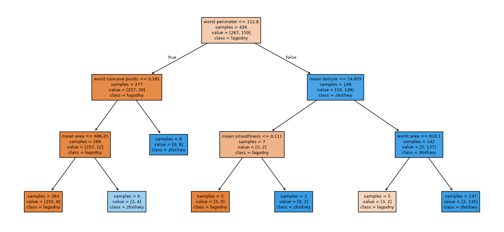
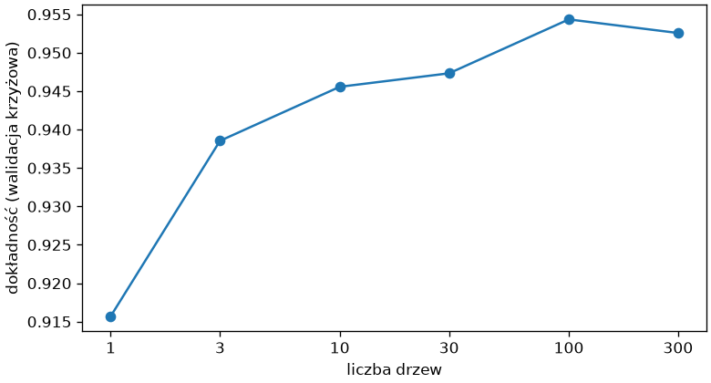

# Drzewa decyzyjne i lasy losowe

**Drzewo decyzyjne** (ang. *decision tree*) klasyfikuje serią pytań o pojedyncze cechy — „czy największy obwód przekracza 112,8?” — aż dojdzie do liścia z odpowiedzią. Reguły da się przeczytać i narysować, model nie wymaga skalowania i odwzorowuje granice, których model liniowy nie odda; w zamian łatwo się przeucza. **Las losowy** (ang. *random forest*) łagodzi tę wadę, uśredniając setki drzew.

## Drzewo decyzyjne

```python title="drzewo.py"
import matplotlib.pyplot as plt
from sklearn.datasets import load_breast_cancer
from sklearn.model_selection import train_test_split
from sklearn.tree import DecisionTreeClassifier, export_text, plot_tree

rak = load_breast_cancer(as_frame=True)
X, y = rak.data, (rak.target == 0).astype(int).rename("zlosliwy")
X_trening, X_test, y_trening, y_test = train_test_split(X, y, test_size=0.25, random_state=42, stratify=y)
drzewo = DecisionTreeClassifier(max_depth=3, random_state=42).fit(X_trening, y_trening)
print(round(drzewo.score(X_trening, y_trening), 3), round(drzewo.score(X_test, y_test), 3), drzewo.get_depth(), drzewo.get_n_leaves())
print(export_text(drzewo, feature_names=list(X.columns), class_names=["łagodny", "złośliwy"]))
print(drzewo.predict_proba(X_test.head(3)).round(3))

fig, ax = plt.subplots(figsize=(13, 6), layout="constrained")
plot_tree(drzewo, feature_names=list(X.columns), class_names=["łagodny", "złośliwy"], filled=True, impurity=False, ax=ax, fontsize=8)
fig.savefig("drzewo.png", dpi=120)
```

```{ .text .no-copy }
0.967 0.888 3 7
|--- worst perimeter <= 112.80
|   |--- worst concave points <= 0.18
|   |   |--- mean area <= 696.25
|   |   |   |--- class: łagodny
|   |   |--- mean area >  696.25
|   |   |   |--- class: złośliwy
|   |--- worst concave points >  0.18
|   |   |--- class: złośliwy
|--- worst perimeter >  112.80
|   |--- mean texture <= 14.95
|   |   |--- mean smoothness <= 0.11
|   |   |   |--- class: łagodny
|   |   |--- mean smoothness >  0.11
|   |   |   |--- class: złośliwy
|   |--- mean texture >  14.95
|   |   |--- worst area <= 810.10
|   |   |   |--- class: łagodny
|   |   |--- worst area >  810.10
|   |   |   |--- class: złośliwy

[[0.015 0.985]
 [0.97  0.03 ]
 [0.015 0.985]]
```

{ width="900" }

Trening drzewa wybiera w każdym węźle cechę i próg, które najlepiej rozdzielają klasy (mierząc **nieczystość** (ang. *impurity*) węzłów potomnych, domyślnie indeksem Giniego), i powtarza to rekurencyjnie do zadanej głębokości lub czystych liści. `export_text()` wypisuje reguły, `plot_tree()` je rysuje — z licznością klas w każdym węźle (`samples`, `value`) i decyzją. Pierwszy podział po największym obwodzie rozdziela większość próbek; guz o małym obwodzie, lecz wysokiej wklęsłości trafia mimo to do liścia „złośliwy”. `predict_proba()` drzewa to udział klas w liściu, do którego trafiła próbka — stąd łamana krzywa ROC drzewa z pierwszego podrozdziału. Drzewo nie wymaga skalowania: przeskalowanie cechy zmienia tylko wartość progu w pytaniu, nie podział próbek, bo drzewo porównuje wartości wyłącznie w obrębie jednej cechy.

## Głębokość i przeuczenie

```python title="glebokosc.py"
from sklearn.datasets import load_breast_cancer
from sklearn.model_selection import StratifiedKFold, cross_validate, train_test_split
from sklearn.tree import DecisionTreeClassifier

rak = load_breast_cancer(as_frame=True)
X, y = rak.data, (rak.target == 0).astype(int).rename("zlosliwy")
X_trening, X_test, y_trening, y_test = train_test_split(X, y, test_size=0.25, random_state=42, stratify=y)
pelne = DecisionTreeClassifier(random_state=42).fit(X_trening, y_trening)
print(pelne.get_depth(), pelne.get_n_leaves(), round(pelne.score(X_trening, y_trening), 3), round(pelne.score(X_test, y_test), 3))
podzialy = StratifiedKFold(n_splits=5, shuffle=True, random_state=42)
for glebokosc in (1, 2, 3, 5, 8, None):
    wyniki = cross_validate(DecisionTreeClassifier(max_depth=glebokosc, random_state=42), X, y, cv=podzialy, return_train_score=True)
    print(f"max_depth={str(glebokosc):<5} trening {wyniki['train_score'].mean():.3f}  walidacja {wyniki['test_score'].mean():.3f} ± {wyniki['test_score'].std():.3f}")
for lisc in (1, 5, 20):
    wyniki = cross_validate(DecisionTreeClassifier(min_samples_leaf=lisc, random_state=42), X, y, cv=podzialy)
    print(f"min_samples_leaf={lisc:<3} walidacja {wyniki['test_score'].mean():.3f}")
```

```{ .text .no-copy }
8 21 1.0 0.958
max_depth=1     trening 0.925  walidacja 0.888 ± 0.028
max_depth=2     trening 0.956  walidacja 0.905 ± 0.032
max_depth=3     trening 0.972  walidacja 0.924 ± 0.021
max_depth=5     trening 0.992  walidacja 0.928 ± 0.023
max_depth=8     trening 1.000  walidacja 0.910 ± 0.028
max_depth=None  trening 1.000  walidacja 0.910 ± 0.028
min_samples_leaf=1   walidacja 0.910
min_samples_leaf=5   walidacja 0.928
min_samples_leaf=20  walidacja 0.909
```

Drzewo bez ograniczeń rośnie, aż każdy liść jest czysty: dwadzieścia jeden liści na ośmiu poziomach i 100% na treningu. Na tym jednym podziale testowym wypada nawet dobrze, ale walidacja krzyżowa — stabilniejsza — pokazuje spadek z 0,928 przy pięciu poziomach do 0,910 bez ograniczeń: ostatnie podziały obsługują pojedyncze próbki i dopasowują szum, jak w rozdziale 7. Ograniczenia to hiperparametry: `max_depth` (liczba poziomów) albo `min_samples_leaf` (najmniejsza liczność liścia), które zatrzymują podziały wcześniej; krzywa walidacji po głębokości ma maksimum przy trzech–pięciu poziomach, a `min_samples_leaf=5` daje ten sam wynik co pięć poziomów, gdy 20 już niedoucza. Drzewo jest też niestabilne — niewielka zmiana próbek treningowych może zmienić cechę w korzeniu i całą strukturę — co widać w odchyleniu między częściami walidacji, dwa razy większym niż u lasu z dalszej sekcji.

## Ważność cech

```python title="waznosc.py"
import pandas as pd
from sklearn.datasets import load_breast_cancer
from sklearn.model_selection import train_test_split
from sklearn.tree import DecisionTreeClassifier

rak = load_breast_cancer(as_frame=True)
X, y = rak.data, (rak.target == 0).astype(int).rename("zlosliwy")
X_trening, X_test, y_trening, y_test = train_test_split(X, y, test_size=0.25, random_state=42, stratify=y)
drzewo = DecisionTreeClassifier(max_depth=3, random_state=42).fit(X_trening, y_trening)
waznosc = pd.Series(drzewo.feature_importances_, index=X.columns).sort_values(ascending=False)
print(waznosc.head(6).round(3).to_dict())
print(round(waznosc.sum(), 3), (waznosc > 0).sum())
bez_obwodu = X_trening.drop(columns="worst perimeter")
inne = DecisionTreeClassifier(max_depth=3, random_state=42).fit(bez_obwodu, y_trening)
print(pd.Series(inne.feature_importances_, index=bez_obwodu.columns).sort_values(ascending=False).head(3).round(3).to_dict())
print(round(inne.score(X_test.drop(columns="worst perimeter"), y_test), 3))
```

```{ .text .no-copy }
{'worst perimeter': 0.821, 'worst concave points': 0.081, 'mean texture': 0.035, 'mean area': 0.027, 'worst area': 0.019, 'mean smoothness': 0.016}
1.0 6
{'worst radius': 0.791, 'worst concave points': 0.1, 'mean texture': 0.045}
0.93
```

`feature_importances_` mierzy, jak bardzo podziały po danej cesze zmniejszyły nieczystość w całym drzewie; wartości sumują się do 1, a cechy nieużyte mają 0 — drzewo o trzech poziomach użyło sześciu z trzydziestu. Ważność jest własnością **tego** drzewa, nie danych: po usunięciu największego obwodu drzewo buduje na innej cesze model równie dobry — na tym podziale nawet lepszy (0,93 wobec 0,888), bo promień i pole niosą tę samą informację — a ważność przechodzi na nią. Przy cechach skorelowanych ważność drzewa mówi więc, którą z równoważnych cech model wybrał, nie która jest niezbędna; miarę niezależną od budowy modelu — ważność permutacyjną — omawiamy w ostatnim podrozdziale, a przy cechach skorelowanych i ona wymaga liczenia dla grup cech.

## Las losowy

```python title="las.py"
import matplotlib.pyplot as plt
import pandas as pd
from sklearn.datasets import load_breast_cancer
from sklearn.ensemble import RandomForestClassifier
from sklearn.model_selection import StratifiedKFold, cross_val_score, train_test_split

rak = load_breast_cancer(as_frame=True)
X, y = rak.data, (rak.target == 0).astype(int).rename("zlosliwy")
X_trening, X_test, y_trening, y_test = train_test_split(X, y, test_size=0.25, random_state=42, stratify=y)
las = RandomForestClassifier(n_estimators=300, oob_score=True, random_state=42, n_jobs=-1).fit(X_trening, y_trening)
print(round(las.score(X_test, y_test), 3), round(las.oob_score_, 3), len(las.estimators_))
print([drzewo.get_depth() for drzewo in las.estimators_[:5]], [X.columns[drzewo.tree_.feature[0]] for drzewo in las.estimators_[:5]])
print(pd.Series(las.feature_importances_, index=X.columns).sort_values(ascending=False).head(5).round(3).to_dict())

podzialy = StratifiedKFold(n_splits=5, shuffle=True, random_state=42)
liczby_drzew = [1, 3, 10, 30, 100, 300]
wyniki = [float(cross_val_score(RandomForestClassifier(n_estimators=n, random_state=42, n_jobs=-1), X, y, cv=podzialy).mean()) for n in liczby_drzew]
print([round(w, 3) for w in wyniki])
fig, ax = plt.subplots(figsize=(6.5, 3.5), layout="constrained")
ax.plot(liczby_drzew, wyniki, marker="o")
ax.set_xscale("log")
ax.set_xticks(liczby_drzew, labels=liczby_drzew)
ax.tick_params(axis="x", which="minor", bottom=False)
ax.set_xlabel("liczba drzew")
ax.set_ylabel("dokładność (walidacja krzyżowa)")
fig.savefig("las.png", dpi=120)
```

```{ .text .no-copy }
0.958 0.955 300
[7, 9, 10, 6, 8] ['worst concave points', 'worst concavity', 'worst concave points', 'worst radius', 'area error']
{'worst perimeter': 0.144, 'worst area': 0.138, 'mean concave points': 0.096, 'worst concave points': 0.095, 'worst radius': 0.084}
[0.916, 0.939, 0.946, 0.947, 0.954, 0.953]
```

{ width="560" }

Las trenuje wiele drzew, każde na **próbce bootstrapowej** (ang. *bootstrap sample*) — losowanej z powtórzeniami ze zbioru treningowego — i z losowym podzbiorem cech rozważanym w każdym węźle; dlatego drzewa różnią się głębokością i cechą w korzeniu, a predykcją jest średnia ich prawdopodobieństw. Uśrednienie tłumi niestabilność pojedynczego drzewa: drzewa mogą być głębokie i przeuczone z osobna, a las w znacznie mniejszym stopniu. Próbki pominięte przy losowaniu dla danego drzewa — **poza workiem** (ang. *out-of-bag*, OOB) — służą do oceny bez odkładania osobnego zbioru (`oob_score_`), zbliżonej do walidacji krzyżowej. Dokładność rośnie z liczbą drzew i wyrównuje się około stu; spadek z 0,954 do 0,953 mieści się w odchyleniu, więc więcej drzew nie pogarsza uogólniania, wydłuża tylko trening, a `n_jobs=-1` trenuje je równolegle na wszystkich rdzeniach. Ważność cech lasu jest uśredniona po drzewach, więc stabilniejsza niż pojedynczego drzewa, ale przy cechach skorelowanych rozkłada się między nie.

## Wzmacnianie gradientowe

```python title="boosting.py"
from sklearn.datasets import load_breast_cancer
from sklearn.ensemble import HistGradientBoostingClassifier, RandomForestClassifier
from sklearn.model_selection import StratifiedKFold, cross_val_score

rak = load_breast_cancer(as_frame=True)
X, y = rak.data, (rak.target == 0).astype(int).rename("zlosliwy")
podzialy = StratifiedKFold(n_splits=5, shuffle=True, random_state=42)
for nazwa, model in (("las losowy", RandomForestClassifier(n_estimators=300, random_state=42, n_jobs=-1)), ("wzmacnianie gradientowe", HistGradientBoostingClassifier(random_state=42))):
    wyniki = cross_val_score(model, X, y, cv=podzialy)
    print(f"{nazwa:<24}{wyniki.mean():.3f} ± {wyniki.std():.3f}")
```

```{ .text .no-copy }
las losowy              0.953 ± 0.013
wzmacnianie gradientowe 0.967 ± 0.013
```

**Wzmacnianie gradientowe** (ang. *gradient boosting*) buduje drzewa po kolei, każde poprawiając błędy poprzednich, zamiast niezależnie jak las; `HistGradientBoostingClassifier` to szybka implementacja dla dużych zbiorów, która obsługuje też braki w cechach. Na danych tabelarycznych bywa najdokładniejszym modelem i jest wart sprawdzenia obok lasu, ale ma więcej hiperparametrów (tempo uczenia, liczba iteracji, głębokość) i łatwiej go przeuczyć — jego strojenie zostawiamy dokumentacji i projektowi zamykającemu ścieżkę.
