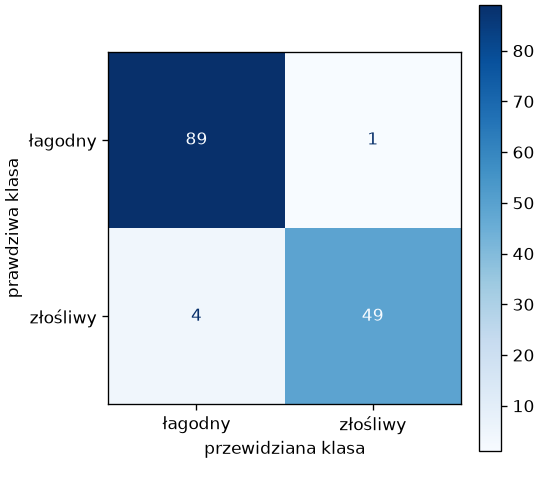
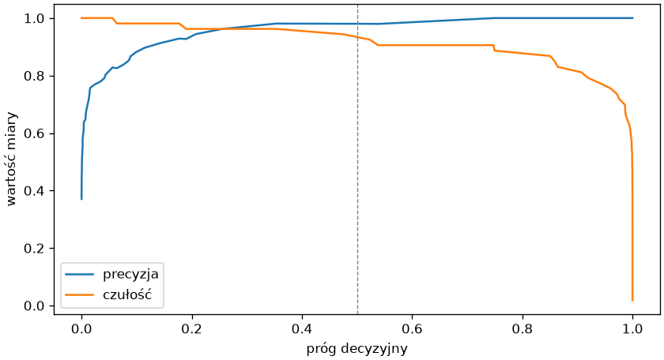
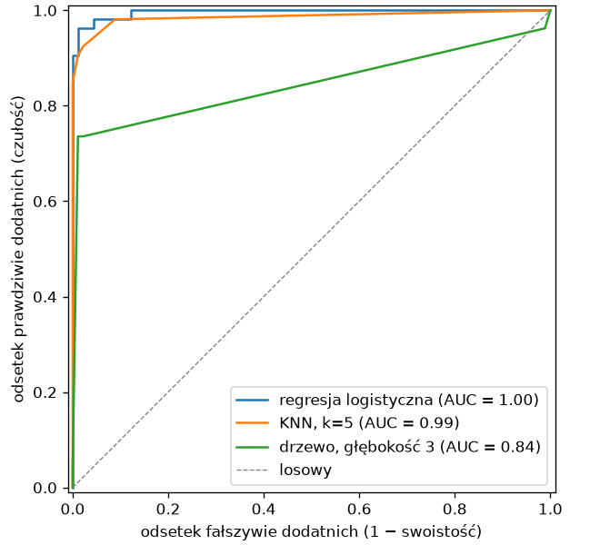
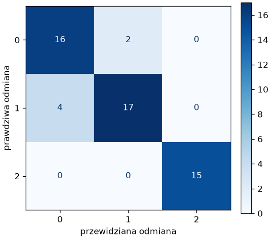

# Miary klasyfikacji

Dokładność odpowiada na pytanie „jak często model ma rację”, ale nie „jak się myli”. W diagnostyce, wykrywaniu oszustw czy filtrowaniu spamu dwa rodzaje błędów — przeoczenie i fałszywy alarm — kosztują różnie, a klasy bywają skrajnie nierównoliczne; wtedy model, który zawsze odpowiada „zdrowy”, ma wysoką dokładność i żadnej wartości praktycznej. Ten podrozdział wprowadza miary, które te sytuacje rozróżniają.

## Dane — diagnoza nowotworu

```python title="dane.py"
from sklearn.datasets import load_breast_cancer

rak = load_breast_cancer(as_frame=True)
X = rak.data
y = (rak.target == 0).astype(int).rename("zlosliwy")
print(X.shape, rak.target_names.tolist())
print(y.value_counts().sort_index().to_dict(), round(y.mean(), 3))
print(X.columns[:6].tolist())
print(X[["mean radius", "mean texture", "mean area", "worst concave points"]].describe().loc[["mean", "min", "max"]].round(2))
```

```{ .text .no-copy }
(569, 30) ['malignant', 'benign']
{0: 357, 1: 212} 0.373
['mean radius', 'mean texture', 'mean perimeter', 'mean area', 'mean smoothness', 'mean compactness']
      mean radius  mean texture  mean area  worst concave points
mean        14.13         19.29     654.89                  0.11
min          6.98          9.71     143.50                  0.00
max         28.11         39.28    2501.00                  0.29
```

Zbiór koduje nowotwór złośliwy jako 0 i łagodny jako 1; miary scikit-learn domyślnie traktują klasę 1 jako **pozytywną** (ang. *positive*) — tę, którą chcemy wykryć — więc etykietę odwracamy: `zlosliwy` równe 1 oznacza guz złośliwy, a wszystkie miary rozdziału odnoszą się do jego wykrywania. Trzydzieści cech to średnie, błędy standardowe i wartości „najgorsze” (średnie z trzech największych) dziesięciu pomiarów komórek (promień, tekstura, pole, wklęsłość…) w różnych jednostkach, co wymaga skalowania z rozdziału 7 przed modelami opartymi na odległości lub współczynnikach.

## Macierz pomyłek

```python title="macierz.py"
import matplotlib.pyplot as plt
from sklearn.datasets import load_breast_cancer
from sklearn.linear_model import LogisticRegression
from sklearn.metrics import ConfusionMatrixDisplay, confusion_matrix
from sklearn.model_selection import train_test_split
from sklearn.pipeline import make_pipeline
from sklearn.preprocessing import StandardScaler

rak = load_breast_cancer(as_frame=True)
X, y = rak.data, (rak.target == 0).astype(int).rename("zlosliwy")
X_trening, X_test, y_trening, y_test = train_test_split(X, y, test_size=0.25, random_state=42, stratify=y)
model = make_pipeline(StandardScaler(), LogisticRegression(max_iter=1000)).fit(X_trening, y_trening)
przewidziane = model.predict(X_test)
macierz = confusion_matrix(y_test, przewidziane)
print(macierz)
tn, fp, fn, tp = macierz.ravel()
print(f"prawdziwie ujemne {tn}, fałszywie dodatnie {fp}, fałszywie ujemne {fn}, prawdziwie dodatnie {tp}")
print(y_test.value_counts().sort_index().tolist(), round(model.score(X_test, y_test), 3))

fig, ax = plt.subplots(figsize=(4.5, 4), layout="constrained")
ConfusionMatrixDisplay.from_estimator(model, X_test, y_test, display_labels=["łagodny", "złośliwy"], cmap="Blues", ax=ax)
ax.set_xlabel("przewidziana klasa")
ax.set_ylabel("prawdziwa klasa")
fig.savefig("macierz.png", dpi=120)
```

```{ .text .no-copy }
[[89  1]
 [ 4 49]]
prawdziwie ujemne 89, fałszywie dodatnie 1, fałszywie ujemne 4, prawdziwie dodatnie 49
[90, 53] 0.965
```

{ width="360" }

**Macierz pomyłek** (ang. *confusion matrix*) zlicza próbki testowe według prawdziwej klasy (wiersze) i przewidzianej (kolumny); scikit-learn układa klasy rosnąco, więc dla etykiet 0 i 1 lewy górny róg to **prawdziwie ujemne** (ang. *true negative*, TN), prawy górny **fałszywie dodatnie** (FP — fałszywy alarm), lewy dolny **fałszywie ujemne** (FN — przeoczenie), prawy dolny **prawdziwie dodatnie** (TP). Model regresji logistycznej — omawiany w następnym podrozdziale — myli się na pięciu próbkach ze 143: jeden guz łagodny uznał za złośliwy, a cztery złośliwe za łagodne. Dokładność 96,5% tych dwóch rodzajów błędów nie rozróżnia, a dla pacjenta różnica jest zasadnicza: cztery przeoczenia to cztery osoby bez dalszej diagnostyki.

## Precyzja, czułość i F1

```python title="miary.py"
from sklearn.datasets import load_breast_cancer
from sklearn.dummy import DummyClassifier
from sklearn.linear_model import LogisticRegression
from sklearn.metrics import classification_report, f1_score, precision_score, recall_score
from sklearn.model_selection import train_test_split
from sklearn.pipeline import make_pipeline
from sklearn.preprocessing import StandardScaler

rak = load_breast_cancer(as_frame=True)
X, y = rak.data, (rak.target == 0).astype(int).rename("zlosliwy")
X_trening, X_test, y_trening, y_test = train_test_split(X, y, test_size=0.25, random_state=42, stratify=y)
model = make_pipeline(StandardScaler(), LogisticRegression(max_iter=1000)).fit(X_trening, y_trening)
przewidziane = model.predict(X_test)
print(round(precision_score(y_test, przewidziane), 3), round(recall_score(y_test, przewidziane), 3), round(f1_score(y_test, przewidziane), 3))
print(classification_report(y_test, przewidziane, target_names=["łagodny", "złośliwy"]))
bazowy = DummyClassifier(strategy="most_frequent").fit(X_trening, y_trening).predict(X_test)
print(classification_report(y_test, bazowy, target_names=["łagodny", "złośliwy"], zero_division=0))
```

```{ .text .no-copy }
0.98 0.925 0.951
              precision    recall  f1-score   support

     łagodny       0.96      0.99      0.97        90
    złośliwy       0.98      0.92      0.95        53

    accuracy                           0.97       143
   macro avg       0.97      0.96      0.96       143
weighted avg       0.97      0.97      0.96       143

              precision    recall  f1-score   support

     łagodny       0.63      1.00      0.77        90
    złośliwy       0.00      0.00      0.00        53

    accuracy                           0.63       143
   macro avg       0.31      0.50      0.39       143
weighted avg       0.40      0.63      0.49       143
```

Z czterech liczb macierzy powstają miary dla klasy pozytywnej: **precyzja** (ang. *precision*) TP / (TP + FP) — jaka część alarmów jest trafna; **czułość** (ang. *recall*, w medycynie *sensitivity*) TP / (TP + FN) — jaka część przypadków pozytywnych została wykryta; **F1** — średnia harmoniczna obu, wysoka tylko wtedy, gdy obie są wysokie. `classification_report()` liczy je dla każdej klasy z osobna wraz z licznością (`support`) i dwoma średnimi: makro (średnia miar klas, każda klasa liczy się tak samo) i ważoną licznością. Model bazowy, który każdy guz uznaje za łagodny, ma dokładność 63% — ale czułość dla klasy złośliwej 0: nie wykrywa niczego, co pokazuje, dlaczego dokładność myli, gdy klasy są nierównoliczne. Przy równych klasach i równych kosztach błędów dokładność wystarcza; w pozostałych przypadkach patrzymy na precyzję i czułość klasy, na której nam zależy.

## Próg decyzyjny

```python title="prog.py"
import matplotlib.pyplot as plt
import numpy as np
from sklearn.datasets import load_breast_cancer
from sklearn.linear_model import LogisticRegression
from sklearn.metrics import confusion_matrix, precision_recall_curve
from sklearn.model_selection import train_test_split
from sklearn.pipeline import make_pipeline
from sklearn.preprocessing import StandardScaler

rak = load_breast_cancer(as_frame=True)
X, y = rak.data, (rak.target == 0).astype(int).rename("zlosliwy")
X_trening, X_test, y_trening, y_test = train_test_split(X, y, test_size=0.25, random_state=42, stratify=y)
model = make_pipeline(StandardScaler(), LogisticRegression(max_iter=1000)).fit(X_trening, y_trening)
prawdopodobienstwo = model.predict_proba(X_test)[:, 1]
print(prawdopodobienstwo[:5].round(3), model.classes_)
for prog in (0.1, 0.3, 0.5, 0.7, 0.9):
    decyzja = (prawdopodobienstwo >= prog).astype(int)
    tn, fp, fn, tp = confusion_matrix(y_test, decyzja).ravel()
    print(f"próg {prog:.1f}: FP {fp:>2}, FN {fn:>2}, precyzja {tp / (tp + fp):.3f}, czułość {tp / (tp + fn):.3f}")

precyzja, czulosc, progi = precision_recall_curve(y_test, prawdopodobienstwo)
fig, ax = plt.subplots(figsize=(7, 3.8), layout="constrained")
ax.plot(progi, precyzja[:-1], label="precyzja")
ax.plot(progi, czulosc[:-1], label="czułość")
ax.axvline(0.5, color="gray", linestyle="--", linewidth=0.8)
ax.set_xlabel("próg decyzyjny")
ax.set_ylabel("wartość miary")
ax.legend(loc="lower left")
fig.savefig("prog.png", dpi=120)
```

```{ .text .no-copy }
[0.999 0.004 1.    0.    0.035] [0 1]
próg 0.1: FP  6, FN  1, precyzja 0.897, czułość 0.981
próg 0.3: FP  1, FN  2, precyzja 0.981, czułość 0.962
próg 0.5: FP  1, FN  4, precyzja 0.980, czułość 0.925
próg 0.7: FP  0, FN  5, precyzja 1.000, czułość 0.906
próg 0.9: FP  0, FN 10, precyzja 1.000, czułość 0.811
```

{ width="640" }

`predict()` klasyfikatora to `predict_proba()` z **progiem decyzyjnym** (ang. *decision threshold*) 0,5: próbka jest pozytywna, gdy prawdopodobieństwo klasy pozytywnej przekracza połowę. Próg jest naszą decyzją, nie własnością modelu: obniżony do 0,1 wykrywa niemal każdy guz złośliwy (czułość 0,98) kosztem sześciu fałszywych alarmów, podniesiony do 0,9 nie daje fałszywych alarmów, ale przeocza dziesięć guzów. `precision_recall_curve()` liczy obie miary dla wszystkich progów naraz; wykres pokazuje, że nie ma progu maksymalizującego obie — jest kompromis, który ustalamy według kosztu każdego rodzaju błędu, do czego wracamy w ostatnim podrozdziale.

## Krzywa ROC i AUC

```python title="roc.py"
import matplotlib.pyplot as plt
from sklearn.datasets import load_breast_cancer
from sklearn.linear_model import LogisticRegression
from sklearn.metrics import RocCurveDisplay, roc_auc_score
from sklearn.model_selection import train_test_split
from sklearn.neighbors import KNeighborsClassifier
from sklearn.pipeline import make_pipeline
from sklearn.preprocessing import StandardScaler
from sklearn.tree import DecisionTreeClassifier

rak = load_breast_cancer(as_frame=True)
X, y = rak.data, (rak.target == 0).astype(int).rename("zlosliwy")
X_trening, X_test, y_trening, y_test = train_test_split(X, y, test_size=0.25, random_state=42, stratify=y)
modele = {"regresja logistyczna": make_pipeline(StandardScaler(), LogisticRegression(max_iter=1000)), "KNN, k=5": make_pipeline(StandardScaler(), KNeighborsClassifier(n_neighbors=5)), "drzewo, głębokość 3": DecisionTreeClassifier(max_depth=3, random_state=42)}
fig, ax = plt.subplots(figsize=(5.5, 5), layout="constrained")
for nazwa, model in modele.items():
    model.fit(X_trening, y_trening)
    auc = roc_auc_score(y_test, model.predict_proba(X_test)[:, 1])
    print(f"{nazwa:<22}AUC {auc:.3f}")
    RocCurveDisplay.from_estimator(model, X_test, y_test, ax=ax, name=nazwa)
ax.plot([0, 1], [0, 1], color="gray", linestyle="--", linewidth=0.8, label="losowy")
ax.set_xlabel("odsetek fałszywie dodatnich (1 − swoistość)")
ax.set_ylabel("odsetek prawdziwie dodatnich (czułość)")
ax.legend(loc="lower right")
fig.savefig("roc.png", dpi=120)
```

```{ .text .no-copy }
regresja logistyczna  AUC 0.996
KNN, k=5              AUC 0.986
drzewo, głębokość 3   AUC 0.844
```

{ width="480" }

**Krzywa ROC** (ang. *receiver operating characteristic*) pokazuje czułość w funkcji odsetka fałszywych alarmów wśród próbek negatywnych (1 − **swoistość**, ang. *specificity*) dla wszystkich progów naraz; model idealny sięga lewego górnego rogu, losowy leży na przekątnej. **Pole pod krzywą** (ang. *area under the curve*, AUC) streszcza ją jedną liczbą niezależną od progu — to prawdopodobieństwo, że losowa próbka pozytywna dostanie wyższą ocenę niż losowa negatywna. AUC porównuje modele bez ustalania progu, dlatego jest częstą miarą przy doborze hiperparametrów (legenda wykresu zaokrągla AUC do dwóch miejsc, stąd 1,00 przy wydruku 0,996); drzewo o trzech poziomach ma krzywą łamaną, bo zwraca co najwyżej tyle różnych prawdopodobieństw, ile ma liści.

## Klasy nierównoliczne

```python title="nierownowaga.py"
import numpy as np
from sklearn.datasets import load_breast_cancer
from sklearn.dummy import DummyClassifier
from sklearn.linear_model import LogisticRegression
from sklearn.metrics import make_scorer, precision_score
from sklearn.model_selection import StratifiedKFold, cross_validate
from sklearn.pipeline import make_pipeline
from sklearn.preprocessing import StandardScaler

rak = load_breast_cancer(as_frame=True)
X, y = rak.data, (rak.target == 0).astype(int).rename("zlosliwy")
rng = np.random.default_rng(42)
wybrane = np.concatenate([rng.choice(np.where(y == 1)[0], 30, replace=False), np.where(y == 0)[0]])
srednie = [kolumna for kolumna in X.columns if kolumna.startswith("mean")]
X_rzadkie, y_rzadkie = X.iloc[wybrane][srednie], y.iloc[wybrane]
print(y_rzadkie.value_counts().sort_index().to_dict(), len(srednie))
podzialy = StratifiedKFold(n_splits=5, shuffle=True, random_state=42)
miary = {"accuracy": "accuracy", "balanced_accuracy": "balanced_accuracy", "recall": "recall", "precision": make_scorer(precision_score, zero_division=0)}
for nazwa, model in (("bazowy", DummyClassifier(strategy="most_frequent")), ("logistyczna", make_pipeline(StandardScaler(), LogisticRegression(max_iter=1000))), ("logistyczna, class_weight", make_pipeline(StandardScaler(), LogisticRegression(max_iter=1000, class_weight="balanced")))):
    wyniki = cross_validate(model, X_rzadkie, y_rzadkie, cv=podzialy, scoring=miary)
    print(f"{nazwa:<26}" + "  ".join(f"{miara} {wyniki['test_' + miara].mean():.3f}" for miara in miary))
```

```{ .text .no-copy }
{0: 357, 1: 30} 10
bazowy                    accuracy 0.922  balanced_accuracy 0.500  recall 0.000  precision 0.000
logistyczna               accuracy 0.979  balanced_accuracy 0.897  recall 0.800  precision 0.943
logistyczna, class_weight accuracy 0.956  balanced_accuracy 0.961  recall 0.967  precision 0.656
```

Podzbiór z trzydziestoma guzami złośliwymi na 357 łagodnych — 8% pozytywnych — opisany tylko dziesięcioma cechami średnimi, aby zadanie nie było trywialne, pokazuje pułapkę **klas nierównolicznych** (ang. *imbalanced classes*): model bazowy ma dokładność 92%, nie wykrywając niczego, a model rzeczywisty z dokładnością 98% przeocza co piąty guz złośliwy. **Dokładność zrównoważona** (ang. *balanced accuracy*) — średnia czułości obu klas — daje mu 0,5, jak losowaniu, a modelowi rzeczywistemu ocenę niezależną od proporcji klas. Argument `class_weight="balanced"` każe modelowi traktować błędy na klasie rzadkiej jako tyle razy droższe, ile razy jest rzadsza — czułość rośnie kosztem precyzji, co bywa właściwe, gdy przeoczenie kosztuje najwięcej. `cross_validate()` ze słownikiem miar liczy je wszystkie w jednym przebiegu; precyzję podajemy przez `make_scorer()` z `zero_division=0`, bo model bazowy nie przewiduje żadnej próbki pozytywnej, a bez tego argumentu scikit-learn zwraca 0 z ostrzeżeniem `UndefinedMetricWarning`, że miara jest nieokreślona. Przy klasach nierównolicznych dbamy o stratyfikację: `cross_validate()` z samą liczbą części stosuje ją dla klasyfikatorów domyślnie, ale zwykły `KFold` bez tasowania mógłby dać część bez próbek rzadkiej klasy — i miarę nieokreśloną.

## Wiele klas

```python title="wieloklasowo.py"
import matplotlib.pyplot as plt
from sklearn.datasets import load_wine
from sklearn.metrics import ConfusionMatrixDisplay, classification_report, f1_score
from sklearn.model_selection import train_test_split
from sklearn.tree import DecisionTreeClassifier

wine = load_wine(as_frame=True)
X_trening, X_test, y_trening, y_test = train_test_split(wine.data, wine.target, test_size=0.3, random_state=42, stratify=wine.target)
model = DecisionTreeClassifier(max_depth=2, random_state=42).fit(X_trening, y_trening)
przewidziane = model.predict(X_test)
print(classification_report(y_test, przewidziane, target_names=["odmiana 0", "odmiana 1", "odmiana 2"]))
print(round(f1_score(y_test, przewidziane, average="macro"), 3), round(f1_score(y_test, przewidziane, average="weighted"), 3))
fig, ax = plt.subplots(figsize=(4.5, 4), layout="constrained")
ConfusionMatrixDisplay.from_predictions(y_test, przewidziane, display_labels=["0", "1", "2"], cmap="Blues", ax=ax)
ax.set_xlabel("przewidziana odmiana")
ax.set_ylabel("prawdziwa odmiana")
fig.savefig("wieloklasowo.png", dpi=120)
```

```{ .text .no-copy }
              precision    recall  f1-score   support

   odmiana 0       0.80      0.89      0.84        18
   odmiana 1       0.89      0.81      0.85        21
   odmiana 2       1.00      1.00      1.00        15

    accuracy                           0.89        54
   macro avg       0.90      0.90      0.90        54
weighted avg       0.89      0.89      0.89        54

0.897 0.889
```

{ width="360" }

Przy więcej niż dwóch klasach macierz pomyłek rośnie do `k × k`, a precyzję i czułość liczymy dla każdej klasy z osobna, traktując ją jako pozytywną, a resztę jako negatywną; płytkie drzewo na winach pokazuje, które odmiany są mylone ze sobą. Jedna liczba dla całości wymaga uśrednienia: `average="macro"` traktuje każdą klasę równo (klasa rzadka waży tyle, co częsta), `"weighted"` waży licznością — wybór wynika z tego, czy wszystkie klasy są dla nas równie ważne. Krzywa ROC i AUC dla wielu klas istnieją w wariancie „każda przeciw reszcie”, ale przy więcej niż kilku klasach czytelniejsza jest macierz pomyłek.
