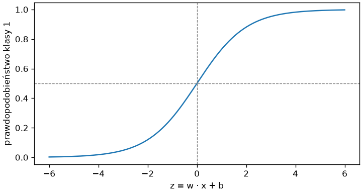
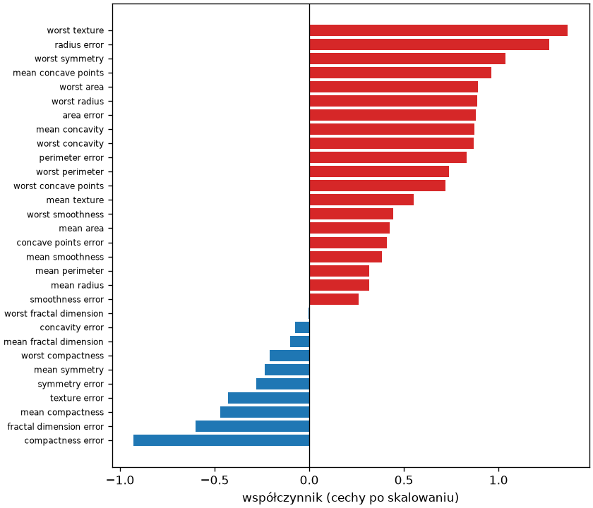
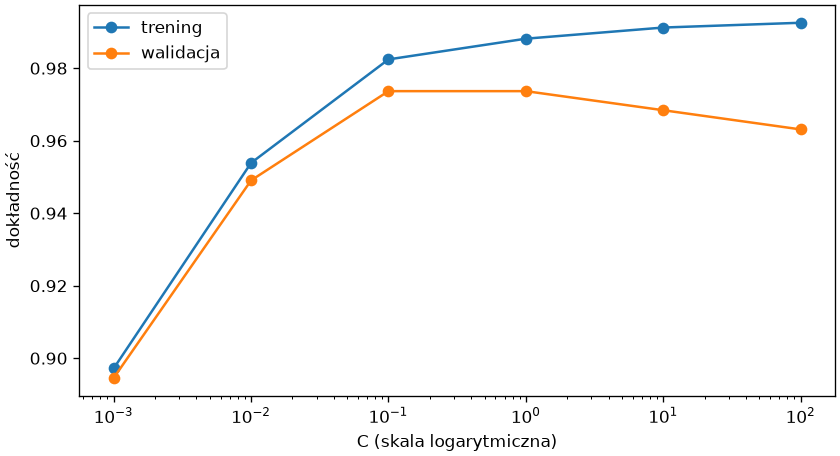
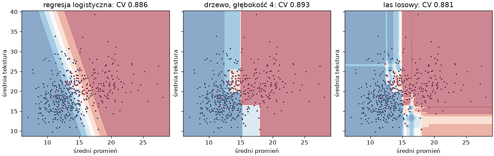

# Regresja logistyczna

Mimo nazwy **regresja logistyczna** (ang. *logistic regression*) jest modelem klasyfikacji — najprostszym, który prawdopodobieństwo modeluje wprost, a nie, jak KNN, udziałem głosów sąsiadów — i pierwszym, po który sięgamy w zadaniach z cechami liczbowymi: uczy się szybko, ma parametry, które da się odczytać, i często wygrywa z modelami znacznie bardziej złożonymi. Ten podrozdział pokazuje, co model liczy, jak czytać jego współczynniki i jak regularyzacja chroni go przed przeuczeniem.

## Model liniowy dla klasyfikacji

```python title="sigmoida.py"
import matplotlib.pyplot as plt
import numpy as np
from sklearn.datasets import load_breast_cancer
from sklearn.linear_model import LogisticRegression
from sklearn.model_selection import train_test_split
from sklearn.pipeline import make_pipeline
from sklearn.preprocessing import StandardScaler

rak = load_breast_cancer(as_frame=True)
X, y = rak.data, (rak.target == 0).astype(int).rename("zlosliwy")
X_trening, X_test, y_trening, y_test = train_test_split(X, y, test_size=0.25, random_state=42, stratify=y)
potok = make_pipeline(StandardScaler(), LogisticRegression(max_iter=1000)).fit(X_trening, y_trening)
model = potok[-1]
print(model.coef_.shape, model.intercept_.round(3))
z = potok.decision_function(X_test.head(4))
recznie = potok[:-1].transform(X_test.head(4)) @ model.coef_[0] + model.intercept_[0]
print(z.round(2), np.allclose(z, recznie))
print((1 / (1 + np.exp(-z))).round(3), potok.predict_proba(X_test.head(4))[:, 1].round(3), potok.predict(X_test.head(4)))

fig, ax = plt.subplots(figsize=(6, 3.2), layout="constrained")
siatka = np.linspace(-6, 6, 200)
ax.plot(siatka, 1 / (1 + np.exp(-siatka)))
ax.axhline(0.5, color="gray", linestyle="--", linewidth=0.8)
ax.axvline(0, color="gray", linestyle="--", linewidth=0.8)
ax.set_xlabel("z = w · x + b")
ax.set_ylabel("prawdopodobieństwo klasy 1")
fig.savefig("sigmoida.png", dpi=120)
```

```{ .text .no-copy }
(1, 30) [-0.256]
[  7.4   -5.54   8.11 -17.67] True
[0.999 0.004 1.    0.   ] [0.999 0.004 1.    0.   ] [1 0 1 0]
```

{ width="520" }

Model liczy **kombinację liniową** cech: `z = w · x + b`, gdzie `w` to trzydzieści współczynników (`coef_`), a `b` wyraz wolny (`intercept_`); `decision_function()` zwraca właśnie `z`, co potwierdza ręczne mnożenie macierzowe z rozdziału 2 na cechach po skalowaniu. **Funkcja logistyczna** (ang. *logistic function*, nazywana też *sigmoid*) `1 / (1 + e^(−z))` przekształca `z` z całej osi liczbowej w prawdopodobieństwo między 0 a 1 — to jest `predict_proba()` — a próg 0,5 odpowiada `z = 0`: granica decyzyjna jest hiperpłaszczyzną, po jednej stronie której model przewiduje klasę 1. Trening szuka `w` i `b`, dla których prawdopodobieństwa przypisane klasom treningowym są najwyższe (**największa wiarygodność**, ang. *maximum likelihood*); rozwiązanie znajduje iteracyjnie, stąd `max_iter`, które dla nieskalowanych cech bywa niewystarczające — kolejny powód, by skalować.

## Współczynniki i iloraz szans

```python title="wspolczynniki.py"
import matplotlib.pyplot as plt
import numpy as np
import pandas as pd
from sklearn.datasets import load_breast_cancer
from sklearn.linear_model import LogisticRegression
from sklearn.model_selection import train_test_split
from sklearn.pipeline import make_pipeline
from sklearn.preprocessing import StandardScaler

rak = load_breast_cancer(as_frame=True)
X, y = rak.data, (rak.target == 0).astype(int).rename("zlosliwy")
X_trening, X_test, y_trening, y_test = train_test_split(X, y, test_size=0.25, random_state=42, stratify=y)
potok = make_pipeline(StandardScaler(), LogisticRegression(max_iter=1000)).fit(X_trening, y_trening)
wspolczynniki = pd.Series(potok[-1].coef_[0], index=X.columns).sort_values()
print(wspolczynniki.head(3).round(2).to_dict())
print(wspolczynniki.tail(3).round(2).to_dict())
print(np.exp(wspolczynniki.tail(2)).round(2).to_dict())
print(X[["mean radius", "worst radius", "worst perimeter", "worst area"]].corr().round(2))

fig, ax = plt.subplots(figsize=(7, 6), layout="constrained")
kolory = np.where(wspolczynniki > 0, "tab:red", "tab:blue")
ax.barh(wspolczynniki.index, wspolczynniki, color=kolory)
ax.axvline(0, color="black", linewidth=0.8)
ax.set_xlabel("współczynnik (cechy po skalowaniu)")
ax.tick_params(axis="y", labelsize=7)
fig.savefig("wspolczynniki.png", dpi=120)
```

```{ .text .no-copy }
{'compactness error': -0.93, 'fractal dimension error': -0.6, 'mean compactness': -0.47}
{'worst symmetry': 1.04, 'radius error': 1.27, 'worst texture': 1.37}
{'radius error': 3.55, 'worst texture': 3.92}
                 mean radius  worst radius  worst perimeter  worst area
mean radius             1.00          0.97             0.97        0.94
worst radius            0.97          1.00             0.99        0.98
worst perimeter         0.97          0.99             1.00        0.98
worst area              0.94          0.98             0.98        1.00
```

{ width="640" }

Znak współczynnika mówi, w którą stronę cecha przesuwa decyzję: dodatni — w stronę klasy pozytywnej (złośliwy), ujemny — w stronę negatywnej; wielkość, przy cechach po skalowaniu, mówi, jak silnie. Współczynnik jest logarytmem ilorazu szans; po nałożeniu funkcji wykładniczej (`np.exp`) otrzymujemy **iloraz szans** (ang. *odds ratio*): `exp(1,37) ≈ 3,9` oznacza, że wzrost największej tekstury o jedno odchylenie standardowe niemal czterokrotnie zwiększa szanse na diagnozę złośliwości, gdy inne cechy się nie zmieniają. Zastrzeżenie jest istotne: cechy tego zbioru są silnie skorelowane (promień, obwód i pole opisują niemal to samo — korelacje 0,94–0,99), a wtedy współczynniki dzielą wpływ między siebie w sposób, który zależy od próbki — pojedynczy współczynnik nie jest miarą ważności cechy, a jego znak może być mylący. Ważność mierzymy inaczej, o czym w ostatnim podrozdziale.

## Regularyzacja — parametr `C`

```python title="regularyzacja.py"
import matplotlib.pyplot as plt
import numpy as np
from sklearn.datasets import load_breast_cancer
from sklearn.linear_model import LogisticRegression
from sklearn.model_selection import StratifiedKFold, train_test_split, validation_curve
from sklearn.pipeline import make_pipeline
from sklearn.preprocessing import StandardScaler

rak = load_breast_cancer(as_frame=True)
X, y = rak.data, (rak.target == 0).astype(int).rename("zlosliwy")
wartosci_C = [0.001, 0.01, 0.1, 1, 10, 100]
podzialy = StratifiedKFold(n_splits=5, shuffle=True, random_state=42)
trening, walidacja = validation_curve(make_pipeline(StandardScaler(), LogisticRegression(max_iter=5000)), X, y, param_name="logisticregression__C", param_range=wartosci_C, cv=podzialy)
print(trening.mean(axis=1).round(3))
print(walidacja.mean(axis=1).round(3))
X_trening, X_test, y_trening, y_test = train_test_split(X, y, test_size=0.25, random_state=42, stratify=y)
for C in (0.01, 1, 100):
    model = make_pipeline(StandardScaler(), LogisticRegression(C=C, max_iter=5000)).fit(X_trening, y_trening)
    print(f"C = {C:<5} średni |współczynnik| {np.abs(model[-1].coef_).mean():.2f}, największy {np.abs(model[-1].coef_).max():.2f}")

fig, ax = plt.subplots(figsize=(7, 3.8), layout="constrained")
ax.plot(wartosci_C, trening.mean(axis=1), marker="o", label="trening")
ax.plot(wartosci_C, walidacja.mean(axis=1), marker="o", label="walidacja")
ax.set_xscale("log")
ax.set_xlabel("C (skala logarytmiczna)")
ax.set_ylabel("dokładność")
ax.legend()
fig.savefig("regularyzacja.png", dpi=120)
```

```{ .text .no-copy }
[0.897 0.954 0.982 0.988 0.991 0.993]
[0.895 0.949 0.974 0.974 0.968 0.963]
C = 0.01  średni |współczynnik| 0.13, największy 0.24
C = 1     średni |współczynnik| 0.59, największy 1.37
C = 100   średni |współczynnik| 3.60, największy 9.43
```

{ width="640" }

Trzydzieści współczynników dopasowanych do 426 próbek może zapamiętać szum; **regularyzacja** (ang. *regularization*) dodaje do celu treningu karę za duże współczynniki, więc preferowane są rozwiązania prostsze. W scikit-learn siłę kary ustawia `C` — **odwrotność** siły regularyzacji: małe `C` to mocna kara i małe współczynniki (niedouczenie przy 0,001), duże `C` to słaba kara i współczynniki rosnące bez ograniczeń (przeuczenie przy 100); wydruk pokazuje, jak średnia wielkość współczynników rośnie z `C` kilkadziesiąt razy. Domyślne `C = 1` jest tu blisko optimum, ale dla każdego zbioru dobieramy je krzywą walidacji z rozdziału 7 lub `GridSearchCV`. Regularyzacja działa poprawnie tylko na cechach o porównywalnej skali — bez `StandardScaler` kara najsilniej ograniczałaby cechy o małych wartościach liczbowych, które potrzebują dużych współczynników.

## Wiele klas

```python title="wiele-klas.py"
from sklearn.datasets import load_wine
from sklearn.linear_model import LogisticRegression
from sklearn.model_selection import train_test_split
from sklearn.pipeline import make_pipeline
from sklearn.preprocessing import StandardScaler

wine = load_wine(as_frame=True)
X_trening, X_test, y_trening, y_test = train_test_split(wine.data, wine.target, test_size=0.25, random_state=42, stratify=wine.target)
potok = make_pipeline(StandardScaler(), LogisticRegression(max_iter=1000)).fit(X_trening, y_trening)
print(potok[-1].coef_.shape, potok[-1].classes_, round(potok.score(X_test, y_test), 3))
print(potok.predict_proba(X_test.head(3)).round(3), potok.predict_proba(X_test.head(3)).sum(axis=1))
print(potok.predict(X_test.head(3)))
```

```{ .text .no-copy }
(3, 13) [0 1 2] 1.0
[[0.926 0.072 0.002]
 [0.004 0.996 0.   ]
 [0.999 0.    0.   ]] [1. 1. 1.]
[0 1 0]
```

Dla trzech klas model ma trzy zestawy współczynników — po jednym na klasę, kształt `(3, 13)` — i liczy trzy wartości `z`, które **funkcja softmax** zamienia w trzy prawdopodobieństwa sumujące się do 1; predykcją jest klasa o największym. Interfejs nie zmienia się w porównaniu z dwiema klasami: te same `fit()`, `predict()`, `predict_proba()`, ta sama regularyzacja. Na winach model bezbłędnie klasyfikuje zbiór testowy — cechy chemiczne rozdzielają odmiany liniowo, po skalowaniu.

## Kiedy model liniowy wystarcza

```python title="granica-liniowa.py"
import matplotlib.pyplot as plt
from sklearn.datasets import load_breast_cancer
from sklearn.ensemble import RandomForestClassifier
from sklearn.inspection import DecisionBoundaryDisplay
from sklearn.linear_model import LogisticRegression
from sklearn.model_selection import cross_val_score
from sklearn.pipeline import make_pipeline
from sklearn.preprocessing import StandardScaler
from sklearn.tree import DecisionTreeClassifier

rak = load_breast_cancer(as_frame=True)
X2 = rak.data[["mean radius", "mean texture"]]
y = (rak.target == 0).astype(int).rename("zlosliwy")
modele = {"regresja logistyczna": make_pipeline(StandardScaler(), LogisticRegression()), "drzewo, głębokość 4": DecisionTreeClassifier(max_depth=4, random_state=42), "las losowy": RandomForestClassifier(n_estimators=100, random_state=42)}
fig, osie = plt.subplots(1, 3, figsize=(12, 3.8), layout="constrained", sharey=True)
for ax, (nazwa, model) in zip(osie, modele.items()):
    model.fit(X2, y)
    DecisionBoundaryDisplay.from_estimator(model, X2, ax=ax, response_method="predict_proba", cmap="RdBu_r", alpha=0.5, xlabel="średni promień", ylabel="średnia tekstura")
    ax.scatter(X2.iloc[:, 0], X2.iloc[:, 1], c=y, cmap="RdBu_r", s=8, edgecolor="white", linewidth=0.3)
    ax.set_title(f"{nazwa}: CV {cross_val_score(model, X2, y, cv=5).mean():.3f}")
    print(nazwa, round(model.score(X2, y), 3))
fig.savefig("granica-liniowa.png", dpi=120)
```

```{ .text .no-copy }
regresja logistyczna 0.891
drzewo, głębokość 4 0.926
las losowy 1.0
```

{ width="900" }

Na dwóch cechach widać, czym różnią się rodziny modeli: regresja logistyczna dzieli płaszczyznę prostą (w wielu wymiarach — hiperpłaszczyzną), drzewo prostokątami równoległymi do osi, las losowy — drobniejszą mozaiką prostokątów o łagodniejszych przejściach prawdopodobieństwa, która na treningu odtwarza każdy punkt. Dokładność w walidacji krzyżowej jest zbliżona: gdy klasy da się rozdzielić w przybliżeniu liniowo, model liniowy wystarcza i wygrywa prostotą; gdy granica jest zakrzywiona lub cechy współdziałają (klasa zależy na przykład od iloczynu cech, nie od ważonej sumy), potrzebne są drzewa i lasy z następnego podrozdziału albo cechy przekształcone — o czym przy przygotowaniu danych w rozdziale 9. <!-- TODO: link po powstaniu rozdziału o regresji i przygotowaniu danych -->
