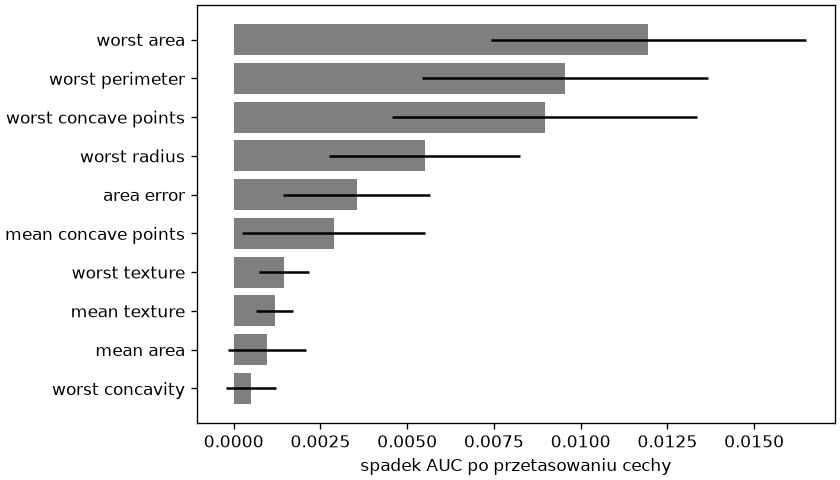

# Wybór modelu i interpretacja

Dwie rodziny modeli i KNN z rozdziału 7, kilka miar, próg do ustalenia — wybór wymaga porządku. Ten podrozdział porównuje modele wieloma miarami naraz, mierzy ważność cech sposobem niezależnym od modelu, ogląda błędy próbka po próbce, ustala próg według kosztu pomyłki na zbiorze treningowym i zapisuje model końcowy z metadanymi.

## Porównanie modeli

```python title="porownanie.py"
import pandas as pd
from sklearn.datasets import load_breast_cancer
from sklearn.dummy import DummyClassifier
from sklearn.ensemble import HistGradientBoostingClassifier, RandomForestClassifier
from sklearn.linear_model import LogisticRegression
from sklearn.metrics import f1_score, make_scorer, precision_score
from sklearn.model_selection import StratifiedKFold, cross_validate, train_test_split
from sklearn.neighbors import KNeighborsClassifier
from sklearn.pipeline import make_pipeline
from sklearn.preprocessing import StandardScaler
from sklearn.tree import DecisionTreeClassifier

rak = load_breast_cancer(as_frame=True)
X, y = rak.data, (rak.target == 0).astype(int).rename("zlosliwy")
X_trening, X_test, y_trening, y_test = train_test_split(X, y, test_size=0.25, random_state=42, stratify=y)
modele = {
    "bazowy": DummyClassifier(strategy="most_frequent"),
    "KNN": make_pipeline(StandardScaler(), KNeighborsClassifier(n_neighbors=5)),
    "regresja logistyczna": make_pipeline(StandardScaler(), LogisticRegression(max_iter=1000)),
    "drzewo": DecisionTreeClassifier(max_depth=3, random_state=42),
    "las losowy": RandomForestClassifier(n_estimators=300, random_state=42, n_jobs=-1),
    "wzmacnianie": HistGradientBoostingClassifier(random_state=42),
}
podzialy = StratifiedKFold(n_splits=5, shuffle=True, random_state=42)
miary = {"accuracy": "accuracy", "recall": "recall", "precision": make_scorer(precision_score, zero_division=0), "f1": make_scorer(f1_score, zero_division=0), "roc_auc": "roc_auc"}
wiersze = []
for nazwa, model in modele.items():
    wyniki = cross_validate(model, X_trening, y_trening, cv=podzialy, scoring=miary)
    wiersze.append({"model": nazwa, **{miara: round(wyniki["test_" + miara].mean(), 3) for miara in miary}})
tabela = pd.DataFrame(wiersze).set_index("model")
print(tabela.to_string())
```

```{ .text .no-copy }
                      accuracy  recall  precision     f1  roc_auc
model                                                            
bazowy                   0.627   0.000      0.000  0.000    0.500
KNN                      0.958   0.899      0.986  0.941    0.983
regresja logistyczna     0.972   0.944      0.981  0.961    0.991
drzewo                   0.930   0.893      0.919  0.905    0.931
las losowy               0.962   0.937      0.962  0.949    0.988
wzmacnianie              0.962   0.931      0.970  0.949    0.991
```

`cross_validate()` ze słownikiem miar daje jeden przebieg walidacji na model i tabelę do porównania: tu regresja logistyczna prowadzi w dokładności, czułości, F1 i AUC (KNN ma nieco wyższą precyzję), wzmacnianie gradientowe, las i KNN są blisko, drzewo wyraźnie niżej, a model bazowy pokazuje poziom odniesienia (AUC 0,5). Różnice rzędu setnych mieszczą się w odchyleniu między częściami, więc rozstrzyga nie sama liczba, lecz reguła z rozdziału 7: model najprostszy spośród tych, których nie da się odróżnić od najlepszego — tu regresja logistyczna, która ma też czytelne współczynniki. Walidacja obejmuje tylko zbiór treningowy z tego samego podziału, co w poprzednich podrozdziałach — tabela to wynik walidacji, a ocena końcowa wybranego modelu należy do odłożonego zbioru testowego.

## Ważność permutacyjna

```python title="permutacja.py"
import matplotlib.pyplot as plt
import pandas as pd
from sklearn.datasets import load_breast_cancer
from sklearn.ensemble import RandomForestClassifier
from sklearn.inspection import permutation_importance
from sklearn.metrics import roc_auc_score
from sklearn.model_selection import train_test_split

rak = load_breast_cancer(as_frame=True)
X, y = rak.data, (rak.target == 0).astype(int).rename("zlosliwy")
X_trening, X_test, y_trening, y_test = train_test_split(X, y, test_size=0.25, random_state=42, stratify=y)
las = RandomForestClassifier(n_estimators=300, random_state=42, n_jobs=-1).fit(X_trening, y_trening)
wynik = permutation_importance(las, X_test, y_test, scoring="roc_auc", n_repeats=30, random_state=42, n_jobs=-1)
waznosc = pd.DataFrame({"srednia": wynik.importances_mean, "odchylenie": wynik.importances_std}, index=X.columns).sort_values("srednia", ascending=False)
print(waznosc.head(6).round(4))
print((waznosc["srednia"] > 0.001).sum())

grupa = ["mean radius", "mean perimeter", "mean area", "worst radius", "worst perimeter", "worst area"]
X_test_grupa = X_test.copy()
X_test_grupa[grupa] = X_test_grupa[grupa].sample(frac=1, random_state=42).to_numpy()
print(round(roc_auc_score(y_test, las.predict_proba(X_test)[:, 1]), 4), round(roc_auc_score(y_test, las.predict_proba(X_test_grupa)[:, 1]), 4))

fig, ax = plt.subplots(figsize=(7, 4), layout="constrained")
najwazniejsze = waznosc.head(10).iloc[::-1]
ax.barh(najwazniejsze.index, najwazniejsze["srednia"], xerr=najwazniejsze["odchylenie"], color="tab:gray")
ax.set_xlabel("spadek AUC po przetasowaniu cechy")
fig.savefig("permutacja.png", dpi=120)
```

```{ .text .no-copy }
                      srednia  odchylenie
worst area             0.0120      0.0045
worst perimeter        0.0095      0.0041
worst concave points   0.0090      0.0044
worst radius           0.0055      0.0028
area error             0.0035      0.0021
mean concave points    0.0029      0.0027
8
0.9957 0.8594
```

{ width="640" }

**Ważność permutacyjna** (ang. *permutation importance*) mierzy, o ile pogarsza się wynik modelu na zbiorze testowym, gdy wartości jednej cechy przetasujemy między próbkami — cecha, bez której model nie może się obejść, obniża miarę wyraźnie, cecha zbędna nie zmienia nic. Działa dla każdego modelu i mierzy wpływ na rzeczywistą jakość, nie na strukturę drzewa; `n_repeats` powtarza tasowanie, a odchylenie pokazuje, czy różnica jest rzeczywista; tylko osiem z trzydziestu cech obniża AUC o więcej niż 0,001. Wynik na tych danych jest pouczający: żadna pojedyncza cecha nie jest niezbędna, bo każda ma zamienniki — dopiero przetasowanie całej grupy cech rozmiaru (promień, obwód, pole) obniża AUC wyraźnie. Przy cechach skorelowanych ważność liczymy dla grup albo najpierw redukujemy cechy do nieskorelowanych składowych — [PCA w potoku](../10-bez-nadzoru/redukcja-wymiaru.md#pca-w-potoku-cechy-skorelowane) w rozdziale 10.

## Analiza błędów

```python title="bledy.py"
import numpy as np
import pandas as pd
from sklearn.datasets import load_breast_cancer
from sklearn.linear_model import LogisticRegression
from sklearn.model_selection import StratifiedKFold, cross_val_predict, train_test_split
from sklearn.pipeline import make_pipeline
from sklearn.preprocessing import StandardScaler

rak = load_breast_cancer(as_frame=True)
X, y = rak.data, (rak.target == 0).astype(int).rename("zlosliwy")
X_trening, X_test, y_trening, y_test = train_test_split(X, y, test_size=0.25, random_state=42, stratify=y)
podzialy = StratifiedKFold(n_splits=5, shuffle=True, random_state=42)
model = make_pipeline(StandardScaler(), LogisticRegression(max_iter=1000))
prawdopodobienstwo = cross_val_predict(model, X_trening, y_trening, cv=podzialy, method="predict_proba")[:, 1]
przewidziane = (prawdopodobienstwo >= 0.5).astype(int)
bledne = pd.DataFrame({"prawdziwa": y_trening, "p_zlosliwy": prawdopodobienstwo.round(3)})[przewidziane != y_trening]
print(len(bledne), len(y_trening), bledne["prawdziwa"].value_counts().to_dict())
print(bledne.sort_values("p_zlosliwy"))
niepewne = np.abs(prawdopodobienstwo - 0.5) < 0.2
print(niepewne.sum(), round((przewidziane[niepewne] != y_trening[niepewne]).mean(), 2), round((przewidziane[~niepewne] != y_trening[~niepewne]).mean(), 3))
przeoczone = bledne.index[bledne["prawdziwa"] == 1]
print(X.loc[przeoczone, "worst radius"].round(2).tolist(), round(X.loc[y == 1, "worst radius"].median(), 2))
```

```{ .text .no-copy }
12 426 {1: 9, 0: 3}
     prawdziwa  p_zlosliwy
297          1       0.002
213          1       0.002
40           1       0.094
135          1       0.098
263          1       0.314
146          1       0.326
255          1       0.360
13           1       0.425
197          1       0.492
68           0       0.549
413          0       0.553
238          0       0.661
18 0.44 0.01
[16.39, 14.49, 16.84, 13.74, 13.36, 19.76, 15.93, 18.07, 17.91] 20.59
```

`cross_val_predict()` zwraca predykcję dla **każdej** próbki zbioru treningowego z tego przebiegu walidacji, w którym była w części walidacyjnej — więc błędy z całych 426 próbek treningowych, bez zaglądania do zbioru testowego. Dwanaście pomyłek — dziewięć przeoczeń i trzy fałszywe alarmy — ma prawdopodobieństwa, które pokazują, że większość błędów model popełnia niepewnie, blisko progu: wśród osiemnastu próbek o prawdopodobieństwie między 0,3 a 0,7 myli się w 44% przypadków, poza tym przedziałem w 1%. To użyteczna informacja: przypadki niepewne można kierować do dodatkowego badania zamiast rozstrzygać automatycznie. Oględziny przeoczonych guzów — wszystkie dziewięć ma największy promień poniżej mediany klasy złośliwej (20,59) — podpowiadają, jakich przykładów brakuje w treningu.

## Próg według kosztu błędu

```python title="koszt.py"
import numpy as np
from sklearn.datasets import load_breast_cancer
from sklearn.linear_model import LogisticRegression
from sklearn.metrics import confusion_matrix
from sklearn.model_selection import StratifiedKFold, cross_val_predict, train_test_split
from sklearn.pipeline import make_pipeline
from sklearn.preprocessing import StandardScaler

rak = load_breast_cancer(as_frame=True)
X, y = rak.data, (rak.target == 0).astype(int).rename("zlosliwy")
X_trening, X_test, y_trening, y_test = train_test_split(X, y, test_size=0.25, random_state=42, stratify=y)
podzialy = StratifiedKFold(n_splits=5, shuffle=True, random_state=42)
prawdopodobienstwo = cross_val_predict(make_pipeline(StandardScaler(), LogisticRegression(max_iter=1000)), X_trening, y_trening, cv=podzialy, method="predict_proba")[:, 1]
KOSZT_PRZEOCZENIA, KOSZT_ALARMU = 10, 1
progi = np.arange(0.05, 0.96, 0.05)
koszty = []
for prog in progi:
    tn, fp, fn, tp = confusion_matrix(y_trening, (prawdopodobienstwo >= prog).astype(int)).ravel()
    koszty.append(fn * KOSZT_PRZEOCZENIA + fp * KOSZT_ALARMU)
najlepszy = progi[np.argmin(koszty)]
for prog, koszt in zip(progi, koszty):
    if round(prog, 2) in (0.05, 0.2, round(najlepszy, 2), 0.5, 0.8):
        tn, fp, fn, tp = confusion_matrix(y_trening, (prawdopodobienstwo >= prog).astype(int)).ravel()
        print(f"próg {prog:.2f}: przeoczenia {fn:>2}, alarmy {fp:>2}, koszt {koszt:>3}")
print("najlepszy próg:", round(najlepszy, 2))
```

```{ .text .no-copy }
próg 0.05: przeoczenia  2, alarmy 43, koszt  63
próg 0.20: przeoczenia  4, alarmy 13, koszt  53
próg 0.30: przeoczenia  4, alarmy  8, koszt  48
próg 0.50: przeoczenia  9, alarmy  3, koszt  93
próg 0.80: przeoczenia 15, alarmy  0, koszt 150
najlepszy próg: 0.3
```

Próg 0,5 odpowiada równym kosztom obu rodzajów błędów (dla dobrze skalibrowanego modelu minimalizuje ich oczekiwaną liczbę); gdy przeoczenie guza złośliwego kosztuje dziesięć razy więcej niż niepotrzebne badanie, minimum kosztu przesuwa się do progu 0,3, który zmniejsza liczbę przeoczeń z dziewięciu do czterech za cenę ośmiu alarmów zamiast trzech. Koszty ustalamy z odbiorcą — są decyzją merytoryczną, jak progi czyszczenia w rozdziale 6 — a próg dobieramy na predykcjach z walidacji krzyżowej na zbiorze treningowym, nie na testowym, bo jest hiperparametrem jak każdy inny. W kodzie produkcyjnym próg zapisujemy obok modelu i stosujemy przez `predict_proba()`, a nie przez `predict()`, które go nie zna; scikit-learn ma też gotowe opakowania z modułu `model_selection` — `FixedThresholdClassifier`, którego `predict()` stosuje zadany próg, i `TunedThresholdClassifierCV`, który dobiera próg walidacją krzyżową pod wskazaną miarę, jak pętla powyżej.

## Model końcowy

```python title="model-koncowy.py"
from pathlib import Path

import joblib
import pandas as pd
import sklearn
from sklearn.datasets import load_breast_cancer
from sklearn.linear_model import LogisticRegression
from sklearn.metrics import precision_score, recall_score
from sklearn.model_selection import train_test_split
from sklearn.pipeline import make_pipeline
from sklearn.preprocessing import StandardScaler

rak = load_breast_cancer(as_frame=True)
X, y = rak.data, (rak.target == 0).astype(int).rename("zlosliwy")
X_trening, X_test, y_trening, y_test = train_test_split(X, y, test_size=0.25, random_state=42, stratify=y)
model = make_pipeline(StandardScaler(), LogisticRegression(max_iter=1000)).fit(X_trening, y_trening)
PROG = 0.3
decyzja = (model.predict_proba(X_test)[:, 1] >= PROG).astype(int)
print("test: czułość", round(recall_score(y_test, decyzja), 3), "precyzja", round(precision_score(y_test, decyzja), 3))

koncowy = make_pipeline(StandardScaler(), LogisticRegression(max_iter=1000)).fit(X, y)
joblib.dump({"model": koncowy, "prog": PROG, "klasa_pozytywna": "złośliwy", "cechy": list(X.columns), "wersja_sklearn": sklearn.__version__}, "model-nowotwor.joblib")
paczka = joblib.load("model-nowotwor.joblib")
nowa = pd.DataFrame([X.iloc[0]], columns=paczka["cechy"])
print(Path("model-nowotwor.joblib").stat().st_size // 1000, "kB", paczka["prog"], paczka["model"].predict_proba(nowa)[:, 1].round(3) >= paczka["prog"])
```

```{ .text .no-copy }
test: czułość 0.962 precyzja 0.981
3 kB 0.3 [ True]
```

Model końcowy powstaje w trzech krokach: wybór modelu i progu na walidacji krzyżowej, jednorazowa ocena na zbiorze testowym z tym progiem — to liczba, którą podajemy odbiorcy — i trening na wszystkich danych, bo więcej próbek daje lepsze parametry, a oceny już nie zmienimy. Zapis z rozdziału 7 rozszerzamy o próg, nazwę klasy pozytywnej i listę cech w kolejności treningu — wszystko, czego program używający modelu potrzebuje, by nie zgadywać. Predykcja w tym programie to `predict_proba()` porównane z zapisanym progiem.

## Lista kontrolna klasyfikacji

- **Klasa pozytywna i miara** wybrane przed treningiem: co wykrywamy i który błąd kosztuje więcej; dokładność tylko przy równych klasach i kosztach, przy klasach nierównolicznych dokładność zrównoważona lub `class_weight`.
- **Model bazowy** w tabeli porównania — każdy model musi go wyraźnie pokonać.
- **Potok ze skalowaniem** dla KNN i regresji logistycznej; drzewa i lasy bez skalowania.
- **Walidacja krzyżowa ze stratyfikacją** do porównań i doboru hiperparametrów; zbiór testowy użyty raz, na końcu.
- **Złożoność pod kontrolą**: `C`, `max_depth` lub `min_samples_leaf` dobrane krzywą walidacji.
- **Próg** dobrany do kosztu błędów na predykcjach z walidacji i zapisany obok modelu wraz z listą cech i wersją biblioteki.
- **Interpretacja**: współczynniki regresji logistycznej ze świadomością korelacji cech, ważność permutacyjna dla grup cech, analiza błędów i próbek niepewnych.

## Dalej: regresja

Następny rozdział przenosi ten sam warsztat na przewidywanie liczb — regresję liniową i jej regularyzowane odmiany, drzewa i lasy w wersji regresyjnej, miary błędu — oraz uzupełnia go o przygotowanie danych, którego zbiory wbudowane nie wymagały: kodowanie cech tekstowych, uzupełnianie braków i `ColumnTransformer`, który łączy różne przekształcenia kolumn w jeden potok — [rozdział o regresji i przygotowaniu danych](../09-regresja/index.md).
