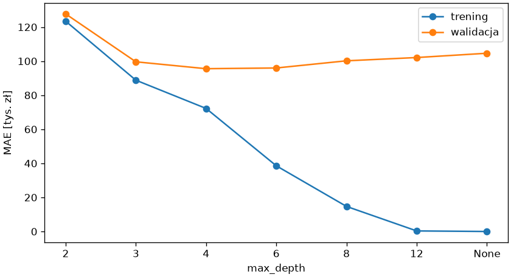
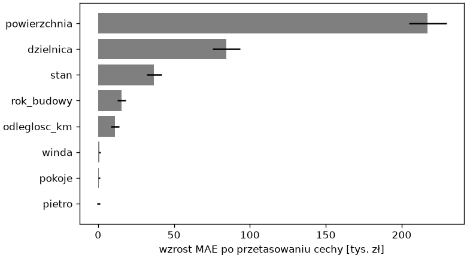

# Modele nieliniowe i wybór

Drzewa i lasy z rozdziału 8 mają odpowiedniki regresyjne: liść przechowuje średnią cen zamiast udziału klas, a podziały minimalizują rozrzut cen w węzłach potomnych zamiast nieczystości. Nie wymagają skalowania ani cech wielomianowych — nieliniowość i współdziałanie cech odkrywają same — a wzmacnianie gradientowe obsługuje braki i kategorie bez imputacji i kodowania. Ten podrozdział porównuje je z modelami liniowymi i domyka rozdział modelem końcowym.

## Drzewo regresji

```python title="drzewo.py"
import matplotlib.pyplot as plt
import pandas as pd
from sklearn.compose import ColumnTransformer
from sklearn.impute import SimpleImputer
from sklearn.model_selection import KFold, cross_validate, train_test_split
from sklearn.pipeline import Pipeline, make_pipeline
from sklearn.preprocessing import OneHotEncoder, OrdinalEncoder
from sklearn.tree import DecisionTreeRegressor, export_text

mieszkania = pd.read_csv("mieszkania.csv")
X, y = mieszkania.drop(columns="cena"), mieszkania["cena"]
X_trening, X_test, y_trening, y_test = train_test_split(X, y, test_size=0.25, random_state=42)
liczbowe = ["powierzchnia", "pokoje", "pietro", "rok_budowy", "odleglosc_km", "winda"]
przygotowanie = ColumnTransformer([
    ("liczbowe", SimpleImputer(strategy="median", add_indicator=True), liczbowe),
    ("stan", make_pipeline(SimpleImputer(strategy="most_frequent"), OrdinalEncoder(categories=[["do remontu", "dobry", "po remoncie"]])), ["stan"]),
    ("dzielnica", OneHotEncoder(handle_unknown="ignore", sparse_output=False), ["dzielnica"]),
], verbose_feature_names_out=False)
drzewo = Pipeline([("przygotowanie", przygotowanie), ("model", DecisionTreeRegressor(max_depth=2, random_state=42))]).fit(X_trening, y_trening)
print(export_text(drzewo[-1], feature_names=list(drzewo[:-1].get_feature_names_out()), decimals=0))
podzialy = KFold(n_splits=5, shuffle=True, random_state=42)
glebokosci = [2, 3, 4, 6, 8, 12, None]
wyniki_tr, wyniki_wal = [], []
for glebokosc in glebokosci:
    wyniki = cross_validate(Pipeline([("przygotowanie", przygotowanie), ("model", DecisionTreeRegressor(max_depth=glebokosc, random_state=42))]), X_trening, y_trening, cv=podzialy, scoring="neg_mean_absolute_error", return_train_score=True)
    wyniki_tr.append(-wyniki["train_score"].mean())
    wyniki_wal.append(-wyniki["test_score"].mean())
    print(f"max_depth={str(glebokosc):<5} MAE trening {wyniki_tr[-1]:>7.0f}  walidacja {wyniki_wal[-1]:>7.0f}")

fig, ax = plt.subplots(figsize=(7, 3.8), layout="constrained")
etykiety = [str(g) for g in glebokosci]
ax.plot(etykiety, [w / 1000 for w in wyniki_tr], marker="o", label="trening")
ax.plot(etykiety, [w / 1000 for w in wyniki_wal], marker="o", label="walidacja")
ax.set_xlabel("max_depth")
ax.set_ylabel("MAE [tys. zł]")
ax.legend()
fig.savefig("drzewo.png", dpi=120)
```

```{ .text .no-copy }
|--- powierzchnia <= 53
|   |--- odleglosc_km <= 5
|   |   |--- value: [550719]
|   |--- odleglosc_km >  5
|   |   |--- value: [344897]
|--- powierzchnia >  53
|   |--- powierzchnia <= 78
|   |   |--- value: [767641]
|   |--- powierzchnia >  78
|   |   |--- value: [1118576]

max_depth=2     MAE trening  123438  walidacja  127712
max_depth=3     MAE trening   88808  walidacja   99601
max_depth=4     MAE trening   72234  walidacja   95559
max_depth=6     MAE trening   38570  walidacja   95975
max_depth=8     MAE trening   14721  walidacja  100191
max_depth=12    MAE trening     333  walidacja  102107
max_depth=None  MAE trening      -0  walidacja  104627
```

{ width="640" }

Drzewo regresji o dwóch poziomach dzieli mieszkania po powierzchni i odległości od centrum na cztery grupy o różnych średnich cenach — `export_text()` pokazuje reguły z `value` w liściach — i to już jest model, choć bardzo uproszczony. Krzywa głębokości wygląda jak w rozdziale 7: głębokie drzewo ma błąd treningowy bliski zera i rosnący błąd walidacyjny (przeuczenie), płytkie niedoucza, optimum leży przy czterech poziomach. Nawet najlepsze drzewo wypada gorzej niż model liniowy (96 wobec 69 tysięcy), bo cena rośnie z powierzchnią gładko, a drzewo aproksymuje ją schodkami — ale nie potrzebowało skalowania ani `drop="first"`; imputację zostawiamy w potoku dla spójności z innymi modelami, choć drzewa scikit-learn przyjmują też `NaN` bezpośrednio.

## Las i wzmacnianie gradientowe

```python title="zespoly.py"
import numpy as np
import pandas as pd
from sklearn.compose import ColumnTransformer, TransformedTargetRegressor
from sklearn.ensemble import HistGradientBoostingRegressor, RandomForestRegressor
from sklearn.impute import SimpleImputer
from sklearn.model_selection import KFold, cross_validate, train_test_split
from sklearn.pipeline import Pipeline, make_pipeline
from sklearn.preprocessing import OneHotEncoder, OrdinalEncoder

mieszkania = pd.read_csv("mieszkania.csv")
X, y = mieszkania.drop(columns="cena"), mieszkania["cena"]
X_trening, X_test, y_trening, y_test = train_test_split(X, y, test_size=0.25, random_state=42)
liczbowe = ["powierzchnia", "pokoje", "pietro", "rok_budowy", "odleglosc_km", "winda"]
przygotowanie = ColumnTransformer([
    ("liczbowe", SimpleImputer(strategy="median", add_indicator=True), liczbowe),
    ("stan", make_pipeline(SimpleImputer(strategy="most_frequent"), OrdinalEncoder(categories=[["do remontu", "dobry", "po remoncie"]])), ["stan"]),
    ("dzielnica", OneHotEncoder(handle_unknown="ignore", sparse_output=False), ["dzielnica"]),
], verbose_feature_names_out=False)
podzialy = KFold(n_splits=5, shuffle=True, random_state=42)
las = Pipeline([("przygotowanie", przygotowanie), ("model", RandomForestRegressor(n_estimators=300, random_state=42, n_jobs=-1))])
wzmacnianie = Pipeline([("przygotowanie", przygotowanie), ("model", HistGradientBoostingRegressor(random_state=42))])
X_kategorie = X_trening.assign(dzielnica=X_trening["dzielnica"].astype("category"), stan=X_trening["stan"].astype("category"))
natywne = HistGradientBoostingRegressor(categorical_features="from_dtype", random_state=42)
for nazwa, model, dane in (("las losowy", las, X_trening), ("wzmacnianie", wzmacnianie, X_trening), ("wzmacnianie, log(cena)", TransformedTargetRegressor(wzmacnianie, func=np.log, inverse_func=np.exp), X_trening), ("wzmacnianie natywne", natywne, X_kategorie)):
    wyniki = cross_validate(model, dane, y_trening, cv=podzialy, scoring=["neg_mean_absolute_error", "r2"])
    print(f"{nazwa:<24} MAE {-wyniki['test_neg_mean_absolute_error'].mean():>6.0f}  R² {wyniki['test_r2'].mean():.3f}")
print(X_kategorie.dtypes[["dzielnica", "stan"]].tolist(), X_kategorie["rok_budowy"].isna().sum())
```

```{ .text .no-copy }
las losowy               MAE  72198  R² 0.867
wzmacnianie              MAE  66118  R² 0.885
wzmacnianie, log(cena)   MAE  60793  R² 0.904
wzmacnianie natywne      MAE  65301  R² 0.889
[CategoricalDtype(categories=['Bronowice', 'Centrum', 'Krowodrza', 'Nowa Huta',
                  'Podgórze'],
, ordered=False, categories_dtype=str), CategoricalDtype(categories=['do remontu', 'dobry', 'po remoncie'], ordered=False, categories_dtype=str)] 26
```

Las losowy uśrednia setki drzew i ma wyraźnie mniejszy błąd niż pojedyncze drzewo (72 wobec 96 tysięcy), choć nie dorównuje modelowi liniowemu z dobrze przygotowanymi cechami; **wzmacnianie gradientowe** (`HistGradientBoostingRegressor`) wyprzedza las, a na logarytmie ceny także zwykły model liniowy. Wariant „natywny” dostaje ramkę **bez** transformatora kolumn: przy `categorical_features="from_dtype"` model traktuje kolumny typu `category` z rozdziału 4 jako kategorie bez kodowania zero-jedynkowego, a braki w roku budowy (26 w ostatnim wierszu wyniku) obsługuje wewnętrznie, ucząc się, w którą stronę kierować próbki bez wartości. Wynik jest porównywalny z potokiem, a kodu mniej — dla drzew wzmacnianych kodowanie i imputacja są opcjonalne, dla modeli liniowych i KNN pozostają konieczne.

## Porównanie modeli

```python title="porownanie.py"
import numpy as np
import pandas as pd
from sklearn.compose import ColumnTransformer, TransformedTargetRegressor
from sklearn.dummy import DummyRegressor
from sklearn.ensemble import HistGradientBoostingRegressor, RandomForestRegressor
from sklearn.impute import SimpleImputer
from sklearn.linear_model import Lasso, LinearRegression, Ridge
from sklearn.model_selection import KFold, cross_validate, train_test_split
from sklearn.pipeline import Pipeline, make_pipeline
from sklearn.preprocessing import FunctionTransformer, OneHotEncoder, OrdinalEncoder, PolynomialFeatures, StandardScaler
from sklearn.tree import DecisionTreeRegressor

mieszkania = pd.read_csv("mieszkania.csv")
X, y = mieszkania.drop(columns="cena"), mieszkania["cena"]
X_trening, X_test, y_trening, y_test = train_test_split(X, y, test_size=0.25, random_state=42)
liczbowe = ["powierzchnia", "pokoje", "pietro", "rok_budowy", "odleglosc_km", "winda"]


def przygotowanie(skalowanie, drop, log_powierzchni=False):
    liczbowy = make_pipeline(SimpleImputer(strategy="median", add_indicator=True), StandardScaler()) if skalowanie else SimpleImputer(strategy="median", add_indicator=True)
    logarytm = [("powierzchnia", FunctionTransformer(np.log, feature_names_out="one-to-one"), ["powierzchnia"])] if log_powierzchni else []
    return ColumnTransformer(logarytm + [
        ("liczbowe", liczbowy, liczbowe[1:] if log_powierzchni else liczbowe),
        ("stan", make_pipeline(SimpleImputer(strategy="most_frequent"), OrdinalEncoder(categories=[["do remontu", "dobry", "po remoncie"]])), ["stan"]),
        ("dzielnica", OneHotEncoder(drop=drop, handle_unknown="ignore", sparse_output=False), ["dzielnica"]),
    ], verbose_feature_names_out=False)


liniowe = lambda model: Pipeline([("przygotowanie", przygotowanie(True, "first")), ("model", model)])
wielomianowe = lambda model: Pipeline([("przygotowanie", przygotowanie(True, "first")), ("wielomian", PolynomialFeatures(degree=2, include_bias=False)), ("skalowanie", StandardScaler()), ("model", model)])
drzewiaste = lambda model: Pipeline([("przygotowanie", przygotowanie(False, None)), ("model", model)])
modele = {
    "bazowy": DummyRegressor(),
    "liniowy": liniowe(LinearRegression()),
    "liniowy, logarytmy": TransformedTargetRegressor(Pipeline([("przygotowanie", przygotowanie(True, "first", log_powierzchni=True)), ("model", LinearRegression())]), func=np.log, inverse_func=np.exp),
    "grzbietowy, wielomian": wielomianowe(Ridge(alpha=10)),
    "lasso, wielomian": wielomianowe(Lasso(alpha=3000, max_iter=100000)),
    "drzewo, głębokość 4": drzewiaste(DecisionTreeRegressor(max_depth=4, random_state=42)),
    "las losowy": drzewiaste(RandomForestRegressor(n_estimators=300, random_state=42, n_jobs=-1)),
    "wzmacnianie, log(cena)": TransformedTargetRegressor(drzewiaste(HistGradientBoostingRegressor(random_state=42)), func=np.log, inverse_func=np.exp),
}
podzialy = KFold(n_splits=5, shuffle=True, random_state=42)
wiersze = []
for nazwa, model in modele.items():
    wyniki = cross_validate(model, X_trening, y_trening, cv=podzialy, scoring=["neg_mean_absolute_error", "neg_root_mean_squared_error", "r2"])
    wiersze.append({"model": nazwa, "MAE": round(-wyniki["test_neg_mean_absolute_error"].mean()), "±": round(wyniki["test_neg_mean_absolute_error"].std()), "RMSE": round(-wyniki["test_neg_root_mean_squared_error"].mean()), "R²": round(wyniki["test_r2"].mean(), 3)})
print(pd.DataFrame(wiersze).set_index("model").to_string())
```

```{ .text .no-copy }
                           MAE      ±    RMSE     R²
model                                               
bazowy                  220127  26905  281160 -0.018
liniowy                  68546   6256   93073  0.889
liniowy, logarytmy       53466   6923   72121  0.933
grzbietowy, wielomian    63656   8349   85281  0.902
lasso, wielomian         56874   4799   77075  0.922
drzewo, głębokość 4      95559   8224  127804  0.788
las losowy               72198   5319  101214  0.867
wzmacnianie, log(cena)   60793   9273   86531  0.904
```

Tabela porządkuje cały rozdział: model bazowy wyznacza skalę, model liniowy z przygotowanymi danymi odzyskuje większość zależności, a najlepiej wypada model liniowy na logarytmach ceny i powierzchni, którego postać odpowiada sposobowi powstania cen. Lasso na cechach wielomianowych i wzmacnianie gradientowe na logarytmie ceny są niewiele gorsze, a pojedyncze drzewo jest najsłabsze. Odchylenie MAE między częściami walidacji (kolumna `±`) jest rzędu kilku tysięcy, więc różnice mniejsze od niego — jak przewaga nad lasso — nie rozstrzygają wyboru. Rozstrzyga prostota: model na logarytmach ma 12 współczynników czytelnych jako procentowe zmiany ceny i nie wymaga doboru hiperparametrów, więc wybieramy go jako model końcowy. Wzmacnianie gradientowe wymaga mniej przygotowania i nie zakłada postaci zależności, co przy danych rzeczywistych bywa ważniejsze.

## Ważność permutacyjna

```python title="waznosc.py"
import matplotlib.pyplot as plt
import numpy as np
import pandas as pd
from sklearn.compose import ColumnTransformer, TransformedTargetRegressor
from sklearn.impute import SimpleImputer
from sklearn.inspection import permutation_importance
from sklearn.linear_model import LinearRegression
from sklearn.model_selection import train_test_split
from sklearn.pipeline import Pipeline, make_pipeline
from sklearn.preprocessing import FunctionTransformer, OneHotEncoder, OrdinalEncoder, StandardScaler

mieszkania = pd.read_csv("mieszkania.csv")
X, y = mieszkania.drop(columns="cena"), mieszkania["cena"]
X_trening, X_test, y_trening, y_test = train_test_split(X, y, test_size=0.25, random_state=42)
pozostale = ["pokoje", "pietro", "rok_budowy", "odleglosc_km", "winda"]
przygotowanie = ColumnTransformer([
    ("powierzchnia", FunctionTransformer(np.log, feature_names_out="one-to-one"), ["powierzchnia"]),
    ("liczbowe", make_pipeline(SimpleImputer(strategy="median", add_indicator=True), StandardScaler()), pozostale),
    ("stan", make_pipeline(SimpleImputer(strategy="most_frequent"), OrdinalEncoder(categories=[["do remontu", "dobry", "po remoncie"]])), ["stan"]),
    ("dzielnica", OneHotEncoder(drop="first", handle_unknown="ignore", sparse_output=False), ["dzielnica"]),
])
model = TransformedTargetRegressor(Pipeline([("przygotowanie", przygotowanie), ("model", LinearRegression())]), func=np.log, inverse_func=np.exp).fit(X_trening, y_trening)
wynik = permutation_importance(model, X_test, y_test, scoring="neg_mean_absolute_error", n_repeats=30, random_state=42, n_jobs=-1)
waznosc = pd.DataFrame({"wzrost_MAE": wynik.importances_mean, "odchylenie": wynik.importances_std}, index=X.columns).sort_values("wzrost_MAE", ascending=False)
print(waznosc.round(0))

fig, ax = plt.subplots(figsize=(6.5, 3.6), layout="constrained")
ax.barh(waznosc.index[::-1], waznosc["wzrost_MAE"][::-1] / 1000, xerr=waznosc["odchylenie"][::-1] / 1000, color="tab:gray")
ax.set_xlabel("wzrost MAE po przetasowaniu cechy [tys. zł]")
fig.savefig("waznosc.png", dpi=120)
```

```{ .text .no-copy }
              wzrost_MAE  odchylenie
powierzchnia    217095.0     12452.0
dzielnica        84540.0      9039.0
stan             36859.0      4942.0
rok_budowy       15449.0      2719.0
odleglosc_km     11053.0      2721.0
winda             1061.0       693.0
pokoje             623.0       612.0
pietro             185.0       929.0
```

{ width="600" }

Ważność permutacyjna z rozdziału 8 działa tak samo dla regresji — miarą jest wzrost MAE po przetasowaniu cechy — i liczymy ją na **oryginalnych kolumnach** ramki, bo cały potok z przygotowaniem jest modelem: przetasowanie kolumny `dzielnica` zmienia naraz wszystkie utworzone z niej kolumny zero-jedynkowe, więc otrzymujemy ważność całej grupy, zgodnie z wcześniejszym zaleceniem. Powierzchnia jest zdecydowanie najważniejsza; dzielnica, stan, rok budowy i odległość mają wpływ wyraźny, winda niewielki, a liczba pokoi i piętro — żaden (wartości rzędu odchylenia), zgodnie z generatorem, w którym cena nie zależy od nich bezpośrednio. Usunięcie cech o zerowej ważności upraszcza formularz, w którym użytkownik podaje dane; cechy skorelowane mogą się jednak wzajemnie zastępować, dlatego decyzję potwierdzamy walidacją krzyżową.

## Model końcowy

```python title="model-koncowy.py"
from pathlib import Path

import joblib
import numpy as np
import pandas as pd
import sklearn
from sklearn.compose import ColumnTransformer, TransformedTargetRegressor
from sklearn.impute import SimpleImputer
from sklearn.linear_model import LinearRegression
from sklearn.metrics import mean_absolute_error, mean_absolute_percentage_error, r2_score
from sklearn.model_selection import train_test_split
from sklearn.pipeline import Pipeline, make_pipeline
from sklearn.preprocessing import FunctionTransformer, OneHotEncoder, OrdinalEncoder, StandardScaler

mieszkania = pd.read_csv("mieszkania.csv")
X, y = mieszkania.drop(columns="cena"), mieszkania["cena"]
X_trening, X_test, y_trening, y_test = train_test_split(X, y, test_size=0.25, random_state=42)
pozostale = ["pokoje", "pietro", "rok_budowy", "odleglosc_km", "winda"]


def zbuduj():
    przygotowanie = ColumnTransformer([
        ("powierzchnia", FunctionTransformer(np.log, feature_names_out="one-to-one"), ["powierzchnia"]),
        ("liczbowe", make_pipeline(SimpleImputer(strategy="median", add_indicator=True), StandardScaler()), pozostale),
        ("stan", make_pipeline(SimpleImputer(strategy="most_frequent"), OrdinalEncoder(categories=[["do remontu", "dobry", "po remoncie"]])), ["stan"]),
        ("dzielnica", OneHotEncoder(drop="first", handle_unknown="ignore", sparse_output=False), ["dzielnica"]),
    ])
    return TransformedTargetRegressor(Pipeline([("przygotowanie", przygotowanie), ("model", LinearRegression())]), func=np.log, inverse_func=np.exp)


model = zbuduj().fit(X_trening, y_trening)
przewidziane = model.predict(X_test)
print("test: MAE", round(mean_absolute_error(y_test, przewidziane)), "MAPE", round(mean_absolute_percentage_error(y_test, przewidziane) * 100, 1), "% R²", round(r2_score(y_test, przewidziane), 3))
koncowy = zbuduj().fit(X, y)
joblib.dump({"model": koncowy, "cechy": list(X.columns), "jednostka": "zł", "mae_test": round(mean_absolute_error(y_test, przewidziane)), "wersja_sklearn": sklearn.__version__}, "model-mieszkania.joblib")
paczka = joblib.load("model-mieszkania.joblib")
nowe = pd.DataFrame([{"dzielnica": "Podgórze", "powierzchnia": 48.0, "pokoje": 2, "pietro": 3, "rok_budowy": 2010, "stan": "dobry", "winda": True, "odleglosc_km": 3.5}])
print(Path("model-mieszkania.joblib").stat().st_size // 1000, "kB", paczka["model"].predict(nowe[paczka["cechy"]]).round(-3), "±", paczka["mae_test"])
```

```{ .text .no-copy }
test: MAE 48245 MAPE 7.5 % R² 0.931
7 kB [607000.] ± 48245
```

Model końcowy powstaje jak w rozdziale 8: wybór na walidacji krzyżowej, jednorazowa ocena na zbiorze testowym — MAE i MAPE to liczby dla odbiorcy — i trening na wszystkich danych. Błąd testowy jest nieco mniejszy od walidacyjnego, co przy stu próbkach mieści się w odchyleniu z kolumny `±`. Funkcja `zbuduj()` gwarantuje, że model końcowy ma tę samą konstrukcję co oceniany, a oba logarytmy są częścią modelu: program podaje powierzchnię w metrach kwadratowych i dostaje cenę w złotych. Do pliku trafia lista cech i błąd testowy, aby program używający modelu mógł podać wynik w postaci: „około 607 tysięcy, z typowym błędem 48 tysięcy”. Predykcja bez miary błędu obok jest w regresji tak samo niepełna jak klasa bez prawdopodobieństwa w klasyfikacji.

## Lista kontrolna regresji

- **Miara błędu czytelna dla odbiorcy** (MAE, MAPE) i model bazowy jako punkt odniesienia; R² jako uzupełnienie, nie cel.
- **Przygotowanie danych w potoku**: kodowanie z jawnym porządkiem kategorii, imputacja ze wskaźnikiem braku, skalowanie dla modeli liniowych; wszystko uczone na zbiorze treningowym.
- **Każda cecha sprawdzona pytaniem**: czy będzie znana w chwili predykcji.
- **Wykres reszt** dla wybranego modelu; rosnący rozrzut lub ogon to sygnał do transformacji celu, a systematyczne zawyżanie lub zaniżanie cen w części zakresu — do zmiany postaci cech.
- **Regularyzacja dobrana krzywą walidacji**, gdy cech jest dużo; lasso do selekcji, gdy trzeba je zrozumieć.
- **Porównanie z odchyleniem** między częściami walidacji, przy zbliżonych wynikach wybór modelu prostszego; ocena końcowa raz, na zbiorze testowym, i błąd zapisany obok modelu.

## Dalej: uczenie bez nadzoru

Wszystkie modele ścieżki dostawały dotąd odpowiedzi. Następny rozdział zdejmuje to założenie: grupuje próbki w segmenty bez etykiet, sprowadza wiele cech do dwóch składowych, które da się narysować, i wykrywa obserwacje nietypowe — narzędzia, które pomagają zrozumieć dane przed uczeniem z nadzorem i rozwiązać problem cech skorelowanych opisany w rozdziale 8 — [rozdział o uczeniu bez nadzoru](../10-bez-nadzoru/index.md).
