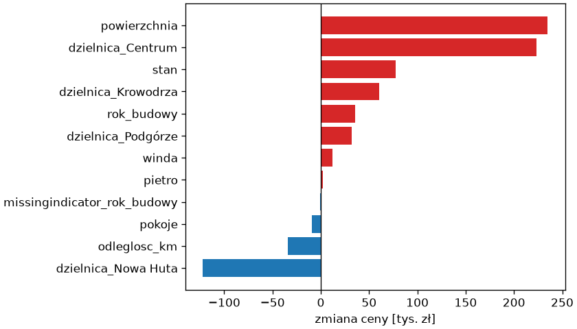

# Przygotowanie danych

Większość modeli scikit-learn — w tym regresja liniowa — przyjmuje wyłącznie liczby bez braków; dane rzeczywiste mają kolumny tekstowe, kategorie porządkowe, wartości brakujące i cechy o różnych skalach. Przygotowanie danych zamienia jedne w drugie — a ponieważ każde z tych przekształceń uczy się czegoś z danych (listy kategorii, mediany, średnich), musi być częścią potoku i widzieć tylko zbiór treningowy, jak nakazuje rozdział 7.

## Typy kolumn

```python title="typy.py"
import pandas as pd
from sklearn.compose import make_column_selector

mieszkania = pd.read_csv("mieszkania.csv")
X = mieszkania.drop(columns="cena")
print(X.dtypes.to_dict())
print(X.select_dtypes(include="number").columns.tolist())
print(X.select_dtypes(exclude="number").columns.tolist())
print(make_column_selector(dtype_include="number")(X))
print(X["dzielnica"].value_counts().to_dict())
print(X["stan"].value_counts(dropna=False).to_dict())
print(X["winda"].dtype, X["winda"].mean().round(2))
```

```{ .text .no-copy }
{'dzielnica': <StringDtype(na_value=nan)>, 'powierzchnia': dtype('float64'), 'pokoje': dtype('int64'), 'pietro': dtype('int64'), 'rok_budowy': dtype('float64'), 'stan': <StringDtype(na_value=nan)>, 'winda': dtype('bool'), 'odleglosc_km': dtype('float64')}
['powierzchnia', 'pokoje', 'pietro', 'rok_budowy', 'odleglosc_km']
['dzielnica', 'stan', 'winda']
['powierzchnia', 'pokoje', 'pietro', 'rok_budowy', 'odleglosc_km']
{'Nowa Huta': 103, 'Podgórze': 90, 'Krowodrza': 86, 'Centrum': 68, 'Bronowice': 53}
{'dobry': 189, 'po remoncie': 110, 'do remontu': 84, nan: 17}
bool 0.78
```

Przed budową potoku dzielimy kolumny na grupy, które dostaną różne przekształcenia: liczbowe (do skalowania i uzupełnienia braków), **nominalne** — kategorie bez porządku, jak dzielnica — i **porządkowe**, jak stan, którego wartości da się uszeregować. Kolumna logiczna `winda` ma wartości `True` i `False`, liczone jako 1 i 0 (średnia 0,78 to udział mieszkań z windą), więc może trafić do liczbowych, ale wybór po typie `"number"` jej nie obejmuje — dopisujemy ją do listy ręcznie. `select_dtypes()` wybiera kolumny po typie, a `make_column_selector()` robi to samo w postaci, którą przyjmuje `ColumnTransformer` — przydatne, gdy kolumn jest dużo albo zmieniają się między plikami.

## Kodowanie kategorii

```python title="kodowanie.py"
import pandas as pd
from sklearn.model_selection import train_test_split
from sklearn.preprocessing import OneHotEncoder, OrdinalEncoder

mieszkania = pd.read_csv("mieszkania.csv")
X, y = mieszkania.drop(columns="cena"), mieszkania["cena"]
X_trening, X_test, y_trening, y_test = train_test_split(X, y, test_size=0.25, random_state=42)
koder = OneHotEncoder(sparse_output=False).fit(X_trening[["dzielnica"]])
print(koder.categories_[0].tolist())
print(koder.transform(X_test[["dzielnica"]].head(3)))
print(koder.get_feature_names_out().tolist())
try:
    koder.transform(pd.DataFrame({"dzielnica": ["Zwierzyniec"]}))
except ValueError as blad:
    print("ValueError:", str(blad)[:60])
odporny = OneHotEncoder(handle_unknown="ignore", sparse_output=False).fit(X_trening[["dzielnica"]])
print(odporny.transform(pd.DataFrame({"dzielnica": ["Zwierzyniec"]})))
porzadkowy = OrdinalEncoder(categories=[["do remontu", "dobry", "po remoncie"]]).fit(X_trening[["stan"]].dropna())
print(porzadkowy.transform(pd.DataFrame({"stan": ["po remoncie", "do remontu", "dobry"]})).ravel())
print(pd.get_dummies(X_trening["dzielnica"]).head(2).astype(int).to_string())
```

```{ .text .no-copy }
['Bronowice', 'Centrum', 'Krowodrza', 'Nowa Huta', 'Podgórze']
[[0. 0. 1. 0. 0.]
 [0. 1. 0. 0. 0.]
 [0. 0. 0. 0. 1.]]
['dzielnica_Bronowice', 'dzielnica_Centrum', 'dzielnica_Krowodrza', 'dzielnica_Nowa Huta', 'dzielnica_Podgórze']
ValueError: Found unknown categories ['Zwierzyniec'] in column 0 during 
[[0. 0. 0. 0. 0.]]
[2. 0. 1.]
     Bronowice  Centrum  Krowodrza  Nowa Huta  Podgórze
247          0        0          1          0         0
110          0        0          1          0         0
```

**Kodowanie zero-jedynkowe** (ang. *one-hot encoding*) zamienia kolumnę o `k` kategoriach na `k` kolumn z jedynką w miejscu kategorii próbki; `OneHotEncoder` uczy się listy kategorii w `fit()` (`categories_`) i nadaje kolumnom nazwy przez `get_feature_names_out()`. Kategoria nieznana w treningu domyślnie powoduje wyjątek — to lepsze niż błąd, który przeszedłby niezauważony — a `handle_unknown="ignore"` koduje ją samymi zerami, gdy nowe dane mają prawo zawierać wartości spoza listy. **Kodowanie porządkowe** (ang. *ordinal encoding*) przypisuje kategoriom kolejne liczby; `OrdinalEncoder` z jawną listą `categories=` zachowuje porządek merytoryczny (do remontu < dobry < po remoncie), a bez niej użyłby porządku alfabetycznego, który tu przypadkiem pokrywa się z merytorycznym, ale w ogólności — np. dla „mały”, „średni”, „duży” — byłby błędny. Braki usuwamy przed `fit()` (`dropna()`), bo `NaN` spoza listy koder uznałby za nieznaną kategorię i zgłosił `ValueError`; w potoku uzupełni je wcześniej imputacja. Kodowania porządkowego nie stosujemy do dzielnic: liczby 0–4 sugerowałyby, że Bronowice są „mniejsze” od Podgórza. `pd.get_dummies()` z pandas koduje zero-jedynkowo i wystarcza do oględzin, ale nie pamięta listy kategorii, więc w potoku używamy kodera scikit-learn.

## Braki — imputacja

```python title="imputacja.py"
import pandas as pd
from sklearn.impute import SimpleImputer
from sklearn.model_selection import train_test_split

mieszkania = pd.read_csv("mieszkania.csv")
X, y = mieszkania.drop(columns="cena"), mieszkania["cena"]
X_trening, X_test, y_trening, y_test = train_test_split(X, y, test_size=0.25, random_state=42)
print(X_trening.isna().sum()[["rok_budowy", "stan"]].to_dict())
mediana = SimpleImputer(strategy="median", add_indicator=True).fit(X_trening[["rok_budowy"]])
print(mediana.statistics_)
print(mediana.transform(X_test[["rok_budowy"]].head(4)))
print(mediana.get_feature_names_out().tolist())
najczestsza = SimpleImputer(strategy="most_frequent").fit(X_trening[["stan"]])
print(najczestsza.statistics_, najczestsza.transform(X_test[["stan"]].head(3)).ravel())
print(y_trening[X_trening["rok_budowy"].isna()].median().round(0), y_trening[X_trening["rok_budowy"].notna()].median().round(0))
```

```{ .text .no-copy }
{'rok_budowy': 26, 'stan': 13}
[1987.]
[[1982.    0.]
 [1939.    0.]
 [1975.    0.]
 [2012.    0.]]
['rok_budowy', 'missingindicator_rok_budowy']
['dobry'] ['po remoncie' 'po remoncie' 'dobry']
531000.0 618000.0
```

**Imputacja** (ang. *imputation*) uzupełnia braki wartością wyliczoną ze zbioru treningowego: `SimpleImputer` z medianą dla liczb, z najczęstszą wartością dla kategorii; `statistics_` przechowuje, czym uzupełnia, a `transform()` stosuje to samo do danych testowych i nowych — mediana testu nie może wpłynąć na model. `add_indicator=True` dodaje kolumnę logiczną „był brak”, bo sam fakt braku bywa informacją. W treningu mediana ceny mieszkań bez roku budowy wynosi 531 tysięcy wobec 618 dla pozostałych, ale generator usuwa rok losowo, więc różnica jest przypadkowa — współczynnik wskaźnika okaże się dalej bliski zera; w danych rzeczywistych brak często ma przyczynę związaną z celem. Usuwanie wierszy z brakami z rozdziału 4 jest w uczeniu maszynowym ostatecznością — wiersz, który trzeba przewidzieć, może mieć brak, a odrzucanie próbek treningowych może wypaczyć rozkład.

## `ColumnTransformer` i potok

```python title="transformator.py"
import pandas as pd
from sklearn.compose import ColumnTransformer
from sklearn.impute import SimpleImputer
from sklearn.linear_model import LinearRegression
from sklearn.metrics import mean_absolute_error, r2_score
from sklearn.model_selection import train_test_split
from sklearn.pipeline import Pipeline, make_pipeline
from sklearn.preprocessing import OneHotEncoder, OrdinalEncoder, StandardScaler

mieszkania = pd.read_csv("mieszkania.csv")
X, y = mieszkania.drop(columns="cena"), mieszkania["cena"]
X_trening, X_test, y_trening, y_test = train_test_split(X, y, test_size=0.25, random_state=42)
liczbowe = ["powierzchnia", "pokoje", "pietro", "rok_budowy", "odleglosc_km", "winda"]
przygotowanie = ColumnTransformer([
    ("liczbowe", make_pipeline(SimpleImputer(strategy="median", add_indicator=True), StandardScaler()), liczbowe),
    ("stan", make_pipeline(SimpleImputer(strategy="most_frequent"), OrdinalEncoder(categories=[["do remontu", "dobry", "po remoncie"]])), ["stan"]),
    ("dzielnica", OneHotEncoder(drop="first", handle_unknown="ignore", sparse_output=False), ["dzielnica"]),
]).set_output(transform="pandas")
przeksztalcone = przygotowanie.fit_transform(X_trening)
print(przeksztalcone.shape, przeksztalcone.columns.tolist())
print(przeksztalcone.head(2).round(2).T)
potok = Pipeline([("przygotowanie", przygotowanie), ("model", LinearRegression())]).fit(X_trening, y_trening)
przewidziane = potok.predict(X_test)
print("MAE", round(mean_absolute_error(y_test, przewidziane)), "R²", round(r2_score(y_test, przewidziane), 3))
nowe = pd.DataFrame([{"dzielnica": "Centrum", "powierzchnia": 60.0, "pokoje": 3, "pietro": 2, "rok_budowy": None, "stan": "po remoncie", "winda": True, "odleglosc_km": 1.5}])
print(potok.predict(nowe).round(0))
```

```{ .text .no-copy }
(300, 12) ['liczbowe__powierzchnia', 'liczbowe__pokoje', 'liczbowe__pietro', 'liczbowe__rok_budowy', 'liczbowe__odleglosc_km', 'liczbowe__winda', 'liczbowe__missingindicator_rok_budowy', 'stan__stan', 'dzielnica__dzielnica_Centrum', 'dzielnica__dzielnica_Krowodrza', 'dzielnica__dzielnica_Nowa Huta', 'dzielnica__dzielnica_Podgórze']
                                        247   110
liczbowe__powierzchnia                -1.42 -1.37
liczbowe__pokoje                      -1.44 -1.44
liczbowe__pietro                       0.26  1.48
liczbowe__rok_budowy                   0.62  1.50
liczbowe__odleglosc_km                 0.19 -0.81
liczbowe__winda                        0.53  0.53
liczbowe__missingindicator_rok_budowy -0.31 -0.31
stan__stan                             1.00  2.00
dzielnica__dzielnica_Centrum           0.00  0.00
dzielnica__dzielnica_Krowodrza         1.00  1.00
dzielnica__dzielnica_Nowa Huta         0.00  0.00
dzielnica__dzielnica_Podgórze          0.00  0.00
MAE 59940 R² 0.919
[1016386.]
```

**Transformator kolumn** `ColumnTransformer` przypisuje różnym grupom kolumn różne przekształcenia — każda trójka to nazwa, transformator (może być potokiem: imputacja, potem skalowanie) i lista kolumn — i skleja wyniki w jedną tabelę; `set_output(transform="pandas")` z rozdziału 7 zwraca tabelę pandas, a nazwy kolumn dostają domyślnie przedrostek grupy (`verbose_feature_names_out=True`), więc wynik da się obejrzeć. Kolumny niewymienione są domyślnie odrzucane (`remainder="drop"`). Dla modelu liniowego dzielnicę kodujemy z `drop="first"`: cztery kolumny zamiast pięciu, bo pięć kolumn sumuje się w każdym wierszu do jedynki, więc razem z wyrazem wolnym byłyby liniowo zależne — pominięte Bronowice stają się poziomem odniesienia. Nieznana dzielnica, zakodowana przez `handle_unknown="ignore"` samymi zerami, jest wtedy traktowana jak Bronowice, a scikit-learn zgłasza ostrzeżenie. Skalowanie nie zmienia predykcji regresji liniowej, ale czyni współczynniki porównywalnymi i będzie potrzebne przy regularyzacji. Cały potok trenuje się i przewiduje jak jeden model, także dla nowej próbki z kategoriami tekstowymi i brakującym rokiem, a dodanie pozostałych cech — dzielnicy, stanu, roku budowy i windy — obniża błąd z 88 do 60 tysięcy złotych.

## Współczynniki po kodowaniu

```python title="wspolczynniki.py"
import matplotlib.pyplot as plt
import pandas as pd
from sklearn.compose import ColumnTransformer
from sklearn.impute import SimpleImputer
from sklearn.linear_model import LinearRegression
from sklearn.model_selection import train_test_split
from sklearn.pipeline import Pipeline, make_pipeline
from sklearn.preprocessing import OneHotEncoder, OrdinalEncoder, StandardScaler

mieszkania = pd.read_csv("mieszkania.csv")
X, y = mieszkania.drop(columns="cena"), mieszkania["cena"]
X_trening, X_test, y_trening, y_test = train_test_split(X, y, test_size=0.25, random_state=42)
liczbowe = ["powierzchnia", "pokoje", "pietro", "rok_budowy", "odleglosc_km", "winda"]
przygotowanie = ColumnTransformer([
    ("liczbowe", make_pipeline(SimpleImputer(strategy="median", add_indicator=True), StandardScaler()), liczbowe),
    ("stan", make_pipeline(SimpleImputer(strategy="most_frequent"), OrdinalEncoder(categories=[["do remontu", "dobry", "po remoncie"]])), ["stan"]),
    ("dzielnica", OneHotEncoder(drop="first", handle_unknown="ignore", sparse_output=False), ["dzielnica"]),
], verbose_feature_names_out=False)
potok = Pipeline([("przygotowanie", przygotowanie), ("model", LinearRegression())]).fit(X_trening, y_trening)
wspolczynniki = pd.Series(potok[-1].coef_, index=potok[:-1].get_feature_names_out()).sort_values()
print(wspolczynniki.round(0).to_dict())
print(round(potok[-1].intercept_))

fig, ax = plt.subplots(figsize=(7, 4), layout="constrained")
ax.barh(wspolczynniki.index, wspolczynniki / 1000, color=["tab:blue" if w < 0 else "tab:red" for w in wspolczynniki])
ax.axvline(0, color="black", linewidth=0.8)
ax.set_xlabel("zmiana ceny [tys. zł]")
fig.savefig("wspolczynniki.png", dpi=120)
```

```{ .text .no-copy }
{'dzielnica_Nowa Huta': -122066.0, 'odleglosc_km': -34161.0, 'pokoje': -9237.0, 'missingindicator_rok_budowy': -827.0, 'pietro': 2261.0, 'winda': 11970.0, 'dzielnica_Podgórze': 32128.0, 'rok_budowy': 35770.0, 'dzielnica_Krowodrza': 60704.0, 'stan': 77775.0, 'dzielnica_Centrum': 223575.0, 'powierzchnia': 235001.0}
529233
```

{ width="640" }

Po skalowaniu współczynniki cech liczbowych mówią, o ile zmienia się cena na jedno odchylenie standardowe cechy — stąd powierzchnia dominuje — a współczynniki kolumn zero-jedynkowych mówią, o ile mieszkanie w danej dzielnicy różni się od poziomu odniesienia (Bronowic) przy pozostałych cechach ustalonych: Nowa Huta jest tańsza o około 120 tysięcy, Centrum droższe o ponad 200 tysięcy. Współczynnik stanu, zakodowanego liczbami 0–2, to zmiana ceny na jeden stopień stanu — model zakłada, że różnica między „do remontu” a „dobrym” jest taka sama jak między „dobrym” a „po remoncie”; gdy to założenie nie pasuje, stan kodujemy zero-jedynkowo. `verbose_feature_names_out=False` pomija przedrostki grup w nazwach, co skraca etykiety wykresu.

## Wyciek celu

```python title="wyciek-celu.py"
import pandas as pd
from sklearn.linear_model import LinearRegression
from sklearn.model_selection import KFold, cross_val_score

mieszkania = pd.read_csv("mieszkania.csv")
X, y = mieszkania.drop(columns="cena"), mieszkania["cena"]
X_z_wyciekiem = X.assign(cena_za_m2=y / X["powierzchnia"])
podzialy = KFold(n_splits=5, shuffle=True, random_state=42)
print(round(cross_val_score(LinearRegression(), X[["powierzchnia", "odleglosc_km"]], y, cv=podzialy, scoring="r2").mean(), 3))
print(round(cross_val_score(LinearRegression(), X_z_wyciekiem[["powierzchnia", "odleglosc_km", "cena_za_m2"]], y, cv=podzialy, scoring="r2").mean(), 3))
```

```{ .text .no-copy }
0.829
0.956
```

Cecha „cena za metr” wydaje się naturalna i podnosi R² z 0,83 do 0,96 — bo powstała z celu: w chwili predykcji dla nowego mieszkania ceny nie znamy, więc i ceny za metr nie będzie. To **wyciek celu** (ang. *target leakage*), o którym ostrzegał rozdział 7: informacja z etykiety przedostaje się do cech przez kolumnę wyliczoną z niej albo zebraną później niż moment decyzji (kwota zwrotu przy przewidywaniu zwrotu, data spłaty przy przewidywaniu opóźnienia). Walidacja krzyżowa go nie wykryje, bo cecha jest równie „dostępna” w części walidacyjnej; wykrywa go pytanie o każdą cechę: „czy znam ją w chwili, gdy model ma odpowiedzieć?”. Zbyt dobry wynik jest sygnałem do sprawdzenia cech, a nie potwierdzeniem jakości modelu.
