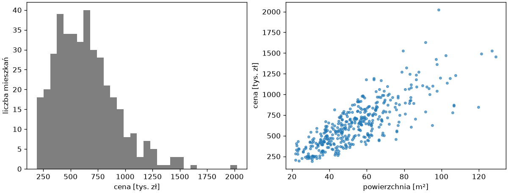
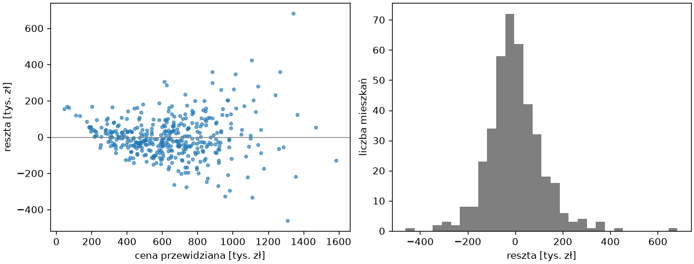

# Regresja liniowa i miary błędu

Regresja przewiduje liczbę, więc błąd modelu też jest liczbą — w tych samych jednostkach co cel — a nie odsetkiem trafień. Ten podrozdział wprowadza dane rozdziału, trzy miary błędu i najprostszy model: regresję liniową na cechach liczbowych, którą rozdział 2 tej części liczył metodą najmniejszych kwadratów w NumPy.

## Dane — ceny mieszkań

```python title="generuj_mieszkania.py"
import numpy as np
import pandas as pd

rng = np.random.default_rng(42)
n = 400
dzielnice = ["Centrum", "Podgórze", "Krowodrza", "Nowa Huta", "Bronowice"]
cena_m2 = {"Centrum": 16000, "Podgórze": 12500, "Krowodrza": 13500, "Nowa Huta": 9500, "Bronowice": 12000}
odleglosc_bazowa = {"Centrum": 1.0, "Podgórze": 3.5, "Krowodrza": 3.0, "Nowa Huta": 8.0, "Bronowice": 5.0}
dzielnica = rng.choice(dzielnice, n, p=[0.15, 0.25, 0.2, 0.25, 0.15])
powierzchnia = np.clip(rng.lognormal(np.log(52), 0.35, n), 22, 150).round(1)
pokoje = np.clip(np.round(powierzchnia / 22 + rng.normal(0, 0.5, n)), 1, 5).astype(int)
pietro = rng.integers(0, 11, n)
rok_budowy = np.where(dzielnica == "Centrum", rng.integers(1900, 1990, n), rng.integers(1960, 2024, n)).astype(float)
rok_budowy[rng.random(n) < 0.08] = np.nan
stan = rng.choice(["do remontu", "dobry", "po remoncie"], n, p=[0.2, 0.5, 0.3]).astype(object)
stan[rng.random(n) < 0.05] = None
winda = (pietro >= 4) | (rng.random(n) < 0.3)
odleglosc = np.clip(np.array([odleglosc_bazowa[d] for d in dzielnica]) + rng.normal(0, 1.0, n), 0.3, 15).round(1)
wsp_stanu = pd.Series(stan).map({"do remontu": 0.85, "dobry": 1.0, "po remoncie": 1.12}).fillna(1.0).to_numpy()
rok_znany = np.where(np.isnan(rok_budowy), 1985, rok_budowy)
cena = np.array([cena_m2[d] for d in dzielnica]) * powierzchnia * wsp_stanu * (1 + 0.002 * (rok_znany - 1985)) * (1 - 0.02 * odleglosc) * (1 + 0.04 * winda) * rng.lognormal(0, 0.10, n)
mieszkania = pd.DataFrame({"dzielnica": dzielnica, "powierzchnia": powierzchnia, "pokoje": pokoje, "pietro": pietro, "rok_budowy": rok_budowy, "stan": stan, "winda": winda, "odleglosc_km": odleglosc, "cena": (cena / 1000).round(0) * 1000})
mieszkania.to_csv("mieszkania.csv", index=False)
print(mieszkania.shape, mieszkania.isna().sum().to_dict())
```

```{ .text .no-copy }
(400, 9) {'dzielnica': 0, 'powierzchnia': 0, 'pokoje': 0, 'pietro': 0, 'rok_budowy': 35, 'stan': 17, 'winda': 0, 'odleglosc_km': 0, 'cena': 0}
```

Cena powstaje z iloczynu powierzchni i ceny za metr zależnej od dzielnicy, stanu, wieku budynku, odległości od centrum i windy, pomnożonego przez szum — zależności są więc nieliniowe i iloczynowe, jak w rzeczywistości, ale znane, co pozwoli ocenić, ile z nich modele odzyskają. Braki w roku budowy i stanie są celowe.

```python title="ogledziny.py"
import matplotlib.pyplot as plt
import pandas as pd

mieszkania = pd.read_csv("mieszkania.csv")
print(mieszkania.dtypes.to_dict())
print(mieszkania.head(3).to_string())
print(mieszkania["cena"].describe().round(0).to_dict(), round(mieszkania["cena"].skew(), 2))
print(mieszkania.groupby("dzielnica")["cena"].median().round(0).sort_values(ascending=False).to_dict())
print(mieszkania.groupby("stan")["cena"].median().round(0).to_dict())

fig, (ax1, ax2) = plt.subplots(1, 2, figsize=(10, 3.8), layout="constrained")
ax1.hist(mieszkania["cena"] / 1000, bins=30, color="tab:gray")
ax1.set_xlabel("cena [tys. zł]")
ax1.set_ylabel("liczba mieszkań")
ax2.scatter(mieszkania["powierzchnia"], mieszkania["cena"] / 1000, s=10, alpha=0.6)
ax2.set_xlabel("powierzchnia [m²]")
ax2.set_ylabel("cena [tys. zł]")
fig.savefig("rozklad.png", dpi=120)
```

```{ .text .no-copy }
{'dzielnica': <StringDtype(na_value=nan)>, 'powierzchnia': dtype('float64'), 'pokoje': dtype('int64'), 'pietro': dtype('int64'), 'rok_budowy': dtype('float64'), 'stan': <StringDtype(na_value=nan)>, 'winda': dtype('bool'), 'odleglosc_km': dtype('float64'), 'cena': dtype('float64')}
   dzielnica  powierzchnia  pokoje  pietro  rok_budowy         stan  winda  odleglosc_km      cena
0  Nowa Huta          60.6       3       6      2006.0        dobry   True           7.8  508000.0
1  Krowodrza          62.5       3       9      2011.0   do remontu   True           3.3  620000.0
2  Bronowice          57.3       2       8      2009.0  po remoncie   True           5.2  823000.0
{'count': 400.0, 'mean': 640778.0, 'std': 281549.0, 'min': 191000.0, '25%': 429750.0, '50%': 605000.0, '75%': 797000.0, 'max': 2024000.0} 1.02
{'Centrum': 726500.0, 'Krowodrza': 705500.0, 'Bronowice': 656000.0, 'Podgórze': 633500.0, 'Nowa Huta': 397000.0}
{'do remontu': 506000.0, 'dobry': 567000.0, 'po remoncie': 703000.0}
```

{ width="760" }

Oględziny z rozdziału 4: kolumny mają trzy rodzaje — liczbowe, tekstowe (`dzielnica`, `stan`) i logiczną — a dwie mają braki. Cena jest **prawoskośna** (skośność około 1): większość mieszkań kosztuje 400–800 tysięcy, a ogon sięga dwóch milionów; mediany według dzielnicy i stanu w przybliżeniu odtwarzają zależności wpisane w generator — w medianach dzielnic nakładają się też wiek budynków i odległość od centrum. Wykres ceny od powierzchni pokazuje zależność w przybliżeniu liniową, ale z rozrzutem rosnącym wraz z powierzchnią — obie obserwacje wrócą przy resztach i transformacji celu.

## Miary błędu

```python title="miary.py"
import numpy as np
import pandas as pd
from sklearn.dummy import DummyRegressor
from sklearn.metrics import mean_absolute_error, mean_absolute_percentage_error, r2_score, root_mean_squared_error
from sklearn.model_selection import train_test_split

mieszkania = pd.read_csv("mieszkania.csv")
X, y = mieszkania.drop(columns="cena"), mieszkania["cena"]
X_trening, X_test, y_trening, y_test = train_test_split(X, y, test_size=0.25, random_state=42)
bazowy = DummyRegressor(strategy="mean").fit(X_trening, y_trening)
przewidziane = bazowy.predict(X_test)
print(przewidziane[:3].round(0), round(y_trening.mean()))
print("MAE ", round(mean_absolute_error(y_test, przewidziane)))
print("RMSE", round(root_mean_squared_error(y_test, przewidziane)))
print("R²  ", round(r2_score(y_test, przewidziane), 3))
print("MAPE", round(mean_absolute_percentage_error(y_test, przewidziane) * 100, 1), "%")
print(round(np.abs(y_test - przewidziane).mean()), round(np.sqrt(((y_test - przewidziane) ** 2).mean())))
```

```{ .text .no-copy }
[641007. 641007. 641007.] 641007
MAE  219391
RMSE 275446
R²   -0.0
MAPE 43.0 %
219391 275446
```

Model bazowy regresji przewiduje wszędzie średnią z treningu (`DummyRegressor`), a jego błędy wyznaczają skalę: **średni błąd bezwzględny** (ang. *mean absolute error*, MAE) to przeciętna odległość predykcji od prawdy w złotych — tu 219 tysięcy; **pierwiastek błędu średniokwadratowego** (ang. *root mean squared error*, RMSE) karze duże pomyłki mocniej, więc jest większy od MAE tym bardziej, im bardziej zróżnicowane są wielkości błędów; **współczynnik determinacji** R² z rozdziału 2 mówi, jaką część wariancji celu model wyjaśnia — dla bazowego około 0 (tu −0,0, bo średnia z treningu różni się nieco od średniej testu), dla idealnego 1, a wartości ujemne oznaczają model gorszy od średniej. **Średni bezwzględny błąd procentowy** (ang. *mean absolute percentage error*, MAPE) wyraża błąd w procentach ceny, co jest czytelne dla odbiorcy, ale karze mocniej pomyłki na tanich mieszkaniach. Ostatni wiersz liczy MAE i RMSE wprost ze wzorów i potwierdza wyniki funkcji z `sklearn.metrics`. W scikit-learn miary błędu jako `scoring` mają przedrostek `neg_` (`neg_mean_absolute_error`), bo narzędzia doboru maksymalizują wynik; miarę raportu wybieramy według tego, co kosztuje odbiorcę — MAE, gdy każdy tysiąc złotych błędu waży tyle samo.

## Regresja liniowa na cechach liczbowych

```python title="liniowa.py"
import pandas as pd
from sklearn.linear_model import LinearRegression
from sklearn.metrics import mean_absolute_error, mean_absolute_percentage_error, r2_score
from sklearn.model_selection import train_test_split

mieszkania = pd.read_csv("mieszkania.csv")
liczbowe = ["powierzchnia", "pokoje", "pietro", "odleglosc_km"]
X, y = mieszkania[liczbowe], mieszkania["cena"]
X_trening, X_test, y_trening, y_test = train_test_split(X, y, test_size=0.25, random_state=42)
model = LinearRegression().fit(X_trening, y_trening)
print(pd.Series(model.coef_, index=liczbowe).round(0).to_dict(), round(model.intercept_))
przewidziane = model.predict(X_test)
print("MAE", round(mean_absolute_error(y_test, przewidziane)), "R²", round(r2_score(y_test, przewidziane), 3), "MAPE", round(mean_absolute_percentage_error(y_test, przewidziane) * 100, 1))
nowe = pd.DataFrame([[60.0, 3, 2, 3.0], [60.0, 3, 2, 8.0]], columns=liczbowe)
print(model.predict(nowe).round(0))
print(X_trening.corr().round(2).loc["powierzchnia", "pokoje"])
```

```{ .text .no-copy }
{'powierzchnia': 12596.0, 'pokoje': -22747.0, 'pietro': 3185.0, 'odleglosc_km': -48257.0} 206365
MAE 87607 R² 0.833 MAPE 14.5
[755475. 514189.]
0.83
```

`LinearRegression` dopasowuje `cena = w · x + b` metodą najmniejszych kwadratów z rozdziału 2 — bez hiperparametrów i bez skalowania, bo współczynniki same przyjmują skalę cech. Czyta się je wprost: każdy metr kwadratowy dodaje około 12,6 tysiąca złotych, każdy kilometr od centrum odejmuje 48 tysięcy (dwa mieszkania różniące się tylko odległością, 3 i 8 km, dzieli w predykcji 241 tysięcy), a wyraz wolny to cena hipotetycznego mieszkania o zerowych cechach — bez znaczenia sam w sobie. Współczynnik liczby pokoi jest ujemny, choć generator nie uzależnia od niej ceny: pokoje są silnie skorelowane z powierzchnią (korelacja 0,83 w ostatnim wierszu), a współczynniki cech skorelowanych dzielą wpływ między siebie w sposób zależny od próbki — to ta sama pułapka interpretacji co przy współczynnikach regresji logistycznej w rozdziale 8. Cztery cechy liczbowe wyjaśniają 83% wariancji ceny, z błędem 88 tysięcy; brakuje dzielnicy i stanu, które są tekstem, roku budowy, który ma braki, oraz windy — ich przygotowanie jest tematem następnego podrozdziału.

## Reszty

```python title="reszty.py"
import matplotlib.pyplot as plt
import numpy as np
import pandas as pd
from sklearn.linear_model import LinearRegression
from sklearn.model_selection import KFold, cross_val_predict

mieszkania = pd.read_csv("mieszkania.csv")
liczbowe = ["powierzchnia", "pokoje", "pietro", "odleglosc_km"]
X, y = mieszkania[liczbowe], mieszkania["cena"]
podzialy = KFold(n_splits=5, shuffle=True, random_state=42)
przewidziane = cross_val_predict(LinearRegression(), X, y, cv=podzialy)
reszty = y - przewidziane
print(reszty.describe().round(0)[["mean", "std", "min", "max"]].to_dict())
male, duze = przewidziane < np.median(przewidziane), przewidziane >= np.median(przewidziane)
print(round(reszty[male].std()), round(reszty[duze].std()))
print(round(np.corrcoef(przewidziane, reszty)[0, 1], 3), round(reszty.skew(), 2))

fig, (ax1, ax2) = plt.subplots(1, 2, figsize=(10, 3.8), layout="constrained")
ax1.scatter(przewidziane / 1000, reszty / 1000, s=10, alpha=0.6)
ax1.axhline(0, color="gray", linewidth=0.8)
ax1.set_xlabel("cena przewidziana [tys. zł]")
ax1.set_ylabel("reszta [tys. zł]")
ax2.hist(reszty / 1000, bins=30, color="tab:gray")
ax2.set_xlabel("reszta [tys. zł]")
ax2.set_ylabel("liczba mieszkań")
fig.savefig("reszty.png", dpi=120)
```

```{ .text .no-copy }
{'mean': -152.0, 'std': 115829.0, 'min': -461211.0, 'max': 682726.0}
78838 143818
-0.005 0.66
```

{ width="760" }

**Reszta** (ang. *residual*) to różnica między ceną prawdziwą a przewidzianą; liczymy ją na predykcjach z walidacji krzyżowej (`cross_val_predict()` z rozdziału 8), aby nie oglądać dopasowania do treningu. Dobry model liniowy ma reszty rozrzucone symetrycznie wokół zera, bez widocznej zależności od predykcji. Średnia reszt i ich korelacja z predykcją (−0,005) są tu bliskie zera, ale rozrzut rośnie wraz z przewidywaną ceną — odchylenie reszt wynosi 144 tysiące dla droższej połowy wobec 79 dla tańszej — a rozkład reszt ma prawy ogon, jak sam cel. Oba objawy mówią, że błąd jest raczej **procentowy** niż stały w złotych — model liniowy na logarytmie ceny albo model nieliniowy powinien to oddać lepiej, co sprawdzimy w dwóch ostatnich podrozdziałach. Wykres reszt jest najprostszą diagnostyką regresji i warto go robić dla każdego modelu, nie tylko liniowego.
