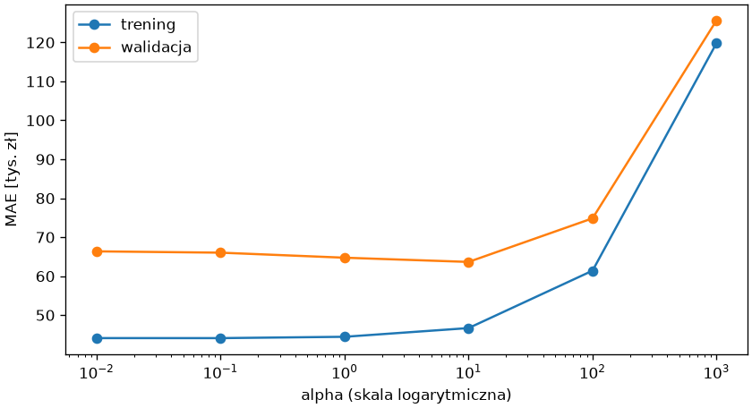
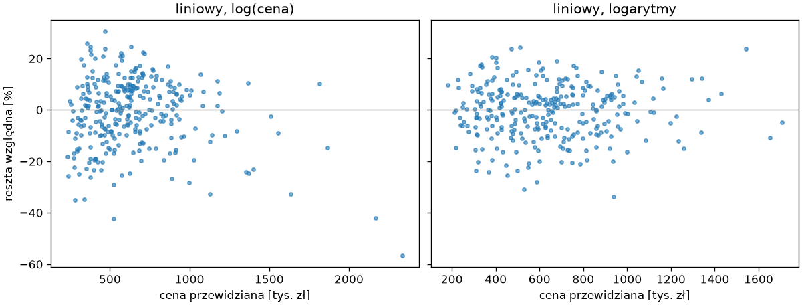

# Regularyzacja i inżynieria cech

Model liniowy oblicza jedynie sumę ważoną cech wejściowych. Zależności nieliniowe i współdziałanie cech — cena za metr inna w każdej dzielnicy, wpływ windy zależny od piętra — trzeba mu podać jako nowe kolumny, a wtedy cech przybywa i potrzebna staje się regularyzacja z rozdziału 8. Ten podrozdział pokazuje **inżynierię cech** (ang. *feature engineering*) dla modelu liniowego, regresję grzbietową i lasso jako sposoby ograniczania przeuczenia oraz transformację celu.

## Cechy wielomianowe

```python title="wielomian.py"
import pandas as pd
from sklearn.compose import ColumnTransformer
from sklearn.impute import SimpleImputer
from sklearn.linear_model import LinearRegression
from sklearn.model_selection import KFold, cross_validate, train_test_split
from sklearn.pipeline import Pipeline, make_pipeline
from sklearn.preprocessing import OneHotEncoder, OrdinalEncoder, PolynomialFeatures, StandardScaler

mieszkania = pd.read_csv("mieszkania.csv")
X, y = mieszkania.drop(columns="cena"), mieszkania["cena"]
X_trening, X_test, y_trening, y_test = train_test_split(X, y, test_size=0.25, random_state=42)
liczbowe = ["powierzchnia", "pokoje", "pietro", "rok_budowy", "odleglosc_km", "winda"]
przygotowanie = ColumnTransformer([
    ("liczbowe", make_pipeline(SimpleImputer(strategy="median", add_indicator=True), StandardScaler()), liczbowe),
    ("stan", make_pipeline(SimpleImputer(strategy="most_frequent"), OrdinalEncoder(categories=[["do remontu", "dobry", "po remoncie"]])), ["stan"]),
    ("dzielnica", OneHotEncoder(drop="first", handle_unknown="ignore", sparse_output=False), ["dzielnica"]),
], verbose_feature_names_out=False)
liniowy = Pipeline([("przygotowanie", przygotowanie), ("model", LinearRegression())])
wielomianowy = Pipeline([("przygotowanie", przygotowanie), ("wielomian", PolynomialFeatures(degree=2, include_bias=False)), ("skalowanie", StandardScaler()), ("model", LinearRegression())])
wielomianowy.fit(X_trening, y_trening)
nazwy = wielomianowy[:-2].get_feature_names_out()
print(len(nazwy), nazwy[:3].tolist(), nazwy[12:15].tolist())
podzialy = KFold(n_splits=5, shuffle=True, random_state=42)
for nazwa, model in (("liniowy", liniowy), ("wielomianowy", wielomianowy)):
    wyniki = cross_validate(model, X_trening, y_trening, cv=podzialy, scoring="neg_mean_absolute_error", return_train_score=True)
    print(f"{nazwa:<13} MAE trening {-wyniki['train_score'].mean():>7.0f}  walidacja {-wyniki['test_score'].mean():>7.0f}")
```

```{ .text .no-copy }
90 ['powierzchnia', 'pokoje', 'pietro'] ['powierzchnia^2', 'powierzchnia pokoje', 'powierzchnia pietro']
liniowy       MAE trening   63564  walidacja   68546
wielomianowy  MAE trening   44101  walidacja   66409
```

`PolynomialFeatures(degree=2)` dodaje do 12 cech ich kwadraty i iloczyny par — razem 90 kolumn, wśród nich `powierzchnia dzielnica_Centrum`, czyli „powierzchnia liczona tylko w Centrum”, która pozwala modelowi liniowemu wycenić metr inaczej w każdej dzielnicy. Ceną jest przeuczenie: błąd treningowy spada z 64 do 44 tysięcy, a walidacyjny prawie się nie zmienia — 90 współczynników dopasowanych do 240 próbek w każdym przebiegu zapamiętuje szum. Nowe cechy skalujemy ponownie, bo iloczyny mają inne rozkłady niż składniki. W praktyce zamiast wszystkich iloczynów dodajemy zwykle kilka wybranych ręcznie, np. `powierzchnia * odleglosc_km` — inżynieria cech to w dużej mierze wiedza o dziedzinie zapisana jako kolumny.

## Regresja grzbietowa — `alpha`

```python title="ridge.py"
import matplotlib.pyplot as plt
import numpy as np
import pandas as pd
from sklearn.compose import ColumnTransformer
from sklearn.impute import SimpleImputer
from sklearn.linear_model import Ridge
from sklearn.model_selection import KFold, train_test_split, validation_curve
from sklearn.pipeline import Pipeline, make_pipeline
from sklearn.preprocessing import OneHotEncoder, OrdinalEncoder, PolynomialFeatures, StandardScaler

mieszkania = pd.read_csv("mieszkania.csv")
X, y = mieszkania.drop(columns="cena"), mieszkania["cena"]
X_trening, X_test, y_trening, y_test = train_test_split(X, y, test_size=0.25, random_state=42)
liczbowe = ["powierzchnia", "pokoje", "pietro", "rok_budowy", "odleglosc_km", "winda"]
przygotowanie = ColumnTransformer([
    ("liczbowe", make_pipeline(SimpleImputer(strategy="median", add_indicator=True), StandardScaler()), liczbowe),
    ("stan", make_pipeline(SimpleImputer(strategy="most_frequent"), OrdinalEncoder(categories=[["do remontu", "dobry", "po remoncie"]])), ["stan"]),
    ("dzielnica", OneHotEncoder(drop="first", handle_unknown="ignore", sparse_output=False), ["dzielnica"]),
], verbose_feature_names_out=False)
grzbietowy = Pipeline([("przygotowanie", przygotowanie), ("wielomian", PolynomialFeatures(degree=2, include_bias=False)), ("skalowanie", StandardScaler()), ("model", Ridge())])
alfy = [0.01, 0.1, 1, 10, 100, 1000]
podzialy = KFold(n_splits=5, shuffle=True, random_state=42)
trening, walidacja = validation_curve(grzbietowy, X_trening, y_trening, param_name="model__alpha", param_range=alfy, cv=podzialy, scoring="neg_mean_absolute_error")
print((-trening.mean(axis=1)).round(0))
print((-walidacja.mean(axis=1)).round(0))
for alfa in (0.01, 10, 1000):
    model = grzbietowy.set_params(model__alpha=alfa).fit(X_trening, y_trening)
    print(f"alpha = {alfa:<6} średni |współczynnik| {np.abs(model[-1].coef_).mean():>8.0f}")

fig, ax = plt.subplots(figsize=(7, 3.8), layout="constrained")
ax.plot(alfy, -trening.mean(axis=1) / 1000, marker="o", label="trening")
ax.plot(alfy, -walidacja.mean(axis=1) / 1000, marker="o", label="walidacja")
ax.set_xscale("log")
ax.set_xlabel("alpha (skala logarytmiczna)")
ax.set_ylabel("MAE [tys. zł]")
ax.legend()
fig.savefig("alfa.png", dpi=120)
```

```{ .text .no-copy }
[ 44099.  44095.  44437.  46676.  61411. 119824.]
[ 66368.  66030.  64737.  63656.  74846. 125664.]
alpha = 0.01   średni |współczynnik|    15745
alpha = 10     średni |współczynnik|    10558
alpha = 1000   średni |współczynnik|     4544
```

{ width="640" }

**Regresja grzbietowa** (ang. *ridge regression*) to regresja liniowa z karą za sumę kwadratów współczynników; `alpha` jest siłą kary — odwrotnie niż `C` w regresji logistycznej, gdzie większe `C` oznaczało słabszą regularyzację. Krzywa walidacji z rozdziału 7 pokazuje znajomy kształt: przy małym `alpha` model zachowuje się jak zwykła regresja na 90 cechach (przeuczenie), przy `alpha = 10` błąd walidacyjny jest najniższy — mniejszy niż modelu liniowego bez cech wielomianowych — a przy `alpha = 1000` współczynniki są tak silnie zmniejszone, że model niedoucza. Regularyzacja pozwala więc korzystać z bogatego zestawu cech bez zapamiętywania szumu; wymaga skalowania, bo kara traktuje wszystkie współczynniki jednakowo.

## Lasso jako selekcja cech

```python title="lasso.py"
import numpy as np
import pandas as pd
from sklearn.compose import ColumnTransformer
from sklearn.impute import SimpleImputer
from sklearn.linear_model import Lasso
from sklearn.model_selection import KFold, cross_val_score, train_test_split
from sklearn.pipeline import Pipeline, make_pipeline
from sklearn.preprocessing import OneHotEncoder, OrdinalEncoder, PolynomialFeatures, StandardScaler

mieszkania = pd.read_csv("mieszkania.csv")
X, y = mieszkania.drop(columns="cena"), mieszkania["cena"]
X_trening, X_test, y_trening, y_test = train_test_split(X, y, test_size=0.25, random_state=42)
liczbowe = ["powierzchnia", "pokoje", "pietro", "rok_budowy", "odleglosc_km", "winda"]
przygotowanie = ColumnTransformer([
    ("liczbowe", make_pipeline(SimpleImputer(strategy="median", add_indicator=True), StandardScaler()), liczbowe),
    ("stan", make_pipeline(SimpleImputer(strategy="most_frequent"), OrdinalEncoder(categories=[["do remontu", "dobry", "po remoncie"]])), ["stan"]),
    ("dzielnica", OneHotEncoder(drop="first", handle_unknown="ignore", sparse_output=False), ["dzielnica"]),
], verbose_feature_names_out=False)
podzialy = KFold(n_splits=5, shuffle=True, random_state=42)
for alfa in (10, 300, 3000, 10000):
    lasso = Pipeline([("przygotowanie", przygotowanie), ("wielomian", PolynomialFeatures(degree=2, include_bias=False)), ("skalowanie", StandardScaler()), ("model", Lasso(alpha=alfa, max_iter=100000))]).fit(X_trening, y_trening)
    wspolczynniki = pd.Series(lasso[-1].coef_, index=lasso[:-1].get_feature_names_out())
    niezerowe = wspolczynniki[wspolczynniki.abs() > 1e-6]
    walidacja = -cross_val_score(lasso, X_trening, y_trening, cv=podzialy, scoring="neg_mean_absolute_error").mean()
    print(f"alpha = {alfa:<6} cech niezerowych {len(niezerowe):>2} z {len(wspolczynniki)}  MAE walidacja {walidacja:>6.0f}")
print(niezerowe.abs().sort_values(ascending=False).head(6).round(0).to_dict())
```

```{ .text .no-copy }
alpha = 10     cech niezerowych 83 z 90  MAE walidacja  66102
alpha = 300    cech niezerowych 66 z 90  MAE walidacja  62192
alpha = 3000   cech niezerowych 35 z 90  MAE walidacja  56874
alpha = 10000  cech niezerowych 19 z 90  MAE walidacja  60968
{'powierzchnia': 186289.0, 'dzielnica_Nowa Huta': 55341.0, 'odleglosc_km': 41461.0, 'stan': 37470.0, 'odleglosc_km dzielnica_Centrum': 33332.0, 'powierzchnia stan': 32240.0}
```

**Lasso** karze sumę wartości bezwzględnych współczynników, a taka kara ma szczególną własność: przy rosnącym `alpha` zeruje współczynniki po kolei, zamiast tylko zbliżać je do zera — model sam wybiera cechy. Z 90 cech wielomianowych lasso przy `alpha = 3000` zostawia 35 i w walidacji krzyżowej wypada lepiej niż regresja liniowa (57 wobec 69 tysięcy). Największe co do wartości bezwzględnej współczynniki przy `alpha = 10000` pokazują, które iloczyny mają znaczenie: odległość w Centrum, powierzchnia w połączeniu ze stanem. Gdy cech jest więcej niż da się obejrzeć, lasso jest narzędziem eksploracji. Obie kary łączy `ElasticNet`, a wartość `alpha`, w lasso inaczej skalowaną niż w regresji grzbietowej, dobieramy jak każdy hiperparametr — krzywą walidacji albo `GridSearchCV`; `RidgeCV` i `LassoCV` robią to wbudowaną walidacją krzyżową.

## Transformacja celu

```python title="log-celu.py"
import matplotlib.pyplot as plt
import numpy as np
import pandas as pd
from sklearn.compose import ColumnTransformer, TransformedTargetRegressor
from sklearn.impute import SimpleImputer
from sklearn.linear_model import LinearRegression
from sklearn.model_selection import KFold, cross_val_predict, cross_validate, train_test_split
from sklearn.pipeline import Pipeline, make_pipeline
from sklearn.preprocessing import FunctionTransformer, OneHotEncoder, OrdinalEncoder, StandardScaler

mieszkania = pd.read_csv("mieszkania.csv")
X, y = mieszkania.drop(columns="cena"), mieszkania["cena"]
X_trening, X_test, y_trening, y_test = train_test_split(X, y, test_size=0.25, random_state=42)
print(round(y_trening.skew(), 2), round(np.log(y_trening).skew(), 2))
pozostale = ["pokoje", "pietro", "rok_budowy", "odleglosc_km", "winda"]


def potok(powierzchnia):
    przygotowanie = ColumnTransformer([
        ("powierzchnia", powierzchnia, ["powierzchnia"]),
        ("liczbowe", make_pipeline(SimpleImputer(strategy="median", add_indicator=True), StandardScaler()), pozostale),
        ("stan", make_pipeline(SimpleImputer(strategy="most_frequent"), OrdinalEncoder(categories=[["do remontu", "dobry", "po remoncie"]])), ["stan"]),
        ("dzielnica", OneHotEncoder(drop="first", handle_unknown="ignore", sparse_output=False), ["dzielnica"]),
    ], verbose_feature_names_out=False)
    return Pipeline([("przygotowanie", przygotowanie), ("model", LinearRegression())])


modele = {
    "liniowy": potok(StandardScaler()),
    "liniowy, log(cena)": TransformedTargetRegressor(potok(StandardScaler()), func=np.log, inverse_func=np.exp),
    "liniowy, logarytmy": TransformedTargetRegressor(potok(FunctionTransformer(np.log, feature_names_out="one-to-one")), func=np.log, inverse_func=np.exp),
}
podzialy = KFold(n_splits=5, shuffle=True, random_state=42)
for nazwa, model in modele.items():
    wyniki = cross_validate(model, X_trening, y_trening, cv=podzialy, scoring=["neg_mean_absolute_error", "neg_mean_absolute_percentage_error", "r2"])
    print(f"{nazwa:<19} MAE {-wyniki['test_neg_mean_absolute_error'].mean():>6.0f}  MAPE {-wyniki['test_neg_mean_absolute_percentage_error'].mean() * 100:>5.1f}%  R² {wyniki['test_r2'].mean():.3f}")
logarytmy = modele["liniowy, logarytmy"].fit(X_trening, y_trening)
wspolczynniki = pd.Series(logarytmy.regressor_[-1].coef_, index=logarytmy.regressor_[:-1].get_feature_names_out())
print(round(wspolczynniki["powierzchnia"], 3), np.exp(wspolczynniki[["dzielnica_Centrum", "dzielnica_Nowa Huta", "stan"]]).round(3).to_dict())

fig, osie = plt.subplots(1, 2, figsize=(10, 3.8), sharey=True, layout="constrained")
for ax, nazwa in zip(osie, ["liniowy, log(cena)", "liniowy, logarytmy"]):
    przewidziane = cross_val_predict(modele[nazwa], X_trening, y_trening, cv=podzialy)
    ax.scatter(przewidziane / 1000, (y_trening - przewidziane) / y_trening * 100, s=10, alpha=0.6)
    ax.axhline(0, color="gray", linewidth=0.8)
    ax.set_title(nazwa)
    ax.set_xlabel("cena przewidziana [tys. zł]")
osie[0].set_ylabel("reszta względna [%]")
fig.savefig("log-celu.png", dpi=120)
```

```{ .text .no-copy }
1.11 -0.15
liniowy             MAE  68546  MAPE  11.8%  R² 0.889
liniowy, log(cena)  MAE  68467  MAPE  10.5%  R² 0.852
liniowy, logarytmy  MAE  53466  MAPE   8.4%  R² 0.933
1.024 {'dzielnica_Centrum': 1.373, 'dzielnica_Nowa Huta': 0.776, 'stan': 1.128}
```

{ width="760" }

Logarytm ceny ma rozkład niemal symetryczny (skośność spada z 1,1 do −0,15), a model liniowy na logarytmie przewiduje **iloczyn** czynników zamiast sumy — podobnie jak w generatorze i na rynku: dzielnica zmienia cenę o procent, nie o stałą kwotę. `TransformedTargetRegressor` przekształca cel przed treningiem (`func`) i cofa przekształcenie przy predykcji (`inverse_func`), więc miary liczymy w złotych. Sama transformacja celu obniża jednak tylko MAPE, a R² nawet maleje: w modelu na logarytmie każdy metr powierzchni podnosi cenę o stały procent, więc przewidywana cena rośnie z powierzchnią wykładniczo, a w generatorze — proporcjonalnie. Model zawyża przez to ceny najmniejszych i największych mieszkań, nawet o kilkadziesiąt procent (lewy panel). Właściwą cechą jest logarytm powierzchni, liczony w potoku przez `FunctionTransformer(np.log)` — przekształcenie, które nie uczy się niczego z danych. Jego współczynnik wynosi 1,02: powierzchnia większa o 1% oznacza cenę wyższą o około 1%, czyli zależność proporcjonalną. Reszty względne nie zależą już od ceny (prawy panel), MAE spada do 53 tysięcy, a R² rośnie do 0,93. Pozostałe współczynniki po `np.exp` czyta się jak iloraz szans w rozdziale 8: mieszkanie w Centrum jest o około 37% droższe niż w Bronowicach, w Nowej Hucie o 22% tańsze, a każdy stopień stanu dodaje 13%. Transformacja celu poprawiła wszystkie miary dopiero razem z dopasowaniem postaci cech; o obu przekształceniach rozstrzyga walidacja krzyżowa na mierze istotnej dla odbiorcy.
