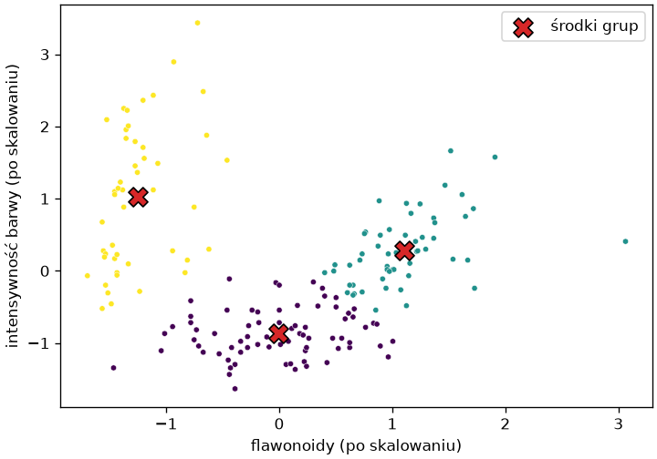
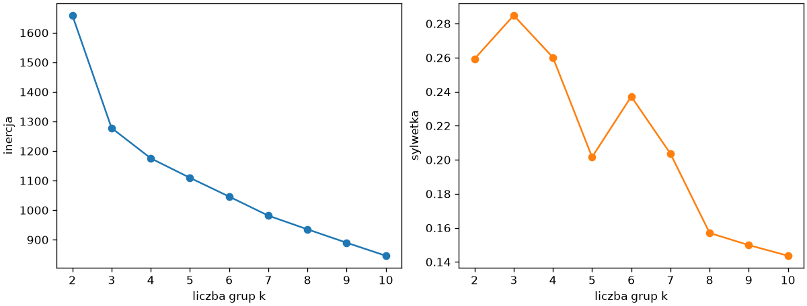
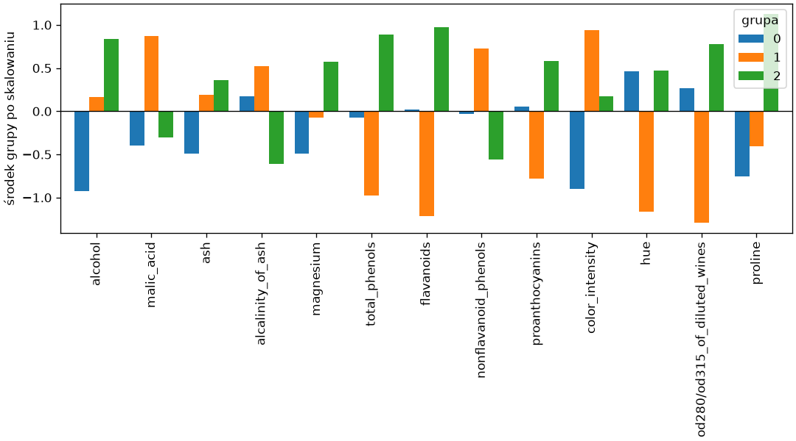
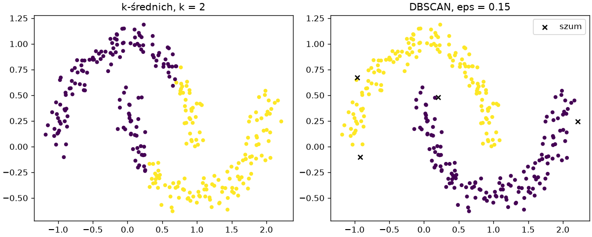

# Grupowanie

**Grupowanie** (ang. *clustering*) dzieli próbki na grupy tak, aby próbki w grupie były do siebie podobne, a między grupami — różne. Podobieństwo mierzy odległość w przestrzeni cech, więc wszystko, co dotyczyło skalowania przy KNN w rozdziale 7, obowiązuje i tutaj. Ten podrozdział omawia najprostszy algorytm na danych wine, których etykiety odmian znamy, ale modelom nie pokazujemy — posłużą wyłącznie do sprawdzenia, czy grupy znalezione bez nadzoru mają sens.

## Algorytm k-średnich krok po kroku

```python title="krok.py"
import matplotlib.pyplot as plt
import numpy as np
from sklearn.datasets import load_wine
from sklearn.preprocessing import StandardScaler

wine = load_wine(as_frame=True)
X = StandardScaler().fit_transform(wine.data[["flavanoids", "color_intensity"]])
rng = np.random.default_rng(42)
srodki = X[rng.choice(len(X), 3, replace=False)]
for krok in range(20):
    odleglosci = np.linalg.norm(X[:, None, :] - srodki[None, :, :], axis=2)
    grupa = odleglosci.argmin(axis=1)
    nowe = np.array([X[grupa == k].mean(axis=0) for k in range(3)])
    print(krok, np.bincount(grupa), round(float(np.abs(nowe - srodki).max()), 3))
    if np.allclose(nowe, srodki):
        break
    srodki = nowe
print(srodki.round(2))
print(round(float((odleglosci.min(axis=1) ** 2).sum()), 2))

fig, ax = plt.subplots(figsize=(6, 4.2), layout="constrained")
ax.scatter(X[:, 0], X[:, 1], c=grupa, cmap="viridis", s=14, edgecolor="white", linewidth=0.3)
ax.scatter(srodki[:, 0], srodki[:, 1], marker="X", s=160, c="tab:red", edgecolor="black", label="środki grup")
ax.set_xlabel("flawonoidy (po skalowaniu)")
ax.set_ylabel("intensywność barwy (po skalowaniu)")
ax.legend()
fig.savefig("krok.png", dpi=120)
```

```{ .text .no-copy }
0 [68 70 40] 0.889
1 [80 51 47] 0.567
2 [79 51 48] 0.113
3 [78 52 48] 0.013
4 [77 53 48] 0.013
5 [75 55 48] 0.027
6 [75 55 48] 0.0
[[-0.01 -0.87]
 [ 1.1   0.29]
 [-1.25  1.03]]
102.65
```

{ width="560" }

**Algorytm k-średnich** (ang. *k-means*) powtarza dwa kroki: przydziela każdą próbkę do najbliższego z `k` **środków** (ang. *centroid*), a potem przesuwa każdy środek do średniej przydzielonych mu próbek — aż środki przestaną się zmieniać. Przydział to macierz odległości z rozdziału 2: różnica tablic o kształtach `(178, 1, 2)` i `(1, 3, 2)` daje wektory od każdej próbki do każdego środka, norma wzdłuż ostatniej osi — odległości, `argmin` — numer najbliższego środka. Kolejne wiersze wyniku podają numer kroku, liczności grup i największe przesunięcie środka — tu algorytm zbiega w siedmiu krokach; dalej końcowe środki, a ostatni wiersz to **inercja** (ang. *inertia*): suma kwadratów odległości próbek od własnych środków, którą algorytm minimalizuje. Wynik zależy od losowego startu — inny start może skończyć w innym minimum lokalnym.

## `KMeans` na wszystkich cechach

```python title="kmeans.py"
import pandas as pd
from sklearn.cluster import KMeans
from sklearn.datasets import load_wine
from sklearn.metrics import adjusted_rand_score
from sklearn.pipeline import make_pipeline
from sklearn.preprocessing import StandardScaler

wine = load_wine(as_frame=True)
X, odmiana = wine.data, wine.target
dwie = StandardScaler().fit_transform(X[["flavanoids", "color_intensity"]])
for n_init in (1, 10):
    print(n_init, round(KMeans(n_clusters=3, init="random", n_init=n_init, random_state=0).fit(dwie).inertia_, 2))
potok = make_pipeline(StandardScaler(), KMeans(n_clusters=3, n_init=10, random_state=42)).fit(X)
grupy = potok[-1].labels_
print(potok[-1].n_iter_, round(potok[-1].inertia_, 1), potok[-1].cluster_centers_.shape)
print(pd.crosstab(grupy, odmiana, rownames=["grupa"], colnames=["odmiana"]))
print(round(adjusted_rand_score(odmiana, grupy), 3))
bez_skalowania = KMeans(n_clusters=3, n_init=10, random_state=42).fit(X)
print(round(adjusted_rand_score(odmiana, bez_skalowania.labels_), 3), X.std().idxmax(), round(X.std().max()))
print(potok.predict(X.iloc[:2]))
```

```{ .text .no-copy }
1 102.65
10 101.96
7 1277.9 (3, 13)
odmiana   0   1   2
grupa              
0         0  65   0
1         0   3  48
2        59   3   0
0.897
0.371 proline 315
[2 2]
```

`KMeans` wykonuje ten sam algorytm: `n_clusters` to `k`, `n_iter_` — liczba kroków, `labels_` — przydział próbek, `cluster_centers_` — środki (tu 3 × 13), a `predict()` przydziela nowe próbki do najbliższego środka, jak każdy model. Jeden losowy start kończy w tym samym minimum lokalnym co przebieg ręczny, a `n_init=10` uruchamia algorytm z dziesięciu startów i zachowuje przebieg o najmniejszej inercji — tu lepszej (domyślne `"auto"` oznacza jeden przebieg ze startem `k-means++`, który rozstawia początkowe środki daleko od siebie). Skalowanie jest konieczne: bez niego odległość wyznacza w praktyce sama prolina, której odchylenie wynosi 315 przy odchyleniach innych cech poniżej 15, i grupy przestają odpowiadać odmianom. Ocena z ukrytymi etykietami to tabela krzyżowa — tu z jedną dominującą liczbą w każdym wierszu, choć nie na przekątnej, bo numery grup są umowne — i **skorygowany indeks Randa** (ang. *adjusted Rand index*, ARI), niezależny od numeracji: 1 dla identycznego podziału, około 0 dla losowego. W prawdziwym zadaniu etykiet nie ma i ocena musi obejść się bez nich, o czym dalej.

## Liczba grup

```python title="liczba-grup.py"
import matplotlib.pyplot as plt
from sklearn.cluster import KMeans
from sklearn.datasets import load_wine
from sklearn.metrics import silhouette_score
from sklearn.preprocessing import StandardScaler

X = StandardScaler().fit_transform(load_wine().data)
liczby = range(2, 11)
inercje, sylwetki = [], []
for k in liczby:
    model = KMeans(n_clusters=k, n_init=10, random_state=42).fit(X)
    inercje.append(model.inertia_)
    sylwetki.append(silhouette_score(X, model.labels_))
print([round(i) for i in inercje])
print([round(s, 3) for s in sylwetki])

fig, (ax1, ax2) = plt.subplots(1, 2, figsize=(10, 3.8), layout="constrained")
ax1.plot(liczby, inercje, marker="o")
ax1.set_xlabel("liczba grup k")
ax1.set_ylabel("inercja")
ax2.plot(liczby, sylwetki, marker="o", color="tab:orange")
ax2.set_xlabel("liczba grup k")
ax2.set_ylabel("sylwetka")
fig.savefig("liczba-grup.png", dpi=120)
```

```{ .text .no-copy }
[1659, 1278, 1175, 1110, 1046, 982, 935, 890, 846]
[0.259, 0.285, 0.26, 0.202, 0.237, 0.204, 0.157, 0.15, 0.144]
```

{ width="760" }

Inercja maleje z każdą dodaną grupą — dla `k` równego liczbie próbek spada do zera — więc nie wybiera `k` sama; szukamy na jej wykresie „łokcia”, miejsca, od którego kolejne grupy dają już niewiele, a tu wypada on przy trzech grupach. **Sylwetka** (ang. *silhouette*) porównuje dla każdej próbki średnią odległość do własnej grupy `a` ze średnią odległością do najbliższej obcej grupy `b` jako `(b − a) / max(a, b)`: blisko 1, gdy próbka leży wyraźnie w swojej grupie, blisko 0 na granicy, ujemna, gdy pasuje bardziej do sąsiedniej. Średnia sylwetka jest tu najwyższa dla trzech grup, choć umiarkowana — grupy w rzeczywistych danych zachodzą na siebie. Obie miary są wskazówką; rozstrzyga cel: liczba segmentów, które odbiorca potrafi wykorzystać.

## Profile grup

```python title="profile.py"
import matplotlib.pyplot as plt
import pandas as pd
from sklearn.cluster import KMeans
from sklearn.datasets import load_wine
from sklearn.pipeline import make_pipeline
from sklearn.preprocessing import StandardScaler

X = load_wine(as_frame=True).data
potok = make_pipeline(StandardScaler(), KMeans(n_clusters=3, n_init=10, random_state=42)).fit(X)
grupy = potok[-1].labels_
print(pd.Series(grupy).value_counts().sort_index().to_dict())
wybrane = ["alcohol", "flavanoids", "color_intensity", "hue", "proline"]
print(X.assign(grupa=grupy).groupby("grupa")[wybrane].mean().round(2).to_string())
srodki = pd.DataFrame(potok[-1].cluster_centers_, columns=X.columns)

fig, ax = plt.subplots(figsize=(9, 5), layout="constrained")
srodki.T.plot.bar(ax=ax, width=0.8)
ax.axhline(0, color="black", linewidth=0.8)
ax.set_ylabel("środek grupy po skalowaniu")
ax.legend(title="grupa")
fig.savefig("profile.png", dpi=120)
```

```{ .text .no-copy }
{0: 65, 1: 51, 2: 62}
       alcohol  flavanoids  color_intensity   hue  proline
grupa                                                     
0        12.25        2.05             2.97  1.06   510.17
1        13.13        0.82             7.23  0.69   619.06
2        13.68        3.00             5.45  1.07  1100.23
```

{ width="760" }

Grupowanie kończy się opisem: `groupby()` z rozdziału 5 po numerze grupy podaje średnie w oryginalnych jednostkach, a środki po skalowaniu — na wykresie — mówią, które cechy odróżniają grupy od przeciętnej. Grupa 1 to wina o niskiej zawartości flawonoidów, intensywnej barwie i niskim odcieniu, grupa 2 — wina mocne, o wysokiej prolinie, grupa 0 — lżejsze i jaśniejsze. Nazwanie grup i ocena, czy taki podział jest użyteczny, należy do człowieka; algorytm dostarcza tylko podziału.

## Kształt grup — DBSCAN

```python title="ksztalt.py"
import matplotlib.pyplot as plt
import numpy as np
from sklearn.cluster import DBSCAN, KMeans
from sklearn.datasets import make_moons
from sklearn.metrics import adjusted_rand_score

X, prawdziwe = make_moons(n_samples=300, noise=0.08, random_state=42)
kmeans = KMeans(n_clusters=2, n_init=10, random_state=42).fit(X)
print(round(adjusted_rand_score(prawdziwe, kmeans.labels_), 3))
for eps in (0.1, 0.15, 0.2, 0.3):
    grupy = DBSCAN(eps=eps, min_samples=5).fit(X).labels_
    print(f"eps={eps:<5} grup {len(set(grupy)) - (-1 in grupy):>2}  szum {np.sum(grupy == -1):>2}  ARI {adjusted_rand_score(prawdziwe, grupy):.3f}")
grupy = DBSCAN(eps=0.15, min_samples=5).fit(X).labels_
szum = grupy == -1

fig, (ax1, ax2) = plt.subplots(1, 2, figsize=(10, 4), layout="constrained")
ax1.scatter(X[:, 0], X[:, 1], c=kmeans.labels_, cmap="viridis", s=14)
ax1.set_title("k-średnich, k = 2")
ax2.scatter(X[~szum, 0], X[~szum, 1], c=grupy[~szum], cmap="viridis", s=14)
ax2.scatter(X[szum, 0], X[szum, 1], marker="x", color="black", s=30, label="szum")
ax2.set_title("DBSCAN, eps = 0.15")
ax2.legend()
fig.savefig("ksztalt.png", dpi=120)
```

```{ .text .no-copy }
0.261
eps=0.1   grup 19  szum 60  ARI 0.109
eps=0.15  grup  2  szum  4  ARI 0.973
eps=0.2   grup  2  szum  0  ARI 1.000
eps=0.3   grup  2  szum  0  ARI 1.000
```

{ width="760" }

Algorytm k-średnich zakłada grupy zwarte i wypukłe wokół środków — każdą próbkę przydziela do najbliższego środka, więc granice między grupami są liniami prostymi — i dwa splecione półksiężyce przecina na pół. **DBSCAN** (ang. *density-based spatial clustering of applications with noise*) grupuje według gęstości: próbka jest **rdzeniem** (ang. *core point*), gdy w promieniu `eps` leży co najmniej `min_samples` próbek (wraz z nią samą), grupa rośnie od rdzenia przez sąsiadów, a próbki nieosiągalne z żadnego rdzenia dostają etykietę `-1` — szum. Nie wymaga podania liczby grup i odnajduje grupy dowolnego kształtu, ale jest czuły na `eps`: za mały rozbija dane na drobne fragmenty, za duży łączy wszystko w jedną grupę; nie ma też metody `predict()`. Takie kształty odnajduje też **grupowanie hierarchiczne** (ang. *hierarchical clustering*; `AgglomerativeClustering` z `linkage="single"`), które scala krok po kroku dwie najbliższe grupy. Domyślne `linkage="ward"` faworyzuje grupy zwarte i półksiężyców nie rozdziela. Wybór algorytmu zależy od kształtu grup i od tego, czy nowe próbki trzeba będzie przydzielać.
