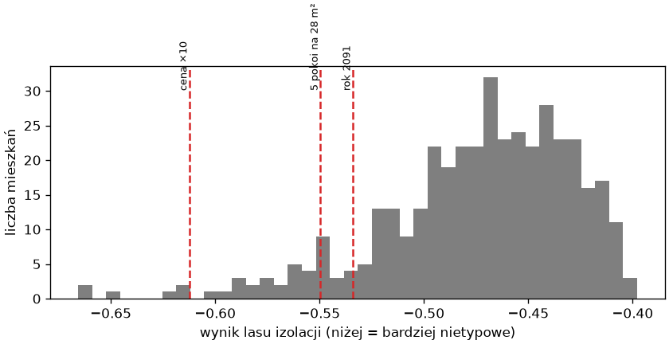
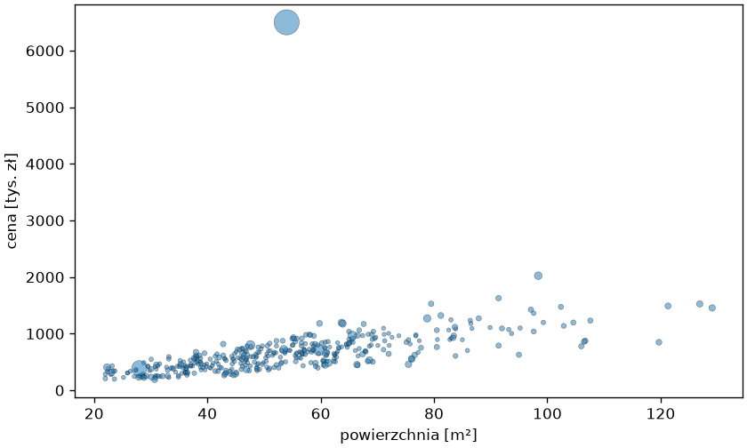

# Obserwacje nietypowe

**Obserwacja nietypowa**, inaczej **anomalia** (ang. *outlier*, *anomaly*), nie pasuje do reszty danych. Bywa błędem wprowadzania, jak ceny odstające w projekcie z rozdziału 6, bywa rzadkim, ale prawdziwym przypadkiem, bywa tym, czego szukamy: oszustwem, awarią, ofertą do sprawdzenia. Bez etykiet metoda może tylko uszeregować próbki według nietypowości; co z nimi zrobić, decyduje człowiek. Ten podrozdział wstrzykuje do danych o mieszkaniach trzy znane błędy i sprawdza, które z nich wykrywa reguła statystyczna, a które — dwie metody uczenia bez nadzoru.

## Błędy do wykrycia

```python title="bledy.py"
import pandas as pd

mieszkania = pd.read_csv("mieszkania.csv")
bledy = pd.DataFrame([
    {"dzielnica": "Podgórze", "powierzchnia": 54.0, "pokoje": 3, "pietro": 2, "rok_budowy": 2001.0, "stan": "dobry", "winda": False, "odleglosc_km": 3.9, "cena": 6500000.0},
    {"dzielnica": "Krowodrza", "powierzchnia": 28.0, "pokoje": 5, "pietro": 1, "rok_budowy": 1998.0, "stan": "dobry", "winda": False, "odleglosc_km": 3.1, "cena": 390000.0},
    {"dzielnica": "Nowa Huta", "powierzchnia": 61.0, "pokoje": 3, "pietro": 3, "rok_budowy": 2091.0, "stan": "po remoncie", "winda": True, "odleglosc_km": 8.5, "cena": 610000.0},
])
z_bledami = pd.concat([mieszkania, bledy], ignore_index=True)
z_bledami.to_csv("mieszkania-bledy.csv", index=False)
print(z_bledami.shape, z_bledami.index[-3:].tolist())
print(z_bledami.tail(3)[["dzielnica", "powierzchnia", "pokoje", "rok_budowy", "cena"]].to_string())
```

```{ .text .no-copy }
(403, 9) [400, 401, 402]
     dzielnica  powierzchnia  pokoje  rok_budowy       cena
400   Podgórze          54.0       3      2001.0  6500000.0
401  Krowodrza          28.0       5      1998.0   390000.0
402  Nowa Huta          61.0       3      2091.0   610000.0
```

Trzy dopisane wiersze — o indeksach 400–402 — udają typowe pomyłki: cena z dodatkowym zerem, pięć pokoi na 28 m² (każda wartość z osobna mieści się w zakresie, niemożliwe jest dopiero ich zestawienie) i rok budowy z przestawioną cyfrą. W tym ćwiczeniu znamy odpowiedzi (w danych rzeczywistych ich nie ma), więc metody oceniamy tak, jak model z nadzorem — czy odnajdują to, co wiemy, że jest błędem.

## Reguła statystyczna

```python title="regula.py"
import pandas as pd

mieszkania = pd.read_csv("mieszkania-bledy.csv")
cena_m2 = mieszkania["cena"] / mieszkania["powierzchnia"]
mediana = cena_m2.median()
mad = (cena_m2 - mediana).abs().median()
z = (cena_m2 - mediana) / (1.4826 * mad)
print(round(mediana), round(mad), mieszkania.index[z.abs() > 3].tolist(), round(z.iloc[400], 1), round(z.iloc[401], 1))
print(mieszkania.index[(mieszkania["rok_budowy"] < 1850) | (mieszkania["rok_budowy"] > 2026)].tolist())
na_pokoj = mieszkania["powierzchnia"] / mieszkania["pokoje"]
print(na_pokoj.describe().round(1)[["min", "25%", "50%", "75%", "max"]].to_dict(), round(na_pokoj.iloc[401], 1))
```

```{ .text .no-copy }
11876 2096 [400] 34.9 0.7
[402]
{'min': 5.6, '25%': 19.0, '50%': 22.3, '75%': 26.7, 'max': 65.6} 5.6
```

Najprostsza metoda to reguła na jednej wielkości: cena za metr odległa od mediany o więcej niż trzy odchylenia. Zamiast średniej i odchylenia standardowego bierzemy medianę i **medianowe odchylenie bezwzględne** (ang. *median absolute deviation*, MAD, pomnożone przez 1,4826, aby dla rozkładu normalnego odpowiadało odchyleniu standardowemu), bo sam błąd zawyżyłby średnią i odchylenie i mógłby się za nimi ukryć. Reguła wskazuje dokładnie jeden wiersz — cenę z dodatkowym zerem, odległą o 35 odchyleń — a kontrola zakresu lat wskazuje rok 2091. Zestawienie pięciu pokoi z 28 m² przechodzi, bo jego cena za metr jest zwyczajna; wykryłaby je reguła na powierzchnię na pokój — 5,6 m² to minimum w zbiorze — ale taką regułę trzeba najpierw wymyślić, osobno dla każdego zestawienia cech. Reguły są przejrzyste i tanie, dlatego zaczynamy od nich zawsze, gdy dziedzina je podsuwa; metody poniżej szukają nietypowych zestawień cech bez podpowiedzi.

## Las izolacji

```python title="izolacja.py"
import matplotlib.pyplot as plt
import numpy as np
import pandas as pd
from sklearn.ensemble import IsolationForest

mieszkania = pd.read_csv("mieszkania-bledy.csv")
cechy = ["powierzchnia", "pokoje", "pietro", "rok_budowy", "odleglosc_km", "cena"]
las = IsolationForest(n_estimators=200, random_state=42).fit(mieszkania[cechy])
wynik = las.score_samples(mieszkania[cechy])
print(wynik.min().round(3), np.median(wynik).round(3), wynik[-3:].round(3))
print(pd.Series(wynik).rank().astype(int).iloc[-3:].tolist())
print(mieszkania.assign(wynik=wynik.round(3)).nsmallest(5, "wynik")[["dzielnica", "powierzchnia", "pokoje", "rok_budowy", "cena", "wynik"]].to_string())
print((las.predict(mieszkania[cechy]) == -1).sum(), round(las.offset_, 3))
las_2 = IsolationForest(n_estimators=200, contamination=0.02, random_state=42).fit(mieszkania[cechy])
flagi = las_2.predict(mieszkania[cechy]) == -1
print(flagi.sum(), mieszkania.index[flagi].tolist())

fig, ax = plt.subplots(figsize=(7, 3.6), layout="constrained")
ax.hist(wynik, bins=40, color="tab:gray")
for i, etykieta in zip(range(400, 403), ["cena ×10", "5 pokoi na 28 m²", "rok 2091"]):
    ax.axvline(wynik[i], color="tab:red", linestyle="--")
    ax.annotate(etykieta, (wynik[i], 30), rotation=90, va="bottom", ha="right", fontsize=8)
ax.set_xlabel("wynik lasu izolacji (niżej = bardziej nietypowe)")
ax.set_ylabel("liczba mieszkań")
fig.savefig("izolacja.png", dpi=120)
```

```{ .text .no-copy }
-0.666 -0.468 [-0.612 -0.55  -0.534]
[6, 32, 42]
     dzielnica  powierzchnia  pokoje  rok_budowy       cena  wynik
245  Bronowice         126.9       5      2005.0  1525000.0 -0.666
206    Centrum          98.4       5      1975.0  2024000.0 -0.662
256  Nowa Huta         106.7       5      1963.0   873000.0 -0.646
93    Podgórze         129.1       5      1963.0  1455000.0 -0.621
120  Krowodrza         121.3       5      1970.0  1490000.0 -0.617
93 -0.5
9 [93, 120, 167, 203, 206, 245, 256, 290, 400]
```

{ width="640" }

**Las izolacji** (ang. *isolation forest*) buduje losowe drzewa, w których każdy podział wybiera losową cechę i losowy próg. Próbka nietypowa zostaje odcięta od reszty po kilku podziałach, typowa potrzebuje ich wielu — `score_samples()` przelicza średnią głębokość na wynik, tym niższy, im łatwiej próbkę wyizolować. Cena z dodatkowym zerem trafia do ogona (szóste miejsce od dołu), dwa pozostałe błędy — na skraj głównej masy rozkładu (miejsca 32 i 42 wśród 403), a najniżej wypadają duże pięciopokojowe mieszkania: rzadkie, lecz prawdziwe. Las mierzy rzadkość, nie błędność, dlatego jego wynik jest listą do przejrzenia, nie werdyktem. `predict()` zwraca `-1` dla próbek poniżej progu, który domyślne `contamination="auto"` ustawia na wynik −0,5 — tu oznacza to niemal jedną czwartą mieszkań; próg lepiej zadać jawnie jako oczekiwany udział anomalii (`contamination=0.02` flaguje dziewięć mieszkań, w tym błędną cenę) albo pracować na samych wynikach. Las nie wymaga skalowania (podziały są progami na pojedynczych cechach), przyjmuje braki (rok budowy z `NaN`) i ma `predict()` dla nowych próbek.

## Lokalny współczynnik odstawania

```python title="lof.py"
import matplotlib.pyplot as plt
import numpy as np
import pandas as pd
from sklearn.neighbors import LocalOutlierFactor
from sklearn.preprocessing import StandardScaler

mieszkania = pd.read_csv("mieszkania-bledy.csv")
cechy = ["powierzchnia", "pokoje", "cena"]
skaler = StandardScaler().fit(mieszkania[cechy])
X = skaler.transform(mieszkania[cechy])
lof = LocalOutlierFactor(n_neighbors=20)
flagi = lof.fit_predict(X) == -1
czynnik = -lof.negative_outlier_factor_
print(flagi.sum(), czynnik[-3:].round(2), pd.Series(czynnik).rank(ascending=False).astype(int).iloc[-3:].tolist())
print(mieszkania.assign(LOF=czynnik.round(2)).nlargest(4, "LOF")[["dzielnica", "powierzchnia", "pokoje", "cena", "LOF"]].to_string())
nowosci = LocalOutlierFactor(n_neighbors=20, novelty=True).fit(X[:400])
nowe = pd.DataFrame({"powierzchnia": [50.0, 50.0, 140.0], "pokoje": [2, 2, 5], "cena": [600000, 2500000, 500000]})
print(nowosci.predict(skaler.transform(nowe)), nowosci.score_samples(skaler.transform(nowe)).round(2))

fig, ax = plt.subplots(figsize=(7, 4.2), layout="constrained")
ax.scatter(mieszkania["powierzchnia"], mieszkania["cena"] / 1000, s=8 * np.minimum(czynnik, 6) ** 2, alpha=0.5, edgecolor="black", linewidth=0.3)
ax.set_xlabel("powierzchnia [m²]")
ax.set_ylabel("cena [tys. zł]")
fig.savefig("lof.png", dpi=120)
```

```{ .text .no-copy }
21 [11.55  3.63  0.96] [1, 2, 389]
     dzielnica  powierzchnia  pokoje       cena    LOF
400   Podgórze          54.0       3  6500000.0  11.55
401  Krowodrza          28.0       5   390000.0   3.63
43    Podgórze          59.7       1   709000.0   2.58
192    Centrum          47.6       1   797000.0   2.19
[ 1 -1 -1] [-0.97 -5.28 -2.11]
```

{ width="640" }

**Lokalny współczynnik odstawania** (ang. *local outlier factor*, LOF) porównuje gęstość otoczenia próbki z gęstością otoczeń jej `n_neighbors` sąsiadów: współczynnik bliski 1 oznacza próbkę tak samo „gęstą” jak sąsiedzi, znacznie większy — próbkę leżącą samotnie. Metoda opiera się na odległości, więc wymaga skalowania i nie przyjmuje braków — rok budowy zostaje poza cechami i błąd w nim jest tu niewidoczny; z pozostałych cech bierzemy trzy, bo w większej liczbie wymiarów odległości się wyrównują i kontrast współczynnika słabnie. Za to dwa pozostałe błędy zajmują dwa pierwsze miejsca: także pięć pokoi na 28 m², bo w otoczeniu mieszkań o tej powierzchni nie ma innych z tyloma pokojami — nietypowe zestawienie, którego reguła na jednej wielkości nie widziała. `LocalOutlierFactor` ma dwa tryby: domyślny ocenia próbki, na których został dopasowany (`fit_predict()` z `contamination="auto"` flaguje współczynnik powyżej 1,5 — tu 21 mieszkań), a `novelty=True` uczy się na danych uznanych za czyste i ocenia nowe (`predict()`, `score_samples()`) — to **wykrywanie nowości** (ang. *novelty detection*), właściwe do sprawdzania napływających ofert: mieszkanie 50 m² za 600 tysięcy przechodzi, za 2,5 miliona nie, podobnie jak 140 m² za 500 tysięcy; `score_samples()` zwraca współczynnik ze znakiem ujemnym, więc jak w lesie izolacji niższy wynik oznacza próbkę bardziej nietypową.

## Kiedy uczenie bez nadzoru

Metody tego rozdziału mają trzy zastosowania. Przed modelowaniem — grupowanie i rzut t-SNE pokazują, czy dane mają strukturę i jaką, a profile grup dostarczają opisu segmentów zrozumiałego dla odbiorcy. W przygotowaniu danych — PCA w potoku zastępuje skorelowane cechy nieskorelowanymi składowymi, co upraszcza model i przywraca sens ważności cech. W kontroli jakości — wykrywanie anomalii wskazuje, co sprawdzić przed treningiem, a wykrywanie nowości pilnuje danych napływających do gotowego modelu. Wspólna trudność to ocena bez etykiet: pozostają miary wewnętrzne (sylwetka, udział wariancji), stabilność wyniku przy innym ziarnie lub podzbiorze danych, ukryte etykiety, gdy istnieją, i przede wszystkim użyteczność — segmenty, które zmieniają decyzje, składowe, które poprawiają model z nadzorem, lista anomalii, w której człowiek znajduje błędy. Liczba grup, promień `eps` i udział anomalii są wyborami, nie odkryciami, i trzeba je zapisać razem z uzasadnieniem.

## Lista kontrolna uczenia bez nadzoru

- **Skalowanie** przed każdą metodą opartą na odległości lub wariancji: k-średnich, DBSCAN, PCA, LOF; las izolacji go nie potrzebuje.
- **Liczba grup**: sylwetka i łokieć jako wskazówki, cel jako rozstrzygnięcie; `n_init` dla k-średnich; DBSCAN, gdy grupy mają nieregularny kształt.
- **Profil grup** w oryginalnych jednostkach i nazwy nadane przez człowieka.
- **PCA**: udział wariancji i ładunki; dopasowanie tylko na zbiorze treningowym w potoku; t-SNE wyłącznie do oglądania.
- **Anomalie**: najpierw reguły z dziedziny, potem ranking (las izolacji, LOF); `contamination` zadane jawnie; rzadkość to nie błąd — decyzja należy do człowieka.
- **Ocena bez etykiet**: stabilność, użyteczność, ukryte etykiety, gdy są.

## Dalej: sieci neuronowe

Wszystkie modele ścieżki były dotąd gotowymi klasami scikit-learn. Następny rozdział schodzi poziom niżej — do biblioteki PyTorch, w której model buduje się z tensorów i warstw, a trening z pętli i automatycznego różniczkowania; to droga do sieci neuronowych, które rozpoznają obrazy takie jak cyfry z tego rozdziału — [rozdział o PyTorch](../11-pytorch/index.md).
