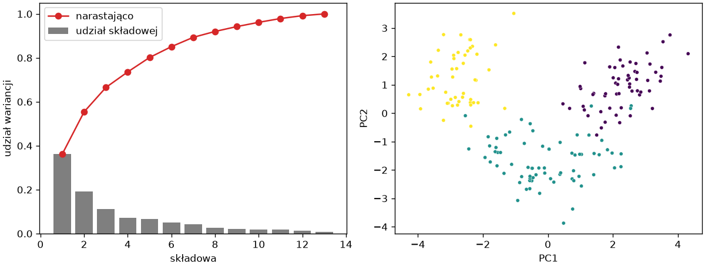
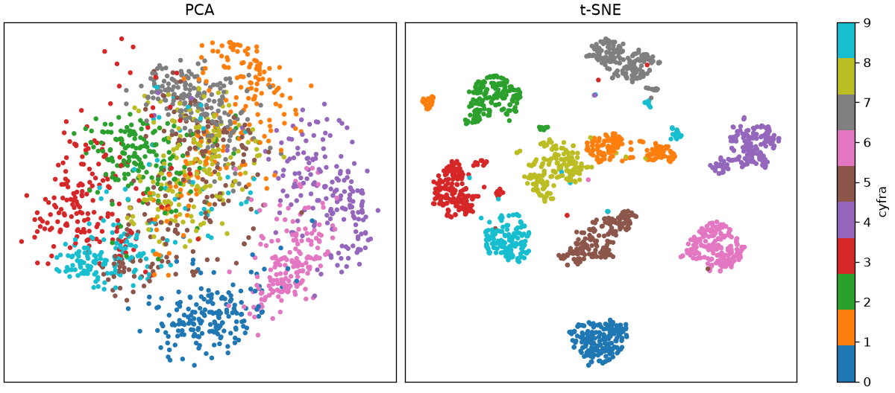

# Redukcja wymiaru

Trzynastu cech wina nie da się narysować, a trzydzieści cech guza w rozdziale 8 było tak skorelowanych, że żadna z osobna nie okazała się niezbędna. **Redukcja wymiaru** (ang. *dimensionality reduction*) zastępuje wiele cech kilkoma nowymi, które zachowują jak najwięcej informacji — do oglądania danych na płaszczyźnie i do uproszczenia modeli z nadzorem. Jej istotę — wartości własne macierzy kowariancji — pokazał rozdział 2; tu liczy je scikit-learn.

## Analiza głównych składowych

```python title="pca.py"
import matplotlib.pyplot as plt
import numpy as np
from sklearn.datasets import load_wine
from sklearn.decomposition import PCA
from sklearn.preprocessing import StandardScaler

wine = load_wine(as_frame=True)
X = StandardScaler().fit_transform(wine.data)
pca = PCA().fit(X)
udzialy = pca.explained_variance_ratio_
print(udzialy.round(3))
print(np.cumsum(udzialy).round(2))
print(PCA(n_components=0.95).fit(X).n_components_)
Z = pca.transform(X)
print(Z.shape, Z[:, :2].std(axis=0).round(2), round(float(np.corrcoef(Z[:, 0], Z[:, 1])[0, 1]), 3))

fig, (ax1, ax2) = plt.subplots(1, 2, figsize=(10, 3.8), layout="constrained")
numery = np.arange(1, len(udzialy) + 1)
ax1.bar(numery, udzialy, color="tab:gray", label="udział składowej")
ax1.plot(numery, np.cumsum(udzialy), marker="o", color="tab:red", label="narastająco")
ax1.set_xlabel("składowa")
ax1.set_ylabel("udział wariancji")
ax1.legend()
ax2.scatter(Z[:, 0], Z[:, 1], c=wine.target, cmap="viridis", s=14, edgecolor="white", linewidth=0.3)
ax2.set_xlabel("PC1")
ax2.set_ylabel("PC2")
fig.savefig("pca.png", dpi=120)
```

```{ .text .no-copy }
[0.362 0.192 0.111 0.071 0.066 0.049 0.042 0.027 0.022 0.019 0.017 0.013
 0.008]
[0.36 0.55 0.67 0.74 0.8  0.85 0.89 0.92 0.94 0.96 0.98 0.99 1.  ]
10
(178, 13) [2.17 1.58] -0.0
```

{ width="760" }

**Analiza głównych składowych** (ang. *principal component analysis*, PCA) obraca układ współrzędnych tak, aby pierwsza oś biegła w kierunku największego rozrzutu danych, druga — największego pozostałego rozrzutu prostopadle do pierwszej, i tak dalej. Każda nowa oś to **składowa** (ang. *component*), a wariancja wzdłuż niej to jej **wariancja wyjaśniona** (ang. *explained variance*); `explained_variance_ratio_` podaje ją jako udział całej wariancji: dwie pierwsze niosą 55%, do 95% potrzeba dziesięciu — `n_components` przyjmuje liczbę składowych albo ułamek wariancji do zachowania. **Wykres osypiska** (ang. *scree plot*) pokazuje, jak szybko udziały maleją. `transform()` rzutuje próbki na składowe — bez `n_components` na wszystkie trzynaście; nowe współrzędne mają malejące odchylenia (2,17 i 1,58 dla dwóch pierwszych) i są z konstrukcji nieskorelowane. Rzut na dwie pierwsze składowe — pokolorowany ukrytymi etykietami — pokazuje trzy rozdzielone chmury: to dlatego grupowanie z poprzedniego podrozdziału odtworzyło odmiany.

## Składowe i skalowanie

```python title="skladowe.py"
import numpy as np
import pandas as pd
from sklearn.datasets import load_wine
from sklearn.decomposition import PCA
from sklearn.preprocessing import StandardScaler

wine = load_wine(as_frame=True)
X = StandardScaler().fit_transform(wine.data)
pca = PCA(n_components=2).fit(X)
ladunki = pd.DataFrame(pca.components_.T, index=wine.data.columns, columns=["PC1", "PC2"]).round(2)
print(ladunki.sort_values("PC1").to_string())
wartosci, wektory = np.linalg.eigh(np.cov(X, rowvar=False))
print(wartosci[::-1][:2].round(3), pca.explained_variance_.round(3))
print(np.abs(wektory[:, -1]).round(2)[:3], np.abs(pca.components_[0]).round(2)[:3])
bez_skalowania = PCA(n_components=2).fit(wine.data)
print(bez_skalowania.explained_variance_ratio_.round(3), wine.data.std().idxmax())
```

```{ .text .no-copy }
                               PC1   PC2
nonflavanoid_phenols         -0.30  0.03
malic_acid                   -0.25  0.22
alcalinity_of_ash            -0.24 -0.01
color_intensity              -0.09  0.53
ash                          -0.00  0.32
alcohol                       0.14  0.48
magnesium                     0.14  0.30
proline                       0.29  0.36
hue                           0.30 -0.28
proanthocyanins               0.31  0.04
od280/od315_of_diluted_wines  0.38 -0.16
total_phenols                 0.39  0.07
flavanoids                    0.42 -0.00
[4.732 2.511] [4.732 2.511]
[0.14 0.25 0.  ] [0.14 0.25 0.  ]
[0.998 0.002] proline
```

`components_` przechowuje składowe wierszami: każdy wiersz to **ładunki** (ang. *loadings*) — wagi, z jakimi cechy oryginalne składają się na składową. PC1 przeciwstawia flawonoidy, fenole i stosunek absorbancji OD280/OD315 fenolom nieflawonoidowym i kwasowi jabłkowemu — jest osią „bogactwa fenolowego” win; PC2 łączy intensywność barwy, alkohol i prolinę — osią mocy i barwy. To dokładnie rachunek z rozdziału 2: wartości własne macierzy kowariancji równają się `explained_variance_`, a wektory własne — ładunkom (co do znaku, który jest umowny). Bez skalowania pierwsza składowa wyjaśnia 99,8% wariancji, bo jest po prostu proliną — cechą o największym odchyleniu; PCA na cechach w różnych jednostkach wymaga skalowania tak samo jak k-średnich.

## PCA w potoku — cechy skorelowane

```python title="pca-potok.py"
import numpy as np
import pandas as pd
from sklearn.datasets import load_breast_cancer
from sklearn.decomposition import PCA
from sklearn.inspection import permutation_importance
from sklearn.linear_model import LogisticRegression
from sklearn.metrics import roc_auc_score
from sklearn.model_selection import StratifiedKFold, cross_val_score, train_test_split
from sklearn.pipeline import make_pipeline
from sklearn.preprocessing import StandardScaler

rak = load_breast_cancer(as_frame=True)
X, y = rak.data, (rak.target == 0).astype(int)
X_trening, X_test, y_trening, y_test = train_test_split(X, y, test_size=0.25, random_state=42, stratify=y)
podzialy = StratifiedKFold(n_splits=5, shuffle=True, random_state=42)
for n in (1, 2, 5, 10, 30):
    potok = make_pipeline(StandardScaler(), PCA(n_components=n), LogisticRegression(max_iter=1000))
    print(n, round(cross_val_score(potok, X_trening, y_trening, cv=podzialy, scoring="roc_auc").mean(), 4))
przygotowanie = make_pipeline(StandardScaler(), PCA(n_components=5)).set_output(transform="pandas").fit(X_trening)
Z_trening, Z_test = przygotowanie.transform(X_trening), przygotowanie.transform(X_test)
print(Z_trening.columns.tolist(), round(przygotowanie[-1].explained_variance_ratio_.sum(), 3))
poza_przekatna = lambda ramka: round(float(ramka.corr().abs().where(~np.eye(ramka.shape[1], dtype=bool)).max().max()), 3)
print(poza_przekatna(X_trening), poza_przekatna(Z_trening))
model = LogisticRegression(max_iter=1000).fit(Z_trening, y_trening)
print(round(roc_auc_score(y_test, model.predict_proba(Z_test)[:, 1]), 4))
wynik = permutation_importance(model, Z_test, y_test, scoring="roc_auc", n_repeats=30, random_state=42)
print(pd.Series(wynik.importances_mean, index=Z_test.columns).round(3).to_dict())
print(pd.Series(przygotowanie[-1].components_[0], index=X.columns).abs().sort_values(ascending=False).head(4).round(2).to_dict())
```

```{ .text .no-copy }
1 0.9625
2 0.9874
5 0.9932
10 0.9934
30 0.9914
['pca0', 'pca1', 'pca2', 'pca3', 'pca4'] 0.849
0.998 0.0
0.9973
{'pca0': 0.46, 'pca1': 0.034, 'pca2': 0.003, 'pca3': 0.003, 'pca4': 0.002}
{'mean concave points': 0.26, 'mean concavity': 0.26, 'worst concave points': 0.25, 'mean compactness': 0.24}
```

W potoku PCA jest transformatorem jak skaler: uczy się kierunków na zbiorze treningowym i te same stosuje do testu. Pięć składowych zamiast trzydziestu cech zachowuje 85% wariancji, a regresja logistyczna na nich osiąga w walidacji krzyżowej AUC nie gorsze niż na wszystkich cechach, a na zbiorze testowym 0,997 — reszta wariancji to szum i powtórzenia. Najsilniejsza korelacja między cechami wynosiła 0,998; między składowymi jest zerowa. Dlatego ważność permutacyjna z rozdziału 8, która dla pojedynczych cech dawała same małe liczby, tu odpowiada jednoznacznie: prawie cały wynik niesie pierwsza składowa, a jej ładunki mówią, że jest to wspólna oś kształtu guza: wklęsłości i zwartości konturu. Cena redukcji to interpretacja: składowa nie jest cechą, którą lekarz zmierzy, tylko ich kombinacją odczytywaną z ładunków.

## Wizualizacja — t-SNE

```python title="tsne.py"
import matplotlib.pyplot as plt
from sklearn.datasets import load_digits
from sklearn.decomposition import PCA
from sklearn.manifold import TSNE
from sklearn.model_selection import cross_val_score
from sklearn.neighbors import KNeighborsClassifier

cyfry = load_digits()
print(cyfry.data.shape, cyfry.images.shape, cyfry.target[:8])
pca = PCA(n_components=2).fit(cyfry.data)
Z_pca = pca.transform(cyfry.data)
print(pca.explained_variance_ratio_.round(3))
Z_tsne = TSNE(n_components=2, perplexity=30, init="pca", random_state=42).fit_transform(cyfry.data)
for nazwa, Z in (("PCA", Z_pca), ("t-SNE", Z_tsne)):
    print(nazwa, round(cross_val_score(KNeighborsClassifier(n_neighbors=5), Z, cyfry.target, cv=5).mean(), 3))
print(hasattr(TSNE(), "transform"))

fig, osie = plt.subplots(1, 2, figsize=(10, 4.4), layout="constrained")
for ax, (nazwa, Z) in zip(osie, (("PCA", Z_pca), ("t-SNE", Z_tsne))):
    punkty = ax.scatter(Z[:, 0], Z[:, 1], c=cyfry.target, cmap="tab10", s=8)
    ax.set_title(nazwa)
    ax.set_xticks([])
    ax.set_yticks([])
fig.colorbar(punkty, ax=osie, ticks=range(10), label="cyfra")
fig.savefig("tsne.png", dpi=120)
```

```{ .text .no-copy }
(1797, 64) (1797, 8, 8) [0 1 2 3 4 5 6 7]
[0.149 0.136]
PCA 0.603
t-SNE 0.976
False
```

{ width="760" }

Obraz 8 × 8 pikseli to wektor 64 cech; ich skalowanie nie jest potrzebne, bo wszystkie są jasnościami w tej samej skali 0–16. PCA zachowuje w dwóch wymiarach 28,5% wariancji i cyfry na rzucie zachodzą na siebie. **t-SNE** (ang. *t-distributed stochastic neighbor embedding*) nie zachowuje wariancji, lecz sąsiedztwo: układa punkty na płaszczyźnie tak, aby próbki bliskie w 64 wymiarach pozostały blisko — i rozdziela cyfry na osobne wyspy, jedynkę nawet na dwie. Miarą jakości obu rzutów jest tu dokładność KNN na dwóch współrzędnych: 0,60 wobec 0,98. Rzut t-SNE służy wyłącznie do oglądania: nie ma metody `transform()` dla nowych próbek, odległości między wyspami i ich wielkości nie mają znaczenia, a `perplexity` — przybliżona liczba branych pod uwagę sąsiadów — zmienia obraz. Podobnie działa UMAP, dostępny jako osobny pakiet.
