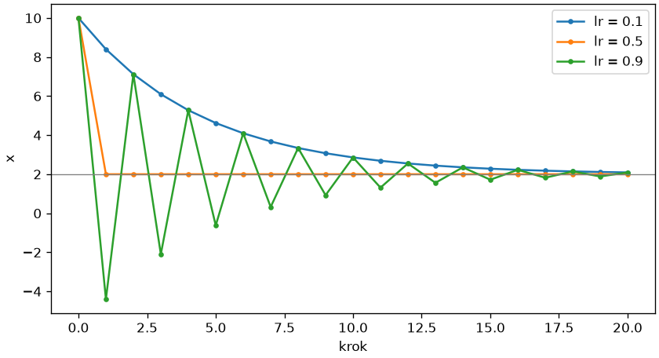
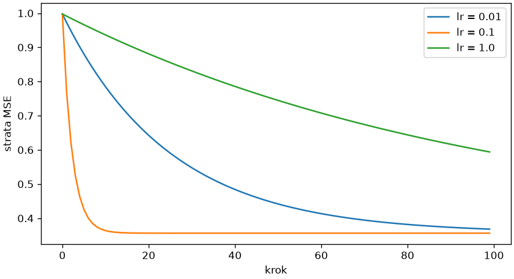

# Automatyczne różniczkowanie

Trening sieci to minimalizacja **funkcji straty** (ang. *loss function*), miary błędu modelu, względem tysięcy wag. Rozdział 2 rozwiązał zadanie najmniejszych kwadratów wprost (`lstsq`); dla sieci wzoru nie ma i pozostaje **spadek gradientu** (ang. *gradient descent*): liczymy pochodne straty po wagach i przesuwamy wagi w stronę malejącej straty. Pochodne dostarcza **automatyczne różniczkowanie** (ang. *automatic differentiation*, autograd): PyTorch zapisuje operacje na śledzonych tensorach i przechodzi je wstecz regułą łańcuchową.

## Gradient

```python title="gradient.py"
import torch

x = torch.tensor(3.0, requires_grad=True)
y = x ** 2 + 2 * x
print(y.item(), type(y.grad_fn).__name__)
y.backward()
print(x.grad.item())
(x ** 2 + 2 * x).backward()
print(x.grad.item())
x.grad.zero_()
print(x.grad.item())
w = torch.tensor([1.0, 2.0], requires_grad=True)
(w ** 2).sum().backward()
print(w.grad)
with torch.no_grad():
    podwojone = w * 2
print(podwojone.requires_grad, w.detach().requires_grad)
try:
    w.numpy()
except RuntimeError as blad:
    print("RuntimeError:", str(blad)[:60])
```

```{ .text .no-copy }
15.0 AddBackward0
8.0
16.0
0.0
tensor([2., 4.])
False False
RuntimeError: Can't call numpy() on Tensor that requires grad. Use tensor.
```

`requires_grad=True` każe śledzić operacje na tensorze: wynik `y` pamięta w `grad_fn` operację, która go utworzyła (`AddBackward0` — dodawanie), a `y.backward()` liczy pochodną `y` po każdym tensorze ze śledzeniem i zapisuje ją w jego atrybucie `grad` — dla `y = x² + 2x` w punkcie 3 jest to `2x + 2 = 8`. Gradienty się **kumulują**: drugie `backward()` dodaje kolejne 8, dlatego przed każdym krokiem treningu gradient zerujemy. Dla tensora wielowymiarowego `grad` ma jego kształt — pochodne cząstkowe po każdym elemencie. Blok `torch.no_grad()` wyłącza śledzenie (przy ocenie modelu oszczędza pamięć i czas), `detach()` zwraca tensor odcięty od historii, a `numpy()` tensora ze śledzeniem odmawia — trzeba go najpierw odciąć.

## Spadek gradientu

```python title="spadek.py"
import matplotlib.pyplot as plt
import torch


def minimalizuj(start, lr, kroki=20):
    x = torch.tensor(start, requires_grad=True)
    sciezka = [x.item()]
    for _ in range(kroki):
        f = (x - 2) ** 2 + 1
        f.backward()
        with torch.no_grad():
            x -= lr * x.grad
        x.grad.zero_()
        sciezka.append(x.item())
    return sciezka


sciezki = {lr: minimalizuj(10.0, lr) for lr in (0.1, 0.5, 0.9, 1.1)}
for lr, sciezka in sciezki.items():
    print(lr, [round(v, 2) for v in sciezka[:4]], round(sciezka[-1], 4))

fig, ax = plt.subplots(figsize=(7, 3.8), layout="constrained")
for lr in (0.1, 0.5, 0.9):
    ax.plot(sciezki[lr], marker="o", markersize=3, label=f"lr = {lr}")
ax.axhline(2, color="gray", linewidth=0.8)
ax.set_xlabel("krok")
ax.set_ylabel("x")
ax.legend()
fig.savefig("spadek.png", dpi=120)
```

```{ .text .no-copy }
0.1 [10.0, 8.4, 7.12, 6.1] 2.0922
0.5 [10.0, 2.0, 2.0, 2.0] 2.0
0.9 [10.0, -4.4, 7.12, -2.1] 2.0922
1.1 [10.0, -7.6, 13.52, -11.82] 308.701
```

{ width="640" }

Spadek gradientu powtarza jeden krok: `x ← x − lr · f′(x)`. Pochodna wskazuje kierunek najszybszego wzrostu, więc krok w przeciwną stronę obniża funkcję; **współczynnik uczenia** (ang. *learning rate*, `lr`) decyduje o długości kroku. Dla paraboli `f′(x) = 2(x − 2)`: `lr = 0.5` trafia w minimum jednym krokiem, `0.1` zbliża się powoli i po dwudziestu krokach jeszcze nie dochodzi, `0.9` przeskakuje minimum i zbiega, oscylując, a `1.1` oddala się z każdym krokiem. Po dwudziestu krokach `0.1` i `0.9` dają tę samą wartość, bo każdy krok mnoży odległość od minimum przez `1 − 2 · lr`, czyli przez `0.8` albo `−0.8`. Aktualizację wykonujemy w `no_grad()`, bo sama nie ma być śledzona, i zerujemy gradient przed kolejnym `backward()`. Ten sam schemat, z wagami sieci zamiast `x` i stratą zamiast `f`, jest całym treningiem.

## Regresja liniowa pętlą

```python title="regresja-gradient.py"
import matplotlib.pyplot as plt
import numpy as np
import pandas as pd
import torch

mieszkania = pd.read_csv("mieszkania.csv")
powierzchnia = torch.tensor(mieszkania["powierzchnia"].to_numpy(), dtype=torch.float32)
cena = torch.tensor(mieszkania["cena"].to_numpy(), dtype=torch.float32)
x = (powierzchnia - powierzchnia.mean()) / powierzchnia.std()
y = (cena - cena.mean()) / cena.std()


def dopasuj(lr, kroki=100):
    w = torch.zeros(1, requires_grad=True)
    b = torch.zeros(1, requires_grad=True)
    straty = []
    for _ in range(kroki):
        przewidziane = w * x + b
        strata = ((przewidziane - y) ** 2).mean()
        strata.backward()
        with torch.no_grad():
            w -= lr * w.grad
            b -= lr * b.grad
        w.grad.zero_()
        b.grad.zero_()
        straty.append(strata.item())
    return w.item(), b.item(), straty


wyniki = {lr: dopasuj(lr) for lr in (0.01, 0.1, 1.0)}
for lr, (w, b, straty) in wyniki.items():
    print(lr, round(w, 4), round(b, 4), round(straty[-1], 4))
print(np.linalg.lstsq(np.c_[x.numpy(), np.ones(len(x))], y.numpy(), rcond=None)[0].round(4))
w = wyniki[0.1][0]
print(round(w * cena.std().item() / powierzchnia.std().item()), round(float(np.corrcoef(mieszkania["powierzchnia"], mieszkania["cena"])[0, 1]), 4))

fig, ax = plt.subplots(figsize=(7, 3.8), layout="constrained")
for lr, (_, _, straty) in wyniki.items():
    ax.plot(straty, label=f"lr = {lr}")
ax.set_xlabel("krok")
ax.set_ylabel("strata MSE")
ax.legend()
fig.savefig("strata.png", dpi=120)
```

```{ .text .no-copy }
0.01 0.6949 0.0 0.3682
0.1 0.8018 0.0 0.3563
1.0 0.3161 0.0 0.594
[0.8018 0.    ]
11588 0.8018
```

{ width="640" }

Regresja ceny od powierzchni to ta sama pętla z dwoma parametrami: `w` i `b` zaczynają od zera, strata to **błąd średniokwadratowy** (ang. *mean squared error*, MSE), czyli kwadrat RMSE z rozdziału 9, a `backward()` liczy obie pochodne cząstkowe naraz. Obie zmienne standaryzujemy, bo bez tego gradienty po `w` i `b` różniłyby się skalą o rzędy wielkości i żaden wspólny `lr` nie pasowałby do obu. Wynik dla `lr = 0.1` po stu krokach zgadza się z rozwiązaniem najmniejszych kwadratów z rozdziału 2 (`lstsq`) — na danych standaryzowanych nachylenie równa się korelacji, wyraz wolny zaś zeru — a przeliczone na złote daje około 11,6 tysiąca złotych za metr; `lr = 0.01` jest daleki od minimum, `lr = 1.0` w każdym kroku przeskakuje je na drugą stronę (`w` oscyluje wokół 0,8 i zbiega najwolniej, choć strata, zależna tylko od odległości od minimum, maleje gładko), a większy rozbiegłby się jak w poprzednim skrypcie. Dobór `lr` jest pierwszym hiperparametrem każdego treningu.

## Funkcja straty i optymalizator

```python title="optymalizator.py"
import pandas as pd
import torch
from torch import nn

mieszkania = pd.read_csv("mieszkania.csv")
powierzchnia = torch.tensor(mieszkania["powierzchnia"].to_numpy(), dtype=torch.float32)
cena = torch.tensor(mieszkania["cena"].to_numpy(), dtype=torch.float32)
X = ((powierzchnia - powierzchnia.mean()) / powierzchnia.std()).unsqueeze(1)
y = ((cena - cena.mean()) / cena.std()).unsqueeze(1)
strata_mse = nn.MSELoss()
for nazwa, klasa in (("SGD", torch.optim.SGD), ("Adam", torch.optim.Adam)):
    torch.manual_seed(42)
    model = nn.Linear(1, 1)
    optymalizator = klasa(model.parameters(), lr=0.1)
    for krok in range(100):
        optymalizator.zero_grad()
        strata = strata_mse(model(X), y)
        strata.backward()
        optymalizator.step()
    print(nazwa, round(model.weight.item(), 4), round(model.bias.item(), 4), round(strata.item(), 4))
print([nazwa for nazwa, _ in model.named_parameters()], model.weight.shape, X.shape)
```

```{ .text .no-copy }
SGD 0.8018 0.0 0.3563
Adam 0.8016 -0.0001 0.3563
['weight', 'bias'] torch.Size([1, 1]) torch.Size([400, 1])
```

Ręczną pętlę zastępują trzy obiekty. `nn.Linear(1, 1)` to warstwa `w · x + b`, która przechowuje `w` i `b` jako parametry ze śledzeniem gradientu i losowo je inicjuje (stąd `manual_seed`); przyjmuje porcję próbek jako macierz `(n, 1)`, dlatego `unsqueeze(1)` dodaje oś kolumn; `weight` ma kształt `(wyjścia, wejścia)`, tu `(1, 1)`. `nn.MSELoss()` to funkcja straty jako obiekt. **Optymalizator** wykonuje aktualizację parametrów: `SGD` robi dokładnie krok z poprzedniego skryptu, `Adam` dobiera długość kroku osobno dla każdego parametru na podstawie historii gradientów i jest domyślnym wyborem w praktyce — mniej czuły na `lr`. Pięć czynności w pętli — `zero_grad()`, obliczenie wyniku, strata, `backward()`, `step()` — to pętla treningowa każdej sieci w tym rozdziale.
