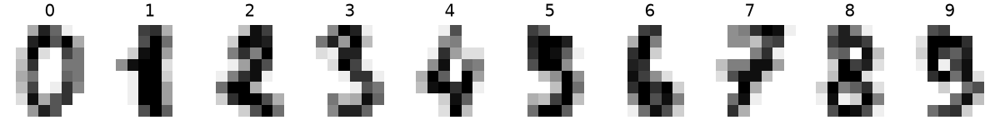
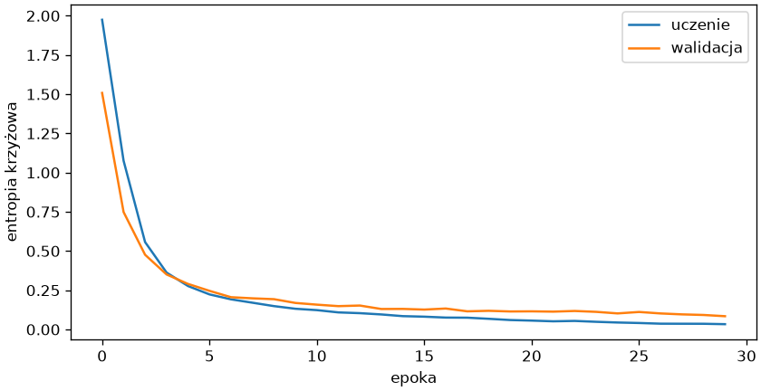
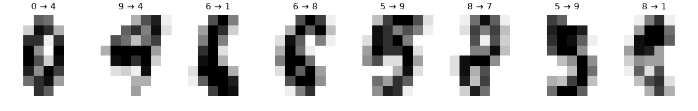

# Klasyfikacja obrazów

Obraz to tablica jasności pikseli, a więc gotowy tensor. Ten podrozdział uczy sieć rozpoznawać cyfry digits z rozdziału 10 — najpierw siecią w pełni połączoną, która widzi obraz jako 64 niezależne liczby, potem siecią splotową, która wykorzystuje to, że piksele sąsiadują — i kończy zapisem wytrenowanego modelu.

## Obrazy jako tensory

```python title="dane-cyfry.py"
import matplotlib.pyplot as plt
import torch
from sklearn.datasets import load_digits
from sklearn.model_selection import train_test_split

cyfry = load_digits()
print(cyfry.data.shape, cyfry.images.shape, cyfry.data.min(), cyfry.data.max())
X_trening, X_test, y_trening, y_test = train_test_split(cyfry.data / 16.0, cyfry.target, test_size=0.25, random_state=42, stratify=cyfry.target)
X_ucz, X_wal, y_ucz, y_wal = train_test_split(X_trening, y_trening, test_size=0.2, random_state=42, stratify=y_trening)
print(len(X_ucz), len(X_wal), len(X_test))
X_ucz, y_ucz = torch.tensor(X_ucz, dtype=torch.float32), torch.tensor(y_ucz)
print(X_ucz.dtype, y_ucz.dtype, X_ucz.shape, y_ucz[:10])
print(X_ucz[0].reshape(8, 8)[2:5, 2:6])

fig, osie = plt.subplots(1, 10, figsize=(10, 1.4), layout="constrained")
for cyfra, ax in enumerate(osie):
    ax.imshow(cyfry.images[cyfry.target == cyfra][0], cmap="gray_r")
    ax.set_title(str(cyfra))
    ax.axis("off")
fig.savefig("cyfry.png", dpi=120)
```

```{ .text .no-copy }
(1797, 64) (1797, 8, 8) 0.0 16.0
1077 270 450
torch.float32 torch.int64 torch.Size([1077, 64]) tensor([5, 4, 6, 0, 6, 2, 4, 2, 1, 6])
tensor([[1.0000, 0.5625, 0.0000, 0.0000],
        [1.0000, 1.0000, 0.6250, 0.0000],
        [0.8125, 0.5000, 1.0000, 0.2500]])
```

{ width="760" }

Zbiór digits ma 1797 obrazów 8 × 8 pikseli o jasnościach 0–16, w `data` spłaszczonych do 64 cech; dzielenie przez 16 sprowadza je do przedziału 0–1, co zastępuje skalowanie — wszystkie cechy mają tę samą jednostkę. Dane dzielimy dwa razy: na trening i test jak zawsze, a trening dodatkowo na część uczącą i **walidacyjną** (ang. *validation set*), która będzie obserwowana w trakcie treningu; zbiór testowy zobaczy tylko gotowy model, zgodnie z regułą z rozdziału 7. Etykiety klas pozostają liczbami całkowitymi `int64` bez dodatkowej osi — tego wymaga funkcja straty dla wielu klas; wycinek pierwszego obrazu pokazuje jasności po przeskalowaniu.

## Sieć w pełni połączona

```python title="mlp-cyfry.py"
import matplotlib.pyplot as plt
import torch
from sklearn.datasets import load_digits
from sklearn.linear_model import LogisticRegression
from sklearn.model_selection import train_test_split
from torch import nn
from torch.utils.data import DataLoader, TensorDataset
from trening import przewiduj, trenuj

cyfry = load_digits()
X_trening, X_test, y_trening, y_test = train_test_split(cyfry.data / 16.0, cyfry.target, test_size=0.25, random_state=42, stratify=cyfry.target)
X_ucz, X_wal, y_ucz, y_wal = train_test_split(X_trening, y_trening, test_size=0.2, random_state=42, stratify=y_trening)
na_tensory = lambda X, y: (torch.tensor(X, dtype=torch.float32), torch.tensor(y))
X_ucz, y_ucz = na_tensory(X_ucz, y_ucz)
X_wal, y_wal = na_tensory(X_wal, y_wal)
X_test, y_test = na_tensory(X_test, y_test)


def dokladnosc(model, X, y):
    return round((przewiduj(model, X).argmax(dim=1) == y).float().mean().item(), 3)


torch.manual_seed(42)
model = nn.Sequential(nn.Linear(64, 64), nn.ReLU(), nn.Linear(64, 10))
porcje = DataLoader(TensorDataset(X_ucz, y_ucz), batch_size=32, shuffle=True)
historia = trenuj(model, porcje, nn.CrossEntropyLoss(), epoki=30, lr=0.003, X_wal=X_wal, y_wal=y_wal)
print([round(s, 3) for s in historia["trening"][::10]], [round(s, 3) for s in historia["walidacja"][::10]])
print("dokładność: uczenie", dokladnosc(model, X_ucz, y_ucz), "walidacja", dokladnosc(model, X_wal, y_wal), "test", dokladnosc(model, X_test, y_test))
logity = przewiduj(model, X_test[:1])
print(logity.round(decimals=1))
print(torch.softmax(logity, dim=1).round(decimals=3), logity.argmax(dim=1).item(), y_test[0].item())
print("regresja logistyczna:", round(LogisticRegression(max_iter=2000).fit(X_ucz.numpy(), y_ucz.numpy()).score(X_test.numpy(), y_test.numpy()), 3))

fig, ax = plt.subplots(figsize=(7, 3.6), layout="constrained")
ax.plot(historia["trening"], label="uczenie")
ax.plot(historia["walidacja"], label="walidacja")
ax.set_xlabel("epoka")
ax.set_ylabel("entropia krzyżowa")
ax.legend()
fig.savefig("mlp-cyfry.png", dpi=120)
```

```{ .text .no-copy }
[1.974, 0.123, 0.056] [1.508, 0.158, 0.115]
dokładność: uczenie 0.999 walidacja 0.978 test 0.971
tensor([[ -7.8000,  -1.9000,  -8.5000, -15.0000,  -5.3000,  -3.2000,  -2.9000,
          -8.0000,  -0.6000, -11.8000]])
tensor([[0.0010, 0.1830, 0.0000, 0.0000, 0.0060, 0.0540, 0.0720, 0.0000, 0.6840,
         0.0000]]) 8 1
regresja logistyczna: 0.962
```

{ width="640" }

Dla dziesięciu klas sieć ma dziesięć wyjść — po jednym logicie na klasę — a **softmax** zamienia je w prawdopodobieństwa sumujące się do jedności; `nn.CrossEntropyLoss` liczy softmax i **entropię krzyżową** (ang. *cross-entropy*) razem, przyjmując logity oraz etykiety jako indeksy klas. Klasę odczytujemy przez `argmax` bez liczenia softmaxu, bo największy logit daje największe prawdopodobieństwo. Pierwsza próbka testowa pokazuje, po co softmax: sieć daje 68% ósemce i 18% jedynce — i myli się, bo to jedynka, ale sama sygnalizuje niepewność. Sieć 64–64–10 po 30 epokach rozpoznaje 97% cyfr testowych — nieco więcej niż regresja logistyczna z rozdziału 8 na tych samych danych. Krzywe pokazują znajome z rozdziału 7 rozejście: strata ucząca dąży do zera, walidacyjna przestaje maleć — sieć zaczyna zapamiętywać zbiór uczący. W pierwszych epokach ucząca jest wyższa, bo `trenuj()` uśrednia straty porcji z całej epoki, także z jej początku przy gorszych wagach, a walidacyjną liczy po epoce.

## Sieć splotowa

```python title="cnn.py"
import matplotlib.pyplot as plt
import torch
from sklearn.datasets import load_digits
from sklearn.model_selection import train_test_split
from torch import nn
from torch.utils.data import DataLoader, TensorDataset
from trening import przewiduj, trenuj

cyfry = load_digits()
X_trening, X_test, y_trening, y_test = train_test_split(cyfry.data / 16.0, cyfry.target, test_size=0.25, random_state=42, stratify=cyfry.target)
X_ucz, X_wal, y_ucz, y_wal = train_test_split(X_trening, y_trening, test_size=0.2, random_state=42, stratify=y_trening)
na_tensory = lambda X, y: (torch.tensor(X, dtype=torch.float32), torch.tensor(y))
X_ucz, y_ucz = na_tensory(X_ucz, y_ucz)
X_wal, y_wal = na_tensory(X_wal, y_wal)
X_test, y_test = na_tensory(X_test, y_test)


class SiecSplotowa(nn.Module):
    def __init__(self):
        super().__init__()
        self.warstwy = nn.Sequential(
            nn.Conv2d(1, 8, kernel_size=3, padding=1), nn.ReLU(), nn.MaxPool2d(2),
            nn.Conv2d(8, 16, kernel_size=3, padding=1), nn.ReLU(), nn.MaxPool2d(2),
            nn.Flatten(), nn.Linear(16 * 2 * 2, 10),
        )

    def forward(self, x):
        return self.warstwy(x.reshape(-1, 1, 8, 8))


torch.manual_seed(42)
model = SiecSplotowa()
print(sum(p.numel() for p in model.parameters()))
obraz = X_ucz[:1].reshape(-1, 1, 8, 8)
print(model.warstwy[:3](obraz).shape, model.warstwy[:6](obraz).shape, model.warstwy[:7](obraz).shape)
porcje = DataLoader(TensorDataset(X_ucz, y_ucz), batch_size=32, shuffle=True)
historia = trenuj(model, porcje, nn.CrossEntropyLoss(), epoki=30, lr=0.003, X_wal=X_wal, y_wal=y_wal)
dokladnosc = lambda X, y: round((przewiduj(model, X).argmax(dim=1) == y).float().mean().item(), 3)
print("dokładność: uczenie", dokladnosc(X_ucz, y_ucz), "walidacja", dokladnosc(X_wal, y_wal), "test", dokladnosc(X_test, y_test))
przewidziane = przewiduj(model, X_test).argmax(dim=1)
bledne = torch.nonzero(przewidziane != y_test).squeeze(1)
print(len(bledne), bledne[:8].tolist())
torch.save(model.state_dict(), "cyfry.pt")

fig, osie = plt.subplots(1, 8, figsize=(10, 1.6), layout="constrained")
for ax, i in zip(osie, bledne[:8].tolist()):
    ax.imshow(X_test[i].reshape(8, 8), cmap="gray_r")
    ax.set_title(f"{y_test[i].item()} → {przewidziane[i].item()}", fontsize=9)
    ax.axis("off")
fig.savefig("bledy-cyfry.png", dpi=120)
```

```{ .text .no-copy }
1898
torch.Size([1, 8, 4, 4]) torch.Size([1, 16, 2, 2]) torch.Size([1, 64])
dokładność: uczenie 1.0 walidacja 0.967 test 0.973
12 [62, 127, 144, 200, 211, 230, 242, 255]
```

{ width="760" }

**Sieć splotowa** (ang. *convolutional neural network*, CNN) nie łączy każdego piksela z każdym wyjściem. Warstwa `Conv2d` przesuwa po obrazie mały **filtr** (ang. *kernel*) 3 × 3 z jednym zestawem wag i w każdym położeniu liczy ważoną sumę sąsiednich pikseli — wykrywa ten sam wzór (krawędź, łuk) wszędzie, a `padding=1` dopełnia brzegi, by obraz nie malał; osiem filtrów daje osiem map 8 × 8. `MaxPool2d(2)` zostawia z każdego kwadratu 2 × 2 największą wartość, zmniejszając mapy do 4 × 4, druga warstwa splotowa buduje z ośmiu map szesnaście, a `Flatten` spłaszcza wynik `(16, 2, 2)` do 64 liczb dla ostatniej warstwy liniowej. Obraz wchodzi jako tensor `(n, 1, 8, 8)` — porcja, kanały, wysokość, szerokość — stąd `reshape` w `forward()`. Sieć ma 1898 parametrów wobec 4810 w sieci w pełni połączonej i rozpoznaje cyfry testowe równie dobrze (różnica jednej próbki z 450); część z dwunastu błędów przypada na cyfry niewyraźne także dla oka, część to pomyłki wyraźne. Na obrazach 8 × 8 przewaga splotów jest niewielka — rośnie z rozmiarem obrazu, gdzie warstwa w pełni połączona miałaby miliony wag.

## Zapis i wczytanie modelu

```python title="zapis.py"
from pathlib import Path

import torch
from sklearn.datasets import load_digits
from torch import nn


class SiecSplotowa(nn.Module):
    def __init__(self):
        super().__init__()
        self.warstwy = nn.Sequential(
            nn.Conv2d(1, 8, kernel_size=3, padding=1), nn.ReLU(), nn.MaxPool2d(2),
            nn.Conv2d(8, 16, kernel_size=3, padding=1), nn.ReLU(), nn.MaxPool2d(2),
            nn.Flatten(), nn.Linear(16 * 2 * 2, 10),
        )

    def forward(self, x):
        return self.warstwy(x.reshape(-1, 1, 8, 8))


stan = torch.load("cyfry.pt")
print(type(stan).__name__, list(stan)[:3], stan["warstwy.0.weight"].shape)
model = SiecSplotowa()
model.load_state_dict(stan)
model.eval()
cyfry = load_digits()
obrazy = torch.tensor(cyfry.data[:5] / 16.0, dtype=torch.float32)
with torch.no_grad():
    print(model(obrazy).argmax(dim=1).tolist(), cyfry.target[:5].tolist())
print(Path("cyfry.pt").stat().st_size // 1000, "kB")
```

```{ .text .no-copy }
OrderedDict ['warstwy.0.weight', 'warstwy.0.bias', 'warstwy.3.weight'] torch.Size([8, 1, 3, 3])
[0, 1, 2, 3, 4] [0, 1, 2, 3, 4]
10 kB
```

Przez `torch.save()` zapisujemy `state_dict()` — słownik nazw parametrów i tensorów wag, w którym pierwszy wpis to osiem filtrów 3 × 3 pierwszej warstwy splotowej — a nie cały obiekt modelu, bo kod klasy może się zmienić, a wagi pozostają czytelne. Wczytanie wymaga zbudowania modelu o tej samej architekturze (klasa musi być dostępna — tu powtórzona, w projekcie importowana z modułu) i `load_state_dict()`; `torch.load()` domyślnie wczytuje wyłącznie tensory i podstawowe typy Pythona (`weights_only=True`), co chroni przed wykonaniem obcego kodu, jak przy `pickle` w rozdziale 9 „Python Notatki”. Po wczytaniu `model.eval()` przełącza tryb oceny, a model rozpoznaje pięć pierwszych cyfr zbioru; plik z 1898 parametrami zajmuje 10 kB. Obok wag trzeba zapisać wszystko, co poprzedza model: tu dzielenie przez 16, w regresji z następnego podrozdziału — transformator scikit-learn przez `joblib` jak w rozdziale 7 — oraz wersje bibliotek.
