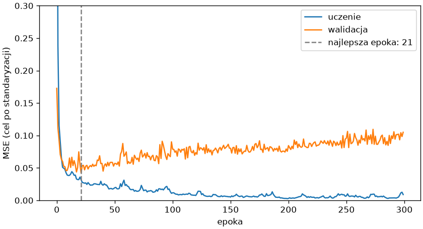

# Trening w praktyce

Sieć na cyfrach wygrała z regresją logistyczną; ten podrozdział sprawdza ją na danych tabelarycznych z rozdziału 9 — czterystu mieszkaniach — gdzie najlepszy okazał się model liniowy na logarytmach. Wynik uczy, kiedy sieć się opłaca, a przy okazji pokazuje narzędzia każdego treningu: wczesne zatrzymanie, hiperparametry i regularyzację.

## Regresja — mieszkania

```python title="mieszkania-siec.py"
import matplotlib.pyplot as plt
import numpy as np
import pandas as pd
import torch
from sklearn.compose import ColumnTransformer
from sklearn.impute import SimpleImputer
from sklearn.model_selection import train_test_split
from sklearn.pipeline import make_pipeline
from sklearn.preprocessing import FunctionTransformer, OneHotEncoder, OrdinalEncoder, StandardScaler
from torch import nn
from torch.utils.data import DataLoader, TensorDataset
from trening import przewiduj, trenuj

mieszkania = pd.read_csv("mieszkania.csv")
X, y = mieszkania.drop(columns="cena"), mieszkania["cena"]
X_trening, X_test, y_trening, y_test = train_test_split(X, y, test_size=0.25, random_state=42)
X_ucz, X_wal, y_ucz, y_wal = train_test_split(X_trening, y_trening, test_size=0.2, random_state=42)
pozostale = ["pokoje", "pietro", "rok_budowy", "odleglosc_km", "winda"]
przygotowanie = ColumnTransformer([
    ("powierzchnia", make_pipeline(FunctionTransformer(np.log, feature_names_out="one-to-one"), StandardScaler()), ["powierzchnia"]),
    ("liczbowe", make_pipeline(SimpleImputer(strategy="median", add_indicator=True), StandardScaler()), pozostale),
    ("stan", make_pipeline(SimpleImputer(strategy="most_frequent"), OrdinalEncoder(categories=[["do remontu", "dobry", "po remoncie"]])), ["stan"]),
    ("dzielnica", OneHotEncoder(drop="first", handle_unknown="ignore", sparse_output=False), ["dzielnica"]),
]).fit(X_ucz)
srednia, odchylenie = float(np.log(y_ucz).mean()), float(np.log(y_ucz).std())


def na_tensory(X, y):
    cel = (np.log(y) - srednia) / odchylenie
    return torch.tensor(przygotowanie.transform(X), dtype=torch.float32), torch.tensor(cel.to_numpy(), dtype=torch.float32).unsqueeze(1)


def mae(model, X, y):
    przewidziane = np.exp(przewiduj(model, X).squeeze(1).numpy() * odchylenie + srednia)
    return round(float(np.abs(przewidziane - y.to_numpy()).mean()))


X_ucz_t, y_ucz_t = na_tensory(X_ucz, y_ucz)
X_wal_t, y_wal_t = na_tensory(X_wal, y_wal)
X_test_t, y_test_t = na_tensory(X_test, y_test)
print(X_ucz_t.shape, X_wal_t.shape, X_test_t.shape)
torch.save({"X_ucz": X_ucz_t, "y_ucz": y_ucz_t, "X_wal": X_wal_t, "y_wal": y_wal_t, "X_test": X_test_t, "y_test": y_test_t, "srednia": srednia, "odchylenie": odchylenie}, "mieszkania-tensory.pt")
zbuduj = lambda: nn.Sequential(nn.Linear(12, 32), nn.ReLU(), nn.Linear(32, 32), nn.ReLU(), nn.Linear(32, 1))
torch.manual_seed(42)
model = zbuduj()
porcje = DataLoader(TensorDataset(X_ucz_t, y_ucz_t), batch_size=32, shuffle=True)
historia = trenuj(model, porcje, nn.MSELoss(), epoki=300, lr=0.01, X_wal=X_wal_t, y_wal=y_wal_t)
najlepsza = int(np.argmin(historia["walidacja"]))
print(najlepsza, round(min(historia["walidacja"]), 3), round(historia["walidacja"][-1], 3), "MAE walidacja", mae(model, X_wal_t, y_wal), "test", mae(model, X_test_t, y_test))
torch.manual_seed(42)
model = zbuduj()
porcje = DataLoader(TensorDataset(X_ucz_t, y_ucz_t), batch_size=32, shuffle=True)
historia_wz = trenuj(model, porcje, nn.MSELoss(), epoki=300, lr=0.01, X_wal=X_wal_t, y_wal=y_wal_t, cierpliwosc=30)
print(len(historia_wz["trening"]), "MAE walidacja", mae(model, X_wal_t, y_wal), "test", mae(model, X_test_t, y_test))
torch.manual_seed(42)
liniowy = nn.Linear(12, 1)
porcje = DataLoader(TensorDataset(X_ucz_t, y_ucz_t), batch_size=32, shuffle=True)
trenuj(liniowy, porcje, nn.MSELoss(), epoki=300, lr=0.01, X_wal=X_wal_t, y_wal=y_wal_t, cierpliwosc=30)
print("liniowy: MAE walidacja", mae(liniowy, X_wal_t, y_wal), "test", mae(liniowy, X_test_t, y_test))

fig, ax = plt.subplots(figsize=(7, 3.8), layout="constrained")
ax.plot(historia["trening"], label="uczenie")
ax.plot(historia["walidacja"], label="walidacja")
ax.axvline(najlepsza, color="gray", linestyle="--", label=f"najlepsza epoka: {najlepsza}")
ax.set_ylim(0, 0.3)
ax.set_xlabel("epoka")
ax.set_ylabel("MSE (cel po standaryzacji)")
ax.legend()
fig.savefig("wczesne-zatrzymanie.png", dpi=120)
```

```{ .text .no-copy }
torch.Size([240, 12]) torch.Size([60, 12]) torch.Size([100, 12])
21 0.042 0.105 MAE walidacja 80719 test 78337
52 MAE walidacja 49573 test 61553
liniowy: MAE walidacja 48250 test 47601
```

{ width="640" }

Przygotowanie danych to transformator z rozdziału 9, uzupełniony o skalowanie logarytmu powierzchni i dopasowany na części uczącej, a cel — logarytm ceny po standaryzacji, bo sieć, jak każdy model trenowany gradientem, potrzebuje wejść i wyjść o podobnej skali; `mae()` cofa obie transformacje i liczy błąd w złotych. Zbiór tensorów zapisujemy przez `torch.save()` dla następnego skryptu. Sieć 12–32–32–1 przez 300 epok uczy się zbioru uczącego niemal na pamięć, a strata walidacyjna po dwudziestu kilku epokach zaczyna rosnąć — przeuczenie z rozdziału 7 w wersji sieciowej. **Wczesne zatrzymanie** (ang. *early stopping*) obserwuje stratę walidacyjną, przerywa trening, gdy nie maleje przez `cierpliwosc` epok, i przywraca wagi z najlepszej epoki — MAE testowy spada z 78 do 62 tysięcy złotych. To wciąż więcej niż model liniowy trenowany tą samą pętlą, który na tych cechach powtarza wynik z rozdziału 9 (48 tysięcy): 240 wierszy to za mało, by sieć nauczyła się czegoś ponad zależności, które przygotowane cechy podają wprost.

## Hiperparametry i regularyzacja

```python title="regularyzacja.py"
import torch
from torch import nn
from torch.utils.data import DataLoader, TensorDataset
from trening import przewiduj, trenuj

dane = torch.load("mieszkania-tensory.pt")


def mae(model, X, y):
    do_zlotych = lambda t: torch.exp(t * dane["odchylenie"] + dane["srednia"])
    return round((do_zlotych(przewiduj(model, X)) - do_zlotych(y)).abs().mean().item())


def zbuduj(porzucanie):
    return nn.Sequential(nn.Linear(12, 32), nn.ReLU(), nn.Dropout(porzucanie), nn.Linear(32, 32), nn.ReLU(), nn.Dropout(porzucanie), nn.Linear(32, 1))


for nazwa, porzucanie, weight_decay in (("wczesne zatrzymanie", 0.0, 0.0), ("+ porzucanie 0,3", 0.3, 0.0), ("+ weight_decay 0,01", 0.0, 0.01), ("+ oba", 0.3, 0.01)):
    torch.manual_seed(42)
    model = zbuduj(porzucanie)
    porcje = DataLoader(TensorDataset(dane["X_ucz"], dane["y_ucz"]), batch_size=32, shuffle=True)
    historia = trenuj(model, porcje, nn.MSELoss(), epoki=300, lr=0.01, X_wal=dane["X_wal"], y_wal=dane["y_wal"], cierpliwosc=30, weight_decay=weight_decay)
    print(f"{nazwa:<22} epok {len(historia['trening']):>3}  MAE walidacja {mae(model, dane['X_wal'], dane['y_wal'])}  test {mae(model, dane['X_test'], dane['y_test'])}")
```

```{ .text .no-copy }
wczesne zatrzymanie    epok  52  MAE walidacja 49573  test 61553
+ porzucanie 0,3       epok  69  MAE walidacja 56357  test 61385
+ weight_decay 0,01    epok  40  MAE walidacja 51847  test 56172
+ oba                  epok  83  MAE walidacja 56852  test 56444
```

Sieć ma więcej hiperparametrów niż modele z poprzednich rozdziałów: liczbę i szerokość warstw, współczynnik uczenia, rozmiar porcji, liczbę epok — i wszystkie dobieramy na zbiorze walidacyjnym, jak `C` czy głębokość drzewa w rozdziałach 7–8. Przeciw przeuczeniu służą, oprócz wczesnego zatrzymania, dwie techniki. **Porzucanie** (ang. *dropout*) w treningu zeruje losowo część wyjść warstwy — tu 30% — więc sieć nie może polegać na pojedynczych neuronach; w trybie `eval()` warstwa `nn.Dropout` przepuszcza wszystko, dlatego `przewiduj()` przełącza tryb. `weight_decay` optymalizatora karze sumę kwadratów wag jak regresja grzbietowa z rozdziału 9. Na tych danych porzucanie samo nic nie zmienia, `weight_decay` obniża błąd testowy o około 5 tysięcy złotych, a żadna kombinacja nie doprowadza sieci do wyniku modelu liniowego; różnice między wariantami są tego rzędu, co odchylenie między podziałami z rozdziału 9, więc rozstrzyga o nich walidacja krzyżowa albo — przy sieciach częściej — kilka ziaren losowych.

## GPU i większe dane

Trening na karcie graficznej różni się od powyższych skryptów kilkoma wierszami: `urzadzenie = torch.device("cuda")`, `model.to(urzadzenie)` po zbudowaniu modelu i `.to(urzadzenie)` na każdej porcji w pętli oraz na zbiorze walidacyjnym i testowym; wynik przed `numpy()` wraca na procesor przez `.cpu()`. Zysk pojawia się przy sieciach o milionach wag i porcjach obrazów, nie przy czterystu wierszach tabeli. Zbiory, które nie mieszczą się w pamięci, obsługuje własna klasa dziedzicząca po `torch.utils.data.Dataset` z metodami `__len__()` i `__getitem__()` wczytującymi próbkę z dysku, a `DataLoader` z `num_workers` czyta je równolegle; gotowe zbiory obrazów, wraz z ich pobieraniem i przekształceniami, dostarcza osobny pakiet torchvision.

## Kiedy PyTorch

Dla tabel o setkach lub tysiącach wierszy modele z rozdziałów 8–9 — regresja z dobrymi cechami, lasy, wzmacnianie gradientowe — wypadają zwykle nie gorzej niż sieć, są szybsze w treningu, mają mniej hiperparametrów i gotową walidację krzyżową; scikit-learn ma zresztą własne proste sieci `MLPClassifier` i `MLPRegressor`, gdy takie chcemy porównać. PyTorch jest właściwy tam, gdzie cechy trzeba dopiero wyuczyć z surowych danych — obrazy, dźwięk, tekst, szeregi sygnałów — gdzie danych są setki tysięcy, gdzie model ma nietypową postać (własna funkcja straty, kilka wejść, wspólne warstwy) albo gdy korzystamy z gotowej sieci wytrenowanej na dużym zbiorze i douczamy ją do własnego zadania. Warsztat z rozdziałów 7–9 pozostaje ten sam.

## Lista kontrolna treningu sieci

- **Dane jako tensory `float32`**, cel w kształcie zgodnym ze stratą: kolumna `(n, 1)` dla regresji i dwóch klas, indeksy `int64` dla wielu klas; wejścia i cel o podobnej skali.
- **Ziarno** `torch.manual_seed()` przed budową modelu i pętlą; porównania modeli na tych samych podziałach.
- **Pętla**: `zero_grad()`, wynik, strata, `backward()`, `step()`; `train()` w treningu, `eval()` z `no_grad()` w ocenie.
- **Współczynnik uczenia** sprawdzony krzywą straty: zbyt mały nie schodzi, zbyt duży oscyluje lub rozbiega się.
- **Zbiór walidacyjny** do krzywych straty, wczesnego zatrzymania i doboru hiperparametrów; zbiór testowy raz.
- **Model prosty** z poprzednich rozdziałów obok sieci — sieć musi go wyraźnie przewyższyć, by uzasadnić koszt.
- **Zapis** `state_dict` z kodem architektury, przekształceniami wejścia i wersjami bibliotek.

## Dalej: projekt

Ścieżkę uczenia maszynowego zamyka projekt, który przechodzi całą drogę od surowych danych do zapisanego modelu z raportem: przygotowanie danych z rozdziału 9, porównanie modeli z rozdziałów 8–11 na wspólnej walidacji, wybór według kosztu błędu i pakiet gotowy do użycia przez inny program — [rozdział z projektem](../12-projekt-ml/index.md).
