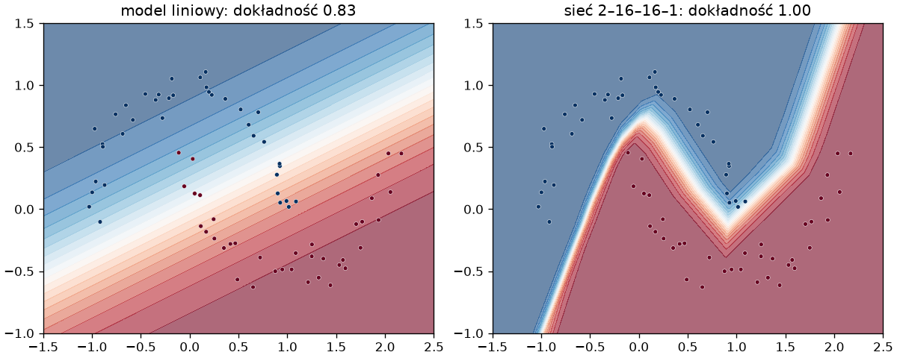

# Sieć neuronowa

Regresja logistyczna z rozdziału 8 dzieliła płaszczyznę prostą i na dwóch splecionych półksiężycach z rozdziału 10 musi się mylić. Sieć neuronowa składa kilka takich modeli liniowych, przedzielając je funkcją nieliniową, i uczy się granicy dowolnego kształtu — tą samą pętlą treningową, co regresja z poprzedniego podrozdziału.

## Warstwy i `nn.Sequential`

```python title="warstwy.py"
import torch
from torch import nn

warstwa = nn.Linear(2, 1)
print(warstwa.weight.shape, warstwa.bias.shape, sum(p.numel() for p in warstwa.parameters()))
siec = nn.Sequential(nn.Linear(2, 16), nn.ReLU(), nn.Linear(16, 16), nn.ReLU(), nn.Linear(16, 1))
print(siec)
print(sum(p.numel() for p in siec.parameters()))
print(siec(torch.zeros(5, 2)).shape)
print(nn.ReLU()(torch.tensor([-2.0, 0.0, 3.0])))


class Siec(nn.Module):
    def __init__(self, ukryte=16):
        super().__init__()
        self.warstwy = nn.Sequential(nn.Linear(2, ukryte), nn.ReLU(), nn.Linear(ukryte, 1))

    def forward(self, x):
        return self.warstwy(x)


print(Siec(8)(torch.zeros(3, 2)).shape, sum(p.numel() for p in Siec(8).parameters()))
```

```{ .text .no-copy }
torch.Size([1, 2]) torch.Size([1]) 3
Sequential(
  (0): Linear(in_features=2, out_features=16, bias=True)
  (1): ReLU()
  (2): Linear(in_features=16, out_features=16, bias=True)
  (3): ReLU()
  (4): Linear(in_features=16, out_features=1, bias=True)
)
337
torch.Size([5, 1])
tensor([0., 0., 3.])
torch.Size([3, 1]) 33
```

**Warstwa w pełni połączona** (ang. *fully connected*, `nn.Linear`) liczy dla każdej próbki tyle ważonych sum, ile ma wyjść: `Linear(2, 16)` zamienia dwie cechy w szesnaście liczb i ma 2 · 16 wag oraz 16 wyrazów wolnych. Między warstwami stoi **funkcja aktywacji** (ang. *activation function*) **ReLU**, która zeruje wartości ujemne; bez niej złożenie warstw liniowych byłoby jedną warstwą liniową. `nn.Sequential` łączy warstwy w łańcuch, wywołanie modelu na porcji `(n, 2)` zwraca `(n, 1)`, a `parameters()` zbiera wszystkie wagi dla optymalizatora — sieć 2–16–16–1 ma ich 337. Własną architekturę zapisujemy jako klasę dziedziczącą po `nn.Module` (rozdziały 10–11 „Python Notatki”): warstwy tworzymy w `__init__()`, a `forward()` mówi, jak liczyć wynik; `model(x)` wywołuje `forward()` i tylko tak wywołujemy model, bo `nn.Module` dokłada wokół `forward()` własną obsługę.

## Pętla treningowa

```python title="petla.py"
import torch
from sklearn.datasets import make_moons
from sklearn.model_selection import train_test_split
from torch import nn

X, y = make_moons(n_samples=300, noise=0.08, random_state=42)
X_trening, X_test, y_trening, y_test = train_test_split(X, y, test_size=0.25, random_state=42, stratify=y)
X_trening, X_test = torch.tensor(X_trening, dtype=torch.float32), torch.tensor(X_test, dtype=torch.float32)
y_trening, y_test = torch.tensor(y_trening, dtype=torch.float32).unsqueeze(1), torch.tensor(y_test, dtype=torch.float32).unsqueeze(1)
strata_bce = nn.BCEWithLogitsLoss()


def dokladnosc(model, X, y):
    with torch.no_grad():
        return ((model(X) > 0).float() == y).float().mean().item()


budowy = {"liniowy": lambda: nn.Linear(2, 1), "sieć": lambda: nn.Sequential(nn.Linear(2, 16), nn.ReLU(), nn.Linear(16, 16), nn.ReLU(), nn.Linear(16, 1))}
for nazwa, zbuduj in budowy.items():
    torch.manual_seed(42)
    model = zbuduj()
    optymalizator = torch.optim.Adam(model.parameters(), lr=0.01)
    for epoka in range(500):
        optymalizator.zero_grad()
        strata = strata_bce(model(X_trening), y_trening)
        strata.backward()
        optymalizator.step()
        if epoka % 100 == 0:
            print(nazwa, epoka, round(strata.item(), 3))
    print(nazwa, "dokładność: trening", round(dokladnosc(model, X_trening, y_trening), 3), "test", round(dokladnosc(model, X_test, y_test), 3))
```

```{ .text .no-copy }
liniowy 0 0.699
liniowy 100 0.468
liniowy 200 0.392
liniowy 300 0.346
liniowy 400 0.315
liniowy dokładność: trening 0.858 test 0.827
sieć 0 0.696
sieć 100 0.08
sieć 200 0.003
sieć 300 0.0
sieć 400 0.0
sieć dokładność: trening 1.0 test 1.0
```

Dla dwóch klas model zwraca jedną liczbę — **logit** (ang. *logit*), czyli `z` z rozdziału 8 przed funkcją logistyczną — a `nn.BCEWithLogitsLoss` łączy funkcję logistyczną z **binarną entropią krzyżową** (ang. *binary cross-entropy*), karą za prawdopodobieństwo przypisane błędnej klasie; liczy obie razem, bo tak jest stabilniej numerycznie. Etykiety podajemy jako kolumnę `float32` o kształcie `(n, 1)`, zgodną z wyjściem, a klasę odczytujemy ze znaku logitu (dodatni to prawdopodobieństwo powyżej 0,5). Jeden przebieg pętli po wszystkich próbkach to **epoka** (ang. *epoch*). Model `nn.Linear(2, 1)` z tą stratą to regresja logistyczna trenowana gradientem — dzieli półksiężyce prostą i myli się w co szóstym przypadku; sieć z dwiema warstwami ukrytymi po 500 epokach klasyfikuje bezbłędnie trening i test.

## Porcje danych — `DataLoader`

```python title="porcje.py"
import torch
from sklearn.datasets import make_moons
from torch.utils.data import DataLoader, TensorDataset

X, y = make_moons(n_samples=300, noise=0.08, random_state=42)
zbior = TensorDataset(torch.tensor(X, dtype=torch.float32), torch.tensor(y, dtype=torch.float32).unsqueeze(1))
print(len(zbior), zbior[0])
torch.manual_seed(42)
porcje = DataLoader(zbior, batch_size=64, shuffle=True)
print(len(porcje))
for X_porcja, y_porcja in porcje:
    print(X_porcja.shape, y_porcja.shape, round(y_porcja.mean().item(), 2))
```

```{ .text .no-copy }
300 (tensor([ 0.6588, -0.3560]), tensor([1.]))
5
torch.Size([64, 2]) torch.Size([64, 1]) 0.42
torch.Size([64, 2]) torch.Size([64, 1]) 0.5
torch.Size([64, 2]) torch.Size([64, 1]) 0.5
torch.Size([64, 2]) torch.Size([64, 1]) 0.5
torch.Size([44, 2]) torch.Size([44, 1]) 0.61
```

Pętla z poprzedniego skryptu liczyła gradient na całym zbiorze naraz. Przy dużych danych zbiór nie mieści się w pamięci, a gradient z losowej **porcji** (ang. *batch*, *mini-batch*) kilkudziesięciu próbek jest wystarczająco dobrym przybliżeniem i pozwala wykonać wiele kroków w jednej epoce — to **stochastyczny spadek gradientu** (ang. *stochastic gradient descent*), od którego optymalizator `SGD` wziął nazwę. `TensorDataset` łączy cechy z etykietami w zbiór indeksowany próbkami, a `DataLoader` wydaje z niego porcje o zadanym rozmiarze, tasując próbki w każdej epoce (`shuffle=True`, z globalnego generatora — stąd `manual_seed` przed treningiem); ostatnia porcja jest mniejsza, a udział klasy 1 (trzecia kolumna wyniku) zmienia się z porcji na porcję, bo ich skład jest losowy. Rozmiar porcji jest hiperparametrem — zwykle od 32 do 256.

## Moduł `trening.py`

Pętla treningowa powtarza się w każdym skrypcie, więc zamykamy ją w funkcji — w module [trening.py](pliki/trening.py), z którego korzystają wszystkie dalsze strony rozdziału:

```python title="trening.py"
"""Pętla treningowa dla modeli PyTorch — moduł rozdziału 11."""

import torch


def trenuj(model, dane, strata, epoki, lr=0.001, X_wal=None, y_wal=None, cierpliwosc=None, weight_decay=0.0):
    """Trenuje model optymalizatorem Adam na porcjach z DataLoadera `dane`.

    Zwraca historię strat: średnią stratę treningową każdej epoki oraz — gdy podano
    X_wal i y_wal — stratę walidacyjną. Z `cierpliwosc` przerywa trening, gdy strata
    walidacyjna nie maleje przez tyle epok z rzędu, i przywraca najlepsze wagi.
    """
    optymalizator = torch.optim.Adam(model.parameters(), lr=lr, weight_decay=weight_decay)
    historia = {"trening": [], "walidacja": []}
    najlepsza, najlepsze_wagi, bez_poprawy = float("inf"), None, 0
    for _ in range(epoki):
        model.train()
        suma = 0.0
        for X_porcja, y_porcja in dane:
            optymalizator.zero_grad()
            wartosc = strata(model(X_porcja), y_porcja)
            wartosc.backward()
            optymalizator.step()
            suma += wartosc.item() * len(X_porcja)
        historia["trening"].append(suma / len(dane.dataset))
        if X_wal is None:
            continue
        wartosc_wal = strata(przewiduj(model, X_wal), y_wal).item()
        historia["walidacja"].append(wartosc_wal)
        if wartosc_wal < najlepsza:
            najlepsza, bez_poprawy = wartosc_wal, 0
            najlepsze_wagi = {nazwa: tensor.clone() for nazwa, tensor in model.state_dict().items()}
        elif cierpliwosc is not None:
            bez_poprawy += 1
            if bez_poprawy >= cierpliwosc:
                break
    if cierpliwosc is not None and najlepsze_wagi is not None:
        model.load_state_dict(najlepsze_wagi)
    return historia


def przewiduj(model, X):
    """Wynik modelu w trybie oceny, bez śledzenia gradientów."""
    model.eval()
    with torch.no_grad():
        return model(X)
```

`trenuj()` przyjmuje model, `DataLoader`, funkcję straty i liczbę epok; po każdej epoce zapisuje średnią stratę treningową (ważoną rozmiarem porcji) i — jeśli podano zbiór walidacyjny — stratę walidacyjną. `model.train()` i `model.eval()` przełączają tryb warstw, które zachowują się inaczej w treningu niż w ocenie (porzucanie z ostatniego podrozdziału); `przewiduj()` łączy tryb oceny z `no_grad()`. Parametry `cierpliwosc` i `weight_decay` opisuje ostatni podrozdział. Zwrócona historia służy do wykresów, a `state_dict()` — słownik nazw i tensorów wag — pozwala zapamiętać najlepszy stan.

## Granica decyzyjna

```python title="granica.py"
import matplotlib.pyplot as plt
import numpy as np
import torch
from sklearn.datasets import make_moons
from sklearn.model_selection import train_test_split
from torch import nn
from torch.utils.data import DataLoader, TensorDataset
from trening import przewiduj, trenuj

X, y = make_moons(n_samples=300, noise=0.08, random_state=42)
X_trening, X_test, y_trening, y_test = train_test_split(X, y, test_size=0.25, random_state=42, stratify=y)
na_tensory = lambda X, y: (torch.tensor(X, dtype=torch.float32), torch.tensor(y, dtype=torch.float32).unsqueeze(1))
X_trening, y_trening = na_tensory(X_trening, y_trening)
X_test, y_test = na_tensory(X_test, y_test)
siatka_x, siatka_y = np.meshgrid(np.linspace(-1.5, 2.5, 200), np.linspace(-1, 1.5, 200))
siatka = torch.tensor(np.c_[siatka_x.ravel(), siatka_y.ravel()], dtype=torch.float32)

fig, osie = plt.subplots(1, 2, figsize=(10, 4), layout="constrained")
budowy = {"model liniowy": lambda: nn.Linear(2, 1), "sieć 2–16–16–1": lambda: nn.Sequential(nn.Linear(2, 16), nn.ReLU(), nn.Linear(16, 16), nn.ReLU(), nn.Linear(16, 1))}
for ax, (nazwa, zbuduj) in zip(osie, budowy.items()):
    torch.manual_seed(42)
    model = zbuduj()
    porcje = DataLoader(TensorDataset(X_trening, y_trening), batch_size=32, shuffle=True)
    historia = trenuj(model, porcje, nn.BCEWithLogitsLoss(), epoki=100, lr=0.01)
    dokladnosc = ((przewiduj(model, X_test) > 0).float() == y_test).float().mean().item()
    print(nazwa, round(historia["trening"][0], 3), round(historia["trening"][-1], 3), round(dokladnosc, 3))
    prawdopodobienstwo = torch.sigmoid(przewiduj(model, siatka)).reshape(siatka_x.shape).numpy()
    ax.contourf(siatka_x, siatka_y, prawdopodobienstwo, levels=20, cmap="RdBu_r", alpha=0.6)
    ax.scatter(X_test[:, 0], X_test[:, 1], c=y_test[:, 0], cmap="RdBu_r", s=12, edgecolor="white", linewidth=0.3)
    ax.set_title(f"{nazwa}: dokładność {dokladnosc:.2f}")
fig.savefig("granica.png", dpi=120)
```

```{ .text .no-copy }
model liniowy 0.687 0.271 0.827
sieć 2–16–16–1 0.641 0.012 1.0
```

{ width="760" }

Sto epok po porcjach z 32 próbek to około 800 kroków optymalizatora — więcej niż 500 kroków pełnego gradientu w `petla.py`, a każdy tańszy. Granicę rysujemy jak w rozdziale 7: siatka punktów przechodzi przez model, `torch.sigmoid()` zamienia logity na prawdopodobieństwa, `contourf` maluje je na tle próbek testowych. Model liniowy widzi jedną prostą, sieć — granicę wijącą się między półksiężycami; to zdolność, którą rozdział 8 przypisywał drzewom i lasom, tyle że granica nie składa się z prostokątów, a sieć uczy się jej z 337 wag zamiast z reguł. Dla danych tabelarycznych zysk bywa jednak niewielki, o czym w ostatnim podrozdziale; siła sieci ujawnia się tam, gdzie cechy trzeba dopiero wyuczyć z surowych danych — jak w obrazach z następnego.
