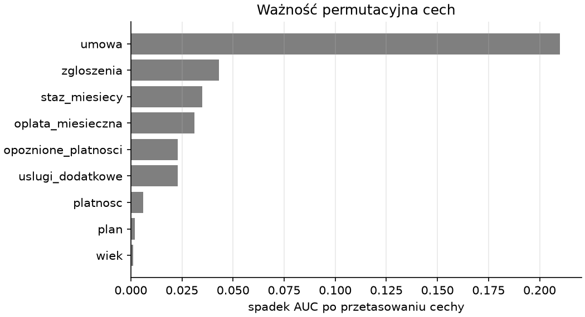

# Model końcowy, raport i użycie

Skrypt treningowy wykonuje jednym poleceniem to, co poprzedni podrozdział pokazał krok po kroku, i dodaje cztery kroki: jednorazową ocenę na zbiorze testowym, ważność cech, trening na wszystkich danych z zapisem pakietu oraz raport. Drugi skrypt ocenia nowych klientów z pliku — z kontrolą, czy dane wyglądają jak te, na których model się uczył.

## Skrypt treningowy

```python title="skrypty/trenuj.py"
"""Trening modelu końcowego: porównanie, próg, ocena testowa, pakiet i raport — jednym poleceniem z katalogu projektu."""

from pathlib import Path

import joblib
import matplotlib.pyplot as plt
import pandas as pd
import sklearn
from sklearn.inspection import permutation_importance
from sklearn.metrics import precision_score, recall_score, roc_auc_score

from modele import KOSZT_OFERTY, KOSZT_UTRATY, dobierz_prog, kandydaci, koszt, koszty_odniesienia, porownaj, potok
from przygotowanie import CECHY, CEL, KATEGORYCZNE, LICZBOWE, ZAKRES_WIEKU, oczysc, podziel, wczytaj_surowe
from rysunki import rysunek_koszt, rysunek_waznosc

WYNIKI = Path("wyniki")


def zapisz_rysunek(nazwa, fig):
    (WYNIKI / "rysunki").mkdir(parents=True, exist_ok=True)
    fig.savefig(WYNIKI / "rysunki" / f"{nazwa}.png", dpi=150)
    plt.close(fig)
    return f""


def main():
    czyste, dziennik = oczysc(wczytaj_surowe())
    X_trening, X_test, y_trening, y_test = podziel(czyste)
    porownanie = porownaj(X_trening, y_trening)
    najlepszy = porownanie["AUC"].idxmax()
    model = potok(kandydaci()[najlepszy])
    prog, koszty = dobierz_prog(model, X_trening, y_trening)
    model.fit(X_trening, y_trening)
    prawdopodobienstwo = model.predict_proba(X_test)[:, 1]
    decyzja = (prawdopodobienstwo >= prog).astype(int)
    odniesienie = koszty_odniesienia(y_test)
    ocena = {"AUC": round(roc_auc_score(y_test, prawdopodobienstwo), 3), "czułość": round(recall_score(y_test, decyzja), 3), "precyzja": round(precision_score(y_test, decyzja), 3), "koszt": koszt(y_test, decyzja), **{f"koszt_{k}": v for k, v in odniesienie.items()}}
    wynik = permutation_importance(model, X_test, y_test, scoring="roc_auc", n_repeats=20, random_state=42, n_jobs=-1)
    waznosc = pd.Series(wynik.importances_mean, index=CECHY).sort_values(ascending=False).round(3)
    koncowy = potok(kandydaci()[najlepszy]).fit(czyste[CECHY], czyste[CEL])
    paczka = {
        "model": koncowy, "nazwa_modelu": najlepszy, "prog": prog, "cechy": CECHY, "klasa_pozytywna": "rezygnacja",
        "dopuszczalne": {"wiek": ZAKRES_WIEKU}, "zakresy": {k: (float(czyste[k].min()), float(czyste[k].max())) for k in LICZBOWE},
        "kategorie": {k: sorted(czyste[k].unique().tolist()) for k in KATEGORYCZNE},
        "koszty": {"utrata": KOSZT_UTRATY, "oferta": KOSZT_OFERTY}, "ocena_testowa": ocena, "wersja_sklearn": sklearn.__version__,
    }
    WYNIKI.mkdir(exist_ok=True)
    joblib.dump(paczka, WYNIKI / "model-rezygnacja.joblib")
    n = len(y_test)
    czesci = [
        "# Ryzyko rezygnacji klientów — raport z modelu",
        f"Koszty: utrata klienta {KOSZT_UTRATY} zł, oferta {KOSZT_OFERTY} zł. Klientów po czyszczeniu: {dziennik['wierszy_czystych']}, rezygnacja: {dziennik['udzial_rezygnacji']:.1%}.",
        "## Jakość danych",
        f"Wierszy surowych: {dziennik['wierszy_surowych']}; usuniętych duplikatów: {dziennik['duplikaty']}; etykiet ujednoliconych: {dziennik['etykiety_ujednolicone']}; planów ujednoliconych: {dziennik['plan_ujednolicony']}; wiek poza zakresem: {dziennik['wiek_poza_zakresem']}; braków wieku (imputowanych): {dziennik['wiek_brak']}; usunięta kolumna z wyciekiem celu: `{dziennik['wyciek_usuniety']}`.",
        f"## Porównanie modeli (walidacja krzyżowa, {len(y_trening)} klientów)", porownanie.to_markdown(floatfmt=".3f"),
        f"## Próg decyzyjny: {prog}", koszty.loc[[0.05, 0.1, 0.15, 0.2, 0.3, 0.5]].to_markdown(), zapisz_rysunek("koszt-prog", rysunek_koszt(koszty, koszty_odniesienia(y_trening), prog)),
        f"## Ocena na zbiorze testowym ({n} klientów, {najlepszy})",
        f"AUC {ocena['AUC']}, czułość {ocena['czułość']}, precyzja {ocena['precyzja']}. Koszt na klienta: model {ocena['koszt'] / n:.0f} zł, oferta dla wszystkich {ocena['koszt_wszyscy'] / n:.0f} zł, bez ofert {ocena['koszt_nikt'] / n:.0f} zł.",
        "## Co wpływa na rezygnację", zapisz_rysunek("waznosc", rysunek_waznosc(waznosc)),
        "## Użycie", "`python skrypty/przewiduj.py plik.csv wyniki/ryzyko.csv` — kolumny jak w `dane/surowe/klienci.csv` bez `rezygnacja` i `powod_rezygnacji`.",
    ]
    (WYNIKI / "raport.md").write_text("\n\n".join(czesci) + "\n", encoding="utf-8")
    print(najlepszy, prog, ocena)
    print(waznosc.to_dict())
    print(sorted(str(p.relative_to(WYNIKI)).replace("\\", "/") for p in WYNIKI.rglob("*") if p.is_file()))


if __name__ == "__main__":
    main()
```

```{ .text .no-copy }
regresja logistyczna 0.15 {'AUC': 0.868, 'czułość': 0.935, 'precyzja': 0.491, 'koszt': 25700, 'koszt_nikt': 69500, 'koszt_wszyscy': 40000}
{'umowa': 0.21, 'zgloszenia': 0.043, 'staz_miesiecy': 0.035, 'oplata_miesieczna': 0.031, 'opoznione_platnosci': 0.023, 'uslugi_dodatkowe': 0.023, 'platnosc': 0.006, 'plan': 0.002, 'wiek': 0.001}
['model-rezygnacja.joblib', 'raport.md', 'rysunki/koszt-prog.png', 'rysunki/waznosc.png']
```

{ width="640" }

`main()` powtarza porównanie i dobór progu z poprzedniego podrozdziału — kilka sekund obliczeń nie uzasadnia przechowywania wyników pośrednich — po czym trenuje wybrany potok na części treningowej i ocenia go **raz** na testowej z progiem z walidacji: AUC potwierdza wynik walidacji, wysoka czułość przy niskiej precyzji jest skutkiem niskiego progu, a koszt na klienta jest niższy niż przy ofercie dla wszystkich i niż bez ofert, co jest liczbą dla odbiorcy. Ważność permutacyjna z rozdziału 8 na kolumnach oryginalnych — potok jest modelem, więc przetasowanie umowy obejmuje jej trzy kolumny zero-jedynkowe — wskazuje umowę jako cechę decydującą, a płatność, plan i wiek jako niemal zbędne. Do pakietu, jak w rozdziale 8, trafiają model wytrenowany na wszystkich danych, próg, lista cech i wersja biblioteki, a ponadto dopuszczalny zakres wieku z README, zakresy cech liczbowych i listy kategorii z treningu — potrzebne skryptowi oceniającemu do kontroli wejścia — oraz koszty i ocena testowa, aby pakiet sam dokumentował swoją jakość. Raport powstaje z listy fragmentów jak w rozdziale 6, z tabel przez `to_markdown()` i rysunków zapisanych obok.

## Dokument raportu

```python title="pokaz_raport.py"
from pathlib import Path

tekst = Path("wyniki/raport.md").read_text(encoding="utf-8").splitlines()
print("\n".join(tekst[:12]))
print("...")
print("\n".join(tekst[-12:-6]))  # skrypt służy tylko wydrukowi w książce
```

```{ .text .no-copy }
# Ryzyko rezygnacji klientów — raport z modelu

Koszty: utrata klienta 500 zł, oferta 80 zł. Klientów po czyszczeniu: 2000, rezygnacja: 27.9%.

## Jakość danych

Wierszy surowych: 2010; usuniętych duplikatów: 10; etykiet ujednoliconych: 110; planów ujednoliconych: 40; wiek poza zakresem: 10; braków wieku (imputowanych): 100; usunięta kolumna z wyciekiem celu: `powod_rezygnacji`.

## Porównanie modeli (walidacja krzyżowa, 1500 klientów)

| model                   |   AUC |     ± |   dokł. zrównoważona |
|:------------------------|------:|------:|---------------------:|
...

## Ocena na zbiorze testowym (500 klientów, regresja logistyczna)

AUC 0.868, czułość 0.935, precyzja 0.491. Koszt na klienta: model 51 zł, oferta dla wszystkich 80 zł, bez ofert 139 zł.

## Co wpływa na rezygnację
```

Raport ma sekcje w kolejności pytań odbiorcy: skąd dane i co w nich poprawiono, które modele porównano i jak, jaki próg i dlaczego, ile model kosztuje wobec rozwiązań bez modelu, co wpływa na rezygnację, jak z modelu korzystać. Liczby pochodzą z tych samych obiektów, które trafiły do pakietu, więc raport i model pozostają zgodne.

## Ocena nowych klientów

```text title="dane/nowi_klienci.csv"
id_klienta,umowa,plan,oplata_miesieczna,staz_miesiecy,uslugi_dodatkowe,zgloszenia,opoznione_platnosci,platnosc,wiek
20001,miesięczna,standard,85.0,2,0,4,1,przelew,29.0
20002,dwuletnia,premium,135.0,60,3,0,0,karta,51.0
20003,roczna,podstawowy,52.0,14,1,1,0,polecenie zapłaty,
20004,miesięczna,premium plus,159.0,8,2,2,0,karta,44.0
20005,miesięczna,podstawowy,45.0,30,1,0,2,przelew,150.0
20006,roczna,standard,79.0,26,2,1,0,karta,38.0
```

```python title="skrypty/przewiduj.py"
"""Ocena ryzyka rezygnacji nowych klientów: python skrypty/przewiduj.py [wejście.csv] [wyjście.csv]"""

import sys
from pathlib import Path

import joblib
import numpy as np
import pandas as pd

PACZKA = Path("wyniki/model-rezygnacja.joblib")


def sprawdz_wejscie(klienci, paczka):
    """Zwraca ramkę z wartościami niemożliwymi zamienionymi na brak i listę uwag; brak wymaganej kolumny zgłasza wyjątek."""
    brakujace = [kolumna for kolumna in ["id_klienta", *paczka["cechy"]] if kolumna not in klienci.columns]
    if brakujace:
        raise ValueError(f"brak kolumn: {brakujace}")
    klienci, uwagi = klienci.copy(), []
    for kolumna, (dolny, gorny) in paczka["dopuszczalne"].items():
        niemozliwe = klienci[kolumna].notna() & ~klienci[kolumna].between(dolny, gorny)
        uwagi += [f"wiersz {i}: {kolumna}={wartosc:g} poza dopuszczalnym {dolny:g}–{gorny:g} — potraktowany jak brak" for i, wartosc in klienci.loc[niemozliwe, kolumna].items()]
        klienci.loc[niemozliwe, kolumna] = np.nan
    for kolumna, (dolny, gorny) in paczka["zakresy"].items():
        poza = klienci[kolumna].notna() & ~klienci[kolumna].between(dolny, gorny)
        uwagi += [f"wiersz {i}: {kolumna}={wartosc:g} poza zakresem treningu {dolny:g}–{gorny:g}" for i, wartosc in klienci.loc[poza, kolumna].items()]
    for kolumna, znane in paczka["kategorie"].items():
        nieznane = ~klienci[kolumna].isin(znane)
        uwagi += [f"wiersz {i}: {kolumna}={wartosc!r} nieznane modelowi — potraktowane jak brak kategorii" for i, wartosc in klienci.loc[nieznane, kolumna].items()]
    return klienci, uwagi


def ocen(klienci, paczka):
    ryzyko = paczka["model"].predict_proba(klienci[paczka["cechy"]])[:, 1]
    oferta = np.where(ryzyko >= paczka["prog"], "tak", "nie")
    return klienci.assign(ryzyko=ryzyko.round(3), oferta=oferta).sort_values("ryzyko", ascending=False)


def main(argv):
    wejscie = Path(argv[1]) if len(argv) > 1 else Path("dane/nowi_klienci.csv")
    wyjscie = Path(argv[2]) if len(argv) > 2 else Path("wyniki/ryzyko.csv")
    paczka = joblib.load(PACZKA)
    klienci, uwagi = sprawdz_wejscie(pd.read_csv(wejscie), paczka)
    for uwaga in uwagi:
        print("UWAGA —", uwaga)
    wynik = ocen(klienci, paczka)
    wynik.to_csv(wyjscie, index=False)
    print(wynik[["id_klienta", "umowa", "staz_miesiecy", "zgloszenia", "ryzyko", "oferta"]].to_string(index=False))
    print(f"{wyjscie.as_posix()}: {len(wynik)} klientów, ofert: {int((wynik['oferta'] == 'tak').sum())}; próg {paczka['prog']}, model: {paczka['nazwa_modelu']}, scikit-learn {paczka['wersja_sklearn']}")


if __name__ == "__main__":
    main(sys.argv)
```

```{ .text .no-copy }
UWAGA — wiersz 4: wiek=150 poza dopuszczalnym 18–100 — potraktowany jak brak
UWAGA — wiersz 3: oplata_miesieczna=159 poza zakresem treningu 39–149
UWAGA — wiersz 3: plan='premium plus' nieznane modelowi — potraktowane jak brak kategorii
 id_klienta      umowa  staz_miesiecy  zgloszenia  ryzyko oferta
      20001 miesięczna              2           4   0.973    tak
      20004 miesięczna              8           2   0.800    tak
      20005 miesięczna             30           0   0.452    tak
      20003     roczna             14           1   0.035    nie
      20006     roczna             26           1   0.027    nie
      20002  dwuletnia             60           0   0.003    nie
wyniki/ryzyko.csv: 6 klientów, ofert: 3; próg 0.15, model: regresja logistyczna, scikit-learn 1.9.1
```

Skrypt oceniający jest jedynym, który uruchomi ktoś spoza projektu, więc poza identyfikatorem klienta nie zakłada niczego, czego nie ma w pakiecie: nazwy kolumn, próg, dopuszczalne zakresy i listy kategorii bierze z pliku, a argumenty czyta z `sys.argv` jak w rozdziale 7 „Python Notatki” — z wartościami domyślnymi, gdy ich brak. **Kontrola wejścia** ma dwa stopnie. Regułę czyszczenia z README — wiek poza 18–100 to brak — powtarza na nowych danych, bo model uczył się na danych po tej regule; dlatego zakres trafił do pakietu, a wiek 150 zostaje zastąpiony brakiem, który uzupełni imputer. Wartość liczbowa spoza zakresu treningu i kategoria, której model nie zna, dostają tylko uwagę — to najprostsza wersja wykrywania nowości z rozdziału 10, reguła na pojedynczej cesze — bo model i tak odpowie (koder z `handle_unknown="ignore"` zakoduje plan `premium plus` zerami), a uwaga mówi odbiorcy, którym wierszom mniej ufać; numer wiersza w uwadze to indeks ramki, liczony od zera. Klient z umową miesięczną, czterema zgłoszeniami i dwumiesięcznym stażem ma najwyższe ryzyko i dostaje ofertę, klient z umową dwuletnią — nie. Brakująca kolumna zatrzymuje skrypt wyjątkiem, bo bez niej wynik byłby zgadywaniem.

```python title="tests/test_przewiduj.py"
import pandas as pd
import pytest

from przewiduj import sprawdz_wejscie

PACZKA = {"cechy": ["staz_miesiecy", "wiek", "plan"], "dopuszczalne": {"wiek": (18, 100)}, "zakresy": {"staz_miesiecy": (1.0, 84.0), "wiek": (18.0, 82.0)}, "kategorie": {"plan": ["podstawowy", "standard"]}}


def test_sprawdz_wejscie_zglasza_uwagi_i_usuwa_niemozliwe():
    klienci = pd.DataFrame({"id_klienta": [1, 2, 3], "staz_miesiecy": [5, 120, None], "wiek": [30.0, 150.0, 90.0], "plan": ["standard", "premium", "podstawowy"]})
    poprawione, uwagi = sprawdz_wejscie(klienci, PACZKA)
    assert [uwaga.split(":")[0] for uwaga in uwagi] == ["wiersz 1", "wiersz 1", "wiersz 2", "wiersz 1"]
    assert "wiek=150" in uwagi[0] and "staz_miesiecy=120" in uwagi[1] and "wiek=90" in uwagi[2] and "'premium'" in uwagi[3]
    assert poprawione["wiek"].isna().tolist() == [False, True, False]
    assert klienci["wiek"].notna().all()


def test_sprawdz_wejscie_wymaga_kolumn():
    with pytest.raises(ValueError, match="plan"):
        sprawdz_wejscie(pd.DataFrame({"id_klienta": [1], "staz_miesiecy": [5], "wiek": [30.0]}), PACZKA)
```

```powershell title="Terminal"
python -m pytest -q
```

```{ .text .no-copy }
.......                                                                  [100%]
7 passed in 1.05s
```

Test kontroli wejścia podaje pakiet jako mały słownik zamiast wczytywać prawdziwy — sprawdza reguły, nie model — i upewnia się, że wartość niemożliwa staje się brakiem w kopii, nie w ramce wejściowej, a brak nie jest zgłaszany jako wartość spoza zakresu.

## Lista kontrolna projektu

- **Koszty i klasa pozytywna** spisane w README przed treningiem; próg dobrany do nich na walidacji krzyżowej, nie na teście.
- **Każda kolumna sprawdzona pytaniem** o dostępność w chwili predykcji; kolumny z wyciekiem usunięte i wymienione w raporcie.
- **Dziennik decyzji** z liczbami w raporcie; nieznana etykieta celu zatrzymuje potok.
- **Model bazowy i model prosty** w tabeli porównania; model złożony tylko przy zysku większym od odchylenia.
- **Zbiór testowy użyty raz**, z progiem z walidacji; wynik podany jako koszt na klienta wobec rozwiązań bez modelu.
- **Pakiet** zawiera wszystko, czego potrzebuje skrypt oceniający — model, próg, cechy, dopuszczalne zakresy i zakresy treningu, kategorie, wersję biblioteki — oraz ocenę testową dla odbiorcy.
- **Odtworzenie od zera**: świeże środowisko, `python -m pytest -q`, `python skrypty/trenuj.py`, `python skrypty/przewiduj.py` — bez kroków ręcznych; `wyniki/` w `.gitignore`.

## Dalej: ścieżka Aplikacje

Ścieżka uczenia maszynowego kończy się tu: czytelnik potrafi przejść od pliku z wadami do zapisanego modelu z progiem, raportem i skryptem dla odbiorcy, wiedząc, kiedy sieć się opłaca, a kiedy wygrywa regresja. Skrypt oceniający czyta plik i pisze plik; w prawdziwym wdrożeniu model odpowiada na pytania innych programów przez sieć — jako usługa HTTP — a dane klientów leżą w bazie, nie w CSV. To tematy następnej ścieżki: [bazy danych](../13-bazy-danych/index.md), [HTTP](../14-http-api/index.md) i [model za API w FastAPI](../15-fastapi/baza.md); skrypt z opcjami i pomocą — `argparse` z rozdziału 7 „Python Notatki” — ścieżka Automatyzacja rozwija w narzędzie wiersza poleceń. <!-- TODO: link po powstaniu rozdziału o narzędziach wiersza poleceń -->
