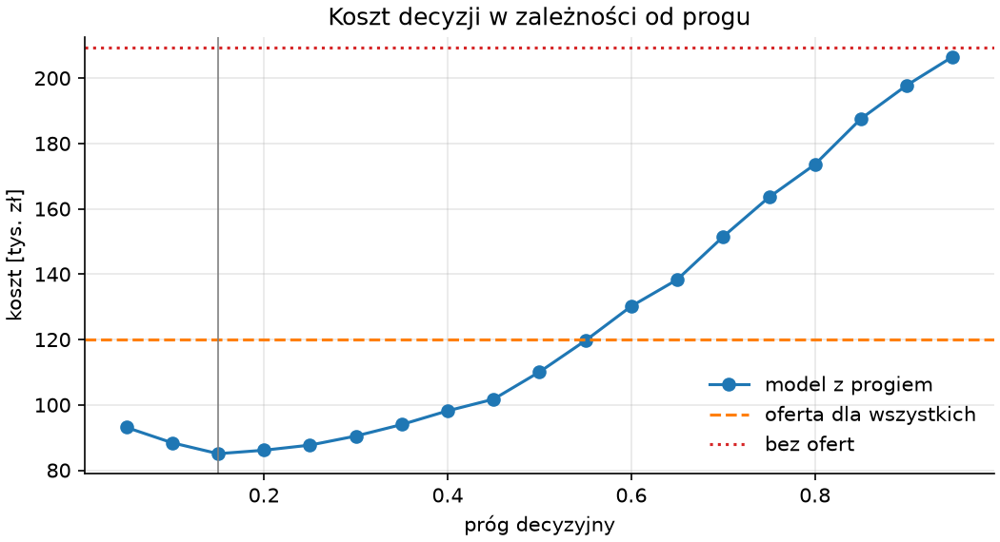

# Potok, modele i wybór

Decyzje zamieniamy w dwa moduły: przygotowania, który z pliku surowego robi tabelę z celem 0/1, dzieli ją i buduje transformator cech, oraz modeli, który zna kandydatów, porównuje ich w walidacji krzyżowej i dobiera próg według kosztu. Skrypt porównania uruchamia oba i pokazuje, co wybierzemy; testy sprawdzają moduły na kilku wierszach o znanym wyniku.

## Moduł przygotowania

```python title="skrypty/przygotowanie.py"
"""Wczytanie pliku surowego, czyszczenie według decyzji z README, podział i transformator cech."""

from pathlib import Path

import pandas as pd
from sklearn.compose import ColumnTransformer
from sklearn.impute import SimpleImputer
from sklearn.model_selection import train_test_split
from sklearn.pipeline import make_pipeline
from sklearn.preprocessing import OneHotEncoder, StandardScaler

SUROWE = Path("dane/surowe/klienci.csv")
CEL = "rezygnacja"
LICZBOWE = ["oplata_miesieczna", "staz_miesiecy", "uslugi_dodatkowe", "zgloszenia", "opoznione_platnosci", "wiek"]
KATEGORYCZNE = ["umowa", "plan", "platnosc"]
CECHY = LICZBOWE + KATEGORYCZNE
ETYKIETY = {"tak": 1, "1": 1, "nie": 0, "0": 0}
ZAKRES_WIEKU = (18, 100)
WYCIEK = "powod_rezygnacji"


def wczytaj_surowe(sciezka=SUROWE):
    return pd.read_csv(sciezka)


def oczysc(surowe):
    """Zwraca oczyszczoną ramkę z celem 0/1 oraz dziennik decyzji."""
    dziennik = {"wierszy_surowych": len(surowe)}
    czyste = surowe.drop_duplicates(subset="id_klienta")
    dziennik["duplikaty"] = len(surowe) - len(czyste)
    etykiety = czyste[CEL].str.strip().str.lower().map(ETYKIETY)
    if etykiety.isna().any():
        raise ValueError(f"nieznane etykiety celu: {czyste.loc[etykiety.isna(), CEL].unique().tolist()}")
    dziennik["etykiety_ujednolicone"] = int((~czyste[CEL].isin(["tak", "nie"])).sum())
    plan = czyste["plan"].str.strip().str.lower()
    dziennik["plan_ujednolicony"] = int((plan != czyste["plan"]).sum())
    wiek = czyste["wiek"].where(czyste["wiek"].between(*ZAKRES_WIEKU))
    dziennik["wiek_poza_zakresem"] = int((czyste["wiek"].notna() & wiek.isna()).sum())
    dziennik["wiek_brak"] = int(wiek.isna().sum())
    dziennik["wyciek_usuniety"] = WYCIEK
    czyste = czyste.assign(**{CEL: etykiety.astype(int), "plan": plan, "wiek": wiek}).drop(columns=WYCIEK)
    dziennik["wierszy_czystych"] = len(czyste)
    dziennik["udzial_rezygnacji"] = round(float(czyste[CEL].mean()), 3)
    return czyste.reset_index(drop=True), dziennik


def podziel(czyste, random_state=42):
    return train_test_split(czyste[CECHY], czyste[CEL], test_size=0.25, random_state=random_state, stratify=czyste[CEL])


def zbuduj_przygotowanie():
    return ColumnTransformer([
        ("liczbowe", make_pipeline(SimpleImputer(strategy="median", add_indicator=True), StandardScaler()), LICZBOWE),
        ("kategoryczne", OneHotEncoder(handle_unknown="ignore", sparse_output=False), KATEGORYCZNE),
    ], verbose_feature_names_out=False)


if __name__ == "__main__":
    czyste, dziennik = oczysc(wczytaj_surowe())
    print(dziennik)
    print(czyste.dtypes[[CEL, "plan", "wiek"]].to_dict())
    X_trening, X_test, y_trening, y_test = podziel(czyste)
    print(X_trening.shape, X_test.shape, round(y_trening.mean(), 3), round(y_test.mean(), 3))
    przygotowane = zbuduj_przygotowanie().set_output(transform="pandas").fit_transform(X_trening)
    print(przygotowane.shape, przygotowane.columns.tolist())
```

```{ .text .no-copy }
{'wierszy_surowych': 2010, 'duplikaty': 10, 'etykiety_ujednolicone': 110, 'plan_ujednolicony': 40, 'wiek_poza_zakresem': 10, 'wiek_brak': 100, 'wyciek_usuniety': 'powod_rezygnacji', 'wierszy_czystych': 2000, 'udzial_rezygnacji': 0.279}
{'rezygnacja': dtype('int64'), 'plan': <StringDtype(na_value=nan)>, 'wiek': dtype('float64')}
(1500, 9) (500, 9) 0.279 0.278
(1500, 16) ['oplata_miesieczna', 'staz_miesiecy', 'uslugi_dodatkowe', 'zgloszenia', 'opoznione_platnosci', 'wiek', 'missingindicator_wiek', 'umowa_dwuletnia', 'umowa_miesięczna', 'umowa_roczna', 'plan_podstawowy', 'plan_premium', 'plan_standard', 'platnosc_karta', 'platnosc_polecenie zapłaty', 'platnosc_przelew']
```

`oczysc()` wykonuje decyzje z README w kolejności z tabeli i liczy każdą w dzienniku, jak w rozdziale 6; nieznana etykieta zatrzymuje potok wyjątkiem z listą wartości, więc plik z nową pisownią nie przejdzie niezauważony. `podziel()` wykonuje podział z rozdziału 7 ze stałym ziarnem i stratyfikacją — obie części mają ten sam udział rezygnacji — a listy kolumn są stałymi modułu, bo używa ich także skrypt oceniający nowych klientów. `zbuduj_przygotowanie()` zwraca transformator z rozdziału 9: imputacja ze wskaźnikiem braku i skalowanie dla cech liczbowych, kodowanie zero-jedynkowe z `handle_unknown="ignore"` dla kategorii — bez `drop="first"`, bo ten sam transformator posłuży modelom drzewiastym, a regresję logistyczną przed zależnością kolumn chroni regularyzacja. Wynik ma 16 kolumn: sześć liczbowych, wskaźnik braku wieku i dziewięć zero-jedynkowych.

## Moduł modeli

```python title="skrypty/modele.py"
"""Kandydaci, porównanie w walidacji krzyżowej i dobór progu według kosztu błędu."""

import numpy as np
import pandas as pd
from sklearn.dummy import DummyClassifier
from sklearn.ensemble import HistGradientBoostingClassifier, RandomForestClassifier
from sklearn.linear_model import LogisticRegression
from sklearn.metrics import confusion_matrix
from sklearn.model_selection import StratifiedKFold, cross_val_predict, cross_validate
from sklearn.neural_network import MLPClassifier
from sklearn.pipeline import Pipeline

from przygotowanie import zbuduj_przygotowanie

KOSZT_UTRATY = 500
KOSZT_OFERTY = 80
PODZIALY = StratifiedKFold(n_splits=5, shuffle=True, random_state=42)
PROGI = np.round(np.arange(0.05, 0.96, 0.05), 2)


def kandydaci():
    return {
        "bazowy": DummyClassifier(strategy="prior"),
        "regresja logistyczna": LogisticRegression(max_iter=1000),
        "las losowy": RandomForestClassifier(n_estimators=300, random_state=42, n_jobs=-1),
        "wzmacnianie gradientowe": HistGradientBoostingClassifier(random_state=42),
        "sieć MLP": MLPClassifier(hidden_layer_sizes=(32, 32), max_iter=1000, early_stopping=True, random_state=42),
    }


def potok(model):
    return Pipeline([("przygotowanie", zbuduj_przygotowanie()), ("model", model)])


def porownaj(X, y):
    wiersze = []
    for nazwa, model in kandydaci().items():
        wyniki = cross_validate(potok(model), X, y, cv=PODZIALY, scoring=["roc_auc", "balanced_accuracy"])
        wiersze.append({"model": nazwa, "AUC": wyniki["test_roc_auc"].mean(), "±": wyniki["test_roc_auc"].std(), "dokł. zrównoważona": wyniki["test_balanced_accuracy"].mean()})
    return pd.DataFrame(wiersze).set_index("model").round(3)


def koszt(y, decyzja, koszt_utraty=KOSZT_UTRATY, koszt_oferty=KOSZT_OFERTY):
    """Łączny koszt decyzji: przeoczeni odchodzący × koszt utraty + wszystkie oferty × koszt oferty."""
    tn, fp, fn, tp = confusion_matrix(y, decyzja, labels=[0, 1]).ravel()
    return int(fn * koszt_utraty + (tp + fp) * koszt_oferty)


def tabela_kosztow(prawdopodobienstwo, y, progi=PROGI):
    wiersze = []
    for prog in progi:
        decyzja = (prawdopodobienstwo >= prog).astype(int)
        tn, fp, fn, tp = confusion_matrix(y, decyzja, labels=[0, 1]).ravel()
        wiersze.append({"prog": prog, "przeoczenia": fn, "oferty": tp + fp, "koszt": koszt(y, decyzja)})
    return pd.DataFrame(wiersze).set_index("prog")


def dobierz_prog(model, X, y):
    """Próg o najmniejszym koszcie na predykcjach z walidacji krzyżowej; zwraca próg i tabelę kosztów."""
    prawdopodobienstwo = cross_val_predict(model, X, y, cv=PODZIALY, method="predict_proba")[:, 1]
    tabela = tabela_kosztow(prawdopodobienstwo, y)
    return float(tabela["koszt"].idxmin()), tabela


def koszty_odniesienia(y):
    return {"nikt": int(y.sum() * KOSZT_UTRATY), "wszyscy": int(len(y) * KOSZT_OFERTY)}
```

Kandydaci to modele z rozdziałów 8 i 11 w domyślnych ustawieniach plus model bazowy: regresja logistyczna, las losowy, wzmacnianie gradientowe i sieć — `MLPClassifier` scikit-learn zamiast pętli PyTorch, bo tylko estymator z `fit()` wchodzi do `cross_validate()` bez dodatkowej pracy; dwie warstwy po 32 neurony z wczesnym zatrzymaniem odpowiadają sieci z rozdziału 11. Każdy kandydat jest potokiem ze wspólnym przygotowaniem, więc transformator uczy się osobno w każdym przebiegu walidacji, bez wycieku. Koszt decyzji różni się od rozdziału 8 jednym składnikiem: oferta kosztuje także wtedy, gdy trafia do klienta, który rzeczywiście odchodzi — to koszt trafienia, nie błędu, ale ponosimy go, więc wchodzi do rachunku. `dobierz_prog()` szuka minimum na predykcjach z walidacji krzyżowej, nie na teście, bo próg jest hiperparametrem.

## Rysunki

```python title="skrypty/rysunki.py"
"""Rysunki raportu: funkcje przyjmują tabele i zwracają obiekt Figure."""

import matplotlib.pyplot as plt

STYL = {"axes.spines.top": False, "axes.spines.right": False, "axes.grid": True, "grid.alpha": 0.3, "legend.frameon": False}


def rysunek_koszt(tabela, odniesienie, prog):
    with plt.rc_context(STYL):
        fig, ax = plt.subplots(figsize=(7, 3.8), layout="constrained")
        ax.plot(tabela.index, tabela["koszt"] / 1000, marker="o", label="model z progiem")
        ax.axhline(odniesienie["wszyscy"] / 1000, color="tab:orange", linestyle="--", label="oferta dla wszystkich")
        ax.axhline(odniesienie["nikt"] / 1000, color="tab:red", linestyle=":", label="bez ofert")
        ax.axvline(prog, color="gray", linewidth=0.8)
        ax.set_xlabel("próg decyzyjny")
        ax.set_ylabel("koszt [tys. zł]")
        ax.set_title("Koszt decyzji w zależności od progu")
        ax.legend()
    return fig


def rysunek_waznosc(waznosc):
    with plt.rc_context(STYL):
        fig, ax = plt.subplots(figsize=(7, 3.8), layout="constrained")
        ax.barh(waznosc.index[::-1], waznosc[::-1], color="tab:gray")
        ax.set_xlabel("spadek AUC po przetasowaniu cechy")
        ax.set_title("Ważność permutacyjna cech")
        ax.grid(axis="y")
    return fig
```

Funkcje rysujące mają kształt z rozdziałów 3 i 6: dostają tabele, zwracają `Figure`, niczego nie zapisują, a styl włączają przez `rc_context()`.

## Porównanie i próg

```python title="skrypty/porownanie.py"
from pathlib import Path

from modele import dobierz_prog, kandydaci, koszty_odniesienia, porownaj, potok
from przygotowanie import oczysc, podziel, wczytaj_surowe
from rysunki import rysunek_koszt

czyste, _ = oczysc(wczytaj_surowe())
X_trening, X_test, y_trening, y_test = podziel(czyste)
porownanie = porownaj(X_trening, y_trening)
print(porownanie.to_string())
najlepszy = porownanie["AUC"].idxmax()
prog, koszty = dobierz_prog(potok(kandydaci()[najlepszy]), X_trening, y_trening)
print(najlepszy, prog)
print(koszty.loc[[0.05, 0.1, 0.15, 0.2, 0.3, 0.5, 0.8]].to_string())
odniesienie = koszty_odniesienia(y_trening)
print(odniesienie, round(koszty.loc[prog, "koszt"] / len(y_trening)), round(odniesienie["wszyscy"] / len(y_trening)))
Path("wyniki/rysunki").mkdir(parents=True, exist_ok=True)
rysunek_koszt(koszty, odniesienie, prog).savefig("wyniki/rysunki/koszt-prog.png", dpi=150)
```

```{ .text .no-copy }
                           AUC      ±  dokł. zrównoważona
model                                                    
bazowy                   0.500  0.000               0.500
regresja logistyczna     0.867  0.037               0.760
las losowy               0.848  0.033               0.714
wzmacnianie gradientowe  0.834  0.021               0.717
sieć MLP                 0.832  0.038               0.689
regresja logistyczna 0.15
      przeoczenia  oferty   koszt
prog                             
0.05            8    1114   93120
0.10           32     905   88400
0.15           45     782   85060
0.20           62     689   86120
0.30           91     562   90460
0.50          164     351  110080
0.80          332      95  173600
{'nikt': 209500, 'wszyscy': 120000} 57 80
```

{ width="640" }

Regresja logistyczna ma najwyższe AUC, a pozostałe modele są słabsze o 0,02–0,035 — mniej niż jej odchylenie między częściami walidacji, więc różnice nie rozstrzygają; na 1500 wierszach z dziewięcioma cechami modele złożone nie mają czego się uczyć ponad to, co daje suma ważona, mimo współdziałania cech wpisanego w generator. Wybieramy model najprostszy i najlepszy zarazem, zgodnie z regułą z rozdziału 7. Tabela kosztów pokazuje, dlaczego próg 0,5 byłby błędem: przeoczenie kosztuje ponad sześć razy więcej niż oferta, więc opłaca się składać ją hojnie — minimum leży przy progu 0,15, a koszt na klienta spada z 80 zł przy ofercie dla wszystkich do 57 zł. Krzywa jest płaska między 0,1 a 0,25, więc dokładna wartość progu ma mniejsze znaczenie niż to, że leży daleko od 0,5.

## Testy

```python title="tests/conftest.py"
import sys
from pathlib import Path

sys.path.insert(0, str(Path(__file__).resolve().parent.parent / "skrypty"))
```

```python title="tests/test_przygotowanie.py"
import pandas as pd
import pytest

from przygotowanie import CECHY, oczysc, zbuduj_przygotowanie


@pytest.fixture
def surowe():
    return pd.DataFrame({
        "id_klienta": [1, 2, 2, 3, 4, 5],
        "umowa": ["miesięczna", "roczna", "roczna", "dwuletnia", "miesięczna", "roczna"],
        "plan": ["standard", "Premium ", "Premium ", "podstawowy", "STANDARD", "standard"],
        "oplata_miesieczna": [79.0, 129.0, 129.0, 49.0, 80.0, 75.0],
        "staz_miesiecy": [3, 40, 40, 70, 1, 12],
        "uslugi_dodatkowe": [0, 2, 2, 3, 0, 1],
        "zgloszenia": [4, 0, 0, 1, 3, 1],
        "opoznione_platnosci": [2, 0, 0, 0, 1, 0],
        "platnosc": ["przelew", "karta", "karta", "polecenie zapłaty", "przelew", "karta"],
        "wiek": [30.0, 0.0, 0.0, 140.0, None, 55.0],
        "powod_rezygnacji": ["cena", None, None, None, "jakość", None],
        "rezygnacja": ["tak", "nie", "nie", "NIE", "1", "0"],
    })


def test_oczysc_stosuje_decyzje(surowe):
    czyste, dziennik = oczysc(surowe)
    assert dziennik["duplikaty"] == 1
    assert dziennik["etykiety_ujednolicone"] == 3
    assert dziennik["plan_ujednolicony"] == 2
    assert dziennik["wiek_poza_zakresem"] == 2
    assert dziennik["wiek_brak"] == 3
    assert czyste["rezygnacja"].tolist() == [1, 0, 0, 1, 0]
    assert czyste["plan"].tolist() == ["standard", "premium", "podstawowy", "standard", "standard"]
    assert czyste["wiek"].isna().tolist() == [False, True, True, True, False]
    assert "powod_rezygnacji" not in czyste.columns


def test_oczysc_odrzuca_nieznana_etykiete(surowe):
    surowe.loc[0, "rezygnacja"] = "może"
    with pytest.raises(ValueError, match="może"):
        oczysc(surowe)


def test_przygotowanie_koduje_i_imputuje(surowe):
    czyste, _ = oczysc(surowe)
    przygotowane = zbuduj_przygotowanie().set_output(transform="pandas").fit_transform(czyste[CECHY])
    assert przygotowane.shape == (5, 16)
    assert (przygotowane["missingindicator_wiek"] > 0).tolist() == [False, True, True, True, False]
    assert przygotowane["umowa_miesięczna"].tolist() == [1.0, 0.0, 0.0, 1.0, 0.0]
    assert przygotowane.isna().sum().sum() == 0
```

```python title="tests/test_modele.py"
import numpy as np

from modele import koszt, tabela_kosztow


def test_koszt_liczy_przeoczenia_i_oferty():
    y = np.array([1, 1, 0, 0])
    decyzja = np.array([1, 0, 1, 0])
    assert koszt(y, decyzja, koszt_utraty=500, koszt_oferty=80) == 500 + 2 * 80


def test_tabela_kosztow_wskazuje_najlepszy_prog():
    prawdopodobienstwo = np.array([0.9, 0.6, 0.3, 0.1])
    y = np.array([1, 1, 0, 0])
    tabela = tabela_kosztow(prawdopodobienstwo, y, progi=[0.2, 0.5, 0.8])
    assert tabela["przeoczenia"].tolist() == [0, 0, 1]
    assert tabela["oferty"].tolist() == [3, 2, 1]
    assert tabela["koszt"].tolist() == [240, 160, 580]
    assert tabela["koszt"].idxmin() == 0.5
```

```powershell title="Terminal"
python -m pytest -q
```

```{ .text .no-copy }
.....                                                                    [100%]
5 passed in 1.02s
```

Fixture ma sześć wierszy ułożonych tak, aby uruchomić każdą decyzję: duplikat, pięć zapisów etykiety, dwa zapisy planu, wiek zerowy, za duży i brakujący, powód rezygnacji. Test transformatora sprawdza kształt i wartości, na które powołuje się opis modułu przygotowania — 16 kolumn, wskaźnik braku, kodowanie umowy — oraz brak `NaN` na wyjściu. Testy modułu modeli używają czterech ręcznie policzonych prawdopodobieństw, więc awaria wskaże błąd w rachunku kosztu, nie w danych.
