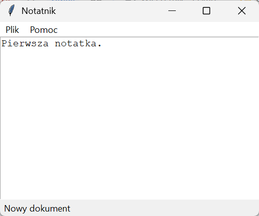
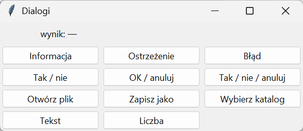
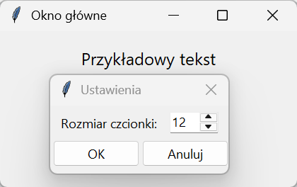

# Aplikacja obiektowa, menu i dialogi

Skrypt z widżetami w zmiennych modułu wystarcza do jednego okna z kilkoma przyciskami. Aplikacja z menu, dialogami i stanem, który zmienia się w wielu miejscach, potrzebuje klasy: widżety i dane stają się atrybutami, a funkcje zwrotne metodami, które mają do nich dostęp przez `self` — bez `global` i bez słowników zastępujących zmienne.

## Klasa aplikacji i menu

```python title="aplikacja.py"
import tkinter as tk
from pathlib import Path
from tkinter import filedialog, messagebox, ttk


class Notatnik(tk.Tk):
    def __init__(self):
        super().__init__()
        self.title("Notatnik")
        self.geometry("520x360")
        self.plik = None
        self._buduj_menu()
        self._buduj_widzety()
        self._buduj_skroty()

    def _buduj_menu(self):
        pasek = tk.Menu(self)
        self.configure(menu=pasek)
        self.menu_plik = tk.Menu(pasek)
        self.menu_plik.add_command(label="Nowy", command=self.nowy, accelerator="Ctrl+N")
        self.menu_plik.add_command(label="Otwórz…", command=self.otworz, accelerator="Ctrl+O")
        self.menu_plik.add_command(label="Zapisz", command=self.zapisz, accelerator="Ctrl+S")
        self.menu_plik.add_separator()
        self.menu_plik.add_command(label="Zakończ", command=self.zamknij)
        pasek.add_cascade(label="Plik", menu=self.menu_plik)
        menu_pomoc = tk.Menu(pasek)
        menu_pomoc.add_command(label="O programie", command=lambda: messagebox.showinfo("Notatnik", "Notatnik — przykład z rozdziału 16."))
        pasek.add_cascade(label="Pomoc", menu=menu_pomoc)

    def _buduj_widzety(self):
        self.stan = tk.StringVar(value="Nowy dokument")
        ttk.Label(self, textvariable=self.stan, anchor="w", padding=(6, 2)).pack(side="bottom", fill="x")
        self.tekst = tk.Text(self, wrap="word", undo=True)
        self.tekst.pack(fill="both", expand=True)

    def _buduj_skroty(self):
        self.bind("<Control-n>", lambda zdarzenie: self.nowy())
        self.bind("<Control-o>", lambda zdarzenie: self.otworz())
        self.unbind_class("Text", "<Control-o>")
        self.bind("<Control-s>", lambda zdarzenie: self.zapisz())
        self.protocol("WM_DELETE_WINDOW", self.zamknij)

    def nowy(self):
        self.tekst.delete("1.0", "end")
        self.plik = None
        self.stan.set("Nowy dokument")

    def otworz(self):
        sciezka = filedialog.askopenfilename(filetypes=[("Pliki tekstowe", "*.txt"), ("Wszystkie", "*.*")])
        if sciezka:
            self.plik = Path(sciezka)
            self.tekst.delete("1.0", "end")
            self.tekst.insert("1.0", self.plik.read_text(encoding="utf-8"))
            self.stan.set(f"Otwarto {self.plik.name}")

    def zapisz(self):
        if self.plik is None:
            sciezka = filedialog.asksaveasfilename(defaultextension=".txt", filetypes=[("Pliki tekstowe", "*.txt")])
            if not sciezka:
                return
            self.plik = Path(sciezka)
        self.plik.write_text(self.tekst.get("1.0", "end-1c"), encoding="utf-8")
        self.stan.set(f"Zapisano {self.plik.name}")

    def zamknij(self):
        if self.tekst.edit_modified() and not messagebox.askyesno("Notatnik", "Dokument ma niezapisane zmiany. Zamknąć mimo to?"):
            return
        self.destroy()


if __name__ == "__main__":
    aplikacja = Notatnik()
    aplikacja.tekst.insert("1.0", "Pierwsza notatka.\n")
    print([aplikacja.menu_plik.entrycget(i, "label") for i in range(aplikacja.menu_plik.index("end") + 1) if aplikacja.menu_plik.type(i) == "command"])
    print(aplikacja.menu_plik.cget("tearoff"), aplikacja.menu_plik.entrycget(0, "accelerator"), aplikacja.tekst.edit_modified())
    aplikacja.mainloop()
```

```{ .text .no-copy }
['Nowy', 'Otwórz…', 'Zapisz', 'Zakończ']
0 Ctrl+N 1
```



Klasa dziedziczy po `tk.Tk`, więc obiekt aplikacji jest oknem głównym — `super().__init__()` tworzy okno, a konstruktor dzieli budowę na metody: menu, widżety, skróty. Pasek stanu pakujemy przed polem tekstowym z `side="bottom"`, bo gdy okno robi się za małe, `pack()` odbiera miejsce widżetom dodanym później — inaczej pasek zniknąłby pierwszy. Stan aplikacji (`plik`, zmienna paska stanu) to atrybuty, do których każda metoda ma dostęp. Menu składa się z paska `Menu` przypiętego do okna opcją `menu` i podmenu dodawanych `add_cascade()`; pozycje to `add_command()` z funkcją zwrotną, `add_separator()` rysuje kreskę. Opcja `accelerator` tylko wyświetla skrót obok pozycji — samo działanie skrótu trzeba związać `bind()`, jak w `_buduj_skroty()`; `Text` ma własne wiązanie `<Control-o>` (wstawia pusty wiersz), wykonywane przed wiązaniem okna, więc `unbind_class()` je usuwa. W Tk 9 podmenu nie mają przerywanej linii odrywającej (opcja `tearoff` domyślnie `0`); w Tk 8.6 trzeba ją wyłączyć jawnie: `tk.Menu(pasek, tearoff=0)`. Metody odczytu — `index("end")`, `type()`, `entrycget()` — pozwalają sprawdzić menu w skrypcie. `Text` z `undo=True` obsługuje cofanie (++ctrl+z++) i pamięta w `edit_modified()`, czy dokument zmienił się od ostatniego zapisu; tu zwraca `1` (prawdę), bo wstawiliśmy notatkę. Blok strażnika `__main__` z rozdziału 7 „Python Notatki” pozwala importować klasę do testów bez otwierania okna.

## Dialogi

```python title="dialogi.py"
import tkinter as tk
from tkinter import filedialog, messagebox, simpledialog, ttk

okno = tk.Tk()
okno.title("Dialogi")
wynik = tk.StringVar(value="wynik: —")
ttk.Label(okno, textvariable=wynik, width=44).grid(row=0, column=0, columnspan=3, padx=10, pady=8)


def pokaz(funkcja, *argumenty, **opcje):
    wynik.set(f"wynik: {funkcja(*argumenty, **opcje)!r}")


dialogi = [
    ("Informacja", lambda: pokaz(messagebox.showinfo, "Informacja", "Operacja zakończona.")),
    ("Ostrzeżenie", lambda: pokaz(messagebox.showwarning, "Uwaga", "Plik jest duży.")),
    ("Błąd", lambda: pokaz(messagebox.showerror, "Błąd", "Nie znaleziono pliku.")),
    ("Tak / nie", lambda: pokaz(messagebox.askyesno, "Pytanie", "Zapisać zmiany?")),
    ("OK / anuluj", lambda: pokaz(messagebox.askokcancel, "Potwierdzenie", "Usunąć wpis?")),
    ("Tak / nie / anuluj", lambda: pokaz(messagebox.askyesnocancel, "Pytanie", "Zapisać przed zamknięciem?")),
    ("Otwórz plik", lambda: pokaz(filedialog.askopenfilename, filetypes=[("CSV", "*.csv"), ("Wszystkie", "*.*")])),
    ("Zapisz jako", lambda: pokaz(filedialog.asksaveasfilename, defaultextension=".txt")),
    ("Wybierz katalog", lambda: pokaz(filedialog.askdirectory)),
    ("Tekst", lambda: pokaz(simpledialog.askstring, "Imię", "Podaj imię:")),
    ("Liczba", lambda: pokaz(simpledialog.askinteger, "Wiek", "Podaj wiek:", minvalue=0, maxvalue=120)),
]
for numer, (etykieta, funkcja) in enumerate(dialogi):
    ttk.Button(okno, text=etykieta, command=funkcja, width=18).grid(row=1 + numer // 3, column=numer % 3, padx=4, pady=3)
okno.mainloop()
```



Moduły `messagebox`, `filedialog` i `simpledialog` dostarczają gotowe okna systemowe. Wszystkie są **modalne** (ang. *modal*): wywołanie nie wraca do zamknięcia okna i zwraca wynik, który warto znać przed napisaniem warunku.

| Funkcja | Zwraca |
|---|---|
| `showinfo`, `showwarning`, `showerror` | tekst `"ok"` |
| `askyesno`, `askokcancel`, `askretrycancel` | `True`/`False` |
| `askyesnocancel` | `True`, `False` albo `None` po anulowaniu |
| `askquestion` | tekst `"yes"`/`"no"` |
| `askopenfilename`, `asksaveasfilename`, `askdirectory` | ścieżkę albo pusty tekst po anulowaniu |
| `askstring`, `askinteger`, `askfloat` | wartość albo `None` po anulowaniu |

Anulowanie zawsze trzeba obsłużyć: pusty tekst i `None` są fałszywe, więc dla ścieżki wystarcza `if sciezka:`; wynik `askinteger` porównujemy z `None`, bo `0` także jest fałszywe. `askinteger` sam pilnuje, by wpis był liczbą z zakresu `minvalue`–`maxvalue`, a przy błędzie wyświetla ostrzeżenie i pozostawia okno otwarte.

## Okna potomne

```python title="potomne.py"
import tkinter as tk
from tkinter import ttk


class Ustawienia(tk.Toplevel):
    def __init__(self, rodzic, rozmiar):
        super().__init__(rodzic)
        self.title("Ustawienia")
        self.resizable(False, False)
        self.transient(rodzic)
        self.geometry(f"+{rodzic.winfo_rootx() + 60}+{rodzic.winfo_rooty() + 60}")
        self.rozmiar = tk.IntVar(value=rozmiar)
        self.wynik = None
        ttk.Label(self, text="Rozmiar czcionki:").grid(row=0, column=0, padx=10, pady=10)
        ttk.Spinbox(self, from_=8, to=32, textvariable=self.rozmiar, width=5).grid(row=0, column=1, padx=(0, 10))
        przyciski = ttk.Frame(self)
        przyciski.grid(row=1, column=0, columnspan=2, pady=(0, 10))
        ttk.Button(przyciski, text="OK", command=self.zatwierdz).pack(side="left", padx=4)
        ttk.Button(przyciski, text="Anuluj", command=self.destroy).pack(side="left")
        self.grab_set()

    def zatwierdz(self):
        self.wynik = self.rozmiar.get()
        self.destroy()


okno = tk.Tk()
okno.title("Okno główne")
okno.geometry("420x220")
etykieta = ttk.Label(okno, text="Przykładowy tekst", font=("Segoe UI", 12))
etykieta.pack(pady=20)
stan = {"rozmiar": 12}


def ustawienia():
    dialog = Ustawienia(okno, stan["rozmiar"])
    okno.wait_window(dialog)
    if dialog.wynik is not None:
        stan["rozmiar"] = dialog.wynik
        etykieta.configure(font=("Segoe UI", stan["rozmiar"]))


ttk.Button(okno, text="Ustawienia…", command=ustawienia).pack()
okno.after(200, lambda: Ustawienia(okno, stan["rozmiar"]))
okno.mainloop()
```



Własne okno dialogowe to klasa po `tk.Toplevel` — drugie okno tego samego programu z własnymi widżetami. `transient(rodzic)` trzyma je nad oknem głównym i bez osobnej pozycji na pasku zadań, `geometry("+x+y")` ustawia je obok rodzica, `grab_set()` kieruje do niego wszystkie zdarzenia (okno staje się modalne; na Linuksie przed `grab_set()` trzeba poczekać na wyświetlenie okna: `wait_visibility()`), a `wait_window()` w oknie głównym czeka na jego zamknięcie, nie zatrzymując pętli zdarzeń. Wynik dialog zapisuje w atrybucie, który wywołujący odczytuje po powrocie; `None` oznacza anulowanie. Skrypt otwiera dialog sam po 200 ms tylko na potrzeby zrzutu; w programie robi to przycisk przez `ustawienia()`.

## Zamykanie aplikacji

Aplikacja kończy się, gdy okno główne zostanie zniszczone: `destroy()` usuwa je z widżetami i oknami potomnymi, `mainloop()` wraca, a program wykonuje instrukcje po nim — zwykle nic więcej. `quit()` przerywa tylko pętlę zdarzeń, okno zostaje na ekranie do końca procesu, więc w funkcjach zwrotnych używamy `destroy()`; `sys.exit()` wewnątrz funkcji zwrotnej także działa, ale omija kod po `mainloop()`. Przycisk zamykania okna obsługuje `protocol("WM_DELETE_WINDOW", …)` — miejsce na pytanie o niezapisane zmiany, jak w klasie `Notatnik`.
