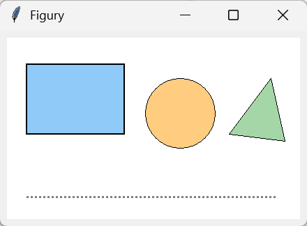
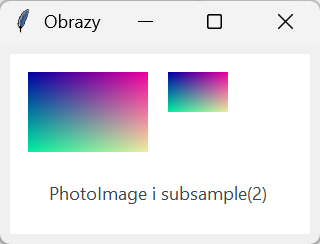
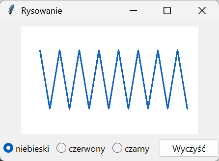
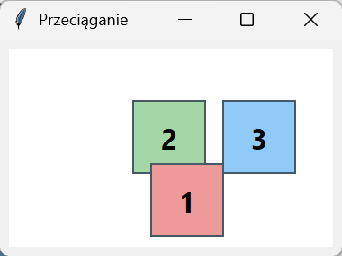
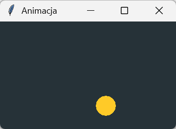
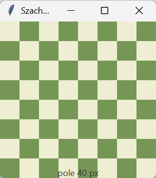

# Canvas — rysowanie i animacja

**Płótno** `Canvas` to widżet do grafiki: rysuje figury, tekst i obrazy, pamięta każdy narysowany element jako obiekt z identyfikatorem i tagami, więc można go później przesuwać, przemalowywać i usuwać, oraz zgłasza zdarzenia myszy ze współrzędnymi. Wystarcza na wykresy rysowane ręcznie, proste gry i edytory.

## Figury i tekst

```python title="figury.py"
import tkinter as tk

okno = tk.Tk()
okno.title("Figury")
plotno = tk.Canvas(okno, width=420, height=260, background="white")
plotno.pack(padx=8, pady=8)
prostokat = plotno.create_rectangle(30, 40, 170, 140, fill="#90caf9", outline="#1565c0", width=2, tags=("figura",))
kolo = plotno.create_oval(200, 40, 300, 140, fill="#ffcc80", outline="", tags=("figura",))
linia = plotno.create_line(30, 200, 390, 200, fill="gray", width=3, dash=(6, 4))
wielokat = plotno.create_polygon(320, 140, 380, 60, 400, 150, fill="#a5d6a7", outline="#2e7d32", tags=("figura",))
tytul = plotno.create_text(210, 20, text="Płótno", font=("Segoe UI", 14, "bold"), fill="#37474f")
print(prostokat, kolo, linia, wielokat, tytul, plotno.find_withtag("figura"))
print(plotno.coords(prostokat), plotno.bbox("figura"), plotno.type(kolo))
plotno.move(kolo, 0, 20)
plotno.itemconfigure("figura", outline="black")
plotno.coords(linia, 30, 230, 390, 230)
plotno.delete(tytul)
print(plotno.coords(kolo), plotno.itemcget(kolo, "outline"), len(plotno.find_all()))
okno.mainloop()
```

```{ .text .no-copy }
1 2 3 4 5 (1, 2, 4)
[30.0, 40.0, 170.0, 140.0] (29, 39, 402, 152) oval
[200.0, 60.0, 300.0, 160.0] black 4
```



Współrzędne płótna liczy się w pikselach od lewego górnego rogu, z osią y w dół. Każda metoda `create_*` zwraca identyfikator — kolejną liczbę całkowitą — a opcja `tags` nadaje etykiety, którymi można adresować wiele elementów naraz: `find_withtag()`, `itemconfigure()`, `bbox()` i `delete()` przyjmują identyfikator albo tag. `coords()` odczytuje lub ustawia współrzędne, `move()` przesuwa o wektor, `itemcget()` odczytuje opcję, `type()` rodzaj elementu, a `find_all()` wszystkie identyfikatory. Elementy późniejsze przykrywają wcześniejsze; `tag_raise()` i `tag_lower()` zmieniają kolejność.

## Obrazy

```python title="obrazy.py"
import tkinter as tk

from PIL import Image

obraz = Image.new("RGB", (120, 80))
for x in range(120):
    for y in range(80):
        obraz.putpixel((x, y), (x * 2, y * 3, 160))
obraz.save("gradient.png")

okno = tk.Tk()
okno.title("Obrazy")
plotno = tk.Canvas(okno, width=300, height=180, background="white")
plotno.pack(padx=8, pady=8)
zdjecie = tk.PhotoImage(file="gradient.png")
miniatura = zdjecie.subsample(2)
plotno.create_image(20, 20, image=zdjecie, anchor="nw")
plotno.create_image(160, 20, image=miniatura, anchor="nw")
plotno.create_text(150, 140, text="PhotoImage i subsample(2)", fill="#37474f")
plotno.obrazy = (zdjecie, miniatura)
print(zdjecie.width(), zdjecie.height(), miniatura.width(), miniatura.height(), zdjecie.get(0, 0), zdjecie.get(119, 79))
okno.mainloop()
```

```{ .text .no-copy }
120 80 60 40 (0, 0, 160) (238, 237, 160)
```



`PhotoImage` wczytuje pliki PNG, GIF i — w Tk 9 — SVG; `subsample(n)` daje kopię pomniejszoną n-krotnie, `zoom(n)` powiększoną, `get(x, y)` zwraca składowe piksela. Obraz JPEG wymaga Pillow: `ImageTk.PhotoImage(Image.open("zdjecie.jpg"))` z modułu `PIL.ImageTk` daje obiekt, który `create_image()` przyjmuje tak samo, choć bez `subsample()`, `zoom()` i `get()`. Pułapka: płótno przechowuje tylko odwołanie do obrazu po stronie Tk, a obiekt Pythona musi żyć — obraz utworzony w funkcji i nieprzypisany nigdzie zostaje zebrany przez odśmiecacz i pole pozostaje puste, bez błędu. Dlatego obrazy przypisujemy do atrybutu widżetu albo aplikacji. Obraz przykładowy powstaje tu z Pillow, żeby skrypt nie zależał od pliku.

## Rysowanie i przeciąganie myszą

```python title="rysowanie.py"
import tkinter as tk
from tkinter import ttk


class Szkicownik:
    def __init__(self, rodzic):
        self.plotno = tk.Canvas(rodzic, width=360, height=220, background="white", cursor="pencil")
        self.plotno.pack(padx=8, pady=8)
        self.kolor = tk.StringVar(value="#1565c0")
        pasek = ttk.Frame(rodzic)
        pasek.pack(pady=(0, 8))
        for nazwa, kolor in (("niebieski", "#1565c0"), ("czerwony", "#c62828"), ("czarny", "black")):
            ttk.Radiobutton(pasek, text=nazwa, value=kolor, variable=self.kolor).pack(side="left", padx=4)
        ttk.Button(pasek, text="Wyczyść", command=lambda: self.plotno.delete("all")).pack(side="left", padx=(12, 0))
        self.ostatni = None
        self.plotno.bind("<Button-1>", self.zacznij)
        self.plotno.bind("<B1-Motion>", self.rysuj)
        self.plotno.bind("<ButtonRelease-1>", self.skoncz)

    def zacznij(self, zdarzenie):
        self.ostatni = (zdarzenie.x, zdarzenie.y)

    def rysuj(self, zdarzenie):
        self.plotno.create_line(*self.ostatni, zdarzenie.x, zdarzenie.y, fill=self.kolor.get(), width=3, capstyle="round", tags=("kreska",))
        self.ostatni = (zdarzenie.x, zdarzenie.y)

    def skoncz(self, zdarzenie):
        self.ostatni = None


okno = tk.Tk()
okno.title("Rysowanie")
szkic = Szkicownik(okno)
okno.update()
punkty = [(40 + numer * 20, 110 + (60 if numer % 2 else -60)) for numer in range(16)]
szkic.plotno.event_generate("<Button-1>", x=punkty[0][0], y=punkty[0][1])
for x, y in punkty[1:]:
    szkic.plotno.event_generate("<B1-Motion>", x=x, y=y)
szkic.plotno.event_generate("<ButtonRelease-1>", x=x, y=y)
print(len(szkic.plotno.find_withtag("kreska")), szkic.ostatni)
okno.mainloop()
```

```{ .text .no-copy }
15 None
```



Rysowanie odręczne to trzy zdarzenia: naciśnięcie zapamiętuje punkt, ruch z wciśniętym przyciskiem (`<B1-Motion>`) dorysowuje odcinek od poprzedniego punktu do bieżącego, zwolnienie kończy kreskę. Stan — ostatni punkt, kolor — trzyma klasa, jak w dymku z trzeciej strony. Skrypt generuje zdarzenia sam (`event_generate()` ze współrzędnymi), więc zygzak na zrzucie powstał bez myszy; tak samo testuje się obsługę rysowania.

```python title="przeciaganie.py"
import tkinter as tk


class Przeciaganie:
    def __init__(self, plotno):
        self.plotno = plotno
        self.grupa = None
        self.punkt = None
        plotno.tag_bind("klocek", "<ButtonPress-1>", self.chwyc)
        plotno.tag_bind("klocek", "<B1-Motion>", self.przesun)
        plotno.tag_bind("klocek", "<ButtonRelease-1>", self.pusc)

    def chwyc(self, zdarzenie):
        element = self.plotno.find_closest(zdarzenie.x, zdarzenie.y)[0]
        self.grupa = [tag for tag in self.plotno.gettags(element) if tag.startswith("grupa")][0]
        self.punkt = (zdarzenie.x, zdarzenie.y)
        self.plotno.tag_raise(self.grupa)

    def przesun(self, zdarzenie):
        self.plotno.move(self.grupa, zdarzenie.x - self.punkt[0], zdarzenie.y - self.punkt[1])
        self.punkt = (zdarzenie.x, zdarzenie.y)

    def pusc(self, zdarzenie):
        self.grupa = None


okno = tk.Tk()
okno.title("Przeciąganie")
plotno = tk.Canvas(okno, width=360, height=220, background="white")
plotno.pack(padx=8, pady=8)
for numer, (x, kolor) in enumerate(((40, "#ef9a9a"), (140, "#a5d6a7"), (240, "#90caf9")), start=1):
    tagi = ("klocek", f"grupa{numer}")
    plotno.create_rectangle(x, 60, x + 80, 140, fill=kolor, outline="#455a64", width=2, tags=tagi)
    plotno.create_text(x + 40, 100, text=str(numer), font=("Segoe UI", 16, "bold"), tags=tagi)
Przeciaganie(plotno)
okno.update()
print(plotno.coords("grupa1")[:4], plotno.gettags(1))
plotno.event_generate("<ButtonPress-1>", x=60, y=100)
plotno.event_generate("<B1-Motion>", x=120, y=150)
plotno.event_generate("<B1-Motion>", x=180, y=170)
plotno.event_generate("<ButtonRelease-1>", x=180, y=170)
print(plotno.coords(1), plotno.find_closest(180, 170))
okno.mainloop()
```

```{ .text .no-copy }
[40.0, 60.0, 120.0, 140.0] ('klocek', 'grupa1')
[160.0, 130.0, 240.0, 210.0] (1,)
```



`tag_bind()` wiąże zdarzenie tylko z elementami o danym tagu — kliknięcie w puste płótno nic nie robi. `find_closest()` zwraca krotkę z identyfikatorem elementu najbliższego punktu; ponieważ klocek składa się z prostokąta i napisu, obie części noszą wspólny tag `grupaN`, a przesuwamy grupę, nie pojedynczy element. `gettags()` odczytuje tagi elementu, `tag_raise()` wynosi chwycony klocek nad pozostałe.

## Animacja

```python title="animacja.py"
import tkinter as tk

okno = tk.Tk()
okno.title("Animacja")
plotno = tk.Canvas(okno, width=360, height=220, background="#263238", highlightthickness=0)
plotno.pack()
pilka = plotno.create_oval(20, 20, 60, 60, fill="#ffca28", outline="")
predkosc = {"dx": 4, "dy": 3}


def krok():
    plotno.move(pilka, predkosc["dx"], predkosc["dy"])
    x1, y1, x2, y2 = plotno.coords(pilka)
    if x1 <= 0 or x2 >= 360:
        predkosc["dx"] = -predkosc["dx"]
    if y1 <= 0 or y2 >= 220:
        predkosc["dy"] = -predkosc["dy"]
    okno.after(16, krok)


krok()
okno.mainloop()
```



Animacja to funkcja, która przesuwa elementy o mały krok i planuje samą siebie przez `after(16, …)` — około 60 klatek na sekundę. Odbicie od krawędzi to zmiana znaku prędkości po odczytaniu `coords()`. Pętla `while` z `sleep()` zamroziłaby okno; `after()` zostawia czas na obsługę zdarzeń między klatkami, więc przyciski i menu działają w trakcie animacji.

## Szachownica i zmiana rozmiaru

```python title="szachownica.py"
import tkinter as tk

okno = tk.Tk()
okno.title("Szachownica")
okno.geometry("320x320")
plotno = tk.Canvas(okno, highlightthickness=0)
plotno.pack(fill="both", expand=True)


def rysuj(zdarzenie=None):
    plotno.delete("all")
    bok = min(plotno.winfo_width(), plotno.winfo_height()) // 8
    for wiersz in range(8):
        for kolumna in range(8):
            kolor = "#eeeed2" if (wiersz + kolumna) % 2 == 0 else "#769656"
            plotno.create_rectangle(kolumna * bok, wiersz * bok, (kolumna + 1) * bok, (wiersz + 1) * bok, fill=kolor, outline="")
    plotno.create_text(4 * bok, 8 * bok - 12, text=f"pole {bok} px", fill="#333")


plotno.bind("<Configure>", rysuj)
okno.mainloop()
```



Płótno rozciągnięte na całe okno dostaje zdarzenie `<Configure>` przy każdej zmianie rozmiaru — także tej pierwszej, gdy okno się pojawia — więc funkcja rysująca liczy bok pola z bieżących wymiarów i rysuje planszę od nowa. Rozmiary odczytujemy z `winfo_width()`/`winfo_height()`, nie z opcji `width` i `height`, bo te podają tylko rozmiar żądany przy tworzeniu.
