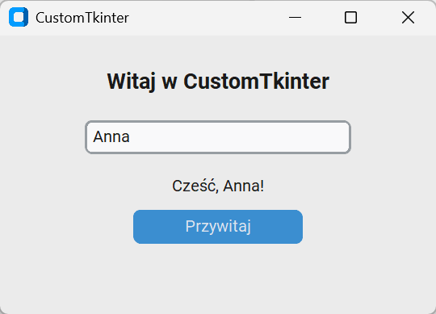
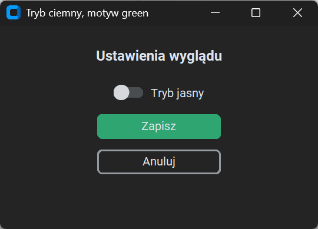
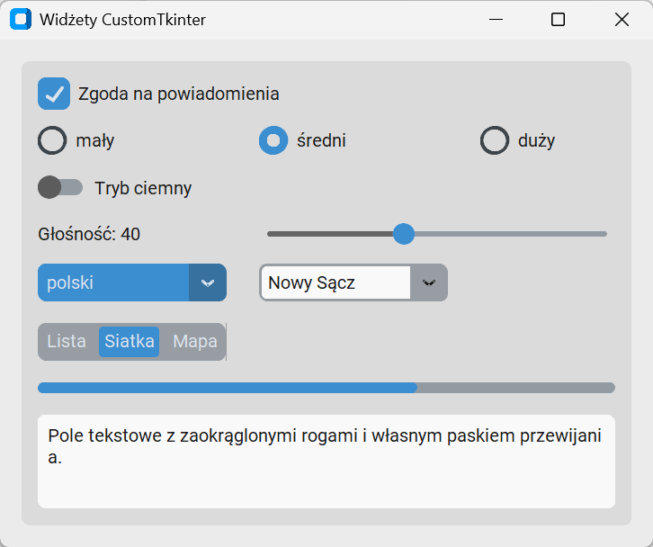
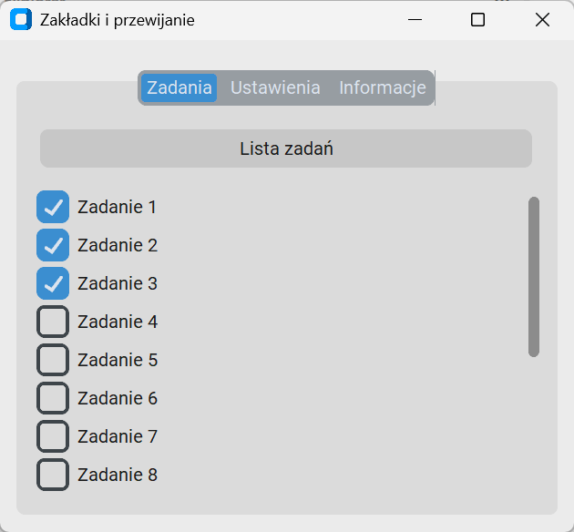
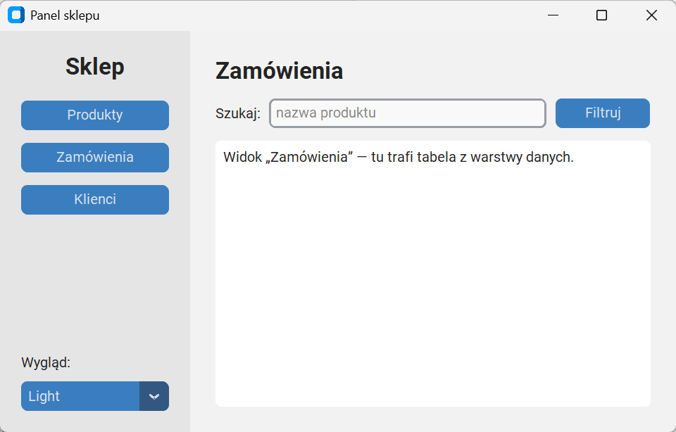
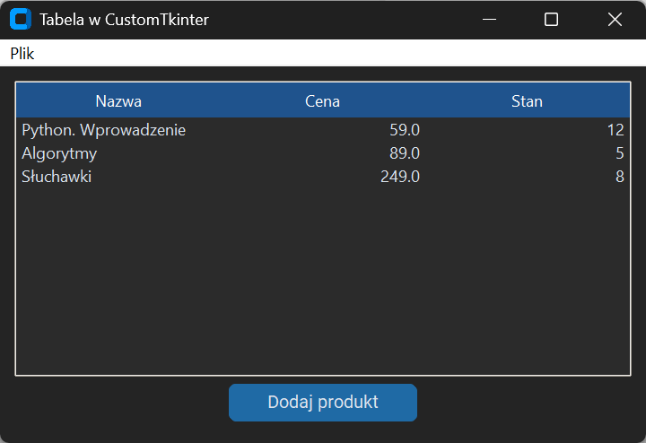

# CustomTkinter — nowoczesny wygląd

Widżety tkinter wyglądają jak w starszych wersjach Windows, a `ttk` — poprawnie, lecz bez zaokrągleń, trybu ciemnego i kolorów akcentu, do których przyzwyczaiły użytkowników współczesne aplikacje. **CustomTkinter** to biblioteka, która rysuje własne widżety na płótnach tkinter: zaokrąglone przyciski i pola, przełączniki, suwaki, zakładki, tryb jasny i ciemny, motywy kolorów i automatyczne skalowanie do rozdzielczości ekranu. Wszystko, co dotąd poznaliśmy — menedżery układu, zmienne kontrolne, `bind()`, `after()`, klasa aplikacji — działa bez zmian, bo okno CustomTkinter jest oknem tkinter.

## Instalacja i pierwsze okno

Pakiet `customtkinter` (wersja 6.0.0) instalujemy z pliku wymagań rozdziału; zależy tylko od `darkdetect` (odczyt trybu systemowego) i `packaging`.

```python title="ctk-pierwsze.py"
import customtkinter as ctk

ctk.set_appearance_mode("light")
ctk.set_default_color_theme("blue")
okno = ctk.CTk()
okno.title("CustomTkinter")
okno.geometry("360x230")
ctk.CTkLabel(okno, text="Witaj w CustomTkinter", font=ctk.CTkFont(size=18, weight="bold")).pack(pady=(24, 12))
pole = ctk.CTkEntry(okno, placeholder_text="Twoje imię", width=220)
pole.pack(pady=6)
powitanie = ctk.CTkLabel(okno, text="")
powitanie.pack(pady=(6, 0))
przycisk = ctk.CTkButton(okno, text="Przywitaj", command=lambda: powitanie.configure(text=f"Cześć, {pole.get() or 'nieznajomy'}!"))
przycisk.pack(pady=6)
pole.insert(0, "Anna")
przycisk.invoke()
print(ctk.get_appearance_mode(), "|", powitanie.cget("text"), "|", type(okno).__mro__[1].__name__)
okno.mainloop()
```

```{ .text .no-copy }
Light | Cześć, Anna! | Tk
```



Nazwy klas mają przedrostek `CTk`: `CTk` to okno główne (podklasa `tkinter.Tk`, co pokazuje `__mro__`), `CTkLabel`, `CTkEntry`, `CTkButton` odpowiadają widżetom tkinter i przyjmują te same podstawowe opcje (`text`, `command`, `width`) oraz metody (`pack()`, `configure()`, `cget()`, `get()`, `insert()`, `invoke()`). Nowości to `placeholder_text` w polu, `CTkFont` z rozmiarem i grubością oraz opcje wyglądu powtarzające się w większości widżetów: `fg_color` (kolor widżetu), `hover_color`, `text_color`, `corner_radius`, `border_width`. Kolory podaje się jako jedną wartość albo parę `(jasny, ciemny)` dla obu trybów.

## Tryby wyglądu i motywy

```python title="ctk-tryby.py"
import customtkinter as ctk

ctk.set_appearance_mode("dark")
ctk.set_default_color_theme("green")
okno = ctk.CTk()
okno.title("Tryb ciemny, motyw green")
okno.geometry("360x230")
ctk.CTkLabel(okno, text="Ustawienia wyglądu", font=ctk.CTkFont(size=16, weight="bold")).pack(pady=(20, 10))
przelacznik = ctk.CTkSwitch(okno, text="Tryb jasny", command=lambda: ctk.set_appearance_mode("light" if przelacznik.get() else "dark"))
przelacznik.pack(pady=6)
ctk.CTkButton(okno, text="Zapisz").pack(pady=6)
ctk.CTkButton(okno, text="Anuluj", fg_color="transparent", border_width=2, text_color=("gray10", "gray90")).pack(pady=6)
print(ctk.get_appearance_mode(), przelacznik.get())
okno.mainloop()
```

```{ .text .no-copy }
Dark 0
```



**Tryb wyglądu** (ang. *appearance mode*) — `"light"`, `"dark"` albo `"system"`, który podąża za ustawieniem Windows — można zmienić w każdej chwili, a wszystkie widżety przemalowują się same; przełącznik `CTkSwitch` robi to w funkcji `command`. **Motyw** kolorów (`"blue"`, `"dark-blue"`, `"green"`, `"gold"` albo własny plik JSON) ustala się przed utworzeniem okna, bo widżety czytają go przy tworzeniu. Przycisk „Anuluj” pokazuje drugi styl przycisku: `fg_color="transparent"` z obwódką.

## Widżety

```python title="ctk-widzety.py"
import tkinter as tk

import customtkinter as ctk

ctk.set_appearance_mode("light")
okno = ctk.CTk()
okno.title("Widżety CustomTkinter")
ramka = ctk.CTkFrame(okno)
ramka.pack(padx=16, pady=16, fill="both", expand=True)
zgoda = ctk.CTkCheckBox(ramka, text="Zgoda na powiadomienia")
zgoda.grid(row=0, column=0, columnspan=2, sticky="w", padx=12, pady=(12, 8))
zgoda.select()
rozmiar = tk.StringVar(value="średni")
for kolumna, wartosc in enumerate(("mały", "średni", "duży")):
    ctk.CTkRadioButton(ramka, text=wartosc, variable=rozmiar, value=wartosc).grid(row=1, column=kolumna, sticky="w", padx=12, pady=4)
ciemny = ctk.CTkSwitch(ramka, text="Tryb ciemny", command=lambda: ctk.set_appearance_mode("dark" if ciemny.get() else "light"))
ciemny.grid(row=2, column=0, sticky="w", padx=12, pady=8)
glosnosc = ctk.CTkLabel(ramka, text="Głośność: 40")
glosnosc.grid(row=3, column=0, sticky="w", padx=12)
suwak = ctk.CTkSlider(ramka, from_=0, to=100, number_of_steps=100, command=lambda wartosc: glosnosc.configure(text=f"Głośność: {wartosc:.0f}"))
suwak.set(40)
suwak.grid(row=3, column=1, columnspan=2, sticky="ew", padx=12)
jezyk = ctk.CTkOptionMenu(ramka, values=["polski", "angielski", "niemiecki"])
jezyk.grid(row=4, column=0, padx=12, pady=8, sticky="w")
miasto = ctk.CTkComboBox(ramka, values=["Kraków", "Tarnów", "Nowy Sącz"])
miasto.set("Nowy Sącz")
miasto.grid(row=4, column=1, padx=12, pady=8, sticky="w")
widok = ctk.CTkSegmentedButton(ramka, values=["Lista", "Siatka", "Mapa"])
widok.set("Siatka")
widok.grid(row=5, column=0, columnspan=2, padx=12, pady=8, sticky="w")
postep = ctk.CTkProgressBar(ramka)
postep.set(0.65)
postep.grid(row=6, column=0, columnspan=3, padx=12, pady=8, sticky="ew")
notatki = ctk.CTkTextbox(ramka, height=70)
notatki.insert("0.0", "Pole tekstowe z zaokrąglonymi rogami i własnym paskiem przewijania.")
notatki.grid(row=7, column=0, columnspan=3, padx=12, pady=(8, 12), sticky="ew")
ramka.columnconfigure((0, 1, 2), weight=1)
print(zgoda.get(), rozmiar.get(), ciemny.get(), suwak.get(), jezyk.get(), miasto.get(), widok.get(), round(postep.get(), 2))
okno.mainloop()
```

```{ .text .no-copy }
1 średni 0 40.0 polski Nowy Sącz Siatka 0.65
```



Widżety odpowiadają tym z tkinter i ttk, z drobnymi różnicami interfejsu: `CTkCheckBox` i `CTkSwitch` mają własne `get()`/`select()`/`deselect()` i nie wymagają zmiennej, `CTkRadioButton` — jak w tkinter — grupuje się przez wspólną zmienną `tk.StringVar` (klasy zmiennych to nadal te z tkinter), `CTkSlider` przekazuje funkcji `command` liczbę zmiennoprzecinkową (nie tekst), `CTkOptionMenu` i `CTkComboBox` mają `get()`/`set()` i `command` z wybranym tekstem, `CTkSegmentedButton` zastępuje rząd przycisków opcji, `CTkProgressBar` przyjmuje wartość z zakresu 0–1 przez `set()`, a `CTkTextbox` przyjmuje indeksy jak `Text` (dokumentacja biblioteki zapisuje początek jako `"0.0"`, co Tk traktuje jak `"1.0"`) i ma wbudowany pasek przewijania. `CTkFrame` grupuje widżety jak `Frame`, z zaokrąglonym tłem; `fg_color="transparent"` daje ramkę niewidoczną.

## Zakładki i przewijanie

```python title="ctk-uklad.py"
import customtkinter as ctk

ctk.set_appearance_mode("light")
okno = ctk.CTk()
okno.title("Zakładki i przewijanie")
okno.geometry("420x360")
zakladki = ctk.CTkTabview(okno)
zakladki.pack(fill="both", expand=True, padx=12, pady=12)
for nazwa in ("Zadania", "Ustawienia", "Informacje"):
    zakladki.add(nazwa)
lista = ctk.CTkScrollableFrame(zakladki.tab("Zadania"), label_text="Lista zadań")
lista.pack(fill="both", expand=True)
pola = [ctk.CTkCheckBox(lista, text=f"Zadanie {numer}") for numer in range(1, 16)]
for numer, pole in enumerate(pola):
    pole.pack(anchor="w", pady=2)
    if numer < 3:
        pole.select()
ctk.CTkLabel(zakladki.tab("Ustawienia"), text="Tu trafią ustawienia.").pack(pady=20)
ctk.CTkLabel(zakladki.tab("Informacje"), text="CustomTkinter " + ctk.__version__).pack(pady=20)
zakladki.set("Zadania")
print(zakladki.get(), sum(pole.get() for pole in pola), len(pola))
okno.mainloop()
```

```{ .text .no-copy }
Zadania 3 15
```



`CTkTabview` tworzy zakładki po nazwie — `add("Zadania")` — a `tab("Zadania")` zwraca ramkę, w której układamy widżety; `set()` i `get()` przełączają i odczytują bieżącą zakładkę. `CTkScrollableFrame` to ramka z własnym paskiem przewijania, także poziomym (`orientation="horizontal"`) — w tkinter taki widok wymagałby płótna z ramką w środku i ręcznego łączenia paska. Widżety wewnątrz układa się zwykłym `pack()` lub `grid()`.

## Aplikacja z panelem bocznym

```python title="ctk-aplikacja.py"
import tkinter as tk

import customtkinter as ctk

ctk.set_appearance_mode("light")
ctk.set_default_color_theme("dark-blue")


class PanelSklepu(ctk.CTk):
    def __init__(self):
        super().__init__()
        self.title("Panel sklepu")
        self.geometry("640x380")
        self.columnconfigure(1, weight=1)
        self.rowconfigure(0, weight=1)
        self.widok = tk.StringVar(value="Produkty")
        self._buduj_panel_boczny()
        self._buduj_glowny()

    def _buduj_panel_boczny(self):
        panel = ctk.CTkFrame(self, width=170, corner_radius=0)
        panel.grid(row=0, column=0, sticky="nsw")
        panel.rowconfigure(5, weight=1)
        ctk.CTkLabel(panel, text="Sklep", font=ctk.CTkFont(size=22, weight="bold")).grid(row=0, column=0, padx=20, pady=(20, 12))
        for wiersz, nazwa in enumerate(("Produkty", "Zamówienia", "Klienci"), start=1):
            ctk.CTkButton(panel, text=nazwa, command=lambda n=nazwa: self.pokaz(n)).grid(row=wiersz, column=0, padx=20, pady=6)
        ctk.CTkLabel(panel, text="Wygląd:", anchor="w").grid(row=6, column=0, padx=20, pady=(10, 0), sticky="w")
        ctk.CTkOptionMenu(panel, values=["Light", "Dark", "System"], command=ctk.set_appearance_mode).grid(row=7, column=0, padx=20, pady=(4, 20))

    def _buduj_glowny(self):
        glowny = ctk.CTkFrame(self, fg_color="transparent")
        glowny.grid(row=0, column=1, sticky="nsew", padx=24, pady=24)
        glowny.columnconfigure(1, weight=1)
        glowny.rowconfigure(2, weight=1)
        ctk.CTkLabel(glowny, textvariable=self.widok, font=ctk.CTkFont(size=22, weight="bold"), anchor="w").grid(row=0, column=0, columnspan=3, sticky="w", pady=(0, 12))
        ctk.CTkLabel(glowny, text="Szukaj:").grid(row=1, column=0, padx=(0, 8))
        ctk.CTkEntry(glowny, placeholder_text="nazwa produktu").grid(row=1, column=1, sticky="ew")
        ctk.CTkButton(glowny, text="Filtruj", width=90).grid(row=1, column=2, padx=(8, 0))
        self.tresc = ctk.CTkTextbox(glowny)
        self.tresc.grid(row=2, column=0, columnspan=3, sticky="nsew", pady=(12, 0))
        self.pokaz("Produkty")

    def pokaz(self, nazwa):
        self.widok.set(nazwa)
        self.tresc.delete("0.0", "end")
        self.tresc.insert("0.0", f"Widok „{nazwa}” — tu trafi tabela z warstwy danych.")


if __name__ == "__main__":
    aplikacja = PanelSklepu()
    aplikacja.pokaz("Zamówienia")
    print(aplikacja.widok.get(), "|", aplikacja.tresc.get("0.0", "end-1c")[:18])
    aplikacja.mainloop()
```

```{ .text .no-copy }
Zamówienia | Widok „Zamówienia”
```



Układ z panelem bocznym to `grid()` z dwiema kolumnami: panel o stałej szerokości w kolumnie 0 i część główna z wagą w kolumnie 1. Klasa aplikacji dziedziczy po `ctk.CTk` dokładnie tak, jak `Notatnik` po `tk.Tk`; przyciski nawigacji używają lambdy z argumentem domyślnym z trzeciej strony. `CTkOptionMenu` z `command=ctk.set_appearance_mode` przełącza tryb bez własnej funkcji, bo `command` dostaje wybrany tekst. Tabelę w miejscu pola tekstowego dostarczy warstwa danych w projekcie ścieżki.

## Współpraca z tkinter i ograniczenia

```python title="ctk-tabela.py"
import tkinter as tk
from tkinter import ttk

import customtkinter as ctk

ctk.set_appearance_mode("dark")
okno = ctk.CTk()
okno.title("Tabela w CustomTkinter")
okno.geometry("480x300")
styl = ttk.Style(okno)
styl.theme_use("clam")
styl.configure("Treeview", background="#2b2b2b", fieldbackground="#2b2b2b", foreground="#dce4ee", rowheight=26, borderwidth=0)
styl.configure("Treeview.Heading", background="#1f538d", foreground="white", relief="flat")
styl.map("Treeview", background=[("selected", "#1f6aa5")])
tabela = ttk.Treeview(okno, columns=("nazwa", "cena", "stan"), show="headings", height=5)
for kolumna, tytul in zip(("nazwa", "cena", "stan"), ("Nazwa", "Cena", "Stan")):
    tabela.heading(kolumna, text=tytul)
    tabela.column(kolumna, anchor="w" if kolumna == "nazwa" else "e", width=120)
for wiersz in (("Python. Wprowadzenie", 59.0, 12), ("Algorytmy", 89.0, 5), ("Słuchawki", 249.0, 8)):
    tabela.insert("", "end", values=wiersz)
tabela.pack(fill="both", expand=True, padx=16, pady=(16, 8))
pasek = tk.Menu(okno)
menu_plik = tk.Menu(pasek)
menu_plik.add_command(label="Zakończ", command=okno.destroy)
pasek.add_cascade(label="Plik", menu=menu_plik)
okno.configure(menu=pasek)
ctk.CTkButton(okno, text="Dodaj produkt").pack(pady=(0, 16))
print(styl.lookup("Treeview", "background"), len(tabela.get_children()), ctk.get_appearance_mode())
okno.mainloop()
```

```{ .text .no-copy }
#2b2b2b 3 Dark
```



CustomTkinter nie ma własnej tabeli, menu ani płótna: w tych miejscach używamy `ttk.Treeview`, `tk.Menu` i `tk.Canvas` z poprzednich stron, a ich kolory dopasowujemy stylem `ttk` w motywie `clam` — menu pozostaje systemowe. Tryb ciemny nie zmienia tych widżetów sam; przy przełączaniu trybu trzeba przemalować styl. Inne różnice: biblioteka sama wywołuje `SetProcessDpiAwareness(2)` ze strony pierwszej i skaluje widżety do rozdzielczości (`set_widget_scaling()` i `set_window_scaling()` pozwalają ją zmienić, `deactivate_automatic_dpi_awareness()` wyłączyć), obrazy podaje się jako `CTkImage(light_image=…, dark_image=…, size=…)` z obiektami Pillow, okna potomne to `CTkToplevel`, a proste pytanie o tekst zadaje `CTkInputDialog`. Widżety są rysowane na płótnach, więc bardzo duże listy (tysiące pól wyboru w `CTkScrollableFrame`) budują się wolniej niż w tkinter — dla dużych zbiorów danych właściwa jest tabela.
