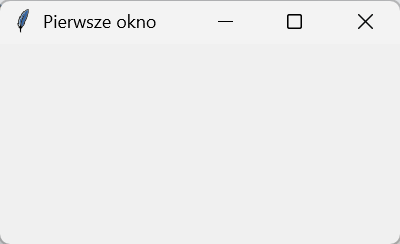
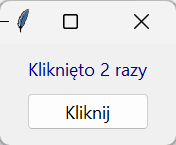
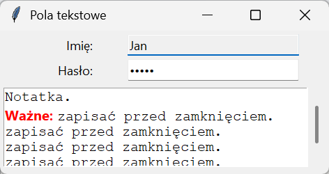
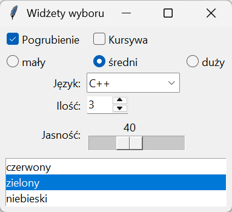

# Okno i widżety

Każdy program tkinter ma tę samą budowę: okno główne, umieszczone w nim **widżety** (ang. *widget*) — etykiety, przyciski, pola — i pętla zdarzeń na końcu. Ten podrozdział pokazuje okno i najczęściej używane widżety; ich rozmieszczaniem zajmuje się następny.

## Pierwsze okno

```python title="pierwsze-okno.py"
import tkinter as tk

okno = tk.Tk()
okno.title("Pierwsze okno")
okno.geometry("400x200")
okno.minsize(240, 120)
print(tk.TkVersion, okno.tk.call("info", "patchlevel"), okno.tk.call("tk", "windowingsystem"))
okno.mainloop()
print("po zamknięciu okna")
```

```{ .text .no-copy }
9.0 9.0.4 win32
po zamknięciu okna
```



`tk.Tk()` tworzy okno główne i uruchamia w tle interpreter Tcl — stąd `okno.tk.call()`, którym można wywołać każde polecenie Tk, tu odczyt dokładnej wersji i nazwy systemu okien. `title()` ustawia tekst na pasku, `geometry("400x200")` rozmiar w pikselach (z dopiskiem `+x+y` także położenie), `minsize()` dolną granicę przy zmianie rozmiaru, a `resizable(False, False)` zablokowałoby ją całkiem. `mainloop()` oddaje sterowanie pętli zdarzeń: program zatrzymuje się w tym wierszu, dopóki użytkownik nie zamknie okna — dopiero wtedy wykonuje się ostatni `print()`. Wszystko, co ma się dziać w trakcie, trzeba zarejestrować przed tym wywołaniem jako **funkcje zwrotne** (ang. *callback*).

## Etykieta i przycisk

```python title="etykieta-przycisk.py"
import tkinter as tk
from tkinter import ttk

okno = tk.Tk()
okno.title("Etykieta i przycisk")
etykieta = ttk.Label(okno, text="Nie kliknięto", foreground="gray")
etykieta.pack(padx=20, pady=10)
stan = {"klikniecia": 0}


def klik():
    stan["klikniecia"] += 1
    etykieta.configure(text=f"Kliknięto {stan['klikniecia']} razy", foreground="navy")


przycisk = ttk.Button(okno, text="Kliknij", command=klik)
przycisk.pack(pady=(0, 15))
print(przycisk.cget("text"), "|", etykieta.cget("text"))
przycisk.invoke()
przycisk.invoke()
print(etykieta.cget("text"), "|", etykieta.cget("foreground"))
okno.mainloop()
```

```{ .text .no-copy }
Kliknij | Nie kliknięto
Kliknięto 2 razy | navy
```



Pierwszy argument każdego widżetu to rodzic — okno albo ramka, w której ma się znaleźć; pozostałe to opcje: tekst, kolor tekstu (`foreground`, w widżetach `tk` także krótsze `fg`), czcionka. Opcje odczytujemy metodą `cget()`, a zmieniamy `configure()` — po wyświetleniu okna również, widżet odrysowuje się sam. `command=klik` przekazuje funkcję jako obiekt, jak w rozdziale 6 „Python Notatki” — bez nawiasów; `command=klik()` wywołałoby ją od razu przy budowaniu okna i przypisało przyciskowi jej wynik, czyli `None`. Funkcja zwrotna przycisku nie dostaje argumentów. `invoke()` wywołuje ją programowo, tak samo jak kliknięcie — dzięki temu skrypt może sprawdzić działanie okna bez myszy, z czego korzystamy w tym rozdziale i w testach. Licznik trzymamy w słowniku, bo funkcja zwrotna nie może przypisać zmiennej modułu bez `global`; w aplikacji z klasą (strona czwarta) stan trafi do atrybutów obiektu.

## Pola tekstowe

```python title="pola.py"
import tkinter as tk
from tkinter import ttk

okno = tk.Tk()
okno.title("Pola tekstowe")
ttk.Label(okno, text="Imię:").grid(row=0, column=0, sticky="e", padx=5, pady=5)
imie = ttk.Entry(okno, width=24)
imie.grid(row=0, column=1, padx=5, pady=5)
imie.insert(0, "Anna")
ttk.Label(okno, text="Hasło:").grid(row=1, column=0, sticky="e", padx=5)
haslo = ttk.Entry(okno, width=24, show="•")
haslo.grid(row=1, column=1, padx=5)
haslo.insert(0, "tajne")

ramka = ttk.Frame(okno)
ramka.grid(row=2, column=0, columnspan=2, padx=5, pady=10)
tekst = tk.Text(ramka, width=36, height=5, wrap="word")
pasek = ttk.Scrollbar(ramka, orient="vertical", command=tekst.yview)
tekst.configure(yscrollcommand=pasek.set)
tekst.pack(side="left")
pasek.pack(side="right", fill="y")
tekst.tag_configure("wazne", foreground="red", font=("Segoe UI", 10, "bold"))
tekst.insert("1.0", "Notatka.\n")
tekst.insert("end", "Ważne: ", "wazne")
tekst.insert("end", "zapisać przed zamknięciem.\n" * 4)
imie.focus()

print(repr(imie.get()), repr(haslo.get()))
print(repr(tekst.get("1.0", "end")[:24]), tekst.get("1.0", "end-1c").count("\n"), tekst.index("end-1c"))
imie.delete(0, "end")
imie.insert(0, "Jan")
imie.configure(state="readonly")
print(imie.get(), imie.cget("state"))
okno.mainloop()
```

```{ .text .no-copy }
'Anna' 'tajne'
'Notatka.\nWażne: zapisać ' 5 6.0
Jan readonly
```



`Entry` to pole jednowierszowe: `insert(0, …)` wstawia tekst od początku, `get()` zwraca całość, `delete(0, "end")` czyści, `show="•"` ukrywa znaki hasła, `focus()` ustawia kursor w polu przy starcie, a `state="readonly"` (lub `"disabled"`) blokuje edycję. `Text` to edytor wielowierszowy z własnym systemem adresowania: `"1.0"` to pierwszy wiersz, znak zerowy — wiersze liczy się od 1, znaki od 0 — a `"end"` to pozycja za ostatnim znakiem. Widżet zawsze kończy się dodatkowym znakiem nowego wiersza, więc `get("1.0", "end")` zwraca tekst z tym dopiskiem, a `"end-1c"` (o jeden znak mniej; w wydruku `6.0` — początek pustego wiersza za pięcioma wpisanymi) — bez niego. **Tagi** nadają fragmentom formatowanie: nazwę tagu podajemy przy wstawianiu, wygląd ustala `tag_configure()`. Pasek przewijania łączy się z polem w obie strony: pole informuje pasek o położeniu (`yscrollcommand`), pasek przesuwa pole (`command=tekst.yview`); gotowe połączenie daje `ScrolledText` z modułu `tkinter.scrolledtext`.

## Widżety wyboru

```python title="wybor.py"
import tkinter as tk
from tkinter import ttk

okno = tk.Tk()
okno.title("Widżety wyboru")
pogrubienie = tk.BooleanVar(value=True)
ttk.Checkbutton(okno, text="Pogrubienie", variable=pogrubienie).grid(row=0, column=0, sticky="w", padx=8, pady=4)
kursywa = tk.BooleanVar()
ttk.Checkbutton(okno, text="Kursywa", variable=kursywa).grid(row=0, column=1, sticky="w", padx=8)

rozmiar = tk.StringVar(value="średni")
for kolumna, wartosc in enumerate(("mały", "średni", "duży")):
    ttk.Radiobutton(okno, text=wartosc, variable=rozmiar, value=wartosc).grid(row=1, column=kolumna, sticky="w", padx=8)

ttk.Label(okno, text="Język:").grid(row=2, column=0, sticky="e", padx=8, pady=4)
jezyk = ttk.Combobox(okno, values=("Python", "Java", "C++"), state="readonly", width=12)
jezyk.current(0)
jezyk.grid(row=2, column=1, sticky="w")
jezyk.bind("<<ComboboxSelected>>", lambda zdarzenie: print("wybrano:", jezyk.get()))

ttk.Label(okno, text="Ilość:").grid(row=3, column=0, sticky="e", padx=8, pady=4)
ilosc = ttk.Spinbox(okno, from_=1, to=10, width=5)
ilosc.set(3)
ilosc.grid(row=3, column=1, sticky="w")

ttk.Label(okno, text="Jasność:").grid(row=4, column=0, sticky="e", padx=8, pady=4)
jasnosc = tk.Scale(okno, from_=0, to=100, orient="horizontal", length=160, command=lambda wartosc: print("suwak:", repr(wartosc)))
jasnosc.set(40)
jasnosc.grid(row=4, column=1, columnspan=2, sticky="w")

lista = tk.Listbox(okno, height=3, exportselection=False)
for pozycja in ("czerwony", "zielony", "niebieski"):
    lista.insert("end", pozycja)
lista.selection_set(1)
lista.grid(row=5, column=0, columnspan=3, sticky="ew", padx=8, pady=8)

okno.update()
print(pogrubienie.get(), kursywa.get(), rozmiar.get(), jezyk.get(), ilosc.get(), jasnosc.get())
jezyk.current(2)
jezyk.event_generate("<<ComboboxSelected>>")
print(lista.curselection(), [lista.get(i) for i in lista.curselection()])
okno.mainloop()
```

```{ .text .no-copy }
suwak: '40'
True False średni Python 3 40
wybrano: C++
(1,) ['zielony']
```



Pola wyboru i przyciski opcji nie przechowują wartości same — łączą się ze **zmienną kontrolną** (ang. *control variable*) `BooleanVar`, `StringVar`, `IntVar` lub `DoubleVar`, z której program czyta stan przez `get()` i którą ustawia przez `set()`; następna strona omawia je dokładniej. Przyciski opcji z tą samą zmienną tworzą grupę — zaznaczenie jednego odznacza pozostałe, a zmienna przyjmuje `value` wybranego. `Combobox` łączy pole z listą: `values` to możliwe pozycje (zawsze teksty), `current(0)` wybiera pierwszą, `state="readonly"` wyklucza wpisywanie, a zdarzenie `<<ComboboxSelected>>` — w podwójnych nawiasach kątowych, bo zdefiniowane przez widżet, nie system — informuje o wyborze. `Spinbox` przyjmuje zakres liczb, `Scale` z `tk` przekazuje funkcji `command` bieżącą wartość jako tekst (stąd `repr()` w wydruku), a `Listbox` zwraca zaznaczenie jako krotkę indeksów; `exportselection=False` zapobiega utracie zaznaczenia, gdy użytkownik zaznaczy tekst w innym widżecie (domyślnie zaznaczenie może mieć tylko jeden widżet naraz). `update()` przed wydrukiem przetwarza zaległe zdarzenia, między innymi `command` suwaka wywołane przez `set()`.

## tk a ttk

Moduł `tkinter` zawiera widżety klasyczne (`tk.Button`, `tk.Label`, …), a podmoduł `tkinter.ttk` ich wersje **tematyczne** (ang. *themed*), rysowane w stylu systemu — na Windows przyciski i pola wyglądają jak w innych programach. Różnica w użyciu: widżety `ttk` nie przyjmują skrótu `bg`, a przyciski także opcji tła i ramki (`background`, `relief`) — wygląd ustala klasa `ttk.Style` ze strony piątej — a kilka istnieje tylko w jednej wersji: `Text`, `Canvas`, `Listbox`, `Menu` i `Scale` z etykietą i podziałką są w `tk`, a `Combobox`, `Notebook`, `Treeview`, `Progressbar`, `Separator` tylko w `ttk`. W jednym oknie trzymamy się `ttk` tam, gdzie istnieje odpowiednik, a `tk` dla pozostałych — mieszanie obu wersji tego samego widżetu daje nierówny wygląd.

## Ostrość na ekranach o dużej skali

```python title="dpi.py"
import ctypes
import tkinter as tk
from tkinter import ttk

ctypes.windll.shcore.SetProcessDpiAwareness(2)  # tylko Windows, przed utworzeniem okna
okno = tk.Tk()
okno.title("Ostrość")
dpi = round(okno.winfo_fpixels("1i"))
skala = round(float(okno.tk.call("tk", "scaling")), 2)
ttk.Label(okno, text=f"{dpi} DPI, skala czcionek {skala}").pack(padx=24, pady=20)
print(dpi, skala)
okno.mainloop()
```

```{ .text .no-copy }
144 2.0
```

Na ekranie ze skalą systemową większą niż 100 % — tu 150 % — Windows powiększa okna programów, które nie deklarują obsługi wysokiej rozdzielczości, rozciągając ich obraz: okno tkinter jest wtedy rozmyte. Wywołanie `SetProcessDpiAwareness(2)` z biblioteki systemowej `shcore` przed utworzeniem okna deklaruje taką obsługę; Tk odczytuje wtedy rzeczywistą rozdzielczość (144 DPI zamiast 96) i odpowiednio powiększa czcionki, więc tekst pozostaje ostry, a rozmiary podane w pikselach — w `geometry()` czy `width` płótna — oznaczają piksele fizyczne, czyli mniejsze niż bez tej deklaracji. Zrzuty w tym rozdziale pochodzą z procesu z tą deklaracją; CustomTkinter ze strony siódmej włącza ją sam.
