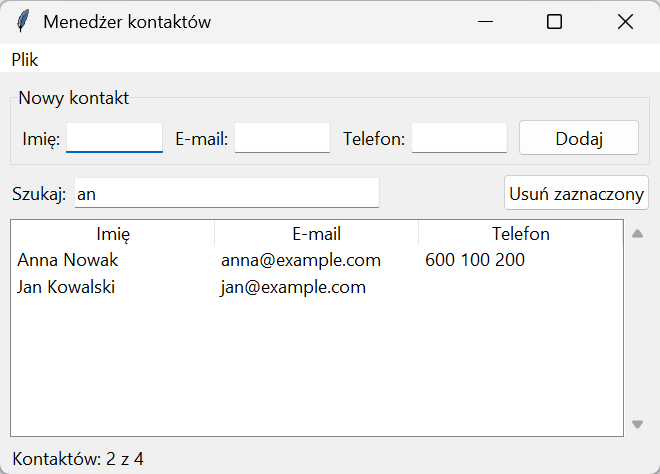
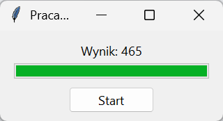

# Mini-projekt: menedżer kontaktów

Projekt łączy elementy rozdziału w jedną aplikację: formularz z walidacją, wyszukiwanie na żywo, tabelę, menu z importem i eksportem CSV oraz pasek stanu. Zasada organizująca kod: **logika poza oknem**. Sprawdzanie danych, filtrowanie i zapis do pliku to zwykłe funkcje działające na obiektach klasy danych, testowane bez tkinter; okno tylko je wywołuje.

## Logika poza oknem

```python title="kontakty_logika.py"
"""Logika menedżera kontaktów — bez okna, do testów."""

import csv
from dataclasses import asdict, dataclass, fields


@dataclass
class Kontakt:
    imie: str
    email: str
    telefon: str = ""


def sprawdz(kontakt):
    """Zwraca listę komunikatów o błędach; pusta lista oznacza poprawny kontakt."""
    bledy = []
    if not kontakt.imie.strip():
        bledy.append("imię jest wymagane")
    if "@" not in kontakt.email[1:-1]:
        bledy.append("adres e-mail musi zawierać znak @ między nazwą a domeną")
    if kontakt.telefon and not kontakt.telefon.replace(" ", "").replace("-", "").isdigit():
        bledy.append("telefon może zawierać tylko cyfry, spacje i myślniki")
    return bledy


def filtruj(kontakty, zapytanie):
    zapytanie = zapytanie.strip().lower()
    return [kontakt for kontakt in kontakty if zapytanie in kontakt.imie.lower() or zapytanie in kontakt.email.lower()]


def zapisz_csv(kontakty, sciezka):
    with open(sciezka, "w", newline="", encoding="utf-8") as plik:
        pisarz = csv.DictWriter(plik, fieldnames=[pole.name for pole in fields(Kontakt)], delimiter=";")
        pisarz.writeheader()
        pisarz.writerows(asdict(kontakt) for kontakt in kontakty)


def wczytaj_csv(sciezka):
    with open(sciezka, newline="", encoding="utf-8-sig") as plik:
        return [Kontakt(**wiersz) for wiersz in csv.DictReader(plik, delimiter=";")]
```

```python title="tests/test_kontakty.py"
import sys
from pathlib import Path

sys.path.insert(0, str(Path(__file__).resolve().parent.parent))

from kontakty_logika import Kontakt, filtruj, sprawdz, wczytaj_csv, zapisz_csv  # noqa: E402

KONTAKTY = [Kontakt("Anna Nowak", "anna@example.com", "600 100 200"), Kontakt("Jan Kowalski", "jan@example.com"), Kontakt("Ewa Lis", "ewa@firma.pl")]


def test_poprawny_kontakt_bez_bledow():
    assert sprawdz(KONTAKTY[0]) == []


def test_bledy_sa_zbierane_razem():
    bledy = sprawdz(Kontakt("  ", "brak-malpy", "abc"))
    assert len(bledy) == 3
    assert bledy[0] == "imię jest wymagane"


def test_filtrowanie_po_imieniu_i_adresie():
    assert [kontakt.imie for kontakt in filtruj(KONTAKTY, "an")] == ["Anna Nowak", "Jan Kowalski"]
    assert [kontakt.imie for kontakt in filtruj(KONTAKTY, "FIRMA")] == ["Ewa Lis"]
    assert filtruj(KONTAKTY, "") == KONTAKTY


def test_zapis_i_odczyt_csv(tmp_path):
    sciezka = tmp_path / "kontakty.csv"
    zapisz_csv(KONTAKTY, sciezka)
    assert sciezka.read_text(encoding="utf-8").splitlines()[0] == "imie;email;telefon"
    assert wczytaj_csv(sciezka) == KONTAKTY
```

```powershell title="Terminal"
python -m pytest -q
```

```{ .text .no-copy }
....                                                                     [100%]
4 passed in 0.04s
```

Klasa danych `Kontakt` z rozdziału 12 „Python Notatki” daje porównywanie i `asdict()` bez dodatkowego kodu — stąd prosty test zapisu i odczytu. `sprawdz()` zwraca listę błędów, a nie pierwszy napotkany, żeby okno mogło pokazać wszystkie naraz; `filtruj()` porównuje małe litery, więc wyszukiwanie nie rozróżnia wielkości. CSV z separatorem `;` i `newline=""` to ustalenia z rozdziału 9 „Python Notatki”; zapis w UTF-8, odczyt z `utf-8-sig`, które przyjmuje także pliki z Excela ze znacznikiem BOM; `fields(Kontakt)` daje nazwy kolumn z definicji klasy, więc nowe pole klasy trafi do pliku bez zmian w funkcjach. Żaden test nie tworzy okna — działają w środowisku bez ekranu, na przykład w automatycznej kontroli z rozdziału 16 „Python Notatki”.

## Okno aplikacji

```python title="kontakty.py"
"""Menedżer kontaktów: okno nad logiką z kontakty_logika.py."""

import tkinter as tk
from tkinter import filedialog, messagebox, ttk

from kontakty_logika import Kontakt, filtruj, sprawdz, wczytaj_csv, zapisz_csv


class MenedzerKontaktow(tk.Tk):
    def __init__(self, kontakty=()):
        super().__init__()
        self.title("Menedżer kontaktów")
        self.geometry("660x400")
        self.minsize(560, 340)
        self.kontakty = list(kontakty)
        self.widoczne = []
        self._buduj_menu()
        self._buduj_formularz()
        self._buduj_liste()
        self._buduj_skroty()
        self.odswiez()

    def _buduj_menu(self):
        pasek = tk.Menu(self)
        self.configure(menu=pasek)
        menu_plik = tk.Menu(pasek)
        menu_plik.add_command(label="Importuj CSV…", command=self.importuj)
        menu_plik.add_command(label="Eksportuj CSV…", command=self.eksportuj)
        menu_plik.add_separator()
        menu_plik.add_command(label="Zakończ", command=self.zamknij)
        pasek.add_cascade(label="Plik", menu=menu_plik)

    def _buduj_formularz(self):
        formularz = ttk.LabelFrame(self, text="Nowy kontakt", padding=8)
        formularz.pack(fill="x", padx=10, pady=(10, 4))
        self.pola = {}
        for kolumna, (nazwa, etykieta) in enumerate((("imie", "Imię:"), ("email", "E-mail:"), ("telefon", "Telefon:"))):
            ttk.Label(formularz, text=etykieta).grid(row=0, column=2 * kolumna, sticky="e", padx=(0, 4))
            self.pola[nazwa] = ttk.Entry(formularz, width=12)
            self.pola[nazwa].grid(row=0, column=2 * kolumna + 1, sticky="ew", padx=(0, 10))
        formularz.columnconfigure((1, 3, 5), weight=1)
        ttk.Button(formularz, text="Dodaj", command=self.dodaj).grid(row=0, column=6)
        szukanie = ttk.Frame(self)
        szukanie.pack(fill="x", padx=10, pady=4)
        ttk.Label(szukanie, text="Szukaj:").pack(side="left")
        self.zapytanie = tk.StringVar()
        self.zapytanie.trace_add("write", lambda *_: self.odswiez())
        ttk.Entry(szukanie, textvariable=self.zapytanie, width=30).pack(side="left", padx=6)
        ttk.Button(szukanie, text="Usuń zaznaczony", command=self.usun).pack(side="right")

    def _buduj_liste(self):
        self.stan = tk.StringVar()
        ttk.Label(self, textvariable=self.stan, anchor="w", padding=(10, 2)).pack(side="bottom", fill="x")
        ramka = ttk.Frame(self)
        ramka.pack(fill="both", expand=True, padx=10, pady=4)
        self.tabela = ttk.Treeview(ramka, columns=("imie", "email", "telefon"), show="headings", selectmode="browse")
        for kolumna, tytul in zip(("imie", "email", "telefon"), ("Imię", "E-mail", "Telefon")):
            self.tabela.heading(kolumna, text=tytul)
            self.tabela.column(kolumna, width=150)
        pasek = ttk.Scrollbar(ramka, orient="vertical", command=self.tabela.yview)
        self.tabela.configure(yscrollcommand=pasek.set)
        self.tabela.pack(side="left", fill="both", expand=True)
        pasek.pack(side="right", fill="y")

    def _buduj_skroty(self):
        for pole in self.pola.values():
            pole.bind("<Return>", lambda zdarzenie: self.dodaj())
        self.tabela.bind("<Delete>", lambda zdarzenie: self.usun())
        self.protocol("WM_DELETE_WINDOW", self.zamknij)

    def dodaj(self):
        kontakt = Kontakt(**{nazwa: pole.get().strip() for nazwa, pole in self.pola.items()})
        bledy = sprawdz(kontakt)
        if bledy:
            messagebox.showwarning("Niepoprawne dane", "\n".join(bledy))
            return
        self.kontakty.append(kontakt)
        for pole in self.pola.values():
            pole.delete(0, "end")
        self.pola["imie"].focus()
        self.odswiez()

    def usun(self):
        zaznaczone = self.tabela.selection()
        if zaznaczone:
            self.kontakty.remove(self.widoczne[self.tabela.index(zaznaczone[0])])
            self.odswiez()

    def odswiez(self):
        self.widoczne = filtruj(self.kontakty, self.zapytanie.get())
        self.tabela.delete(*self.tabela.get_children())
        for kontakt in self.widoczne:
            self.tabela.insert("", "end", values=(kontakt.imie, kontakt.email, kontakt.telefon))
        self.stan.set(f"Kontaktów: {len(self.widoczne)} z {len(self.kontakty)}")

    def importuj(self):
        sciezka = filedialog.askopenfilename(filetypes=[("CSV", "*.csv")])
        if sciezka:
            self.kontakty.extend(wczytaj_csv(sciezka))
            self.odswiez()

    def eksportuj(self):
        sciezka = filedialog.asksaveasfilename(defaultextension=".csv", filetypes=[("CSV", "*.csv")])
        if sciezka:
            zapisz_csv(self.kontakty, sciezka)
            messagebox.showinfo("Eksport", f"Zapisano {len(self.kontakty)} kontaktów.")

    def zamknij(self):
        if messagebox.askokcancel("Menedżer kontaktów", "Zamknąć program?"):
            self.destroy()


if __name__ == "__main__":
    aplikacja = MenedzerKontaktow([Kontakt("Anna Nowak", "anna@example.com", "600 100 200"), Kontakt("Jan Kowalski", "jan@example.com"), Kontakt("Ewa Lis", "ewa@firma.pl", "12 444 55 66")])
    aplikacja.pola["imie"].insert(0, "Piotr Zieliński")
    aplikacja.pola["email"].insert(0, "piotr@example.com")
    aplikacja.dodaj()
    aplikacja.zapytanie.set("an")
    print(aplikacja.stan.get(), "|", [aplikacja.tabela.set(wiersz, "imie") for wiersz in aplikacja.tabela.get_children()])
    aplikacja.mainloop()
```

```{ .text .no-copy }
Kontaktów: 2 z 4 | ['Anna Nowak', 'Jan Kowalski']
```



Okno przechowuje listę kontaktów i listę aktualnie widocznych; każda zmiana — dodanie, usunięcie, wpisanie litery w polu wyszukiwania (obserwator zmiennej) — kończy się wywołaniem `odswiez()`, które filtruje, przebudowuje tabelę i uaktualnia pasek stanu. Jedno miejsce odpowiedzialne za odrysowanie zapobiega rozbieżnościom między danymi a widokiem. Formularz nie sprawdza danych sam — buduje `Kontakt` i pyta `sprawdz()`, a błędy pokazuje w jednym oknie. Usuwanie tłumaczy zaznaczony wiersz tabeli na obiekt przez indeks w liście widocznych. Blok `__main__` dodaje kontakt przez formularz i ustawia filtr, więc wydruk i zrzut pokazują aplikację po kilku działaniach użytkownika.

## Praca w tle: wątek, kolejka i `after`

```python title="praca-w-tle.py"
import queue
import threading
import time
import tkinter as tk
from tkinter import ttk


def dluga_praca(kolejka, n):
    suma = 0
    for i in range(1, n + 1):
        time.sleep(0.02)
        suma += i
        if i % 5 == 0:
            kolejka.put(("postep", i / n))
    kolejka.put(("wynik", suma))


okno = tk.Tk()
okno.title("Praca w tle")
okno.minsize(320, 120)
kolejka = queue.Queue()
opis = tk.StringVar(value="Gotowy")
ttk.Label(okno, textvariable=opis).pack(padx=16, pady=(14, 4))
postep = ttk.Progressbar(okno, length=280, maximum=1.0)
postep.pack(padx=16)
start = ttk.Button(okno, text="Start")
start.pack(pady=12)


def uruchom():
    start.configure(state="disabled")
    postep["value"] = 0
    opis.set("Liczę…")
    threading.Thread(target=dluga_praca, args=(kolejka, 30), daemon=True).start()
    sprawdz_kolejke()


def sprawdz_kolejke():
    try:
        while True:
            rodzaj, wartosc = kolejka.get_nowait()
            if rodzaj == "postep":
                postep["value"] = wartosc
            else:
                opis.set(f"Wynik: {wartosc}")
                print("wynik z wątku:", wartosc)
                start.configure(state="normal")
                return
    except queue.Empty:
        okno.after(50, sprawdz_kolejke)


start.configure(command=uruchom)
okno.after(100, uruchom)
okno.mainloop()
```

```{ .text .no-copy }
wynik z wątku: 465
```



Długie obliczenie lub pobieranie w funkcji zwrotnej zamroziłoby okno, a widżetów nie zmienia wątek roboczy — Tk obsługuje okno w jednym wątku, a wywołania z innych wątków tkinter tylko przekazuje do niego, nie gwarantując bezpieczeństwa wszystkich operacji. Rozwiązanie z rozdziału 15 „Python Notatki”: wątek roboczy wysyła postęp i wynik do kolejki `queue.Queue`, a okno odpytuje ją co 50 ms przez `after()` i tylko ono zmienia widżety. `get_nowait()` opróżnia kolejkę bez czekania, `queue.Empty` kończy rundę i planuje następną, a odebrany wynik przerywa odpytywanie. Wątek jest demonem, więc zamknięcie okna nie czeka na jego koniec. Skrypt uruchamia zadanie sam po 100 ms; przycisk pozwala je powtórzyć.

## Dobre praktyki i pułapki

- **Logika poza oknem**: funkcje i klasy danych testowane bez tkinter; okno tylko wywołuje i pokazuje.
- **Klasa aplikacji** ze stanem w atrybutach i budową podzieloną na metody; jedno miejsce odświeżające widok.
- **Jeden menedżer układu na kontener**; ramki dla grup; `weight` i `sticky` tam, gdzie okno ma się rozciągać.
- **`command=funkcja`**, nie `funkcja()`; lambda w pętli z argumentem domyślnym.
- **`after()` zamiast `sleep()`**; długie zadania w wątku, wyniki przez kolejkę; widżety zmienia tylko wątek okna.
- **Obrazy** trzymane w atrybucie, inaczej znikają.
- **`trace_add` zamiast `trace`**; `destroy()` zamiast `quit()`; anulowanie dialogów sprawdzone.
- **Wygląd**: `ttk` z jednym motywem albo CustomTkinter — bez mieszania obu zestawów tego samego widżetu.

## Dalej: pakiet i projekt

Aplikację okienkową trzeba dostarczyć użytkownikowi, który nie zainstaluje Pythona ani pakietów — o [pakowaniu i dystrybucji](../17-pakowanie/index.md) mówi następny rozdział, a [projekt ścieżki](../18-projekt-aplikacja/index.md) połączy okno z bazą danych i API z poprzednich rozdziałów w jeden program.
