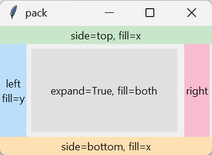
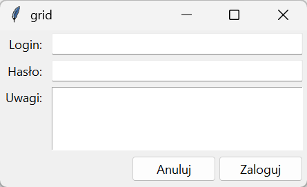
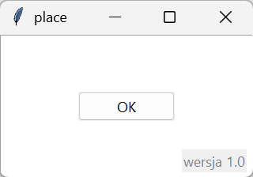
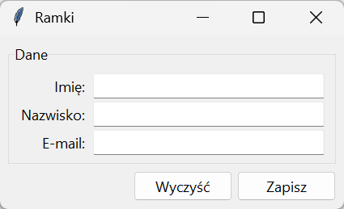

# Menedżery układu

Utworzenie widżetu nie umieszcza go w oknie — robi to jeden z trzech **menedżerów układu** (ang. *geometry manager*): `pack()` układa widżety wzdłuż krawędzi, `grid()` w siatce wierszy i kolumn, `place()` we wskazanym punkcie. Dobrze dobrany menedżer decyduje, czy okno zachowuje się poprawnie po zmianie rozmiaru.

## pack

```python title="pack.py"
import tkinter as tk

okno = tk.Tk()
okno.title("pack")
okno.geometry("360x220")
tk.Label(okno, text="side=top, fill=x", bg="#c8e6c9").pack(side="top", fill="x")
tk.Label(okno, text="side=bottom, fill=x", bg="#ffe0b2").pack(side="bottom", fill="x")
tk.Label(okno, text="left\nfill=y", bg="#bbdefb").pack(side="left", fill="y")
tk.Label(okno, text="right", bg="#f8bbd0").pack(side="right", fill="y", padx=4)
srodek = tk.Label(okno, text="expand=True, fill=both", bg="#e0e0e0")
srodek.pack(fill="both", expand=True, padx=8, pady=8)
print(srodek.pack_info()["side"], srodek.pack_info()["expand"], srodek.pack_info()["fill"])
print([widzet.pack_info()["side"] for widzet in okno.pack_slaves()])
okno.mainloop()
```

```{ .text .no-copy }
top 1 both
['top', 'bottom', 'left', 'right', 'top']
```



`pack()` przydziela widżetom miejsce w kolejności wywołań: każdy zajmuje pas wzdłuż krawędzi wskazanej przez `side` (domyślnie górnej), a następne dostają resztę. `fill` rozciąga widżet w obrębie jego pasa (`"x"`, `"y"` lub `"both"`), `expand=True` każe pasowi zająć całe wolne miejsce — bez tego środkowy pas miałby tylko wysokość tekstu, a dół okna zostałby pusty — a `padx`/`pady` dodają marginesy zewnętrzne (`ipadx`/`ipady` wewnętrzne). `pack_info()` zwraca ustawienia widżetu, `pack_slaves()` listę widżetów zarządzanych w kontenerze. Etykiety `tk` przyjmują kolor tła `bg`, dlatego posłużyły za kolorowe pola. `pack()` wystarcza do pasków narzędzi, przycisków w rzędzie i układów „nagłówek i reszta”; formularze wymagają siatki.

## grid

```python title="grid.py"
import tkinter as tk
from tkinter import ttk

okno = tk.Tk()
okno.title("grid")
okno.columnconfigure(1, weight=1)
okno.rowconfigure(2, weight=1)
ttk.Label(okno, text="Login:").grid(row=0, column=0, sticky="e", padx=6, pady=4)
login = ttk.Entry(okno)
login.grid(row=0, column=1, sticky="ew", padx=6, pady=4)
ttk.Label(okno, text="Hasło:").grid(row=1, column=0, sticky="e", padx=6, pady=4)
ttk.Entry(okno, show="•").grid(row=1, column=1, sticky="ew", padx=6, pady=4)
ttk.Label(okno, text="Uwagi:").grid(row=2, column=0, sticky="ne", padx=6, pady=4)
tk.Text(okno, width=30, height=4).grid(row=2, column=1, sticky="nsew", padx=6, pady=4)
przyciski = ttk.Frame(okno)
przyciski.grid(row=3, column=0, columnspan=2, sticky="e", padx=6, pady=(4, 8))
ttk.Button(przyciski, text="Anuluj").pack(side="left", padx=4)
ttk.Button(przyciski, text="Zaloguj").pack(side="left")
print(okno.grid_size(), login.grid_info()["row"], login.grid_info()["sticky"], okno.grid_columnconfigure(1)["weight"])
okno.mainloop()
```

```{ .text .no-copy }
(2, 4) 0 ew 1
```



`grid()` umieszcza widżet w komórce `(row, column)`; komórka rośnie do największego widżetu w wierszu i kolumnie, a widżet jest w niej wyśrodkowany, chyba że `sticky` przyklei go do krawędzi: `"e"` do prawej, `"ew"` rozciągnie w poziomie, `"nsew"` na całą komórkę (litery to strony świata). `columnspan`/`rowspan` scalają komórki. Bez `columnconfigure(1, weight=1)` dodatkowa przestrzeń po powiększeniu okna zostałaby niewykorzystana — waga mówi, które kolumny i wiersze ją dostają i w jakiej proporcji. `grid_size()` zwraca liczbę kolumn i wierszy, `grid_info()` ustawienia widżetu. Przyciski zebraliśmy w ramce z własnym `pack()`: w jednej komórce siatki może stać kontener z innym menedżerem — to właściwy sposób łączenia menedżerów.

## place

```python title="place.py"
import tkinter as tk
from tkinter import ttk

okno = tk.Tk()
okno.title("place")
okno.geometry("320x180")
tk.Text(okno).place(relx=0, rely=0, relwidth=1, relheight=1)
ttk.Button(okno, text="OK").place(relx=0.5, rely=0.5, anchor="center")
znak = ttk.Label(okno, text="wersja 1.0", foreground="gray")
znak.place(relx=1.0, rely=1.0, x=-8, y=-6, anchor="se")
print(znak.place_info()["relx"], znak.place_info()["anchor"], znak.place_info()["x"])
okno.mainloop()
```

```{ .text .no-copy }
1 se -8
```



`place()` ustawia widżet w punkcie: `x`/`y` w pikselach, `relx`/`rely` jako ułamek rozmiaru rodzica (razem — jak napis w rogu — dają punkt względny z przesunięciem), `anchor` wskazuje, który punkt widżetu trafia w podane miejsce, a `relwidth`/`relheight` dają rozmiar względny. Nie negocjuje miejsca z innymi widżetami, więc nadaje się do nakładek — przycisk na tle, znak wodny w rogu — a nie do formularzy, które muszą reagować na zmianę rozmiaru.

## Ramki i zagnieżdżanie

```python title="ramki.py"
import tkinter as tk
from tkinter import ttk

okno = tk.Tk()
okno.title("Ramki")
dane = ttk.LabelFrame(okno, text="Dane", padding=8)
dane.pack(fill="x", padx=10, pady=(10, 4))
for wiersz, etykieta in enumerate(("Imię", "Nazwisko", "E-mail")):
    ttk.Label(dane, text=etykieta + ":").grid(row=wiersz, column=0, sticky="e")
    ttk.Entry(dane, width=28).grid(row=wiersz, column=1, sticky="ew")
dane.columnconfigure(1, weight=1)
for potomek in dane.winfo_children():
    potomek.grid_configure(padx=4, pady=2)

przyciski = ttk.Frame(okno)
przyciski.pack(fill="x", padx=10, pady=(4, 10))
ttk.Button(przyciski, text="Zapisz").pack(side="right")
ttk.Button(przyciski, text="Wyczyść").pack(side="right", padx=6)
print([potomek.winfo_class() for potomek in dane.winfo_children()][:4], dane.winfo_children()[1].grid_info()["padx"])
print([potomek.winfo_manager() for potomek in okno.winfo_children()], przyciski.winfo_children()[0].winfo_manager())
okno.mainloop()
```

```{ .text .no-copy }
['TLabel', 'TEntry', 'TLabel', 'TEntry'] 4
['pack', 'pack'] pack
```



**Ramka** (`Frame`, z tytułem `LabelFrame`) grupuje widżety i ma własny menedżer układu: w ramce „Dane” działa `grid()`, w ramce przycisków `pack()`, a obie ramki układa `pack()` okna. Tak buduje się każde większe okno — z ramek, z których każda odpowiada za jeden fragment. `winfo_children()` zwraca widżety potomne w kolejności utworzenia, więc jednolite marginesy nadajemy pętlą przez `grid_configure()` (to ta sama metoda co `grid()`, wywołana ponownie z nowymi opcjami); `winfo_manager()` mówi, który menedżer zarządza widżetem.

## Pułapka: pack i grid w jednym kontenerze

```python title="mieszanie.py"
import tkinter as tk

okno = tk.Tk()
tk.Label(okno, text="A").pack()
try:
    tk.Label(okno, text="B").grid(row=0, column=0)
    okno.update()
except tk.TclError as blad:
    print("TclError:", blad)
okno.destroy()
```

```{ .text .no-copy }
TclError: cannot use geometry manager "grid" inside ".": pack is already managing its content windows
```

W jednym kontenerze działa jeden menedżer: `pack()` i `grid()` w tym samym oknie lub ramce nie uzgodniłyby rozmiaru. Tk zgłasza to od razu jako `TclError` (Tk 8.6 z komunikatem o nieco innym brzmieniu); ostrzeżenia ze starszych opisów, że okno zapętla się w negocjacji rozmiaru i nigdy się nie pojawia, dotyczą dawnych wersji Tk. `place()` można łączyć z pozostałymi, bo nie bierze udziału w negocjacji.

## Porównanie

| Menedżer | Model | Zastosowanie | Reakcja na zmianę rozmiaru |
|---|---|---|---|
| `pack()` | pasy wzdłuż krawędzi, w kolejności wywołań | paski narzędzi, rzędy przycisków, „nagłówek i reszta” | `fill` i `expand` |
| `grid()` | siatka wierszy i kolumn | formularze, panele z etykietami i polami | `sticky` oraz `weight` kolumn i wierszy |
| `place()` | współrzędne bezwzględne lub względne | nakładki, znaki wodne, pojedyncze elementy | tylko `relx`/`rely`/`relwidth`/`relheight` |
