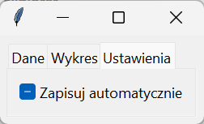
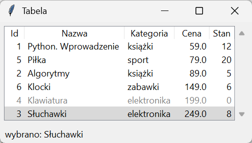
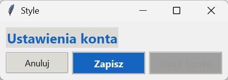
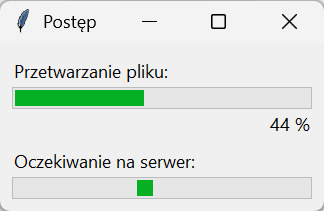

# Widżety ttk — zakładki, tabela i style

Moduł `ttk` poza tematycznymi wersjami podstawowych widżetów dostarcza kilka, których w `tk` nie ma: zakładki, tabelę z nagłówkami i pasek postępu. Ich wyglądem zarządza wspólny mechanizm stylów.

## Zakładki

```python title="zakladki.py"
import tkinter as tk
from tkinter import ttk

okno = tk.Tk()
okno.title("Zakładki")
zakladki = ttk.Notebook(okno)
zakladki.pack(fill="both", expand=True, padx=8, pady=8)
dane = ttk.Frame(zakladki, padding=12)
wykres = ttk.Frame(zakladki, padding=12)
ustawienia = ttk.Frame(zakladki, padding=12)
zakladki.add(dane, text="Dane")
zakladki.add(wykres, text="Wykres")
zakladki.add(ustawienia, text="Ustawienia")
ttk.Label(dane, text="Tu będzie tabela.").pack()
ttk.Label(wykres, text="Tu będzie wykres.").pack()
ttk.Checkbutton(ustawienia, text="Zapisuj automatycznie").pack(anchor="w")
zakladki.bind("<<NotebookTabChanged>>", lambda zdarzenie: print("zakładka:", zakladki.tab(zakladki.select(), "text")))
okno.update()
zakladki.select(ustawienia)
okno.update()
print(len(zakladki.tabs()), zakladki.index("current"), zakladki.tab(0, "text"))
okno.mainloop()
```

```{ .text .no-copy }
zakładka: Dane
zakładka: Ustawienia
3 2 Dane
```



`Notebook` przyjmuje ramki metodą `add()` z tytułem zakładki; każda ramka ma własny układ. `select()` przełącza zakładkę (po obiekcie albo indeksie), a bez argumentu zwraca bieżącą, `index("current")` i `tabs()` zwracają bieżący indeks i identyfikatory, `tab(…, "text")` opcje zakładki, a zdarzenie `<<NotebookTabChanged>>` pozwala reagować na przełączenie — także to pierwsze, przy wyświetleniu okna.

## Tabela Treeview

```python title="tabela.py"
import tkinter as tk
from tkinter import ttk

PRODUKTY = [
    (1, "Python. Wprowadzenie", "książki", 59.0, 12),
    (2, "Algorytmy", "książki", 89.0, 5),
    (3, "Słuchawki", "elektronika", 249.0, 8),
    (4, "Klawiatura", "elektronika", 199.0, 0),
    (5, "Piłka", "sport", 79.0, 20),
    (6, "Klocki", "zabawki", 149.0, 6),
]
okno = tk.Tk()
okno.title("Tabela")
ramka = ttk.Frame(okno, padding=8)
ramka.pack(fill="both", expand=True)
kolumny = ("id", "nazwa", "kategoria", "cena", "stan")
tabela = ttk.Treeview(ramka, columns=kolumny, show="headings", height=6, selectmode="browse")
for kolumna, tytul, szerokosc in zip(kolumny, ("Id", "Nazwa", "Kategoria", "Cena", "Stan"), (40, 200, 100, 70, 50)):
    tabela.heading(kolumna, text=tytul, command=lambda k=kolumna: sortuj(k))
    tabela.column(kolumna, width=szerokosc, anchor="e" if kolumna in ("id", "cena", "stan") else "w")
pasek = ttk.Scrollbar(ramka, orient="vertical", command=tabela.yview)
tabela.configure(yscrollcommand=pasek.set)
tabela.grid(row=0, column=0, sticky="nsew")
pasek.grid(row=0, column=1, sticky="ns")
ramka.rowconfigure(0, weight=1)
ramka.columnconfigure(0, weight=1)
stan = tk.StringVar(value="nic nie wybrano")
ttk.Label(okno, textvariable=stan, padding=(8, 4)).pack(fill="x")


def sortuj(kolumna):
    wiersze = [(tabela.set(wiersz, kolumna), wiersz) for wiersz in tabela.get_children()]
    liczbowa = kolumna in ("id", "cena", "stan")
    wiersze.sort(key=lambda para: float(para[0]) if liczbowa else para[0])
    for pozycja, (_, wiersz) in enumerate(wiersze):
        tabela.move(wiersz, "", pozycja)


def wybrano(zdarzenie):
    wiersz = tabela.selection()
    if wiersz:
        stan.set("wybrano: " + tabela.item(wiersz[0], "values")[1])


tabela.bind("<<TreeviewSelect>>", wybrano)
for produkt in PRODUKTY:
    tabela.insert("", "end", values=produkt, tags=("brak",) if produkt[4] == 0 else ())
tabela.tag_configure("brak", foreground="gray")
tabela.selection_set(tabela.get_children()[2])
sortuj("cena")
okno.update()
print(len(tabela.get_children()), [tabela.set(wiersz, "nazwa") for wiersz in tabela.get_children()][:3], stan.get())
okno.mainloop()
```

```{ .text .no-copy }
6 ['Python. Wprowadzenie', 'Piłka', 'Algorytmy'] wybrano: Słuchawki
```



`Treeview` wyświetla drzewo albo — z `show="headings"` — tabelę: `columns` nazywa kolumny, `heading()` ustawia tytuł i funkcję po kliknięciu nagłówka, `column()` szerokość i wyrównanie. `insert("", "end", values=…)` dodaje wiersz na najwyższym poziomie (pusty rodzic) i zwraca jego identyfikator; `get_children()` zwraca identyfikatory w kolejności, `set(wiersz, kolumna)` odczytuje pojedynczą komórkę, `item(wiersz, "values")` cały wiersz, a `move()` przestawia wiersze — sortowanie to zebranie wartości kolumny, `sort()` i przestawienie. Tagi wierszy, jak w `Text`, nadają wygląd — produkt bez stanu jest szary. Zaznaczenie zgłasza zdarzenie `<<TreeviewSelect>>`, a `selection()` zwraca krotkę identyfikatorów. Dane to produkty sklepu z rozdziałów 13–15; w projekcie ścieżki tabelę wypełni warstwa danych.

## Style i motywy

```python title="style.py"
import tkinter as tk
from tkinter import ttk

okno = tk.Tk()
okno.title("Style")
styl = ttk.Style(okno)
print(styl.theme_use(), styl.theme_names())
styl.theme_use("clam")
styl.configure("TButton", padding=6)
styl.configure("Akcent.TButton", foreground="white", background="#1565c0", font=("Segoe UI", 10, "bold"))
styl.map("Akcent.TButton", background=[("active", "#1e88e5"), ("disabled", "#9e9e9e")])
styl.configure("Naglowek.TLabel", font=("Segoe UI", 14, "bold"), foreground="#1565c0")
ttk.Label(okno, text="Ustawienia konta", style="Naglowek.TLabel").grid(row=0, column=0, columnspan=3, padx=12, pady=(12, 8), sticky="w")
ttk.Button(okno, text="Anuluj").grid(row=1, column=0, padx=(12, 4), pady=(0, 12))
ttk.Button(okno, text="Zapisz", style="Akcent.TButton").grid(row=1, column=1, padx=4, pady=(0, 12))
ttk.Button(okno, text="Usuń konto", style="Akcent.TButton", state="disabled").grid(row=1, column=2, padx=(4, 12), pady=(0, 12))
print(styl.lookup("Akcent.TButton", "background"), styl.lookup("Akcent.TButton", "background", ("disabled",)), styl.lookup("TButton", "padding"))
okno.mainloop()
```

```{ .text .no-copy }
vista ('winnative', 'clam', 'alt', 'default', 'classic', 'vista', 'xpnative')
#1565c0 #9e9e9e (6,)
```



Widżety `ttk` na ogół nie mają opcji kolorów — ich wygląd opisuje **styl** o nazwie klasy (`TButton`, `TLabel`, `Treeview`), a styl zależy od **motywu** (ang. *theme*). Na Windows domyślny jest `vista`, rysowany przez system, dlatego zmiana tła przycisku w nim nie działa; motyw `clam` rysuje wszystko sam i przyjmuje każdą konfigurację. `configure()` ustawia opcje stylu, `map()` ich wartości w stanach (`active` po najechaniu, `disabled`, `pressed`), a styl pochodny `Akcent.TButton` dziedziczy po `TButton` i dotyczy tylko widżetów, którym go przypiszemy opcją `style`. `lookup()` odczytuje wartość opcji, także dla stanu. Zmiana motywu dotyczy wszystkich okien aplikacji, także widżetów już wyświetlonych.

## Pasek postępu

```python title="postep.py"
import tkinter as tk
from tkinter import ttk

okno = tk.Tk()
okno.title("Postęp")
ttk.Label(okno, text="Przetwarzanie pliku:").pack(anchor="w", padx=12, pady=(12, 2))
postep = ttk.Progressbar(okno, orient="horizontal", length=300, mode="determinate", maximum=100)
postep.pack(padx=12)
opis = tk.StringVar(value="0 %")
ttk.Label(okno, textvariable=opis).pack(anchor="e", padx=12)
ttk.Label(okno, text="Oczekiwanie na serwer:").pack(anchor="w", padx=12, pady=(8, 2))
czekanie = ttk.Progressbar(okno, orient="horizontal", length=300, mode="indeterminate")
czekanie.pack(padx=12, pady=(0, 12))
czekanie.start(15)


def krok():
    wartosc = postep["value"] + 4
    postep["value"] = min(wartosc, 100)
    opis.set(f"{postep['value']:.0f} %")
    if wartosc < 100:
        okno.after(80, krok)
    else:
        czekanie.stop()


okno.after(80, krok)
okno.mainloop()
```



Pasek w trybie `determinate` pokazuje `value` w zakresie do `maximum`; postęp zwiększamy z funkcji wywoływanej przez `after()`, nigdy w pętli z `update()` — okno reagowałoby tylko w chwilach wywołania `update()`, a `after()` zostawia je responsywne. Tryb `indeterminate` z `start(ms)` animuje pasek, gdy długość zadania nie jest znana, do `stop()`. Prawdziwą pracę — pobieranie, obliczenia — wykonuje wątek, a pasek odczytuje jej stan z kolejki; ten wzorzec zamyka mini-projekt na ostatniej stronie.
