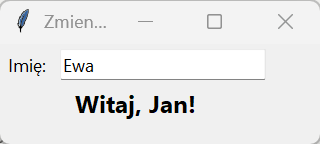
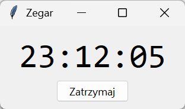
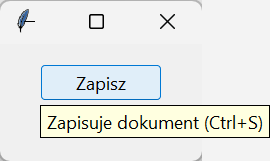

# Zdarzenia i zmienne kontrolne

Okno reaguje na dwa rodzaje sygnałów: zmianę wartości, którą wyświetla, i zdarzenia od użytkownika — kliknięcia, klawisze, ruch myszy. Pierwsze obsługują **zmienne kontrolne** z obserwatorami, drugie funkcje zwrotne rejestrowane przez `command` albo `bind()`. Do tego dochodzi czas: pętla zdarzeń nie może czekać w `sleep()`, więc opóźnienia i zegary załatwia `after()`.

## Zmienne kontrolne i obserwatorzy

```python title="zmienne.py"
import tkinter as tk
import warnings
from tkinter import ttk

okno = tk.Tk()
okno.title("Zmienne kontrolne")
okno.minsize(320, 100)
imie = tk.StringVar(value="Anna")
ttk.Label(okno, text="Imię:").grid(row=0, column=0, padx=6, pady=6)
ttk.Entry(okno, textvariable=imie, width=20).grid(row=0, column=1, padx=6)
powitanie = tk.StringVar()
ttk.Label(okno, textvariable=powitanie, font=("Segoe UI", 12, "bold")).grid(row=1, column=0, columnspan=2, pady=(0, 10))


def obserwator(nazwa, indeks, tryb):
    powitanie.set(f"Witaj, {imie.get() or '…'}!")


identyfikator = imie.trace_add("write", obserwator)
imie.set("Jan")
print(powitanie.get(), "|", [tryb for tryb, nazwa in imie.trace_info()])
imie.trace_remove("write", identyfikator)
imie.set("Ewa")
print(powitanie.get(), "|", [tryb for tryb, nazwa in imie.trace_info()])

liczba, ulamek, flaga = tk.IntVar(), tk.DoubleVar(value=2), tk.BooleanVar()
liczba.set("7")
print(liczba.get(), type(liczba.get()).__name__, ulamek.get(), flaga.get())
with warnings.catch_warnings(record=True) as ostrzezenia:
    warnings.simplefilter("always")
    try:
        imie.trace("w", obserwator)
    except tk.TclError as blad:
        print("TclError:", blad)
print(ostrzezenia[0].category.__name__, "—", str(ostrzezenia[0].message))
okno.mainloop()
```

```{ .text .no-copy }
Witaj, Jan! | [('write',)]
Witaj, Jan! | []
7 int 2.0 False
TclError: bad option "variable": must be add, info, or remove
DeprecationWarning — trace_variable() is deprecated and not supported with Tcl 9; use trace_add() instead.
```



Zwykła zmienna Pythona nie odświeży etykiety — widżet nie wie, że coś się zmieniło. Zmienna kontrolna jest obiektem po stronie Tk: widżet z opcją `textvariable` wyświetla jej wartość i zapisuje do niej to, co wpisze użytkownik, a program czyta ją `get()` i ustawia `set()` — związanie działa w obie strony. `IntVar` i `DoubleVar` konwertują wartości (`"7"` staje się liczbą całkowitą), `BooleanVar` służy polom wyboru. **Obserwator** (ang. *observer*) z `trace_add("write", …)` jest wywoływany przy każdym zapisie — także przy każdym wpisanym znaku — z trzema argumentami: wewnętrzną nazwą zmiennej, indeksem (dla tablic Tcl, tu pusty) i trybem; funkcje, które ich nie potrzebują, przyjmują `*_`. `trace_add()` zwraca identyfikator do `trace_remove()`, a `trace_info()` wymienia zarejestrowanych obserwatorów; po usunięciu obserwatora `set("Ewa")` już nie zmienia powitania, choć pole pokazuje nową wartość. To wzorzec obserwatora z rozdziału 12 „Python Notatki” w gotowej postaci. Dawna metoda `trace("w", …)` w Tk 9 nie działa: zgłasza ostrzeżenie o wycofaniu i `TclError`, bo polecenie `trace variable` zniknęło z Tcl 9 — w starszym kodzie zamieniamy ją na `trace_add`.

## `command` a `bind`

```python title="zdarzenia.py"
import tkinter as tk
from tkinter import ttk

okno = tk.Tk()
okno.title("Zdarzenia")
dziennik = tk.StringVar(value="brak zdarzeń")
ttk.Label(okno, textvariable=dziennik, width=40).pack(padx=10, pady=8)
przycisk = ttk.Button(okno, text="Zapisz", command=lambda: dziennik.set("command: bez argumentów"))
przycisk.pack(pady=(0, 8))


def klik(zdarzenie):
    dziennik.set(f"bind: {zdarzenie.type.name} przycisk {zdarzenie.num} w ({zdarzenie.x}, {zdarzenie.y}) na {zdarzenie.widget.winfo_class()}")


przycisk.bind("<Button-3>", klik)
okno.bind("<Control-s>", lambda zdarzenie: dziennik.set(f"klawisz: Ctrl+{zdarzenie.keysym}"))
okno.bind("<Return>", lambda zdarzenie: przycisk.invoke())
okno.bind("<Escape>", lambda zdarzenie: okno.destroy())

for zdarzenie in ("<Button-3>", "<Control-s>", "<Return>"):
    (przycisk if zdarzenie == "<Button-3>" else okno).event_generate(zdarzenie, x=12, y=7)
    okno.update()
    print(dziennik.get())
okno.mainloop()
```

```{ .text .no-copy }
bind: ButtonPress przycisk 3 w (12, 7) na TButton
klawisz: Ctrl+s
command: bez argumentów
```

Opcja `command` obsługuje jedno, najprostsze zdarzenie widżetu — kliknięcie przycisku, zmianę pola wyboru — i wywołuje funkcję bez argumentów (`Scale` przekazuje wartość). `bind()` przypisuje funkcję dowolnemu zdarzeniu opisanemu tekstem: `<Button-3>` to prawy przycisk myszy, `<Control-s>` skrót klawiszowy, `<Return>` Enter; funkcja dostaje obiekt zdarzenia z rodzajem, położeniem kursora, klawiszem (`keysym`) i widżetem. Wiązania na oknie głównym działają dla wszystkich jego widżetów, dlatego skróty rejestrujemy na `okno`. Funkcję bezargumentową, jaką przyjmuje `command`, w `bind()` opakowujemy w `lambda zdarzenie: …`, bo `bind()` zawsze przekazuje zdarzenie — `okno.bind("<Escape>", okno.destroy)` zgłosiłoby błąd liczby argumentów. `event_generate()` wysyła zdarzenie tak, jakby zrobił to użytkownik, więc obsługę można sprawdzać w skrypcie i w testach.

| Zdarzenie | Znaczenie |
|---|---|
| `<Button-1>`, `<Button-3>` | lewy, prawy przycisk myszy; `<Double-Button-1>` dwuklik |
| `<B1-Motion>` | ruch z wciśniętym lewym przyciskiem |
| `<Motion>`, `<Enter>`, `<Leave>` | ruch kursora, wejście na widżet, opuszczenie go |
| `<Key>`, `<Return>`, `<Escape>`, `<Control-s>` | dowolny klawisz, Enter, Esc, skrót |
| `<FocusIn>`, `<FocusOut>` | widżet dostał lub stracił fokus |
| `<Configure>` | zmiana rozmiaru lub położenia |
| `<<ComboboxSelected>>`, `<<TreeviewSelect>>` | zdarzenia zdefiniowane przez widżety ttk |

## Pułapka: lambda w pętli

```python title="petla.py"
import tkinter as tk
from tkinter import ttk

okno = tk.Tk()
okno.title("Lambda w pętli")
wybrany = tk.StringVar(value="—")
ttk.Label(okno, textvariable=wybrany).grid(row=0, column=0, columnspan=3, pady=6)
zle, dobre = [], []
for numer in range(3):
    zle.append(ttk.Button(okno, text=f"Źle {numer}", command=lambda: wybrany.set(f"źle: {numer}")))
    zle[-1].grid(row=1, column=numer, padx=4)
    dobre.append(ttk.Button(okno, text=f"Dobrze {numer}", command=lambda n=numer: wybrany.set(f"dobrze: {n}")))
    dobre[-1].grid(row=2, column=numer, padx=4, pady=(4, 8))
for przycisk in zle + dobre:
    przycisk.invoke()
    print(przycisk.cget("text"), "→", wybrany.get())
okno.mainloop()
```

```{ .text .no-copy }
Źle 0 → źle: 2
Źle 1 → źle: 2
Źle 2 → źle: 2
Dobrze 0 → dobrze: 0
Dobrze 1 → dobrze: 1
Dobrze 2 → dobrze: 2
```

Lambda w pętli zapamiętuje zmienną `numer`, nie jej bieżącą wartość — to późne wiązanie z rozdziału 6 „Python Notatki” — więc każdy przycisk z pierwszego rzędu ustawia ostatnią wartość pętli. Argument domyślny `n=numer` jest obliczany w chwili tworzenia lambdy i wiąże właściwą liczbę z każdym przyciskiem; to samo daje `functools.partial(funkcja, numer)`.

## Zegar, `after` i zamykanie okna

```python title="zegar.py"
import time
import tkinter as tk
from tkinter import messagebox, ttk

okno = tk.Tk()
okno.title("Zegar")
czas = tk.StringVar()
ttk.Label(okno, textvariable=czas, font=("Consolas", 28)).pack(padx=30, pady=(16, 6))
stan = {"zadanie": None}


def tykniecie():
    czas.set(time.strftime("%H:%M:%S"))
    stan["zadanie"] = okno.after(1000, tykniecie)


def zatrzymaj():
    if stan["zadanie"] is not None:
        okno.after_cancel(stan["zadanie"])
        stan["zadanie"] = None


def zamknij():
    if messagebox.askokcancel("Zegar", "Zamknąć okno?"):
        okno.destroy()


ttk.Button(okno, text="Zatrzymaj", command=zatrzymaj).pack(pady=(0, 12))
okno.protocol("WM_DELETE_WINDOW", zamknij)
tykniecie()
okno.mainloop()
```



`after(ms, funkcja)` prosi pętlę zdarzeń o wywołanie funkcji po upływie czasu i od razu zwraca identyfikator; funkcja, która na końcu ponownie wywołuje `after()` dla siebie, staje się zegarem. `time.sleep()` w programie okienkowym zatrzymałby pętlę — okno przestałoby się odrysowywać i reagować. `after_cancel()` odwołuje zaplanowane wywołanie. `protocol("WM_DELETE_WINDOW", …)` przejmuje kliknięcie w przycisk zamykania okna: program może zapytać o potwierdzenie albo zapisać dane; `destroy()` niszczy okno i kończy `mainloop()`.

## Dla dociekliwych: dymek podpowiedzi

```python title="dymek.py"
import tkinter as tk
from tkinter import ttk


class Dymek:
    """Podpowiedź pokazywana po najechaniu kursorem na widżet."""

    def __init__(self, widzet, tekst):
        self.widzet = widzet
        self.tekst = tekst
        self.okno = None
        widzet.bind("<Enter>", self.pokaz)
        widzet.bind("<Leave>", self.ukryj)

    def pokaz(self, zdarzenie):
        if self.okno is not None:
            return
        self.okno = tk.Toplevel(self.widzet)
        self.okno.overrideredirect(True)
        self.okno.geometry(f"+{self.widzet.winfo_rootx()}+{self.widzet.winfo_rooty() + self.widzet.winfo_height() + 4}")
        tk.Label(self.okno, text=self.tekst, background="#ffffe0", relief="solid", borderwidth=1, padx=6, pady=3).pack()

    def ukryj(self, zdarzenie):
        if self.okno is not None:
            self.okno.destroy()
            self.okno = None


okno = tk.Tk()
okno.title("Dymek")
przycisk = ttk.Button(okno, text="Zapisz")
przycisk.pack(padx=40, pady=(20, 60))
Dymek(przycisk, "Zapisuje dokument (Ctrl+S)")
okno.after(300, lambda: przycisk.event_generate("<Enter>"))
okno.mainloop()
```



Dymek to małe okno `Toplevel` bez ramki systemowej (`overrideredirect(True)`), ustawione pod widżetem współrzędnymi ekranowymi z `winfo_rootx()`/`winfo_rooty()`, tworzone przy `<Enter>` i niszczone przy `<Leave>`. Atrybut `okno` inicjujemy w konstruktorze wartością `None` — bez tego `ukryj()` wywołane przed pierwszym pokazaniem zgłosiłoby `AttributeError`. Ten sam schemat — klasa, która przy tworzeniu wiąże zdarzenia i przechowuje stan — obsługuje przeciąganie, podświetlanie i inne zachowania dopisywane do istniejących widżetów.
