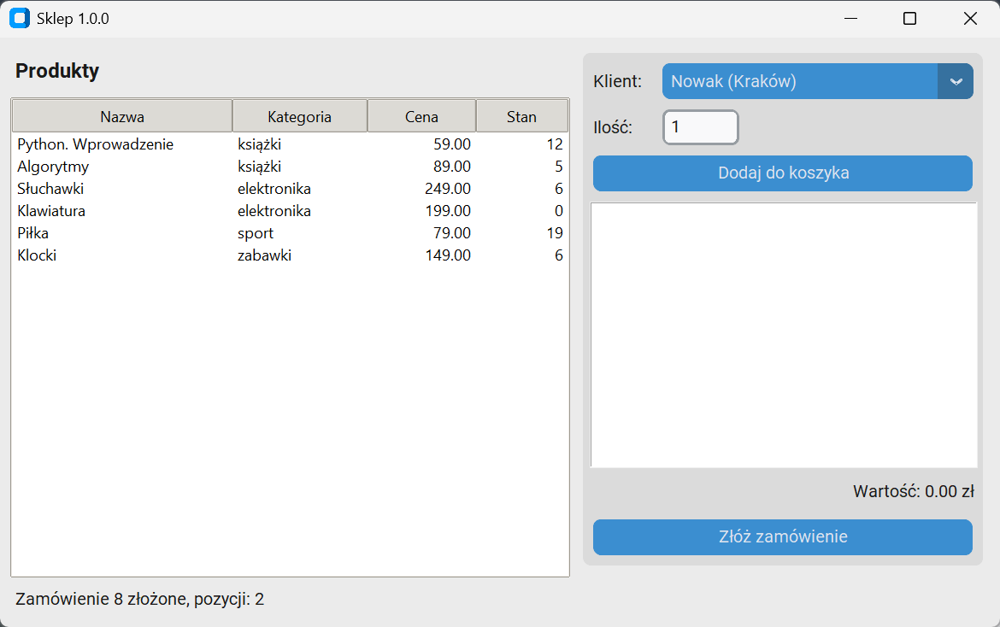

# Klient: moduł API i okno

Okno nie wysyła żądań HTTP samo — korzysta z modułu klienta, który zamienia adresy i kody stanu na metody i wyjątki, jak w rozdziale 14. Między klientem a widżetami stoi jeszcze koszyk: zwykła klasa bez okna, którą testujemy bez serwera i bez okna.

## Klient API

```python title="src/sklep/klient.py"
"""Klient usługi sklepu: metody zamiast adresów, wyjątki zamiast kodów stanu."""

import os

import httpx


class BladApi(Exception):
    def __init__(self, status, komunikat):
        super().__init__(f"{status}: {komunikat}")
        self.status = status
        self.komunikat = komunikat


class KlientSklepu:
    def __init__(self, adres=None, transport=None):
        adres = adres or os.environ.get("SKLEP_ADRES", "http://127.0.0.1:8000")
        self._klient = httpx.Client(base_url=adres, timeout=5.0, transport=transport)

    def __enter__(self):
        return self

    def __exit__(self, *_):
        self._klient.close()

    def _zapytaj(self, metoda, sciezka, **argumenty):
        odpowiedz = self._klient.request(metoda, sciezka, **argumenty)
        if odpowiedz.is_error:
            komunikat = odpowiedz.reason_phrase
            if odpowiedz.headers.get("content-type", "").startswith("application/json"):
                szczegoly = odpowiedz.json().get("detail", komunikat)
                komunikat = szczegoly if isinstance(szczegoly, str) else "niepoprawne dane żądania"
            raise BladApi(odpowiedz.status_code, komunikat)
        return odpowiedz.json()

    def produkty(self, kategoria=None):
        return self._zapytaj("GET", "/produkty", params={"kategoria": kategoria} if kategoria else None)

    def klienci(self):
        return self._zapytaj("GET", "/klienci")

    def zloz_zamowienie(self, klient_id, koszyk):
        pozycje = [{"produkt_id": produkt_id, "ilosc": ilosc} for produkt_id, ilosc in koszyk]
        return self._zapytaj("POST", "/zamowienia", json={"klient_id": klient_id, "koszyk": pozycje})

    def podsumowanie(self, klient_id):
        return self._zapytaj("GET", f"/klienci/{klient_id}/podsumowanie")

    def anuluj(self, zamowienie_id):
        return self._zapytaj("POST", f"/zamowienia/{zamowienie_id}/anulowanie")
```

```python title="src/sklep/koszyk.py"
"""Koszyk zamówienia: pozycje i wartość, bez okna."""


class Koszyk:
    def __init__(self):
        self._pozycje = {}

    def dodaj(self, produkt_id, ilosc):
        if ilosc < 1:
            raise ValueError("ilość musi być dodatnia")
        self._pozycje[produkt_id] = self._pozycje.get(produkt_id, 0) + ilosc

    def usun(self, produkt_id):
        self._pozycje.pop(produkt_id, None)

    def wyczysc(self):
        self._pozycje.clear()

    def pozycje(self):
        return list(self._pozycje.items())

    def wartosc(self, produkty):
        return sum(produkty[produkt_id]["cena"] * ilosc for produkt_id, ilosc in self._pozycje.items())
```

```python title="uzycie-klienta.py"
import os
import threading
import time
from pathlib import Path

import uvicorn

os.environ["SKLEP_BAZA"] = "sqlite:///sklep-proba.db"
Path("sklep-proba.db").unlink(missing_ok=True)

from sklep.api import app  # noqa: E402
from sklep.klient import BladApi, KlientSklepu  # noqa: E402
from sklep.koszyk import Koszyk  # noqa: E402

serwer = uvicorn.Server(uvicorn.Config(app, host="127.0.0.1", port=8765, log_level="warning"))
threading.Thread(target=serwer.run, daemon=True).start()
while not serwer.started:
    time.sleep(0.05)

with KlientSklepu("http://127.0.0.1:8765") as sklep:
    produkty = {produkt["id"]: produkt for produkt in sklep.produkty()}
    print(len(produkty), [klient["nazwisko"] for klient in sklep.klienci()][:3])
    koszyk = Koszyk()
    koszyk.dodaj(1, 2)
    koszyk.dodaj(5, 1)
    koszyk.dodaj(1, 1)
    print(koszyk.pozycje(), koszyk.wartosc(produkty))
    zamowienie = sklep.zloz_zamowienie(6, koszyk.pozycje())
    print(zamowienie["id"], zamowienie["status"], [(p["produkt_id"], p["ilosc"]) for p in zamowienie["pozycje"]])
    print(sklep.podsumowanie(6), sklep.produkty("książki")[0]["stan"])
    for wywolanie in (lambda: sklep.zloz_zamowienie(6, [(4, 1)]), lambda: sklep.podsumowanie(99), lambda: sklep.zloz_zamowienie(6, [(1, 0)])):
        try:
            wywolanie()
        except BladApi as blad:
            print(blad.status, "|", blad.komunikat)
serwer.should_exit = True
```

```{ .text .no-copy }
6 ['Nowak', 'Kowalska', 'Wiśniewski']
[(1, 3), (5, 1)] 256.0
8 nowe [(1, 3), (5, 1)]
{'zamowien': 1, 'wartosc': 256.0} 9
409 | produkt 4: zamówiono 1, dostępne 0
404 | nie ma klienta o id 99
422 | niepoprawne dane żądania
```

Klient trzyma jeden `httpx.Client` z adresem bazowym z argumentu albo zmiennej `SKLEP_ADRES` — domyślnie lokalny serwer na porcie 8000 — i tłumaczy odpowiedzi: `is_error` zamienia się w `BladApi` z kodem i komunikatem z pola `detail`, a błąd walidacji (lista zamiast tekstu) dostaje komunikat ogólny. Argument `transport` służy testom z atrapą transportu, jak w rozdziale 14; ponawiania po `503` nie ma: usługa nie odpowiada tym kodem, a każdy błąd trafia na pasek stanu i użytkownik może powtórzyć działanie. Koszyk zlicza sztuki tego samego produktu, odrzuca ilości niedodatnie i liczy wartość z cen produktów podanych z zewnątrz — nie zna ani sieci, ani okna. Skrypt kontrolny uruchamia usługę w wątku, jak w rozdziale 15, i wykonuje kolejno wywołania, z których skorzysta okno — lista produktów, koszyk, zamówienie, błędy — oraz podsumowanie klienta.

## Okno

```python title="src/sklep/okno.py"
"""Okno klienta sklepu: produkty, koszyk, zamówienie."""

import queue
import sys
import threading
import tkinter as tk
from tkinter import ttk

import customtkinter as ctk

from . import __version__
from .klient import KlientSklepu
from .koszyk import Koszyk

KOLUMNY = (("nazwa", "Nazwa", 200, "w"), ("kategoria", "Kategoria", 100, "w"), ("cena", "Cena", 70, "e"), ("stan", "Stan", 50, "e"))


class OknoSklepu(ctk.CTk):
    def __init__(self, klient):
        super().__init__()
        self.klient = klient
        self.koszyk = Koszyk()
        self.produkty = {}
        self.klienci = {}
        self.kolejka = queue.Queue()
        self.ostatni_komunikat = ""
        self.title(f"Sklep {__version__}")
        self.geometry("780x460")
        self._buduj()
        self.w_tle(self.klient.produkty, self.pokaz_produkty)
        self.w_tle(self.klient.klienci, self.pokaz_klientow)
        self.after(50, self.odbierz)

    def _buduj(self):
        self.columnconfigure(0, weight=3)
        self.columnconfigure(1, weight=2)
        self.rowconfigure(1, weight=1)
        ctk.CTkLabel(self, text="Produkty", font=ctk.CTkFont(size=16, weight="bold")).grid(row=0, column=0, sticky="w", padx=12, pady=(12, 4))
        styl = ttk.Style(self)
        styl.theme_use("clam")
        styl.configure("Treeview", rowheight=26)
        self.tabela = ttk.Treeview(self, columns=[kolumna for kolumna, *_ in KOLUMNY], show="headings", selectmode="browse")
        for kolumna, tytul, szerokosc, wyrownanie in KOLUMNY:
            self.tabela.heading(kolumna, text=tytul)
            self.tabela.column(kolumna, width=szerokosc, anchor=wyrownanie)
        self.tabela.grid(row=1, column=0, sticky="nsew", padx=(12, 6), pady=4)
        panel = ctk.CTkFrame(self)
        panel.grid(row=0, column=1, rowspan=2, sticky="nsew", padx=(6, 12), pady=12)
        panel.columnconfigure(1, weight=1)
        panel.rowconfigure(3, weight=1)
        ctk.CTkLabel(panel, text="Klient:").grid(row=0, column=0, padx=8, pady=8, sticky="w")
        self.wybor_klienta = ctk.CTkOptionMenu(panel, values=["…"])
        self.wybor_klienta.grid(row=0, column=1, padx=8, pady=8, sticky="ew")
        ctk.CTkLabel(panel, text="Ilość:").grid(row=1, column=0, padx=8, sticky="w")
        self.ilosc = ctk.CTkEntry(panel, width=60)
        self.ilosc.insert(0, "1")
        self.ilosc.grid(row=1, column=1, padx=8, sticky="w")
        ctk.CTkButton(panel, text="Dodaj do koszyka", command=self.dodaj).grid(row=2, column=0, columnspan=2, padx=8, pady=8, sticky="ew")
        self.lista = tk.Listbox(panel, height=6, activestyle="none")
        self.lista.grid(row=3, column=0, columnspan=2, padx=8, sticky="nsew")
        self.wartosc = ctk.CTkLabel(panel, text="Wartość: 0.00 zł")
        self.wartosc.grid(row=4, column=0, columnspan=2, padx=8, pady=4, sticky="e")
        ctk.CTkButton(panel, text="Złóż zamówienie", command=self.zamow).grid(row=5, column=0, columnspan=2, padx=8, pady=(4, 8), sticky="ew")
        self.stan = ctk.CTkLabel(self, text="Łączenie z serwerem…", anchor="w")
        self.stan.grid(row=2, column=0, columnspan=2, sticky="ew", padx=12, pady=(0, 8))

    def w_tle(self, funkcja, po_wyniku, *argumenty):
        """Wykonuje wywołanie klienta w wątku; wynik albo wyjątek trafia do kolejki."""

        def praca():
            try:
                self.kolejka.put((po_wyniku, funkcja(*argumenty), None))
            except Exception as blad:
                self.kolejka.put((po_wyniku, None, blad))

        threading.Thread(target=praca, daemon=True).start()

    def odbierz(self):
        try:
            while True:
                po_wyniku, wynik, blad = self.kolejka.get_nowait()
                if blad is None:
                    po_wyniku(wynik)
                else:
                    self.komunikat(f"Błąd: {blad}")
        except queue.Empty:
            pass
        self.after(50, self.odbierz)

    def komunikat(self, tekst):
        self.ostatni_komunikat = tekst
        self.stan.configure(text=tekst)

    def pokaz_produkty(self, produkty):
        pierwsze_wczytanie = not self.produkty
        self.produkty = {produkt["id"]: produkt for produkt in produkty}
        self.tabela.delete(*self.tabela.get_children())
        for produkt in produkty:
            self.tabela.insert("", "end", iid=str(produkt["id"]), values=(produkt["nazwa"], produkt["kategoria"], f"{produkt['cena']:.2f}", produkt["stan"]))
        if pierwsze_wczytanie:
            self.komunikat(f"Produktów: {len(produkty)}")

    def pokaz_klientow(self, klienci):
        self.klienci = {f"{klient['nazwisko']} ({klient['miasto']})": klient["id"] for klient in klienci}
        self.wybor_klienta.configure(values=list(self.klienci))
        self.wybor_klienta.set(next(iter(self.klienci)))

    def dodaj(self):
        wybrane = self.tabela.selection()
        if not wybrane:
            return self.komunikat("Wybierz produkt w tabeli.")
        try:
            self.koszyk.dodaj(int(wybrane[0]), int(self.ilosc.get()))
        except ValueError as blad:
            return self.komunikat(f"Niepoprawna ilość: {blad}")
        self.odswiez_koszyk()

    def odswiez_koszyk(self):
        self.lista.delete(0, "end")
        for produkt_id, ilosc in self.koszyk.pozycje():
            self.lista.insert("end", f"{ilosc} × {self.produkty[produkt_id]['nazwa']}")
        self.wartosc.configure(text=f"Wartość: {self.koszyk.wartosc(self.produkty):.2f} zł")

    def zamow(self):
        if not self.koszyk.pozycje():
            return self.komunikat("Koszyk jest pusty.")
        klient_id = self.klienci.get(self.wybor_klienta.get())
        self.w_tle(self.klient.zloz_zamowienie, self.po_zamowieniu, klient_id, self.koszyk.pozycje())

    def po_zamowieniu(self, zamowienie):
        self.koszyk.wyczysc()
        self.odswiez_koszyk()
        self.komunikat(f"Zamówienie {zamowienie['id']} złożone, pozycji: {len(zamowienie['pozycje'])}")
        self.w_tle(self.klient.produkty, self.pokaz_produkty)


def main(argv=None):
    argumenty = sys.argv[1:] if argv is None else argv
    ctk.set_appearance_mode("light")
    with KlientSklepu() as klient:
        okno = OknoSklepu(klient)
        if "--zamknij-po" in argumenty:
            okno.after(int(argumenty[argumenty.index("--zamknij-po") + 1]), okno.destroy)
        okno.mainloop()


if __name__ == "__main__":
    main()
```

Okno dziedziczy po `ctk.CTk`, jak panel z rozdziału 16: tabela produktów w `ttk.Treeview` (identyfikator wiersza to numer produktu), panel z wyborem klienta, ilością, koszykiem i przyciskami, pasek stanu. Każde wywołanie klienta API przechodzi przez `w_tle()`: wątek wykonuje żądanie i wkłada do kolejki wynik albo wyjątek razem z funkcją, która ma go obsłużyć; `odbierz()` co 50 ms opróżnia kolejkę w wątku okna — ten sam wzorzec, co w rozdziale 16, tylko z funkcją zwrotną w elemencie kolejki. Dzięki temu okno nie zamiera, gdy serwer odpowiada wolno, a błąd sieci lub `BladApi` kończy się komunikatem na pasku, nie wyjątkiem w wątku. Zamówienie przechodzi przez koszyk (który sprawdza ilość) i klienta (który tłumaczy odpowiedź), a po sukcesie okno czyści koszyk i odświeża tabelę, żeby pokazać zmniejszony stan; komunikat o liczbie produktów pojawia się tylko przy pierwszym wczytaniu, więc odświeżenie nie zakrywa komunikatu o zamówieniu. Ostatni komunikat trafia też do zwykłego atrybutu, dostępnego po zamknięciu okna — dla skryptów kontrolnych i testów. Funkcja `main()`, punkt wejścia polecenia `sklep`, otwiera okno w bloku `with` klienta i przyjmuje przełącznik `--zamknij-po` z rozdziału 17, z którego skorzysta skrypt budujący plik wykonywalny.

## Okno w działaniu

```python title="uzycie-okna.py"
import os
import threading
import time
from pathlib import Path

import uvicorn

os.environ["SKLEP_BAZA"] = "sqlite:///sklep-proba.db"
os.environ["SKLEP_ADRES"] = "http://127.0.0.1:8765"
Path("sklep-proba.db").unlink(missing_ok=True)

from sklep.api import app  # noqa: E402
from sklep.klient import KlientSklepu  # noqa: E402
from sklep.okno import OknoSklepu, ctk  # noqa: E402

serwer = uvicorn.Server(uvicorn.Config(app, host="127.0.0.1", port=8765, log_level="warning"))
threading.Thread(target=serwer.run, daemon=True).start()
while not serwer.started:
    time.sleep(0.05)

ctk.set_appearance_mode("light")
with KlientSklepu() as klient:
    okno = OknoSklepu(klient)

    def symulacja():
        okno.tabela.selection_set("3")
        okno.ilosc.delete(0, "end")
        okno.ilosc.insert(0, "2")
        okno.dodaj()
        okno.tabela.selection_set("5")
        okno.ilosc.delete(0, "end")
        okno.ilosc.insert(0, "1")
        okno.dodaj()
        okno.after(200, okno.zamow)

    okno.after(300, symulacja)
    okno.after(1500, okno.destroy)
    okno.mainloop()
print(okno.ostatni_komunikat, "|", okno.produkty[3]["stan"], okno.produkty[5]["stan"], "|", okno.koszyk.pozycje())
serwer.should_exit = True
```

```{ .text .no-copy }
Zamówienie 8 złożone, pozycji: 2 | 6 19 | []
```



Skrypt kontrolny naśladuje użytkownika: po 300 ms zaznacza w tabeli słuchawki i piłkę, dodaje je do koszyka i składa zamówienie, a po 1,5 s zamyka okno. Stany produktów w atrybucie `produkty` pochodzą z odświeżenia po zamówieniu — słuchawek jest o dwie mniej, piłek o jedną — a koszyk jest pusty. Tak samo można sprawdzić okno w automatycznej kontroli, bez klikania; do prawdziwej pracy służy polecenie `sklep` z następnej strony.
