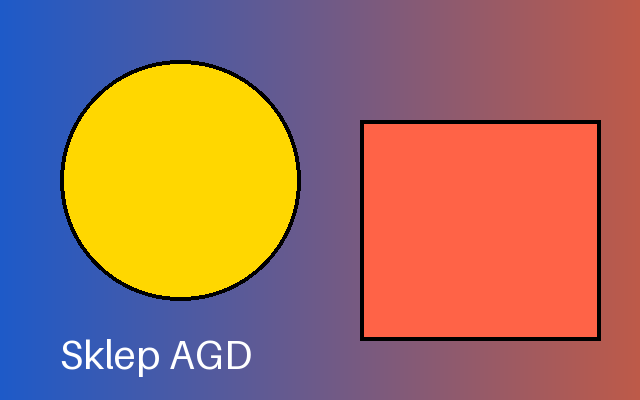
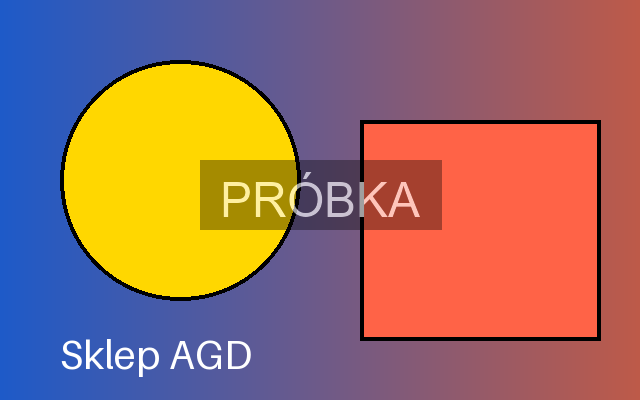
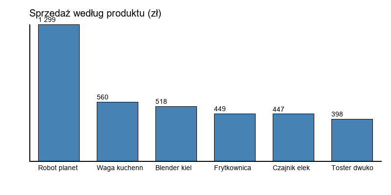

# Obrazy

Pillow otwiera obraz jako obiekt `Image` z wymiarami, **trybem** (ang. *mode*) — `RGB`, `RGBA` z przezroczystością, `L` w odcieniach szarości — i formatem pliku; przekształcenia zwracają nowy obraz, a `save()` zapisuje w formacie wybranym po rozszerzeniu.

## Otwieranie i przekształcenia

```python title="przeksztalcenia.py"
from PIL import Image, ImageDraw, ImageFont

obraz = Image.new("RGB", (640, 400), "white")
rysunek = ImageDraw.Draw(obraz)
for x in range(640):
    rysunek.line([(x, 0), (x, 400)], fill=(30 + x // 4, 90, 200 - x // 5))
rysunek.ellipse((60, 60, 300, 300), fill="gold", outline="black", width=4)
rysunek.rectangle((360, 120, 600, 340), fill="tomato", outline="black", width=4)
rysunek.text((60, 330), "Sklep AGD", fill="white", font=ImageFont.load_default(size=40))
obraz.save("oryginal.png")

obraz = Image.open("oryginal.png")
print(obraz.format, obraz.size, obraz.mode, obraz.getpixel((0, 0)))
print(obraz.resize((320, 200)).size, obraz.crop((360, 120, 600, 340)).size, obraz.rotate(90, expand=True).size)
print(obraz.convert("L").mode, obraz.convert("L").getpixel((0, 0)))
miniatura = obraz.copy()
miniatura.thumbnail((200, 200))
print(miniatura.size)
obraz.save("oryginal.jpg", quality=85)
obraz.convert("L").save("szary.png")
miniatura.save("miniatura.png")
print(Image.open("oryginal.jpg").format, Image.open("oryginal.jpg").mode)
```

```{ .text .no-copy }
PNG (640, 400) RGB (30, 90, 200)
(320, 200) (240, 220) (400, 640)
L 85
(200, 125)
JPEG RGB
```



Skrypt najpierw rysuje obraz testowy, żeby nie zależeć od pliku z dysku. `Image.open()` czyta nagłówek pliku, a piksele dopiero przy pierwszym użyciu; `getpixel()` zwraca składowe koloru. `resize()` daje nowy obraz o zadanych wymiarach (bez zachowania proporcji), `crop()` wycina prostokąt podany jako lewy, górny, prawy i dolny brzeg, `rotate(expand=True)` obraca i powiększa płótno, `convert("L")` zamienia na odcienie szarości. **Miniatura** (ang. *thumbnail*) różni się od `resize()`: `thumbnail()` zmienia obraz w miejscu, zachowuje proporcje i nie powiększa — stąd `copy()` przed wywołaniem. Zapis JPEG przyjmuje `quality` (stratna kompresja, domyślnie 75) i wymaga trybu bez przezroczystości.

## Rysowanie i znak wodny

```python title="rysowanie.py"
from PIL import Image, ImageDraw, ImageFont

obraz = Image.open("oryginal.png").convert("RGBA")
warstwa = Image.new("RGBA", obraz.size, (0, 0, 0, 0))
rysunek = ImageDraw.Draw(warstwa)
czcionka = ImageFont.truetype("arial.ttf", 48)
tekst = "PRÓBKA"
srodek = (obraz.width // 2, obraz.height // 2)
lewy, gorny, prawy, dolny = rysunek.textbbox(srodek, tekst, font=czcionka, anchor="mm")
rysunek.rectangle((lewy - 20, gorny - 12, prawy + 20, dolny + 12), fill=(0, 0, 0, 90))
rysunek.text(srodek, tekst, fill=(255, 255, 255, 160), font=czcionka, anchor="mm")
wynik = Image.alpha_composite(obraz, warstwa).convert("RGB")
wynik.save("znak-wodny.png")
print(wynik.size, wynik.mode, (prawy - lewy, dolny - gorny), wynik.getpixel((320, 200)) != obraz.convert("RGB").getpixel((320, 200)))
```

```{ .text .no-copy }
(640, 400) RGB (201, 45) True
```



`ImageDraw` rysuje figury i tekst na obrazie. Wbudowana czcionka `load_default(size=…)` ma ograniczony zestaw znaków — bez polskich liter, które zastępuje pustym prostokątem — więc napisy po polsku wymagają `truetype("nazwa.ttf", rozmiar)`; podaną nazwę Pillow odnajduje także w katalogu czcionek systemu (Windows, macOS), a na Linuksie podajemy np. `DejaVuSans.ttf`. `textbbox()` zwraca prostokąt, jaki zajmie tekst, a **kotwica** (ang. *anchor*) `anchor="mm"` umieszcza środek tekstu w podanym punkcie, co wystarcza do wyśrodkowania. **Znak wodny** (ang. *watermark*) rysujemy na osobnej przezroczystej warstwie w trybie `RGBA`, gdzie czwarta składowa to krycie, i nakładamy przez `alpha_composite()`; przed zapisem do formatu bez przezroczystości wracamy do `RGB`.

## Wykres słupkowy

```python title="slupki.py"
"""Prosty wykres słupkowy rysowany Pillow — bez matplotlib, do wstawienia w dokument."""

from PIL import Image, ImageDraw, ImageFont


def czcionka(rozmiar):
    """Czcionka z polskimi literami: Arial (Windows, macOS) albo DejaVu Sans (Linux)."""
    for nazwa in ("arial.ttf", "DejaVuSans.ttf"):
        try:
            return ImageFont.truetype(nazwa, rozmiar)
        except OSError:
            continue
    return ImageFont.load_default(size=rozmiar)


def wykres_slupkowy(dane, sciezka, tytul="", szerokosc=800, wysokosc=400):
    """dane: lista par (etykieta, wartość); zapisuje PNG i zwraca obraz."""
    obraz = Image.new("RGB", (szerokosc, wysokosc), "white")
    rysunek = ImageDraw.Draw(obraz)
    etykiety = czcionka(14)
    lewy, gorny, prawy, dolny = 60, 50, szerokosc - 20, wysokosc - 70
    maksimum = max(wartosc for _, wartosc in dane) or 1
    krok = (prawy - lewy) / len(dane)
    rysunek.text((lewy, 15), tytul, fill="black", font=czcionka(20))
    rysunek.line([(lewy, gorny), (lewy, dolny), (prawy, dolny)], fill="black", width=2)
    for numer, (etykieta, wartosc) in enumerate(dane):
        x0 = lewy + numer * krok + krok * 0.15
        x1 = x0 + krok * 0.7
        y0 = dolny - (dolny - gorny) * wartosc / maksimum
        rysunek.rectangle((x0, y0, x1, dolny), fill="steelblue", outline="black")
        rysunek.text((x0, y0 - 18), f"{wartosc:,.0f}".replace(",", " "), fill="black", font=etykiety)
        rysunek.text((x0, dolny + 6), etykieta[:12], fill="black", font=etykiety)
    obraz.save(sciezka)
    return obraz
```

```python title="wykres-slupkowy.py"
import csv
from collections import defaultdict

from slupki import wykres_slupkowy

with open("sprzedaz.csv", encoding="utf-8", newline="") as plik:
    suma = defaultdict(float)
    for wiersz in csv.DictReader(plik):
        suma[wiersz["produkt"]] += int(wiersz["ilosc"]) * float(wiersz["cena"])
dane = sorted(suma.items(), key=lambda para: -para[1])[:6]
obraz = wykres_slupkowy(dane, "wykres.png", "Sprzedaż według produktu (zł)")
print(obraz.size, [etykieta for etykieta, _ in dane])
```

```{ .text .no-copy }
(800, 400) ['Robot planetarny', 'Waga kuchenna', 'Blender kielichowy', 'Frytkownica beztłuszczowa', 'Czajnik elektryczny', 'Toster dwukomorowy']
```



Kilkadziesiąt wierszy `ImageDraw` wystarcza na czytelny wykres słupkowy do raportu: osie, słupki proporcjonalne do maksimum, wartości nad słupkami i skrócone etykiety. Funkcja `czcionka()` szuka czcionki z polskimi literami po nazwie — Arial na Windows i macOS, DejaVu Sans na Linuksie — i dopiero w ostateczności sięga po wbudowaną, bo moduł ma działać na każdym systemie. Do analizy danych właściwy jest matplotlib z rozdziału 14 „Python Notatki”, który rysuje osie, legendy i skale sam; funkcja `wykres_slupkowy()` służy tam, gdzie narzędzie ma nie zależeć od bibliotek naukowych — użyje jej narzędzie na następnej stronie.

## Przetwarzanie wsadowe

```python title="miniatury.py"
from pathlib import Path

from PIL import Image

zrodlo = Path("zdjecia")
zrodlo.mkdir(exist_ok=True)
for numer, kolor in enumerate(("navy", "darkgreen", "maroon"), 1):
    Image.new("RGB", (1200 + 100 * numer, 900), kolor).save(zrodlo / f"zdjecie-{numer}.jpg", quality=80)

cel = Path("miniatury")
cel.mkdir(exist_ok=True)
for sciezka in sorted(zrodlo.glob("*.jpg")):
    with Image.open(sciezka) as obraz:
        obraz.thumbnail((300, 300))
        obraz.save(cel / sciezka.with_suffix(".png").name)
        print(sciezka.name, "->", obraz.size)
print(sorted(p.name for p in cel.iterdir()))
```

```{ .text .no-copy }
zdjecie-1.jpg -> (300, 208)
zdjecie-2.jpg -> (300, 193)
zdjecie-3.jpg -> (300, 180)
['zdjecie-1.png', 'zdjecie-2.png', 'zdjecie-3.png']
```

**Przetwarzanie wsadowe** (ang. *batch processing*) to pętla po plikach z `pathlib` z rozdziału 9 „Python Notatki”: dla każdego obrazu miniatura o proporcjach oryginału i zapis pod nową nazwą w innym katalogu, żeby nie nadpisać źródeł. `Image.open()` w bloku `with` zwalnia plik po użyciu, co przy setkach obrazów ma znaczenie. Ten sam wzorzec obsługuje zmianę formatu, obrót zdjęć z telefonu, dodanie znaku wodnego czy podpisu z nazwą pliku — i z opcjami z rozdziału 20 staje się narzędziem `miniatury katalog --rozmiar 300`.
